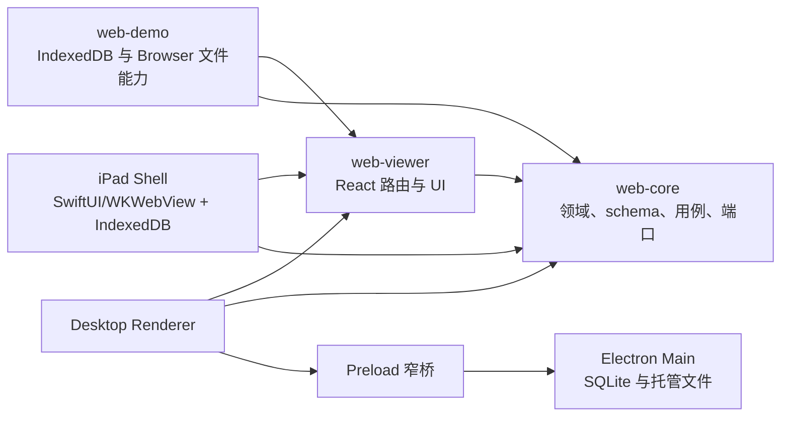

# 当前架构索引

本页是 Zupulse 当前实现架构的入口。历史设计可能保留完整论证，但不得覆盖本页、Current ADR、
运行时代码和测试表达的现状。

## 系统边界

- `web-core` 不依赖 UI 或宿主平台。
- `web-viewer` 只通过领域端口访问 Library 和文件能力。
- Browser 与 Desktop 共享领域契约和 React UI，但使用互相独立的本地曲谱库。
- Desktop Renderer 不可信；本地能力只由 Main 经严格 Bridge 提供。
- iPad Shell 是薄原生宿主：共享 React Library/Viewer，经版本化 Bridge 访问文件、生命周期与音频；
  个人原型复用 IndexedDB，正式产品化前重新评审持久化、迁移与性能。

## 当前文档

- 产品语言：`../../CONTEXT.md`、`glossary.md`
- 产品设计契约：`../../DESIGN.md`
- Feature Contract 索引：`../features/README.md`
- Documentation Gardening 机制：`../conventions/documentation-gardening.md`
- Sheet Library 当前行为：`../features/contracts/sheet-library.md`
- React 应用系统：`react-application-system.md`
- 应用国际化：`application-i18n.md`
- Viewer 键盘与播放控制：`viewer-keyboard-and-transport-controls.md`
- Browser alphaTab DOM 边界：`browser-demo-alphatab-dom-rendering.md`
- MusicXML 导入：`musicxml-import-design.md`、`musicxml-import-acceptance.md`
- Sheet Library 原始设计规格：`../superpowers/specs/2026-07-12-sheet-library-design.md`
- Harmony Analysis 当前实现：`harmony-analysis-system.md`
- iPad Practice Player：`ipad-practice-player.md`
- Harmony engine 核心：`../../packages/web-core/docs/harmony.md`
- Harmony CLI 与调优：`../../tools/harmony-cli/README.md`、`../../tools/harmony-cli/docs/evaluation.md`
- Harmony Analysis 历史设计规格：`../superpowers/specs/2026-07-15-harmony-analysis-studio-design.md`
- 架构决策状态：`../adr/README.md`

## 当前核心不变量

- Library Score ID 是 UUID，Score Identity 是小写 SHA-256。
- Viewer 使用 `#/viewer/:libraryScoreId`，Studio 使用 `#/studio/:libraryScoreId`；两类 Session 都是可重建的运行时状态。
- Repository 管馆藏，Gateway 管用户选择的外部文件。
- 删除联动清理馆藏、托管字节、sidecar、resume 和 Harmony Analysis Document。
- 当前不包含云同步、OPFS、分页或移动端。产品导入仍不支持 MIDI；Harmony CLI 只为 POP909 评测解析 MIDI，不改变产品格式边界。

## 历史文档

带 `status: historical` 或 `status: superseded` 的文档只解释决策来源。实现任务若引用历史文档，
必须同时指出取代它的 Current ADR 或当前规格。
