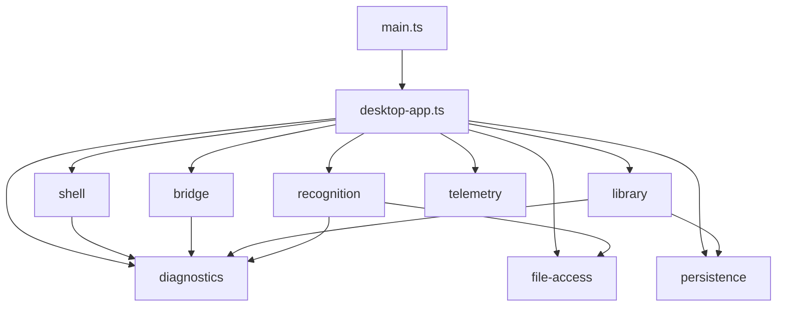

# Desktop Main Process 架构

Electron Main 按宿主大功能组织，`main.ts` 只承担 Electron entry-point 必需的顶层副作用，`desktop-app.ts`
是唯一 composition root。该结构不改变 Renderer/Preload/Main 的信任边界：Renderer 仍只能经版本化、Zod
校验的 Bridge 请求 Main 能力，绝对路径、Electron 对象和原始异常不得跨进程暴露。

## 顶层结构

```text
apps/desktop-shell/src/main/
  main.ts                 privileged scheme、single-instance、App 顶层 lifecycle
  desktop-app.ts          初始化顺序、feature wiring、window creation、cleanup
  telemetry-preference-store.ts  Main-owned telemetry consent 与 session identity
  bridge/                 request/response validation 与 Electron IPC adapter
  shell/                  window、menu、locale、protocol、close/suspend lifecycle
  file-access/            picker、dropped-file IPC、one-time token、read/save
  library/                SQLite、Managed Score Copy、Sidecar、Resume、Harmony persistence
  recognition/            provider settings、PDF OMR job、MIDI correction、result filtering
  diagnostics/            safe event、store、instrumentation、export 与 Bridge handler
  persistence/            共享的 typed JSON store primitive
```

`main.ts` 不创建 store/controller、不声明 Bridge application handler，也不读取 `userData`。App ready 后它调用
`startDesktopApp()`，并只保留返回的 `focusMainWindow()` 供 `second-instance` 使用。

`desktop-app.ts` 显式创建各具体模块，不使用 DI container、service locator、event bus 或动态 module registry。
Feature module 返回实际需要的 `handlers`、少量共享能力和显式 `dispose()`；退出顺序直接写在 composition root。

## Bridge handler ownership

| Owner       | Request family                                                     |
| ----------- | ------------------------------------------------------------------ |
| Shell       | `external.openUrl`、`app.locale.setPreference`、`app.lifecycleAck` |
| Telemetry   | `app.telemetry.setPreference`                                      |
| File Access | `file.*` 与专用 `zupulse:file:importDropped` IPC                   |
| Library     | `library.*`、`sidecar.*`、`playbackResume.*`、`harmonyAnalysis.*`  |
| Recognition | `recognitionSettings.*`、`pdfOmr.*`                                |
| Diagnostics | `diagnostics.write`                                                |
| Dispatcher  | `app.handshake` 与通用 sender/request/response validation          |

各 handler group 使用精确的 `RequiredBridgeHandlers<...>` 类型声明。`bridge/server.ts` 只把 Electron IPC
适配到 `bridge/dispatcher.ts`，不得 import feature module 或实现业务行为。Dropped-file channel 由 File Access
直接拥有，因为它承载只允许在 Preload/Main 之间出现的 path，并必须复用同一个 `FileTokenStore` 信任边界。

## 状态与依赖方向



- `shell/window.ts` 独占当前 `BrowserWindow` 引用，提供 create/get/focus/sendEvent。
- `shell/locale.ts` 独占当前 `LocaleState`；写入成功后才更新内存 state 和原生菜单。
- `file-access/module.ts` 独占进程内唯一 `FileTokenStore`，window close 与 App quit 都会清空 token。
- `library/library-module.ts` 聚合 SQLite Library、Sidecar、Resume 与 Harmony handlers，保持删除联动和启动
  reconciliation。
- `recognition/module.ts` 聚合 provider registry snapshot、active OMR job、progress/heartbeat、MIDI correction 和
  safe result projection；App quit 取消 runtime 并清理 timer。
- Diagnostics 是顶层安全基础设施，可以被其他模块调用，但不得反向依赖 feature module。
- Telemetry preference 由 Main 持久化；Bridge handshake 只投影安全的 consent/session context，provider adapter
  继续复用 `src/telemetry/desktop-telemetry.ts`。

Recognition 只因 PDF/image/MIDI 选择与 materialization 依赖 File Access；其他 feature module 之间不直接
依赖。共享领域事实和 Bridge schema 继续来自 `@zupulse/web-core`。

## 启动与退出

启动顺序保持为：

1. `main.ts` 在 `app.whenReady()` 前注册 privileged scheme 并获取 single-instance lock。
2. Diagnostics 初始化。
3. Telemetry preference 恢复，随后安装带 Telemetry port 的 App instrumentation。
4. Locale preference 恢复。
5. Recognition provider configuration 恢复并执行启动 preflight。
6. Library 初始化 SQLite、migration 与 managed-file reconciliation。
7. App protocol、permission deny policy、dropped-file IPC 和通用 Bridge server 注册。
8. Main window 创建，随后安装 Window instrumentation、Lifecycle 与 Menu。
9. 记录 `APP_STARTED`。

Window close 先请求 Renderer `prepare-close` acknowledgement；ack 或 5 秒 timeout 后清空 file tokens、销毁窗口并
退出；关闭前最多等待 300 ms flush Telemetry。`will-quit` 按 Bridge server、Recognition、Library、File Access
的顺序执行幂等 cleanup。
启动期间发生失败时复用同一 cleanup，记录 `APP_START_FAILED` 后退出 App。

## 保持的不变量

- 通用 Bridge 继续校验 sender origin、request schema 和 response schema。
- dropped-file IPC 继续重新校验 sender、envelope、path metadata、扩展名和大小。
- `FileTokenStore` 保持 expiry、single consumption 与 read-time metadata/size revalidation。
- Library 保持 staging/ready/deleting 和 startup reconciliation；删除联动 Managed Score、SQLite、Sidecar、
  Resume 与 Harmony data。
- Diagnostics 只持久化白名单安全事实，失败不得改变业务流程。
- Telemetry preference 写入成功后才替换 Main provider；无效发布配置保持 No-op。
- Recognition 不向 Renderer 暴露 path、stderr、raw result JSON 或原始异常。

## 验证入口

- Main unit/integration tests：`pnpm test -- apps/desktop-shell/src/main`
- Desktop bundle：`pnpm desktop:build`
- Electron journeys：`pnpm desktop:test:e2e`
- Repository gates：`pnpm verify:fast`

Feature module 测试与 source 使用相同 stem 并位于相邻 `__tests__/`。Library module 测试使用真实 SQLite 和
Managed Score Copy 验证删除联动；Bridge、File Access、Shell state 与启动失败 cleanup 分别有独立测试。
