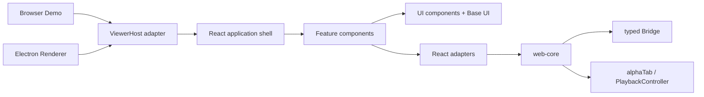

# React 应用系统设计

## 目标与边界

本设计把 `packages/web-viewer` 演进为 React SPA，同时保留已经成立的宿主边界：



React 负责渲染、页面生命周期和交互编排；`web-core` 继续负责领域规则、导入、播放、持久化协议和运行时校验。不要把 controller、schema 或文件解析搬进 React component。

## 包与目录

不新增 workspace 包。先在现有 `packages/web-viewer` 内建立清晰边界，只有出现第二个独立消费者时才抽包。

```text
packages/web-viewer/src/
  app/
    App.tsx                 # providers 与 RouterProvider
    router.tsx              # route objects、lazy route、error boundary
    AppShell.tsx            # 全局布局与导航区域
    ViewerApplication.ts    # 打开串行化、Session registry 与宿主生命周期
  routes/
    IdleViewerRoute.tsx
    ViewerRoute.tsx
  features/
    open-score/             # 打开文件的交互与状态
    playback/               # 播放控制 UI
    track-mixer/            # 轨道 mute/solo/volume
    practice-loop/          # AB 循环
  viewer/
    AlphaTabSurface.tsx     # 命令式 alphaTab 的 React 生命周期边界
    useViewerSession.ts     # 创建、订阅、销毁 session
    viewerSessionAdapter.ts # web-core -> React 的窄适配层
  components/
    ui/                     # Button、Dialog、Slider 等基础组件
    layout/                 # Toolbar、SplitPane、Panel 等无业务布局
  state/
    appStore.ts             # 少量跨树客户端状态
  styles/
    tokens.css
    base.css
    components.css
  host.ts                   # 宿主契约：subscribe（commands/lifecycle）；library 必选
  index.ts                  # 公共挂载 API
```

组织规则：

1. `components/ui` 只接受展示 props，不读取 `ViewerHost`、store 或路由。
2. `features` 按用户能力组织，可以组合 UI、调用 route hook 或 session adapter。
3. `routes` 只负责页面级布局、数据边界和 feature 组合，不实现播放算法。
4. `viewer` 是命令式第三方运行时的隔离层。alphaTab 只能在这里直接操作 DOM。
5. 文件默认与组件共置；只有被两个以上 feature 使用时才提升到 `components`。

不建立 `utils/`、`hooks/` 之类的全局杂物目录。共享代码应按它服务的领域命名。

### Feature 内部目录

新增或实质拆分的 feature 采用“默认扁平、按真实职责展开”的组织方式。现有目录不需要为了形式一致
机械迁移；只有文件数量、状态连接或用户任务已经形成清晰边界时才增加子目录：

```text
features/<feature>/
  index.ts                         # 可选；只导出 feature public surface
  <feature>.tsx                    # connected composition entry
  <connected-part>.tsx             # 少量状态连接型 orchestration
  components/                      # props-only 或仅有局部 UI state 的 leaf components
  adapters/                        # React 到 application/session/browser port 的适配
  model/                           # 纯 types、selector、projection 与 view model
  runtime/                         # 非 React 的 scheduler、DOM 或命令式 runtime
  <semantic-cluster>/              # panels 等有产品语义的内部任务集
  __tests__/                       # 按 source stem 与用户行为组织
  <feature>.module.css             # feature-level style owner，不机械一组件一文件
```

目录创建规则：

- 小型 feature 保持扁平；不预建空的 `components/`、`adapters/`、`model/` 或 `runtime/`。
- `components/` 只放 presentation leaf。读取 application、session external store 或 route state 的
  connected orchestration 留在 feature root 或有产品语义的子目录。
- `adapters/` 中的 React hooks 只连接既有状态所有者和平台生命周期，包括
  `useSyncExternalStore` selector、application command adapter、timer、keyboard 与 window lifecycle。
  它们不是新的数据层，不得复制 Repository、Controller、Bridge 或 persisted state。
- 可以写成纯函数的 filter、sort、range projection、status mapping 和 view model 放在 `model/`，
  不包装成无必要的 hook。
- 单个组件的 local UI state 留在 owning component；非 React 的 RAF、scheduler 和命令式 DOM
  lifecycle 放在 `runtime/`。
- `panels/` 等目录必须对应用户可识别的任务集合；禁止使用 `misc/`、`common/`、`shared/` 作为未分类
  内容容器。

Feature 内部依赖保持单向：

```text
route
  -> feature entry / connected orchestration
       -> adapters -> ViewerApplication / session / host ports
       -> model
       -> components -> model + components/ui
       -> runtime
```

Feature 的 `index.ts` 只定义对外 surface，内部 module 不通过自己的 barrel 回导。Feature A 不
deep-import Feature B 的内部文件；真正跨 feature 的 UI primitive 提升到 `src/components`，领域行为
进入 `web-core` 或 application/session port。新 source module 与目录遵循
`docs/conventions/file-naming.md` 的 `kebab-case` 规则。

## 基础组件与组件库

采用“两层组件”策略：

- 原生层：`Button`、`IconButton`、`TextField`、`Toolbar`、`Panel` 优先包装语义 HTML，统一尺寸、focus ring、disabled 和 loading 行为。
- 交互层：Dialog、AlertDialog、Menu、Tooltip、Tabs、Slider、Switch 使用 Base UI，复用其键盘导航、ARIA、焦点管理和浮层定位。

基础组件 API 以组合为主。例如 `Dialog` 暴露 `Trigger`、`Popup`、`Title`，不设计一个包含几十个配置项的 `AppDialog`。业务文案、权限判断和 controller 调用不能进入基础组件。

### 为什么选择 Base UI

- 无默认样式和 CSS 运行时，不会把 Material、企业后台或通用 SaaS 视觉带进乐谱工作区。
- component parts 开放，适合包装成项目自己的紧凑桌面控件，而不需要覆盖高 specificity 样式。
- 提供 `data-open`、`data-closed`、`data-checked`、`data-starting-style`、`data-ending-style` 等稳定样式钩子，普通 CSS 可以直接表达交互和动画状态。
- 浮层组件暴露可用高度、anchor 宽度等 CSS variable，便于 Menu、Popover、Tooltip 适应 Electron 小窗口和可调整面板。
- `className`、`style` 和 `render` 支持基于组件状态定制，能与项目自己的 `Button`、`IconButton` 组合。
- 复杂可访问性交给库，简单语义控件继续使用原生 HTML，避免自研 Dialog、Menu、Slider 的焦点和键盘细节。

Radix Primitives 与 React Aria 都是可行备选。Radix 的历史和社区示例更丰富，但 Base UI 对动画阶段、布尔式 data attribute、CSS variable 和 render composition 的接口更符合本项目的新组件封装。React Aria 在未来出现复杂文件集合、多选、国际化输入时可重新评估，但当前 API 范围超过 Viewer 首批需求。MUI、Ant Design、Mantine 等完整视觉组件库不采用，因为它们会引入需要反向覆盖的主题和视觉体系。

首轮只采用 Base UI `Slider` 迁移播放进度、速度和 Loop 边界，以真实验证键盘、焦点与状态样式。Loop enabled 保留原生 checkbox，Loop snap 保留原生 `<select>`，普通操作使用项目的原生 `<button>` 薄封装。Dialog、Menu、Tooltip、Tabs 等没有当前入口的组件不预建，等 feature 实际需要时逐个增加。

视觉继续使用 CSS custom properties：

组件只能消费语义 token，不直接散落颜色值。暗色主题通过根节点 `data-theme` 覆盖 token。

### 受约束的 Tailwind utility layer

随着共享 UI、响应式组合和 feature CSS 明显增长，ADR 0065 取代首轮 React 迁移时暂缓 Tailwind 的
决定。Tailwind 只管理应用壳、基础控件和 feature 中适合组合的 layout、spacing、typography、
responsive 与 visual state：

- 不加载 Preflight；现有 common 与 vendor base styles 保持所有权。
- Tailwind theme 只投影 `tokens.css` 中已经批准的 runtime semantic token，不保存第二份产品色值。
- 默认 color、font、radius 和 shadow vocabulary 不向产品代码开放；raw colors 和静态 arbitrary
  aesthetic values 由 `check:design` 阻断。
- Base UI 继续拥有可访问性交互、Portal、定位和 component state；UI primitives 集中组合 Base UI
  parts 与 Tailwind classes。
- alphaTab、Score surface、splitter/slider geometry、scrollbar、keyframes、Canvas/SVG 和高频音乐
  可视化保持专用 CSS、CSS variable 或命令式渲染。
- 组件按垂直切片迁移；同一 property/state 不同时由 CSS Module 和 utility class 拥有。

当前 style ownership 如下：

| Style category                                                       | Owner                                         |
| -------------------------------------------------------------------- | --------------------------------------------- |
| Runtime semantic values and theme switching                          | `styles/tokens.css`                           |
| Shared control visuals and interaction states                        | `components/ui` + semantic Tailwind utilities |
| Feature layout, safe areas and container-query composition           | Feature CSS Modules                           |
| Score surface, splitter/slider geometry, animation and generated DOM | Dedicated CSS Modules or vendor CSS           |
| Runtime coordinates and external-library values                      | Inline CSS variables or imperative adapters   |

Pilot 已结束，现有 CSS Module 不再作为强制迁移 backlog。只有迁移能删除重复 selector、复用已有
primitive 或消除双重 style ownership 时才继续；不得以 CSS LOC 归零或 Tailwind 覆盖率作为目标。

当前仍不引入 styled-components 或 Storybook；当基础组件需要被仓库外团队独立消费、发布和视觉
回归时再增加独立组件包与 Storybook。

## 状态管理

状态按“谁拥有事实”分类，避免把所有内容塞进一个 store：

| 状态              | 归属                                | 示例                                   |
| ----------------- | ----------------------------------- | -------------------------------------- |
| 组件私有状态      | React `useState` / reducer          | 菜单开关、临时输入、展开面板           |
| 可导航状态        | React Router URL                    | 当前页面、设置 tab、库过滤条件         |
| 跨树客户端状态    | Zustand                             | 主题、侧栏宽度、最近使用的 Viewer 布局 |
| Viewer 会话状态   | `PlaybackController` + adapter hook | 播放、tempo、loop、当前小节            |
| 持久化领域状态    | Bridge / sidecar                    | 练习设置、批注、进度、文件索引         |
| alphaTab 内部状态 | alphaTab adapter                    | score 渲染、光标、音频运行时           |

`ViewerSession` 对 React 暴露不可变 snapshot，并用 `useSyncExternalStore` 订阅 session。组件通过 `ViewerSessionCommand`
发送 domain command，不直接修改 snapshot：

```ts
const playback = useViewerSession(session, selectPlayback);
await session.dispatch({ type: "playback", command: { type: "toggle-playback" } });
```

当前对外的 Session seam 是：

```ts
type ViewerSession = {
  getSnapshot(): ViewerSessionSnapshot;
  subscribe(listener: () => void): () => void;
  dispatch(command: ViewerSessionCommand): Promise<void>;
  destroy(): Promise<void>;
};
```

`ViewerSessionSnapshot` 是只读的 UI projection，包含 playback、navigation、loop-editor bounds 和 piano-key
visualization 所需的运行时数据；它不包含 Session ID，URL 与 Session registry 继续由 `ViewerApplication` 持有。
feature 组件消费 `ViewerSessionSlices`，而不是访问 `PlaybackController`、alphaTab adapter 或 session wiring。
Session 初始化失败后仍保留在 registry 和当前 route，以结构化 snapshot 区分文件不支持、损坏、renderer、audio 与未知错误；
只映射当前能够可靠识别的分类，其余使用 `unknown`，UI 不解析 message 猜测类型。文件/renderer 错误提供重新打开文件，
只有音频错误提供原地 retry。不存在的 `libraryScoreId` 才显示 route 级“会话已结束”空态。

### 架构风格

该结构最接近 MVVM 的 Presentation Model 变体，而不是传统 MVC：

- Model：`web-core` 的领域模型、Bridge contract、`PlaybackController` 与 alphaTab runtime。
- ViewModel / Presentation Model：`ViewerApplication` 和 `ViewerSession` adapter，将领域事件投影为不可变 snapshot，并接收 application/domain command。
- View：React route、feature 和基础组件，只渲染 snapshot 并发送 command。

数据流保持单向：`View → command → application/session → model/runtime → snapshot → View`。它同时具有 Ports and Adapters 特征：`ViewerHost` 是平台端口，Browser 与 Electron 提供 adapter。

这种组合适合当前应用，因为播放和文件生命周期可脱离 React 测试，Browser/Electron 共享 presentation 层，命令式 alphaTab 不必伪装成 React state，高频光标也不会触发整棵组件树更新。约束是 snapshot 必须保持面向 UI 且不可变，ViewModel 不能重新实现 `web-core` 的领域规则，也不能让 React component 绕过 command 直接修改 controller。

播放光标等逐帧事件留在 alphaTab/DOM 边界，不进入 Zustand，防止整棵 React 树高频重渲染。Zustand store 必须使用 selector，且 action 与 state 放在同一 slice；当前预计一个 `appStore.ts` 足够，不预建 slice factory。

如果后续文件库通过 Bridge 提供分页列表，可为该资源引入 TanStack Query，并将 Electron 离线读取配置为适合非网络 Promise 的模式。它不替代 Zustand，也不接管播放 controller。

### 状态库选型评估

当前选择 Zustand 管理少量、边界明确的应用级状态。首批只迁移跨 route 使用的 `theme`；vanilla store 按应用实例创建，并通过 React Context 注入，保证 Electron 多窗口和测试实例隔离。

| 方案                            | 适合的问题                                          | 对本项目的判断                                               |
| ------------------------------- | --------------------------------------------------- | ------------------------------------------------------------ |
| React state / reducer / Context | 组件私有或局部共享状态                              | 默认起点；不为简单状态引入库                                 |
| Zustand                         | 少量应用级状态、具名 action、selector、React 外订阅 | 首选；按应用实例创建，不使用 module singleton                |
| Jotai                           | 大量独立原子和复杂派生状态图                        | 备选；若 UI 变成细粒度编辑器状态，可替换 Zustand，不与其并存 |
| Redux Toolkit                   | 强约束 action 日志、中间件、多人协作规范            | 当前偏重，且会复制 controller 已有的 command 模型            |
| MobX                            | 深层可变领域对象、computed 和自动依赖追踪           | 当前不选；会与 controller、Bridge、alphaTab 的状态所有权重叠 |
| XState                          | 有限状态、并发任务、取消、重试和错误恢复            | 仅在复杂文件导入工作流中局部采用，不存普通 UI 状态           |
| Valtio / Legend-State           | proxy 或 signal 驱动的深层细粒度响应式              | 范式侵入较深；内建同步还会与 sidecar/Bridge 重叠             |
| Effector                        | event/store/effect 构成的响应式业务流               | 与现有 Bridge event 和 controller command 形成第三套事件模型 |
| TanStack Store                  | 框架无关的 immutable reactive store                 | 方向合适但当前仍为 alpha，不作为基础依赖                     |
| RxJS                            | 连续事件流、合并、节流和设备输入                    | 未来可用于 MIDI/播放事件流，不作为应用 store                 |
| TanStack Query                  | 异步资源缓存、失效、重试和 mutation                 | 文件库出现后引入；它不是客户端 UI 状态库                     |

MobX 在产品转向复杂制谱编辑器时值得重新评估。例如大量 note、selection、inspector 和 computed 属性共同组成可编辑对象图时，observable class 能减少手写派生与更新代码。当前 Viewer 则已有清晰的命令式领域核心；将其复制进 MobX 会制造双份状态，将其改写为 MobX 又会让 `web-core` 依赖 UI 响应式范式，因此收益不足。

推荐组合保持按所有权拆分：

```text
React state          组件局部状态
React Router         页面和可恢复 URL 状态
Zustand（按需）      主题与工作区布局
PlaybackController   播放领域状态
alphaTab             高频渲染与音频运行时
Bridge / sidecar     持久化领域状态
TanStack Query（后续）异步资源读模型
XState（后续局部）  复杂导入工作流
```

任何新增状态库都必须替代某个现有所有者或解决一个尚未被覆盖的问题，不能只作为 controller snapshot 的第二份副本。

Zustand 不保存 `ViewerSessionHandle`、Studio Session、`PlaybackController`、文件字节、播放、循环、tempo 或轨道状态。URL、application service、controller、Bridge 与 alphaTab 继续拥有这些事实。Dialog 开关、输入草稿等组件私有状态长期保留在 `useState`；后续只对真实跨 route、跨 feature 且没有现有所有者的客户端状态逐项评估迁移。

## SPA 路由

使用 React Router Data Mode 的 `createHashRouter`：

```text
/#/                               Sheet Library
/#/viewer/:libraryScoreId         Viewer 查看与练习工作区
/#/studio/:libraryScoreId         Studio 分析与编辑工作区
/#/*                              NotFound
```

选择 hash history 是因为同一个 bundle 需要运行在浏览器静态资源地址与 Electron 自定义协议下；刷新或重开窗口时无需服务端把任意路径回退到 `index.html`。

Data Router 只负责 route 匹配、lazy module、错误边界和导航，不通过 loader/action 执行文件选择、Bridge 请求、分析或播放命令。Library Import 完成后导航到 Viewer；ViewerRoute 与 StudioRoute 使用 `libraryScoreId` 调用注入的 application service，从 Managed Score Copy 分别重建自己的 Session。

应用 service 从现有 `ViewerApplication` / `mountViewerApp()` 演进并保持以下语义：并发打开串行、新 Workspace Session 前销毁旧 Session、destroy 后拒绝新操作、清理已接受的打开操作、聚合打开与清理失败，以及转发宿主播放/挂起/关闭命令。它以 workspace kind 区分 Viewer 与 Studio，不渲染 UI、不依赖 React/DOM，也不进入 Zustand；React 只订阅其 snapshot 并发送 application command。

`mountViewerApp` 必须提供宿主 `library`（Sheet Library Repository + Score File Gateway + adapters）；不存在无
library 的直开模式（ADR 0067）。应用命令 `openScore()` 的语义是「导入并打开」，外部打开一律经 Library Import
（ADR 0047），不再经 `ViewerHost.openScore`。

已有活动谱时，系统文件选择器打开期间保留旧 Session；用户取消不改变 route 或 Session。选定新文件后先对旧 Session 执行 pause/flush/destroy，再导航到新 Library Score 并进入 loading。初始化失败时保留新 Session 的可恢复错误态，不回滚已销毁的旧 Session，也不同时持有两个 alphaTab/audio runtime。

路由约束：

- `libraryScoreId` 是持久化 UUID；URL 禁止出现 Viewer/Studio Session ID、绝对路径、bookmark、文件 token 或内容 hash。
- 页面刷新、Renderer 重载或复制 URL 后从当前宿主的独立 Sheet Library 重建对应 Session；馆藏不存在时显示可返回 Library 的缺失状态。
- `AppShell` 是根 layout route；Viewer 与 Studio route lazy load，避免 Library 立即加载重型工作区代码。
- 每个 route 提供自己的 error boundary；Viewer/Studio 错误页保留返回 Library 的恢复路径。
- 打开馆藏成功后创建对应 Session；不得根据 URL 伪造 Library Score 或 Session。
- Electron 菜单命令仍经 `ViewerHost.subscribe` 进入应用 service，再由 router/session 分发，不让 Main Process 操作 URL。

Viewer 的 Practice Sidecar / Local Playback Resume 与 Studio 的 Harmony Analysis Document 由不同
Repository 和 Session 所有；两者不通过 Zustand 共享可变状态。Studio 的详细边界见
[`harmony-analysis-system.md`](harmony-analysis-system.md)。

## Provider 顺序与入口

`mountViewerApp(element, dependencies)` 是 Browser Demo 与 Electron 的唯一入口。两个宿主的 HTML 模板都提供 `<div id="root"></div>`；入口接收明确的 `HTMLElement`，不再接收 `Document`，也不保留旧签名兼容层。`dependencies` 必须包含 `host` 与 `library`（ADR 0067）。它创建 Zustand store、`ViewerApplication`、Router 与 React root，并返回保留 `openScore`（导入并打开）、`togglePlayback`、`pauseAndFlush`、`destroy` 的 handle，供 Electron 生命周期接入。`destroy()` 先销毁 application/session，再卸载 React root。

Provider 从稳定到易变排列：

```tsx
<StrictMode>
  <HostProvider host={host}>
    <AppStoreProvider>
      <RouterProvider router={router} />
    </AppStoreProvider>
  </HostProvider>
</StrictMode>
```

store 使用工厂按应用实例创建，避免测试和多窗口共享 module singleton。router 同样由 `createAppRouter(dependencies)` 创建，使 route 与 Electron 全局对象解耦。

Electron 在 React 外完成 preload Bridge 检查、`app.handshake` 和版本/hash 校验，成功后才挂载应用。Bridge 缺失、握手失败或版本不匹配由宿主 bootstrap 渲染最小 fatal startup error；文件打开、Session 初始化、音频、持久化等挂载后错误由 React route/feature 状态展示。不为启动前错误创建第二个 React root 或假 Host。

开发与测试入口启用 React `StrictMode`。`AlphaTabSurface`、Session adapter、host subscription 和所有 effect 必须支持 `setup → cleanup → setup`，不得以关闭 StrictMode 规避重复初始化、事件泄漏或非幂等销毁问题。生产构建仍按 React 的正常生产语义运行。

## 渐进迁移

迁移终点是完整替换共享 Viewer UI，而不只是建立 React 基础设施或示范页面。Browser Demo 与 Electron Renderer 最终都使用同一个 React root；AppShell、主题、打开文件、状态反馈、播放控制、循环和轨道面板全部由 React 绘制。`ViewerHost`、`PlaybackController`、Bridge schema 与 `web-core` 保持 UI 无关，alphaTab 继续作为命令式运行时由 React adapter 管理生命周期。

迁移期间 Browser Demo 与 Electron 必须持续可运行。允许 React Shell 在短期内渲染旧 mount 逻辑依赖的兼容 DOM，但每个 feature 在任一时刻只能有一个状态和行为所有者；feature 迁入 React 后立即删除对应旧 presenter、事件绑定和兼容 selector，不长期维护双实现。

本轮以视觉与功能等价迁移为目标，保持现有 studio-style 信息结构、产品文案、密度和主题。优先复用现有 CSS token 与 class，只修复迁移直接暴露的可访问性问题；播放条、练习面板和谱面布局的整体视觉重设计在 React 迁移稳定后另行规划。

1. 安装 React、React DOM、React Router、Zustand 与 `@base-ui/react`，为 Rspack 增加 TSX/React automatic runtime；保留现有普通 CSS 和构建工具。建立按应用实例创建的 store，首批只迁移 `theme`。
2. 建立 React root、hash router、HostProvider 和与当前 HTML 等价的 AppShell，Browser Demo 与 Electron 同时切换入口。
3. 先迁移 theme、打开文件和状态空态，再迁移 playback controls；首批只为播放进度、速度和 Loop 边界采用 Base UI Slider，每一步继续复用现有 `ViewerHost` 与 `PlaybackController`。
4. 用 `AlphaTabSurface` 包住现有命令式挂载，确保 effect cleanup 能销毁 adapter、controller 和事件订阅。
5. 删除已被 React 覆盖的 DOM mount 函数及对应 selector，最后收拢旧 CSS。

宿主同步删除 `renderViewerShell(document)` 调用；由于所有 workspace package 都是 private，不维护 `(Document, dependencies)` 的旧挂载 API。

迁移期间不同时维护两套业务状态。每个 feature 一旦迁移，旧 presenter 对该 feature 立即退出所有权。

## 验证门槛

- `pnpm check`、Browser Demo build、Desktop build 全部通过。
- 运行 `pnpm desktop:test:e2e`；Browser Demo 人工打开代表性 GP/MusicXML 文件，Electron 人工覆盖打开、播放/暂停、停止、速度、Loop 和轨道控制。
- 保留 Vitest 与 jsdom，React 组件测试新增 `@testing-library/react` 和 `@testing-library/user-event`；通过 role、accessible name、键盘和指针行为查询，不以内部 class、组件名或大规模 snapshot 为主。
- 同一组 Viewer component tests 使用 fake `ViewerHost`（只实现 `subscribe`）与 fake `library`，不依赖 Electron；领域、controller 和 Bridge 单元测试继续使用现有测试方式。
- Base UI Slider 覆盖方向键、Home/End、disabled、accessible label 和 command dispatch；指针几何交互由真实浏览器/E2E 验证。
- Electron E2E 继续覆盖真实 Bridge、协议、应用生命周期和打包后 smoke test，不在 jsdom 重复模拟 Electron。
- 路由至少覆盖首页、有效 session、失效 session和错误边界。
- 打开第二个文件、窗口挂起和卸载都验证旧 session 已销毁。
- StrictMode 下验证 alphaTab、Session 和 host subscription 不重复持有资源，cleanup 可安全执行后再次 setup。
- 键盘可以完成打开文件、播放/暂停、调整 slider、关闭 dialog；焦点恢复到触发元素。
- 320、768、1024、1440 px 下无不可达控制；桌面工作区允许紧凑布局而不是盲目堆叠卡片。
- 亮暗主题跨 route 保持；失效 Session URL 显示恢复空态；suspend/prepare-close 完成 pause、flush、destroy 与 lifecycle ack。
- 控制台无 React、Base UI、ARIA 或未处理 Promise 错误。

本轮不要求 Windows 人工验收；Windows 构建与人工核心流程仍属于 Desktop Shell MVP 发布流程，而不是 React 迁移的完成条件。

## 明确暂缓

- 不引入 Next.js、React Router Framework Mode 或 SSR：应用是本地优先的离线 Viewer，没有服务端渲染需求。
- Tailwind 按 ADR 0065 作为受约束 utility layer；不使用默认视觉主题替代 Zupulse runtime tokens。
- 不引入 Redux Toolkit：当前全局客户端状态很少，领域状态已有 controller。
- 不同时引入 Zustand、Jotai 或 MobX；状态形态发生变化时以替换方式重新决策。
- 不把 `web-core` React 化，也不让 package 依赖 DOM。
- 不为未来移动端预建第二套路由或组件包；先让共享 Viewer 的响应式布局成立。
