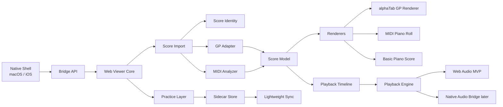

# macOS 与 iOS Viewer 架构总览

> 历史研究文档：描述早期 Apple 平台与同步方向，不作为当前 Electron/Browser 实现依据。

## 背景

本项目第一版定位为“GP + MIDI 双优先的跨端练习型 viewer”。目标平台先覆盖 macOS 与 iOS，同时在架构上为 Windows 桌面预留复用空间。

第一版不是制谱软件，也不是版权曲库平台。它优先解决用户用本地文件练习的问题：打开 Guitar Pro 与 MIDI 文件，查看谱面，播放，循环，变速，跟随，高亮，保存练习元数据，并在设备之间同步这些元数据。

## 架构原则

- 本地文件优先，不把上传原始谱文件作为第一版核心能力。
- GP 与 MIDI 平权，但承认两者技术性质不同：GP 是结构化乐谱文件，MIDI 是演奏事件流。
- 渲染和交互核心尽量跨端复用，平台壳层只负责系统能力。
- 第一版允许轻编辑，但所有修改保存到 sidecar，不直接改原始文件。
- 播放引擎可替换：MVP 先打通 Web Audio / SoundFont，后续可替换或增强为原生音频桥。

## 推荐方案

采用“WebView 渲染核心 + 原生壳 + 可替换音频引擎”。

macOS 与 iOS 使用原生壳层承载应用生命周期、文件访问、窗口导航、系统权限、同步入口和后续原生音频桥。谱面渲染、piano-roll、播放跟随、练习交互优先放在共享 WebView 核心中。

Windows 后续可以复用 WebView 核心、领域模型、sidecar schema 与同步协议，只替换桌面壳层和平台桥接。

## 高层模块

## 领域边界

### Native Shell

负责平台相关能力：

- 文件选择、最近文件、沙盒权限与安全书签。
- iOS Document Picker、macOS 文件系统访问。
- 外部文件引用和可选本机库导入。
- 应用导航、窗口、多任务、系统外设入口。
- SQLite 本地索引与 CloudKit 系统同步能力的接入。
- 后续原生音频引擎、后台播放、蓝牙 MIDI 等平台桥接。

Native Shell 不直接理解具体乐谱排版细节，也不拥有播放时间轴的业务逻辑。

### Bridge API

负责 Native Shell 与 Web Viewer Core 之间的稳定通信。

第一版桥接能力包括：

- 打开文件并传递文件数据或受控访问句柄。
- 读取和写入 sidecar。
- 暴露平台能力，例如文件重定位、同步状态、音频后端能力。
- 接收 Web Viewer Core 的播放状态、当前小节、错误状态和用户操作事件。

Bridge API 采用混合风格：文件、sidecar、权限、安全书签、同步拉取和推送使用 RPC；播放状态、当前小节、同步状态、错误状态和用户交互使用事件流。所有消息都需要 typed、versioned，并带 correlation id。Web Viewer Core 必须通过 capability discovery 判断平台能力，不能直接假设当前运行环境。

### Score Import

负责识别文件格式并进入对应解析通道。

第一版格式范围：

- Guitar Pro：`.gp3`、`.gp4`、`.gp5`、`.gpx`、`.gp`
- MIDI：`.mid`、`.midi`

GP 文件优先走 alphaTab 能力。MIDI 文件进入 MIDI Analyzer，先产出事件时间轴、piano-roll 数据和基础钢琴谱候选。

### Score Identity

负责为本地文件生成稳定身份，用于匹配 sidecar 和同步元数据。

第一版采用内容指纹优先：

- 文件内容 hash 是主要身份来源。
- 格式内元信息作为辅助线索，例如标题、轨道名、时长、拍号、tempo map。
- 文件路径只作为最近访问和重定位线索。

同一份谱在不同设备路径不同，也应能匹配到同一份 sidecar。

### Score Model

负责统一表达可渲染、可播放、可练习的乐谱结构。

模型需要覆盖：

- score、track、staff、measure、beat、note。
- tempo map、time signature、repeat、section。
- 播放时间轴与渲染位置之间的映射。
- GP 特有技法信息的透传能力。
- MIDI 分析后的量化结果、左右手分配、异常小节标记。

Score Model 采用中等厚度：渲染、播放和练习层主要依赖统一模型，但不追求完整制谱级模型。GP 技法、MIDI 分析状态和 piano-roll 原始事件保留在 source-specific extension。

Score Model 以跨端共享 schema 定义边界，Web Viewer Core 拥有主要实现。Native Shell 只消费必要子集，例如文件身份、播放状态、同步元数据和未来原生音频事件。

### GP Adapter

负责把 alphaTab 的 GP 解析与渲染能力接入系统。

第一版重点：

- 高保真打开 GP 文件。
- Tab / 五线谱展示。
- 多轨 mute / solo / volume。
- tempo、transpose、loop、count-in。
- 当前小节或当前音符高亮与自动滚动。

GP Adapter 应尽量避免修改 alphaTab 源码。必须修改时，要单独记录 MPL-2.0 合规义务。

### MIDI Analyzer

负责把 MIDI 事件流转成可练习的视图与基础记谱结果。

第一版承诺中等野心：

- piano-roll 必须可靠。
- 基础钢琴谱支持 clean MIDI 与钢琴教学 MIDI。
- 支持量化粒度选择。
- 支持左右手自动分配。
- 标记重叠音、疑似错误量化、无法漂亮转谱的小节。
- 支持小节级重算或用户修正。

第一版不承诺任意复杂 MIDI 一键生成出版级钢琴谱。

实现策略采用混合方式：客户端第一版使用 TypeScript heuristic 完成量化、左右手分配和异常检测；同时维护离线研究脚本和测试集，用 music21、mido 或 pretty_midi 辅助分析，把验证过的规则移植回 Web Viewer Core。

### Renderers

负责把 Score Model 和 source-specific data 展示给用户。

第一版包含：

- GP renderer：基于 alphaTab。
- MIDI piano-roll renderer：表达 MIDI 原始演奏时间、音高、力度和声部。
- Basic piano score renderer：表达量化后的基础钢琴谱。

MIDI 视图需要支持 piano-roll 与基础钢琴谱联动。用户在一个视图选择小节或音符，另一个视图应同步定位。

### Playback Layer

负责从 Score Model 生成播放时间轴，并驱动音频后端与渲染跟随。

第一版采用双路径策略：

- MVP 使用 Web Audio / SoundFont 快速打通播放。
- 架构预留 Native Audio Bridge。

核心抽象包括：

- `PlaybackTimeline`：乐谱时间、真实时间、循环区间、tempo override。
- `PlaybackEngine`：播放、暂停、seek、变速、count-in、metronome。
- `SynthAdapter`：Web Audio、TinySoundFont、AVAudioEngine 或 AudioKit 的适配层。

渲染层订阅播放状态，不直接拥有音频实现。

### Practice Layer

负责练习相关状态和操作。

第一版包括：

- section 标记。
- AB 循环。
- tempo override。
- transpose。
- 轨道 mute / solo / volume。
- 批注。
- 练习进度。
- MIDI 量化粒度、左右手分配、小节级修正。

这些数据全部写入 sidecar，不直接改原始谱文件。

### Sidecar Store

负责存储用户对某份谱的练习元数据和轻编辑结果。

sidecar 绑定 `ScoreIdentity`，而不是绑定单一路径。

本地存储采用 SQLite + JSON sidecar payload。SQLite 保存本地索引、最近打开、收藏、文件引用、同步状态和练习统计；sidecar payload 使用 JSON 保存并按 schema version 迁移。Web Viewer Core 通过 Bridge API 读写这些数据，不直接访问 SQLite。

第一版 sidecar 内容包括：

- 练习设置：tempo、transpose、loop、section。
- 轨道设置：mute、solo、volume、instrument override。
- 批注与标记。
- MIDI 分析参数与用户修正。
- 最近打开位置、播放进度和练习统计。

sidecar schema 需要版本化，并支持向前迁移。

### Lightweight Sync

负责跨设备同步 sidecar 与索引元数据。

第一版同步范围：

- 收藏。
- 最近打开。
- sidecar。
- 练习进度。
- section 与批注。
- MIDI 修正参数。

第一版不同步原始谱文件。用户需要通过本地文件、iCloud Drive、AirDrop 或其他文件系统能力让设备获得同一份谱。

macOS 与 iOS 第一版优先使用 iCloud / CloudKit 或等价 Apple 系统同步能力。Sync Layer 对 Web Viewer Core 暴露抽象接口，不暴露 CloudKit 细节。后续 Windows 接入时，再增加自有账号或后端同步适配器。

### File Access

文件访问采用混合模型：

- 默认通过 iOS Document Picker / macOS open panel 访问外部文件。
- 保存安全书签、最近访问和重定位线索。
- 用户可选择导入到本机库，以获得更稳定的离线访问。
- 本机库只解决访问稳定性和本地管理，不等同于云曲库。
- sidecar 仍通过内容指纹匹配，不依赖文件路径。

## 数据流

### 打开 GP 文件

1. Native Shell 通过系统文件选择器获得文件访问权。
2. 用户可选择保持外部文件引用，或导入本机库。
3. Score Import 识别格式并生成 Score Identity。
4. GP Adapter 调用 alphaTab 公共 API 解析并初始化渲染。
5. Sidecar Store 查找匹配的练习元数据。
6. Renderers 展示谱面。
7. Playback Layer 生成播放时间轴。
8. Practice Layer 应用 tempo、loop、轨道设置和批注。

### 打开 MIDI 文件

1. Native Shell 读取 MIDI 文件。
2. Score Import 生成 Score Identity。
3. MIDI Analyzer 解析 tempo map、track、channel、note events、program change、control change。
4. 系统生成 piano-roll 数据和基础钢琴谱候选。
5. 用户可调整量化粒度、左右手分配或小节级修正。
6. 修正结果写入 sidecar。

### 跨设备恢复

1. 新设备打开同一份谱文件。
2. Score Identity 通过内容 hash 匹配已有 sidecar。
3. Lightweight Sync 拉取练习元数据。
4. Practice Layer 应用用户设置。
5. 如果内容 hash 不匹配但元信息高度相似，系统可提示用户手动关联。

## MVP 范围

第一版必须完成：

- macOS 与 iOS 可打开 GP 和 MIDI 文件。
- GP 查看、播放、轨道控制、循环、变速、跟随。
- MIDI piano-roll + 基础钢琴谱双视图。
- MIDI 量化、左右手自动分配、异常小节提示。
- sidecar 保存轻编辑与练习元数据。
- 轻量同步 sidecar 和索引元数据。
- Web Audio / SoundFont 播放路径。
- 为后续原生音频桥保留接口。
- SQLite 本地索引与 JSON sidecar payload。
- CloudKit 或等价 Apple 系统同步适配器。

第一版明确不做：

- 完整自有曲库。
- 上传和托管用户原始谱文件作为核心能力。
- 任意 MIDI 一键生成出版级钢琴谱。
- 直接编辑并覆盖 GP/MIDI 原始文件。
- 大规模社区、版权曲库或教学机构后台。

## 风险

### WebView 与原生桥复杂度

桥接层如果没有版本化和清晰边界，后续会变成平台差异堆积点。应从第一版开始定义 Bridge API schema 和能力探测。

### MIDI 转谱质量

MIDI 的难点不是解析，而是量化、分声部、休止符补全、连音和可读性。第一版必须把复杂 MIDI 降级到 piano-roll，并明确标记不可漂亮转谱的小节。

### 音频替换成本

如果 Web Audio MVP 与后续原生音频桥共享不了播放抽象，后续会重写大半播放跟随逻辑。必须先定义 `PlaybackTimeline` 和 `SynthAdapter`。

### 许可合规

alphaTab 是 MPL-2.0，适合商业闭源组合，但修改过的 MPL 文件有公开义务。FluidSynth / Verovio 等 LGPL 组件在 iOS 上需要额外合规评估。第一版优先选择许可更低风险的路径。

## 后续阶段

### 阶段一

完成 GP 与 MIDI 的本地 viewer / 练习器 MVP。

### 阶段二

增强云同步、批注、练习统计、音色质量和原生音频桥。

### 阶段三

加入教育版能力，例如作业分发、共享批注、指定 section 练习。

### 阶段四

评估内容生态、轻社区或分享链接能力。

## 技术栈方向

- Web Core：TypeScript。
- GP：alphaTab 公共 API 优先，不 fork。
- MIDI Analyzer：TypeScript heuristic + 离线研究脚本。
- Apple Shell：Swift / SwiftUI。
- Web 容器：WKWebView。
- 本地存储：SQLite + JSON sidecar payload。
- 同步：CloudKit 或等价 Apple 系统同步能力，封装在 Sync Layer 后面。
- 音频：MVP 使用 Web Audio / SoundFont，预留原生音频桥。
