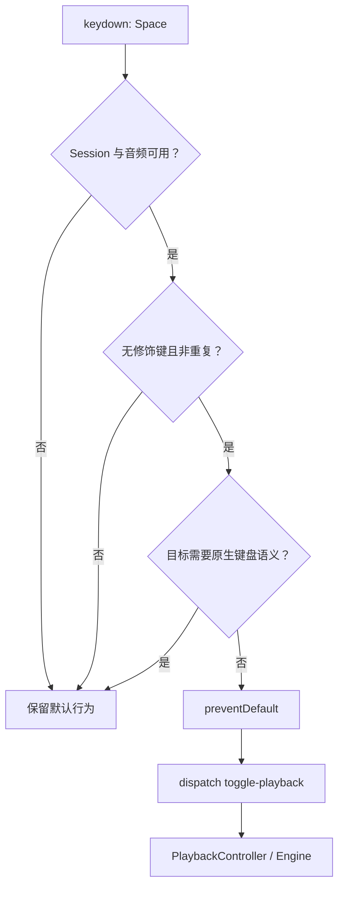

# Viewer 键盘与播放控制设计

## 目标与边界

Viewer 的键盘层把明确的用户意图转成已有播放命令，不维护或推断播放状态。播放事实仍由
`PlaybackController` 和 Playback Engine 拥有，React 只订阅 snapshot 并发送 command。

本设计覆盖 Viewer 页面中的全局播放快捷键、Page Turn 键盘输入、顶部播放控制栏和节奏练习任务。
它不扩展 Bridge API；持久化和 Engine 行为继续由共享 `web-core` 契约定义。

## Space 播放快捷键

无修饰键的 `Space` 是 Viewer 的播放/暂停快捷键。满足以下条件时，Viewer 阻止浏览器默认滚动，
并发送一次 `toggle-playback`：

- 当前存在可播放的 Viewer Session；
- SoundFont 已就绪；
- 按键不是长按产生的重复事件；
- 没有同时按下 `Alt`、`Control`、`Meta` 或 `Shift`；
- 事件目标不属于需要保留原生键盘语义的交互区域。

以下目标保留原生 `Space` 行为，不触发全局播放：

- 链接和按钮；
- 输入框、文本域和下拉框；
- Slider 等具有交互角色的控件；
- `contenteditable` 编辑区域；
- 明确标记为禁用全局快捷键的浮层，例如速度设置 Popover。

这条边界避免按钮因原生键盘激活和全局监听发生双触发，也保证输入、滑块和浮层仍可按标准键盘方式操作。
不可播放时不吞掉按键，不伪造本地播放状态；是否开始播放始终以 Engine 事件反馈为准。

## 顶部播放控制栏

控制栏保持左对齐，按使用频率和职责分组：

1. 播放/暂停是主图标按钮，提示 `Space` 快捷键。
2. 停止是次级方形图标按钮。普通播放时回到谱面开头；启用已选循环时回到循环起点。
3. 循环是可切换图标按钮，直接打开或关闭循环模式，不打开练习设置。存在已选 Loop 或有效草稿时
   直接启用；首次打开且没有可用区间时，以播放头所在小节建立默认 A/B 并立即作为临时 Loop 生效；
   再次打开恢复保留的草稿或已选 Loop。
4. 当前时间与总时长紧邻 Transport 控件。
5. 播放进度继续横跨控制栏底边。
6. 速度同时显示实际 BPM 和相对原谱百分比；精确输入与预设留在 Popover。
7. 音频正常时不占据固定状态位；加载或失败时才显示状态与恢复操作。
8. 练习设置保留节拍与预备拍、循环边界、循环列表和轨道等低频操作。
9. 谱面导航模式使用图标 + ContextPopup；Page Turn 才显示页码与上一页/下一页，Detached 显示
   “返回播放位置”。

所有纯图标按钮必须提供中文 accessible name。可用的循环按钮使用 `aria-pressed` 表达状态；按钮提示解释
动作或快捷键，不能只依赖图标形状传达含义。

route viewport 小于等于 620px 时，控制栏保留播放、停止、循环、时间、非就绪音频状态和练习设置；
速度入口与音频重试移入练习设置，进度 Slider 仍横跨控制栏顶边。练习设置使用
`SlidersHorizontal` 紧凑入口，但 accessible name 不缩写。面板打开时聚焦关闭按钮，`Escape`
关闭后把焦点恢复到练习设置入口；面板保持非模态，不强制焦点圈定。

Viewer 的宽屏谱面缩放保留缩小、百分比和放大三个直接控件；小于等于 620px 时改为单个“调整谱面
缩放”Popover 入口。两种入口与双指缩放都提交同一个 `zupulse:score-zoom-commit` 事件。

## 节拍与预备拍

Metronome 与一小节 Count-in 位于练习设置首层任务，不增加 Transport 常驻文字控件。两个设置各自
保留显式开关和 0–100 整数音量，不能用音量是否为零推断用户选择。音频未就绪时控件保持可发现，
但禁用并提供就地原因。

`PlaybackController` 持有设置、持久化和 `counting-in` 状态；React 只发送 command。新开始允许
alphaTab 执行 Count-in，从 pause 恢复通过 Engine 的 `skipCountIn` 操作避免再次启动。Count-in
期间只显示“预备拍”，因为当前公开生命周期无法可靠提供逐拍进度。

## 练习手

练习手只对唯一的双非打击乐 Staff Track 开放，并使用稳定的 Track / Staff source index 建立显式
`PianoHandMapping`。单手模式默认让系统播放另一只手作为伴奏；临时试听目标手使用 Toggle，关闭后
恢复伴奏手且不写入 Sidecar。

alphaTab 没有公开 Staff mixer，因此 Engine 深拷贝运行时 Score，在副本中清空非目标 Staff 的 Note
并生成替换 MIDI。渲染 Score、来源文件与 Track Mixer facts 不变。播放中切换执行暂停、加载、恢复
tick 和 mixer、继续播放；失败降级为语义化 unavailable。谱面强调通过 bounds overlay 实现，不修改
音符颜色或谱面内容。

## 琴键引导

琴键引导复用 `PianoHandMapping` 的 eligibility，只对唯一双非打击乐 Staff Track 开放。入口位于
练习设置任务列表和 Transport 右侧工具区的琴键引导图标按钮（`aria-pressed` 反映状态，不可用时禁用），默认关闭
且仅属于当前 Viewer Session。可视化位于乐谱下方、Transport 上方；关闭
后不保留空白，不改变 transport、position、tempo、Loop、Track Mixer 或练习手状态。

可视化在空间允许时默认高 260px，用户可拖动顶部分隔条在 180–420px 内调整。工作区 resize 时以
180px 最小谱面高度和 8px 独立区域间距重新限制可视化上限；钢琴区作为 Grid 行参与布局，不得用
overlay 覆盖仍可独立滚动的谱面。关闭再打开保留当前 Session 的用户高度，Viewer source 变化时恢复
默认值。分隔条暴露 horizontal separator 语义，ArrowUp / ArrowDown 以 16px 调整，Home / End 到达
当前边界，双击恢复默认高度。布局约束由 React state 与 `ResizeObserver` 低频更新，不进入逐帧 SVG
runtime。

`web-core` 分别克隆左右 Staff 的 alphaTab Score，并从 `MidiFileGenerator` 捕获已展开的播放事件，
由此继承反复、连音和实际时值语义。事件使用发声音高与半开区间 `[startTick, endTick)`；时间轴生成不
修改渲染 Score。Viewer Session 只向 React 边界暴露不可变事件和窄 `getTick()` 读取器，不暴露
`AlphaTabApi`。完整时间轴只在用户首次打开提示时惰性生成，并在当前 Session 内复用；视觉 eligibility
只取决于稳定的 Staff mapping，不与单手音频隔离 capability 绑定。

React 负责开关、稳定音域和无障碍结构；逐帧提示块与 active key 更新由 session-owned runtime 直接写
入区域内的 SVG 元素，不进入 `PlaybackController` snapshot 或 React state。提前窗口跟随当前有效速度
（baseTempo × scoreSpeed）固定提前约 2 秒墙钟时间，并限制在 2–8 个四分音符之间，使音符下落速度在
变速练习中保持体感一致。active key 按手色高亮（signal purple / signal blue），coral 只用于击打线；
到达击打线的提示块标记为发声并加亮。
双手示范显示双手，练右手或练左手时只显示目标手。卸载时必须取消 animation frame 并清除命令式
引用。runtime 初始化一次按 `startTick` 排序的时间索引，逐帧只投影当前窗口附近的候选事件；SVG
提示 rect 使用可增长节点池并按属性差异更新，active key 只切换变化的音高，不得逐帧清空提示层或
遍历整首时间轴。每个 React effect 实例只拥有自己创建的池节点；effect 清理必须删除这些节点并复位
active key，保证 Strict Mode 重挂载、Session 切换和 route teardown 不留下静止的旧提示块。

## 明确不做

- 不绑定停止快捷键。不同音乐软件没有足够一致的约定。
- 不劫持方向键。未来必须先明确按时间、拍还是小节移动，再设计修饰键规则。
- 不在 Transport 增加节拍器或预备拍的常驻文字按钮。
- 不在 React 中根据按键直接切换本地 `transport`；Engine 事件仍是播放状态事实源。
- 不接收外接 MIDI、不评价演奏准确度，也不持久化琴键引导开关。

## Page Turn 输入

Page Turn Mode 在非交互目标上消费 PageUp / PageDown，一次移动一个 Screen Score Page 并进入
Detached。输入框、按钮、选择框、可编辑区域和 Slider 保留原生键盘语义。左右方向键不用于翻页。

## 验证契约

组件测试至少覆盖：

- 页面非交互区域按 `Space` 发送一次 `toggle-playback` 并阻止默认行为；
- 输入控件和按钮上的 `Space` 不触发全局播放；
- 带修饰键或重复的 `Space` 被忽略；
- 播放、停止和循环按钮具有正确的 accessible name、图标和状态；
- 循环按钮直接切换模式且不打开练习设置；没有可用区间时按当前小节建立默认 A/B 草稿并提交为临时
  Loop，已有可用区间时发送 `set-loop-enabled`；
- 健康音频状态隐藏，非就绪状态仍然可见；
- 速度按钮同时暴露 BPM 与百分比；
- 练习设置与窄屏 Zoom Popover 支持 `Escape` 和焦点恢复。
- Metronome / Count-in 开关与音量互相独立，`counting-in` 通过文字状态和暂停按钮可感知。
- 琴键引导覆盖反复、连音、半开边界、同音重叠、左右手过滤、逐帧清理与不可用降级。

浏览器运行时检查在 390、620、640 和 1280px 补充验证真实布局、焦点行为、控件边界和控制台错误。
新增快捷键必须先写出与现有控件焦点冲突的场景，不能只验证页面背景上的成功路径。
