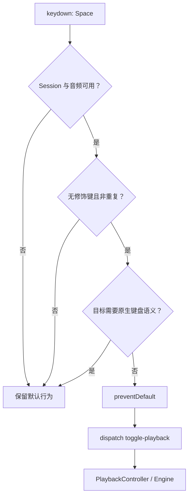

# Viewer 键盘与播放控制设计

## 目标与边界

Viewer 的键盘层把明确的用户意图转成已有播放命令，不维护或推断播放状态。播放事实仍由
`PlaybackController` 和 Playback Engine 拥有，React 只订阅 snapshot 并发送 command。

本设计覆盖 Viewer 页面中的全局播放快捷键、Page Turn 键盘输入和顶部播放控制栏。它不扩展
Bridge API、持久化结构、Playback Engine 契约或领域命令集合。

## Space 播放快捷键

无修饰键的 `Space` 是 Viewer 的播放/暂停快捷键。满足以下条件时，Viewer 阻止浏览器默认滚动，
并发送一次 `toggle-playback`：

- 当前存在可播放的 Viewer Session；
- SoundFont 已就绪；
- 按键不是长按产生的重复事件；
- 没有同时按下 `Alt`、`Control`、`Meta` 或 `Shift`；
- 事件目标不属于需要保留原生键盘语义的交互区域。

以下目标保留原生 `Space` 行为，不触发全局播放：

- 链接和按钮；
- 输入框、文本域和下拉框；
- Slider 等具有交互角色的控件；
- `contenteditable` 编辑区域；
- 明确标记为禁用全局快捷键的浮层，例如速度设置 Popover。

这条边界避免按钮因原生键盘激活和全局监听发生双触发，也保证输入、滑块和浮层仍可按标准键盘方式操作。
不可播放时不吞掉按键，不伪造本地播放状态；是否开始播放始终以 Engine 事件反馈为准。

## 顶部播放控制栏

控制栏保持左对齐，按使用频率和职责分组：

1. 播放/暂停是主图标按钮，提示 `Space` 快捷键。
2. 停止是次级方形图标按钮。普通播放时回到谱面开头；启用已选循环时回到循环起点。
3. 循环是可切换图标按钮。存在已选 Loop Region 时直接启用或关闭；没有有效区间时打开练习设置，
   不自动猜测 A/B 边界。
4. 当前时间与总时长紧邻 Transport 控件。
5. 播放进度继续横跨控制栏底边。
6. 速度同时显示实际 BPM 和相对原谱百分比；精确输入与预设留在 Popover。
7. 音频正常时不占据固定状态位；加载或失败时才显示状态与恢复操作。
8. 练习设置保留循环边界、循环列表、轨道和 Session 详情等低频操作。
9. 谱面导航模式使用图标 + ContextPopup；Page Turn 才显示页码与上一页/下一页，Detached 显示
   “返回播放位置”。

所有纯图标按钮必须提供中文 accessible name。可用的循环按钮使用 `aria-pressed` 表达状态；按钮提示解释
动作或快捷键，不能只依赖图标形状传达含义。

route viewport 小于等于 620px 时，控制栏保留播放、停止、循环、时间、非就绪音频状态和练习设置；
速度入口与音频重试移入练习设置，进度 Slider 仍横跨控制栏顶边。练习设置使用
`SlidersHorizontal` 紧凑入口，但 accessible name 不缩写。面板打开时聚焦关闭按钮，`Escape`
关闭后把焦点恢复到练习设置入口；面板保持非模态，不强制焦点圈定。

Viewer 的宽屏谱面缩放保留缩小、百分比和放大三个直接控件；小于等于 620px 时改为单个“调整谱面
缩放”Popover 入口。两种入口与双指缩放都提交同一个 `zupulse:score-zoom-commit` 事件。

## 明确不做

- 不绑定停止快捷键。不同音乐软件没有足够一致的约定。
- 不劫持方向键。未来必须先明确按时间、拍还是小节移动，再设计修饰键规则。
- 不增加节拍器、预备拍或无功能占位按钮；这些能力需要独立扩展播放契约和音频行为。
- 不在 React 中根据按键直接切换本地 `transport`；Engine 事件仍是播放状态事实源。

## Page Turn 输入

Page Turn Mode 在非交互目标上消费 PageUp / PageDown，一次移动一个 Screen Score Page 并进入
Detached。输入框、按钮、选择框、可编辑区域和 Slider 保留原生键盘语义。左右方向键不用于翻页。

## 验证契约

组件测试至少覆盖：

- 页面非交互区域按 `Space` 发送一次 `toggle-playback` 并阻止默认行为；
- 输入控件和按钮上的 `Space` 不触发全局播放；
- 带修饰键或重复的 `Space` 被忽略；
- 播放、停止和循环按钮具有正确的 accessible name、图标和状态；
- 没有已选循环时打开练习设置，有已选循环时发送 `set-loop-enabled`；
- 健康音频状态隐藏，非就绪状态仍然可见；
- 速度按钮同时暴露 BPM 与百分比；
- 练习设置与窄屏 Zoom Popover 支持 `Escape` 和焦点恢复。

浏览器运行时检查在 390、620、640 和 1280px 补充验证真实布局、焦点行为、控件边界和控制台错误。
新增快捷键必须先写出与现有控件焦点冲突的场景，不能只验证页面背景上的成功路径。
