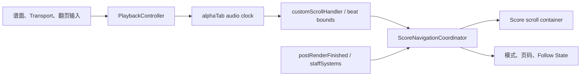

# Viewer 谱面导航架构

Viewer 在一份 alphaTab 纵向布局上组合播放语义和视口导航，不逐页重建曲谱或播放器。

## 责任边界

- `web-core` 的 `PlaybackController` 是正式 transport、seek、Loop 和持久化入口。
- alphaTab 拥有音频时钟、动画游标、beat 命中、展开后的播放时间轴和谱面坐标。
- `web-viewer/src/score-navigation` 把公开 alphaTab bounds 规范化为完整谱表行和 Screen Score Page，
  并管理 `Following | Detached`、generation、手势去重与滚动。
- React 只订阅低频导航 snapshot。Scrub Preview、游标几何和滚动位置留在命令式 Viewer 边界。

## 位置与页面

Written Position 通过 alphaTab `tickCache.masterBars` 的展开顺序形成 Playback Occurrence。正式谱面
点击选择当前 occurrence、之后最近 occurrence 或首次 fallback，并只 dispatch 一次 seek。

页面投影按真实 `y + height` 与视口高度贪心分组，身份来自首条谱表行的书面小节锚点。Loop 涉及的
完整谱表行可容纳时强制从 Loop 首行开始临时页面。resize、zoom 和 render 完成后重新投影；递增
generation 防止旧布局回调覆盖新状态。

## 发布与生命周期

alphaTab 游标继续逐帧运行；Controller 对普通 playing position 以 100ms 窗口合并，语义事件立即
通知。Session destroy 清理 alphaTab handler、DOM 输入、ResizeObserver、Controller 和预览状态。
