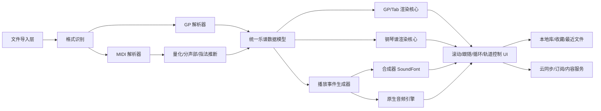

# 跨桌面与 iOS 的 Guitar Pro 与 MIDI 乐谱 App 深度研究

## 执行摘要

如果你的目标是做一个“在 Windows/macOS 与 iOS 都可用、能看 Guitar Pro 与 MIDI 钢琴谱、带较强练习播放能力”的产品，最值得参考的不是单一竞品，而是三类产品的组合能力。

一类是 **Guitar Pro / alphaTab 路线**。它们最强的是对 Guitar Pro 生态的保真度：Tab、五线谱、弯音/滑音/击勾弦、轨道静音独奏、变速、循环、指板/键盘跟随，这条线最接近你要做的 GP 阅读器本体。官方层面，Guitar Pro 自 1997 年以来累计下载已超过 1500 万次，移动端 iOS 版仍在售卖，说明“付费买本地乐谱工具”这件事是成立的。citeturn29search2turn17view0turn29search8turn31search0

另一类是 **Songsterr / Soundslice 路线**。它们不是“文件工具”优先，而是“练习体验”优先。Songsterr 依靠百万级曲库、原音频/伴奏、速度控制、Loop、Solo/Mute，证明用户愿意为“学习过程”付费；Soundslice 则证明“谱面 + 音频/视频同步 + 精准跟随”是一个强黏性的差异化方向，而且它直接支持 Guitar Pro 原生文件导入。citeturn9search8turn17view1turn8search7turn8search1turn24search15

第三类是 **MuseScore / Flat / forScore / Newzik 路线**。MuseScore 与 Flat 代表“格式兼容 + 社区/云 + 订阅”；forScore 与 Newzik 代表“演出/批注/乐谱库管理”。这几家说明，单纯“看谱”价值有限，真正能把客单价拉上去的是云同步、批注、团队协作、课件/教学、内容库、AI/OCR、以及更好的音色与练习闭环。citeturn17view2turn10search4turn15search5turn13search3turn13search9

技术上，**最合适的开源起点不是从零写渲染器**。如果你要尽快做出跨平台一致体验，优先考虑 **alphaTab 作为 GP 渲染与播放核心**，再配合 **独立 MIDI 解析与量化层**、**FluidSynth 或 TinySoundFont 做合成**、必要时对 **MusicXML/钢琴谱使用 Verovio 或 OpenSheetMusicDisplay**。alphaTab 的优势是它本身就是“跨平台乐谱与吉他谱渲染库”，并且原生支持 Guitar Pro 数据源；这会显著降低你在 GP 保真、滚动跟随、轨道控制上的实现成本。citeturn31search0turn31search4turn40search19turn31search3turn36view7turn36view1turn41search6

许可上，**GPL/AGPL 是最大风险点**。MuseScore Studio 代码库是 GPLv3，JUCE 是 AGPLv3/商业双许可证，LilyPond 也是 GPL。对闭源商业 App 来说，这些都不适合直接嵌入核心业务代码。相对安全的是 **MIT / BSD / MPL / LGPL** 组合：比如 alphaTab 是 MPL-2.0，VexFlow MIT，OpenSheetMusicDisplay MIT，AudioKit MIT，GUIDOlib MPL-2.0，FluidSynth/Verovio 属于 LGPL，但在 iOS 分发上需要专门做合规评估。citeturn39search14turn42search4turn41search8turn40search3turn40search12turn41search14turn40search2turn42search5turn42search2turn40search9

商业上，最可行的切入点不是去正面复制 MuseScore 社区，也不是去做版权曲库平台，而是做一个 **“本地文件优先、练习体验更强、GP 与 MIDI 双优先、桌面+iOS 一致”的高质量播放器/学习器**。这个位置比“通用制谱软件”轻，比“正版曲库平台”法律风险低，也比“PDF 看谱器”更容易做出付费价值。竞品价格带已经验证：一次性 $24.99～$69.95、月订阅 $4.99～$9.99、教育/教师更高客单都成立。citeturn15search5turn15search16turn17view1turn10search4turn8search7turn8search17

## 竞品格局与产品对比

先给结论。真正与你目标最接近的核心参考对象是 **Guitar Pro、alphaTab、Songsterr、Soundslice**。  
MuseScore、Flat 更像“记谱生态”；forScore、Newzik 更像“演出与文档管理”；TuxGuitar 是免费的格式与功能基线。

### 产品对比表

| 产品                                    | 产品类型                                   | 功能摘要                                                                                                      | 格式支持                                                                                                                                                                                 | 平台                                                                                                             | 定价模式                                                                                                                   | 用户规模/下载量信号                                                                                                                                                                                                                            | 参考价值                                          |
| --------------------------------------- | ------------------------------------------ | ------------------------------------------------------------------------------------------------------------- | ---------------------------------------------------------------------------------------------------------------------------------------------------------------------------------------- | ---------------------------------------------------------------------------------------------------------------- | -------------------------------------------------------------------------------------------------------------------------- | ---------------------------------------------------------------------------------------------------------------------------------------------------------------------------------------------------------------------------------------------- | ------------------------------------------------- |
| **Guitar Pro**                          | 商业桌面编辑器 + iOS 查看器                | GP 原生生态；Tab/五线谱、多轨播放、节拍器、循环、移调、指板/键盘；iOS 版偏播放器，桌面版偏编辑+练习           | iOS 明确支持 GP3/4/5/6/7/8 与 PTB；桌面是 GP 主格式中心 citeturn17view0                                                                                                               | Windows / macOS / iOS；官方站点强调桌面与“Application”形态 citeturn29search2turn29search8                    | 桌面一次性购买，官方购买页显示 **$69.95**；iOS 版 **$6.99**；另有 mySongBook 订阅/单曲购买 citeturn1search0turn17view0 | 官方称 1997 年以来累计下载 **1500 万+**；iOS 美区 887 评分 citeturn29search2turn18view3                                                                                                                                                    | **最高**。看 GP 保真、练习功能、付费成立性        |
| **TuxGuitar**                           | 免费开源桌面编辑器/播放器                  | Java/SWT，多轨 Tab 编辑与播放，可打开 Guitar Pro / PowerTab / TablEdit；维护节奏偏慢                          | 可打开 GuitarPro、PowerTab、TablEdit；官方项目页未给出 GPX/GP7 完整声明 citeturn16view0                                                                                               | Windows / macOS / Linux；**无 iOS** citeturn16view0                                                           | 免费；项目页有 Donate 链接 citeturn16view0                                                                              | SourceForge 87 reviews，419 weekly downloads，官方项目页上次更新时间 2022-06-01 citeturn16view0                                                                                                                                             | **中高**。看免费基线、UI/稳定性短板、开源功能边界 |
| **MuseScore Studio + MuseScore 移动端** | 桌面开源记谱软件 + iOS/Android 曲库/播放器 | 桌面强在记谱与导入导出；移动端强在曲库、播放、移调、loop、PDF 导出、收藏/离线                                 | 桌面可打开 Guitar Pro `*.gtp/*.gp3/*.gp4/*.gp5/*.gpx/*.gp`；移动端可打开 `.mscz` 与社区谱；移动端订阅与网站 Pro 打通 citeturn39search18turn17view2                                   | 桌面 Windows/macOS/Linux；移动端 iOS/Android citeturn39search14turn42search11                                | 移动端/网站 Pro：**$6.99/月**、**$49.99/年** citeturn17view2                                                            | 官方/第三方信号很强：网站近 3 个月访问约 **1840 万**，Android 页显示 **300 万+** 免费乐谱，日区 iOS 评分 **9038**，美国 iOS Sensor Tower 页面给出“上月约 10 万下载 / 90 万美元收入” citeturn27view1turn42search3turn19view2turn22search1 | **高**。看导入、社区、订阅、移动曲库运营          |
| **Songsterr**                           | 版权曲库型练习平台                         | 百万级 Tab/Chord 曲库，真实播放、原音/伴奏、速度控制、Loop、Solo/Mute、Pitch 等；文件工具属性弱               | 不以“用户文件导入”见长，核心是站内版权曲库；官方称 Web 端 100 万+ tabs，移动端 40 万 songs / 130 万 tracks citeturn9search8turn9search16                                             | Web / iOS / Android；Web 在线，iOS/Android 支持离线 citeturn9search1turn17view1                              | **$9.99/月** 跨平台订阅 citeturn17view1                                                                                 | 网站近 3 个月访问约 **2190 万**；iOS 美区 **4.7 分 / 4.3 万评分**；第三方页面显示美国 iOS 上月约 **8 万下载 / 50 万美元收入** citeturn27view0turn18view2turn5search0                                                                      | **很高**。看“练习工具 > 文件查看器”的商业化方式   |
| **Soundslice**                          | Web/PWA 练习与转录平台                     | 乐谱/Tab 与 YouTube/MP3 同步；Loop、变速、转调、隐藏声部、节拍器；支持 Guitar Pro 原生导入；支持扫码/PDF 识谱 | 原生支持 Guitar Pro、TuxGuitar、MusicXML、ASCII tab、PDF/照片等导入；支持导出 MIDI/MP3/PDF 等 citeturn8search1turn8search12turn8search18turn24search13turn24search5turn8search11 | Web；**无原生 iOS/Android App**，推荐 Home Screen/PWA；也支持嵌入原生 WebView citeturn8search2turn8search13  | Free；Plus **$5/月 / $50/年**；Teacher **$20/月/100 学生**；嵌入授权另算 citeturn8search7turn8search17turn8search4    | 无公开用户数；Similarweb 竞品页把 soundslice.com 排到音乐类约 **#652**，说明是中等规模垂直站点 citeturn30search2                                                                                                                            | **很高**。看“同步跟随 + 教学/嵌入 SaaS”           |
| **Flat**                                | 商业记谱与协作平台                         | 跨设备记谱、协作、播放、离线、教育版，支持乐谱与吉他谱；移动端也能编辑                                        | 直接导入 PDF、MusicXML、MuseScore、MIDI、Guitar Pro、PowerTab、TuxGuitar；GP 支持 `*.gp/*.gpx/*.gp5/*.gp4/*.gp3` citeturn11search0turn11search4                                      | Web / Windows / macOS / iOS / Android citeturn10search0                                                       | Flat Power：**$9.99/月 / $49/年 / $299 终身**；教育版另售 citeturn10search4                                             | 官方称“**millions of consumers**”；Google Play 显示 **500K+ downloads**、4.89K reviews citeturn29search1turn20search10                                                                                                                     | **高**。看跨端、协作、教育商业化                  |
| **forScore**                            | Apple 生态 PDF 乐谱阅读器                  | 强项是 PDF 乐谱阅读、批注、组织、外设、节目单、音频链接；不是 GP/MIDI 播放器                                  | 以 **PDF** 为中心；官方明确不具备“识别音符并转调/回放”的能力 citeturn14search1turn14search8                                                                                          | iPad / iPhone / Mac / Vision；**无 Windows** citeturn14search6turn14search17                                 | 一次性 **$24.99**；forScore Pro **$14.99/年起** citeturn15search5turn15search14                                        | 官方无公开 MAU；作为 Universal Purchase 长期存在，Apple 官方商店长期上架 citeturn14search6turn17view3                                                                                                                                      | **中**。看乐谱库管理、演出态、Apple-only 商业化   |
| **Newzik**                              | 专业演出/教育/机构协作平台                 | PDF/LiveScores/批注/翻页/团队协作/云库，Web 管理 + iPad 演出体验强                                            | 支持 PDF、JPEG、MusicXML/XML/MXL/TXT；音频含 MIDI；Premium 支持导出 MusicXML/MIDI、PDF 转调、LiveScores                                                                                  | iOS + Web；电脑端以 Web 管理为主，播放更偏 iPad citeturn13search14turn13search12turn12search5turn13search2 | Premium **€49.99/年** 或 **€9.99/月**；另有 Essentials 与机构方案 citeturn13search3turn13search15                      | 官方披露 **45 万活跃用户**、**1400 万托管乐谱**、**150+ 机构** citeturn13search9                                                                                                                                                            | **中高**。看批注协作、机构销售、演出工作流        |

### 竞品分层判断

如果从“你要做的事情”反推，竞品可分成四层。

**最直接层**：Guitar Pro、TuxGuitar、alphaTab。  
它们解决的是 **GP 文件能否高保真打开、渲染、播放、控制**。这是你的产品底盘。citeturn17view0turn16view0turn31search0

**练习体验层**：Songsterr、Soundslice。  
它们证明用户付费点不是“打开文件”，而是 **跟着学、跟着练、能降速、能 Loop、能伴奏、能同步音视频**。citeturn17view1turn24search15turn24search11

**格式与社区层**：MuseScore、Flat。  
它们证明订阅能成立，但前提是 **格式兼容 + 内容库/社区 + 云工作流**。citeturn39search18turn11search0turn27view1

**演出与文档层**：forScore、Newzik。  
它们对“本地乐谱库、批注、翻页、节目单、跨设备同步”的体验做得比 GP 产品更成熟。citeturn17view3turn13search12turn13search14

## 收入估算与商业模式

### 估算方法

这部分没有公开财报可直接抄。比较可靠的方法只能做 **三角估算**：

- **移动端收入锚点**：优先用 Sensor Tower 搜索结果里暴露的“上月 downloads / revenue estimates”。这类数据对 MuseScore、Songsterr、forScore 有用，但通常只覆盖某个商店与国家，所以应把它当成 **下限或锚点**，不是总收入。citeturn22search1turn5search0turn6search4
- **Web/桌面规模锚点**：用 Similarweb 的近 3 个月访问量与品类排名，看 web 业务的体量；Songsterr 近 3 个月约 2190 万访问，MuseScore 约 1840 万，说明两者的 web 订阅与广告/转化空间都不小。citeturn27view0turn27view1
- **官方价格与席位模型**：像 Soundslice、Flat、Newzik 都公开了个人版、教师版、机构版价格，可以反推单位经济模型。citeturn8search7turn8search17turn10search4turn13search3
- **官方用户规模信号**：Guitar Pro 的 1500 万累计下载、Newzik 的 45 万活跃用户 / 150+ 机构、Flat 的“millions of consumers”，可用来约束过高或过低的结果。citeturn29search2turn13search9turn29search1

我的做法是给每个产品三个档位：

- **保守**：只承认已能看到的商店收入锚点，或按很低转化率估算
- **中位**：把 Web/桌面/机构收入补进去
- **乐观**：允许更高订阅转化、更高地域扩展、或更强 B2B 占比

以下全部为 **2025 年年化估算** 与 **2023–2025 三年累计区间估算**，单位统一按 **美元** 近似表示。  
这不是审计口径。它更适合拿来做立项优先级判断，不适合当投资材料直接引用。

### 收入估算表

| 产品                        | 核心变现                                            | 关键观测值                                                                                                                                                                                          | 2025E 保守 / 中位 / 乐观        | 2023–2025 累计估算             | 置信度    |
| --------------------------- | --------------------------------------------------- | --------------------------------------------------------------------------------------------------------------------------------------------------------------------------------------------------- | ------------------------------- | ------------------------------ | --------- |
| **MuseScore**               | Pro 订阅；Web + iOS/Android；内容与导出能力驱动转化 | iOS US 上月约 **$0.9M**、10 万下载；网站 3 个月 **18.4M** 访问；移动端/网站 Pro 统一定价；Android 页面显示 **300 万+** 免费谱面 citeturn22search1turn27view1turn17view2turn42search3          | **$20M / $35M / $55M**          | **$50M / $90M / $140M**        | **中**    |
| **Songsterr**               | 月订阅；曲库内容 + 练习功能；少量广告/版权分成结构  | iOS US 上月约 **$0.5M**；网站 3 个月 **21.9M** 访问；iOS **43K ratings**；订阅 **$9.99/月** citeturn5search0turn27view0turn18view2turn17view1                                                 | **$8M / $14M / $22M**           | **$20M / $35M / $55M**         | **中**    |
| **Guitar Pro + mySongBook** | 桌面一次性付费；移动端买断；内容订阅/单曲购买       | 桌面价 **$69.95**；iOS **$6.99**；累计下载 **1500 万+**；iOS 排名在美区 Music Top 20 附近但评分数不大，说明移动端是附属收入，桌面仍是大头 citeturn1search0turn17view0turn29search2turn18view3 | **$2.5M / $5M / $9M**           | **$6M / $12M / $22M**          | **低-中** |
| **Flat**                    | 订阅 + 终身买断 + 教育席位                          | Power **$9.99/月 / $49/年 / $299 终身**；官方称“millions of consumers”；Android **500K+** 安装；支持多端与教育 citeturn10search4turn29search1turn20search10                                    | **$2M / $5M / $9M**             | **$4M / $11M / $20M**          | **低-中** |
| **forScore**                | 一次性买断 + Pro 年订阅                             | Store 一次性 **$24.99**；Pro **$14.99/年起**；第三方页面显示 iOS US 上月约 **$0.2M** 收入；Apple-only 限制了 TAM，但付费意愿高 citeturn15search5turn6search4turn14search17                     | **$1.5M / $3M / $5M**           | **$4M / $8M / $14M**           | **中**    |
| **Newzik**                  | Premium 订阅 + Essentials 买断 + 机构销售           | Premium **€49.99/年 / €9.99/月**；官方 **45 万活跃用户**、**150+ 机构**、**1400 万托管乐谱**；Web + iPad 更偏专业/B2B citeturn13search3turn13search9                                            | **$1M / $2.5M / $5M**           | **$2.5M / $6M / $12M**         | **低-中** |
| **Soundslice**              | Plus / Teacher / Licensing 三层 SaaS                | Plus **$50/年**；Teacher **$20/月/100 学生**；嵌入授权首 200 用户 **$100/月**；无公开用户数，说明更像高 ARPU 小团队 SaaS citeturn8search7turn8search17turn8search4                             | **$0.6M / $1.5M / $3M**         | **$1.5M / $4M / $8M**          | **低**    |
| **TuxGuitar**               | 免费 / 捐赠                                         | 免费、LGPL、Donate 链接、周下载 419；没有可见商业闭环 citeturn16view0                                                                                                                            | **$0 ~ $0.05M / $0.1M / $0.2M** | **$0 ~ $0.1M / $0.2M / $0.3M** | **高**    |

### 对这些数字的解读

**最能赚钱的不是“最好打开 GP 文件”的产品，而是“持续使用”的产品。**  
MuseScore、Songsterr 估算收入显著高于 Guitar Pro，本质原因不是它们渲染更强，而是 **订阅 + 曲库/社区 + 高频打开**。Guitar Pro 的一次性买断模式更像专业工具，生命周期长，但年度营收天花板通常低于强订阅产品。citeturn22search1turn5search0turn29search2

**如果你只做本地查看器，收入上限很可能更接近 forScore / Guitar Pro，而不是 MuseScore / Songsterr。**  
也就是说，纯播放器可以赚钱，但更可能是 **几百万美元级**，不是天然的几十百万美元级。后者往往需要内容库、订阅、机构侧、或高频练习场景。citeturn15search5turn6search4turn17view2turn17view1

**Soundslice 和 Newzik 很值得看，不是因为它们最大，而是因为它们把高客单价做出来了。**  
它们说明：只要切到明确垂直工作流，哪怕用户规模不是最大，也可以做出不错的 SaaS 收入密度。citeturn8search17turn8search4turn13search9

## 开源库与技术栈评估

### 一个关键判断

你的项目有两个完全不同的技术问题：

- **Guitar Pro 文件解析/渲染/播放**
- **MIDI 文件解析 + 从事件推回“可读钢琴谱”**

前者已经有比较成熟的开源积累。  
后者真正难的不是“读 MIDI”，而是 **量化、分声部、音符时值归并、连音/休止符/跨小节表达**。  
所以不要把“支持 MIDI”理解成“有个 MIDI parser 就够了”。

### 开源库清单与评估表

| 项目                       | 主要用途                                | 语言                                          | 许可证                                                                    | 活跃度信号                                                                                                | 覆盖能力                                                                                                                              | 移动端可用性                                                                                                                      | 优点                                             | 已知限制 / 集成难度                                                           |
| -------------------------- | --------------------------------------- | --------------------------------------------- | ------------------------------------------------------------------------- | --------------------------------------------------------------------------------------------------------- | ------------------------------------------------------------------------------------------------------------------------------------- | --------------------------------------------------------------------------------------------------------------------------------- | ------------------------------------------------ | ----------------------------------------------------------------------------- |
| **alphaTab**               | **GP 渲染 + 播放 + Tab/五线谱 UI 核心** | TypeScript / JS；也有 Android/Kotlin 等发行物 | **MPL-2.0** citeturn40search3turn40search19                           | 2026 仍在发布，1.6.x/1.3.x 体系持续更新；提供 Android 原生支持说明 citeturn35search11turn35search4    | 官方明确是跨平台乐谱与吉他谱渲染库；支持从 Guitar Pro 等数据源加载；带响应式显示、布局与播放器能力 citeturn31search0turn31search4 | **强**。Web 直接用；桌面可经 WebView/Tauri/Electron；iOS 可经 WKWebView；Android 有原生发行物 citeturn31search12turn35search4 | 你这类产品的**首选**开源底座；GP 方向最贴题      | MPL 对修改过的库文件有开源义务；播放器音色与 UI 仍常需二次定制                |
| **PyGuitarPro**            | GP3/4/5 解析/改写、服务端转换、原型验证 | Python                                        | 未在当前页面直接展开许可证；项目公开可用                                  | 2026 仍有更新痕迹；GitHub Topics 显示 2026 更新 citeturn34search4turn38search3                        | 只支持 **GP3/4/5**，明确**不支持 GPX** citeturn34search15turn36view3                                                              | **弱**。更适合工具链/服务端，不适合客户端嵌入                                                                                     | Python 原型快，适合测试、批处理、diff/merge      | 不支持 GPX/GP7/GP8；不适合移动端产线                                          |
| **slundi/guitarpro**       | Rust GP 解析写入库                      | Rust                                          | **MIT** citeturn36view4                                                | 2026 仍公开维护，GitHub 可见 stars 与 activity citeturn36view4                                         | 声称支持 GP3/4/5、早期 GP6/7、MSCZ；统一数据模型 citeturn36view4                                                                   | **中强**。Rust core 可桥接 iOS/desktop                                                                                            | 如果你要自己掌控解析层，这是目前很有潜力的方向   | 生态新，星标不大；你要自己补播放器/渲染/UI                                    |
| **PhpTabs**                | GP3/4/5 与 MIDI 读写；可转 VexTab       | PHP                                           | 开源；文档/仓库公开                                                       | 更新不算高频；更偏服务器工具 citeturn34search3turn36view5                                             | 支持 GP3/4/5、MIDI；能输出 VexTab citeturn34search3turn36view5turn31search9                                                      | **弱**                                                                                                                            | 适合服务端导入/转换流水线                        | 不覆盖 GPX/GP7；PHP 不适合作为客户端核心                                      |
| **VexFlow**                | 五线谱/吉他谱渲染                       | TypeScript / JS                               | **MIT** citeturn40search12turn40search8                               | V5 已迁移到新仓库；4.x 仍维护为 LTS citeturn38search8turn38search12                                   | 标准五线谱、吉他 Tab、Canvas/SVG 渲染 citeturn31search1turn36view0                                                                | **强**，尤其 WebView 跨端                                                                                                         | 渲染能力成熟、生态大                             | 它是**渲染 API，不是完整 MusicXML/GP 业务引擎**；布局、分页、交互很多要自己补 |
| **OpenSheetMusicDisplay**  | MusicXML -> 浏览器可视乐谱              | TypeScript / JS                               | **MIT** citeturn41search14                                             | 持续存在，定位清晰                                                                                        | 官方称是 MusicXML 与 VexFlow 的“missing link” citeturn41search10turn41search6                                                     | **强**，WebView 友好                                                                                                              | 如果你要做钢琴谱浏览，比纯 VexFlow 更省事        | 主战场是 MusicXML，不是 GP；Tab/GP 语义不如 alphaTab 原生                     |
| **Verovio**                | MEI/MusicXML/ABC/Humdrum 等渲染         | C++20 + JS/Python/Swift/Java/Go bindings      | **LGPL** / LGPLv3 系列 citeturn40search1turn40search13turn40search17 | 版本到 6.x；有 Android/Qt demo 与 Swift/CocoaPods 分发 citeturn38search13turn38search9turn31search10 | 快、轻、SVG 输出，适合分页展示；支持 MusicXML on-the-fly 转换 citeturn36view1                                                      | **中强**，但 iOS 需处理 LGPL 合规                                                                                                 | 适合“钢琴谱/传统五线谱浏览器”                    | 不原生面向 GP；iOS/App Store 上 LGPL 合规要专门评估 citeturn40search9      |
| **GUIDOlib / GuidoEngine** | 记谱描述与渲染引擎                      | C++                                           | **MPL-2.0** citeturn42search5turn42search1                            | 老项目，研究与工程积累都在                                                                                | 适合文本记谱描述到渲染的工具链 citeturn41search13turn42search1                                                                    | **中**                                                                                                                            | 许可比 GPL 友好                                  | 生态远弱于 VexFlow/Verovio/alphaTab；GP/MIDI 现成支持有限                     |
| **LilyPond**               | 高质量排版 / 出版级 engraving           | C++ / Scheme 体系                             | **GPL-3.0** 等 citeturn41search8turn41search0                         | 长期稳定                                                                                                  | 排版质量强，适合离线生成高质量乐谱/PDF citeturn41search0turn41search12                                                            | **弱**，更适合离线后端                                                                                                            | 出版质量高                                       | 不适合闭源 App 直接嵌入；实时交互型 viewer 也不是它的强项                     |
| **MuseScore codebase**     | 完整记谱、导入导出、播放、排版          | C++ / Qt                                      | **GPLv3** citeturn39search14                                           | 极活跃，大生态                                                                                            | 现成支持 MusicXML/MIDI/GP 导入等 citeturn39search14turn39search18                                                                 | 桌面强，移动嵌入不现实                                                                                                            | 参考价值极高                                     | **闭源商用直接嵌入风险高**；更适合看实现思路，不适合拿来当 SDK                |
| **music21**                | MIDI/MusicXML 解析、理论分析、规则处理  | Python                                        | **BSD** citeturn41search3turn41search7                                | 长期项目                                                                                                  | 可 parse MIDI / MusicXML，适合量化、分析、原型验证 citeturn32search0turn41search7                                                 | **弱**，服务端/工具链友好                                                                                                         | 做 MIDI -> 规则推断、切分实验很方便              | 性能与移动端嵌入都不适合产线客户端                                            |
| **Mido / pretty_midi**     | MIDI 读写、分析                         | Python                                        | Mido 文档公开；pretty_midi **MIT** citeturn33search0turn32search3     | 长期稳定                                                                                                  | 读写 MIDI、事件与时间处理方便 citeturn33search4turn32search19                                                                     | **弱**                                                                                                                            | 好用、上手快                                     | 只是 MIDI 层，不解决“钢琴谱可读化”                                            |
| **DryWetMIDI**             | .NET/Unity MIDI 全家桶                  | C# / .NET                                     | **MIT** citeturn36view6                                                | 2025 末还有 8.0.3 发布 citeturn38search2                                                               | 文件读写、设备收发、播放、记录、量化工具都齐 citeturn36view6                                                                       | **中**；适合 Windows/.NET/Unity 路线                                                                                              | 如果你走 C#/MAUI/Unity，这个是很强的 MIDI 基础库 | 非 GP 库；iOS 不是它的主场                                                    |
| **FluidSynth**             | 实时 SoundFont 合成                     | C                                             | **LGPL 2.1** citeturn42search2turn42search6                           | 长期成熟，广泛分发                                                                                        | 读 MIDI 事件与 MIDI 文件，用 SoundFont 合成音频 citeturn31search3turn31search7                                                    | **中**，跨平台强，但移动端要处理体积与合规                                                                                        | 老牌稳定，GM/SF2 路线成熟                        | 无 GUI；音色质量取决于 SoundFont；iOS 分发要评估 LGPL 义务                    |
| **TinySoundFont**          | 轻量 SoundFont 合成                     | C/C++ 单头文件                                | **MIT** citeturn36view7                                                | 星标与示例都不少                                                                                          | SF2 合成；例子覆盖 Win/Linux/macOS，无额外依赖 citeturn36view7                                                                     | **强**，很适合移动端                                                                                                              | 轻、易嵌入、许可友好                             | 功能深度不如 FluidSynth；高级效果要自己补                                     |
| **AudioKit**               | iOS/macOS 音频框架                      | Swift                                         | **MIT** citeturn40search2turn40search6                                | 2026 仍持续发布；官方称支撑 2 亿+ 安装 citeturn32search2turn36view2                                   | 合成、DSP、采样器、Sequencer、Catalyst 支持                                                                                           | **很强**，Apple 平台首选                                                                                                          | iOS/macOS 原生音频体验好                         | 不解决 Windows；更适合 Apple 侧音频引擎                                       |
| **JUCE**                   | 跨平台音频应用框架                      | C++                                           | **AGPLv3 / 商业许可证** citeturn42search4turn42search16               | 行业事实标准之一                                                                                          | 音频 I/O、DSP、GUI、插件与移动/桌面应用框架 citeturn32search1turn32search5                                                        | **强**                                                                                                                            | 如果你要做高性能原生音频，JUCE 很稳              | 对闭源商业 App 来说，大概率需要商业授权，不适合“省授权费”的方案               |

### 对开源技术栈的落地结论

**如果目标是最短时间做一个靠谱 MVP，优先级如下：**

- **GP 文件**：`alphaTab` 第一选择
- **MIDI 解析**：客户端走 `DryWetMIDI`（C#路线）或自研/轻量 parser；服务端/原型走 `music21 + Mido/pretty_midi`
- **五线谱渲染**：`alphaTab` 处理 GP；钢琴谱建议 `OpenSheetMusicDisplay` 或 `Verovio`
- **音频播放**：`TinySoundFont` 追求轻量，`FluidSynth` 追求成熟；Apple 原生可加 `AudioKit`
- **不要直接嵌 MuseScore / LilyPond / JUCE AGPL 版** 到闭源商业核心里

## 架构建议与许可风险

### 推荐架构

我建议采用 **“文件解析核心” 与 “渲染播放核心” 分离** 的结构。  
原因很简单：GP 与 MIDI 不是一个问题。  
GP 是“结构化乐谱文件”；MIDI 更像“演奏事件流”。

### 方案选择建议

#### 方案 A

**Web 渲染核心 + 原生壳层**  
**推荐度最高**

- **渲染**：alphaTab + OSMD/Verovio，统一在 Web 技术栈里
- **桌面**：Tauri 或 Electron
- **iOS**：SwiftUI + WKWebView
- **音频**：iOS 侧用 AudioKit/AVAudioEngine；桌面侧用 TinySoundFont/FluidSynth 或独立原生模块

优点：

- GP 方向最快出效果
- 渲染一致性最好
- iOS 与桌面 UI 行为容易统一
- alphaTab/VexFlow/OSMD 都是这条线的天然搭档

缺点：

- WebView 与原生音频、文件系统、后台播放、蓝牙 MIDI/外设的桥接要做干净
- 超大谱面、复杂分页时要做性能优化

适合：

- 你优先要的是 **快上线 + GP 体验不错 + iOS/桌面一致**

#### 方案 B

**Rust/C++ 核心 + 原生 UI**

- **解析核心**：Rust `guitarpro` + 自研 MIDI 管线
- **桌面/iOS UI**：Qt 或各自原生壳
- **音频**：JUCE/原生音频栈

优点：

- 性能、可控性、离线能力都最好
- 合适做长期平台能力沉淀
- 解析、播放、缓存、同步都能统一成一个强内核

缺点：

- 开发周期显著更长
- 乐谱渲染仍要自己补很多东西
- 如果用 JUCE，要处理许可证；如果不用 JUCE，GUI/音频都更费人力

适合：

- 你已经确定要做长期产品，而不是验证型 MVP

#### 方案 C

**Apple-first 双栈**

- **Apple 侧**：SwiftUI + AudioKit + Web 渲染
- **Windows/macOS 桌面**：单独做 Tauri/Electron 或 Qt 客户端

优点：

- iOS/macOS 体验能做到最好
- Apple 生态支付、文件、音频、蓝牙、外设都更顺

缺点：

- Windows 会被迫双维护
- 如果桌面与 iOS 不是同一 UI 内核，长期成本高

适合：

- 你打算先吃 iPad/iPhone/Mac 用户，再补 Windows

### 实现重点

#### GP 方向

GP 文件支持的优先级建议直接按用户需求排：

- **MVP**：`.gp3 .gp4 .gp5 .gpx .gp`
- **播放控制**：mute/solo、tempo、loop、count-in、transpose、metronome
- **视觉跟随**：当前小节/当前音符高亮，自动滚动
- **教学视图**：fretboard/keyboard 同步高亮

这部分最适合直接建立在 alphaTab 之上。citeturn31search0turn31search4

#### MIDI 方向

MIDI 支持要拆成两层：

- **事件层**：文件读取、tempo map、program change、CC、pitch bend
- **记谱层**：量化、分左右手、和弦归组、拍号检查、休止符补全、连音/切分控制

工程上建议：

- **MVP 不承诺“任意 MIDI 一键漂亮出谱”**
- 先支持
  - piano-roll
  - 基础两行谱（clean MIDI、钢琴教学 MIDI）
  - 可调量化粒度
  - 左右手自动分配的 heuristic
- 把“复杂 MIDI 变高质量钢琴谱”定义成 Pro/后期功能

原因是 music21、Mido、pretty_midi 能帮你处理 MIDI 数据，但不能替你完成最终商业级的出谱体验。citeturn32search0turn33search0turn32search3

### 许可风险要点

| 组件/路线                                                            | 风险等级 | 要点                                                                                                                                                             |
| -------------------------------------------------------------------- | -------- | ---------------------------------------------------------------------------------------------------------------------------------------------------------------- |
| **MuseScore codebase**                                               | **高**   | GPLv3。闭源 App 直接链接/复用核心代码风险高。适合参考实现，不适合当 SDK 直接嵌入。citeturn39search14                                                          |
| **JUCE**                                                             | **高**   | AGPLv3 / 商业双许可证。闭源商业 App 通常要买商业授权。citeturn42search4turn42search16                                                                        |
| **LilyPond**                                                         | **高**   | GPL-3.0。更适合离线转档工具，不适合作为闭源客户端嵌入核心。citeturn41search8                                                                                  |
| **FluidSynth / Verovio**                                             | **中**   | LGPL。桌面通常可控，iOS 需要更严谨地处理替换/重链接等合规问题。Verovio 社区也明确讨论过 iOS/App Store 合规细节。citeturn42search2turn40search1turn40search9 |
| **alphaTab / GUIDOlib**                                              | **中低** | MPL-2.0 对商业闭源相对友好，但你改过的 MPL 文件要按规则公开。citeturn40search3turn42search5                                                                  |
| **VexFlow / OSMD / AudioKit / TinySoundFont / DryWetMIDI / music21** | **低**   | MIT/BSD 方向最适合商业闭源产品。citeturn40search12turn41search14turn40search2turn36view7turn36view6turn41search3                                         |

**结论很明确**：  
如果你想把许可风险压低，主组合应优先考虑：

- `alphaTab`
- `VexFlow / OSMD`
- `TinySoundFont` 或谨慎使用 `FluidSynth`
- `AudioKit`（Apple）
- `Rust/自研 parser` 或 `DryWetMIDI`

## 差异化与商业化路径

### 差异化方向

这个市场已经不缺“能打开谱”的产品。  
缺的是 **跨端一致、GP 与 MIDI 双优先、练习体验更强、且本地文件友好** 的产品。

我认为最有机会的差异化有五个。

#### 高保真 GP 阅读器

不是“兼容 GP”，而是：

- GP 弯音/滑音/泛音/击勾弦/颤音保真
- 轨道级音色/音量/静音独奏
- 指板/键盘双视图
- 深色模式 + 小屏优化 + 演奏模式

这条线是直接对 Guitar Pro 移动端与 TuxGuitar 的体验空白开刀。citeturn17view0turn16view0

#### MIDI 钢琴谱双视图

多数产品对 MIDI 只有两种处理：

- 直接 piano-roll
- 粗糙转谱

你可以做成：

- **钢琴谱 + Piano Roll 同时显示**
- 可调量化粒度
- 左右手分配可编辑
- 小节级重算
- 错误音/重叠音高亮

这会比单纯“导入 MIDI”更有产品价值。

#### 练习模式做深

参考 Songsterr / Soundslice，但更偏本地文件：

- AB 循环
- 智能减速不变调
- 自定义 section 标记
- 只练某轨 / 某声部 / 某只手
- 跟随滚动
- 节拍器 / count-in
- 伴奏轨 / backing mute
- “错处回放”与“热区练习”

Songsterr 已证明练习功能有付费能力，Soundslice 证明同步跟随会提高留存。citeturn17view1turn24search15

#### 本地优先 + 云同步

竞品里很多产品要么偏云平台，要么偏 PDF 管理。  
你可以做：

- 默认本地库
- 云端只做收藏、最近、批注、学习进度、设备同步
- iOS 与桌面秒级同步
- 离线仍完整可用

这比做“大社区曲库”更容易落地，也更少版权压力。

#### 音色质量

Guitar Pro / TuxGuitar 一类产品最容易被用户吐槽的点通常不是功能，而是 **音色普通**。  
如果你把默认 GM/SF2 音色做得更好，再加上练习混音，会很容易形成感知差异。  
技术上可以先用 SoundFont，后面再上更好的 sample pack 或 Apple 侧原生采样器。citeturn31search3turn36view7turn32search14

### 建议的商业化路径

#### 路径一

**买断 + Pro 订阅**

最适合你这个品类。

- 基础版
  - 桌面一次性 **$24.99～$39.99**
  - iOS 一次性 **$9.99～$19.99**
  - 或 Apple Universal Purchase

- Pro 订阅 **$4.99～$7.99/月**
  - 云同步
  - 高级音色包
  - 无限批注/收藏/设备同步
  - 进阶练习功能
  - MIDI 高级量化与导出

这个价格带与 forScore、Flat、Soundslice、Songsterr 的现有市场锚点兼容，不会显得离谱。citeturn15search5turn10search4turn8search7turn17view1

#### 路径二

**个人工具 + 教育版**

如果你想提高 ARPU，教育版很值得加。

- 教师版：**$9.99～$19.99/月**
- 功能：
  - 作业分发
  - 指定 section 练习
  - 批注共享
  - 班级曲库
  - 演示模式

Soundslice、Newzik、Flat 都证明了教育/机构付费比个人买断更稳定。citeturn8search17turn13search10turn29search15

### 你的潜在收入模型

下面给一个更贴近新产品现实的模型，方便你做立项预算。

| 场景     | 用户结构                                                | 年化收入估算          |
| -------- | ------------------------------------------------------- | --------------------- |
| **保守** | 1.5 万买断用户；1000 个 Pro 订阅；少量教育客户          | **$0.4M ~ $0.8M ARR** |
| **中位** | 3 万买断用户；3000 个 Pro 订阅；30–50 个教师/小机构客户 | **$1.0M ~ $2.0M ARR** |
| **乐观** | 5–8 万买断用户；6000+ Pro 订阅；100+ 教育客户           | **$2.5M ~ $5.0M ARR** |

这个区间不是拍脑袋。它是按当前竞品验证过的价格带反推出来的：  
如果你的产品不碰版权大曲库，**几百万美元年收入** 是现实目标；  
如果想冲更高，需要做内容、社区、版权或教育机构。citeturn17view1turn17view2turn10search4turn13search9

### 用户获取渠道

最现实的渠道不是泛投放。

建议顺序：

- **SEO / ASO**：`gp5 viewer`, `gpx viewer`, `guitar pro iPhone`, `MIDI piano score`, `tab player`
- **内容营销**：与 Guitar Pro / MIDI 文件格式教程绑定
- **YouTube / Bilibili 演示**：对比 Guitar Pro / MuseScore / Songsterr 的练习体验
- **Reddit / Discord / GitHub 社区**：尤其是 guitar tabs、practice、MIDI、notation 圈层
- **教育/KOL 合作**：吉他老师、钢琴老师、课程平台

最好的增长素材不是“功能列表”，而是 **同一段 riff / 同一段钢琴 MIDI 在你的产品里学起来更快**。

## 结论

如果把“参考产品、收入、开源库、许可风险、落地性”放在一起看，结论很直接。

**产品参考上**：

- **Guitar Pro**：看 GP 原生文件体验与买断模式
- **Songsterr / Soundslice**：看练习体验与订阅
- **MuseScore / Flat**：看格式兼容与社区/云化
- **forScore / Newzik**：看本地库、批注、演出态与机构销售

**技术选型上**：

- **最优 MVP 路线**：`alphaTab + WebView 跨端壳 + 原生音频桥`
- **MIDI 钢琴谱**：先做“干净 MIDI 的好体验”，不要一开始承诺“任意 MIDI 一键完美出谱”
- **音频合成**：先 `TinySoundFont` / `FluidSynth`，Apple 侧再叠 `AudioKit`
- **不要把 MuseScore/LilyPond/JUCE AGPL 直接塞进闭源商业核心**

**商业判断上**：

- 只做本地查看器，也能成立
- 真正拉开收入差距的，是练习、同步、云、教育、内容
- 你最适合切的市场位置是  
  **“GP + MIDI 双优先的跨端高质量练习播放器”**  
  不是“大而全制谱软件”，也不是“版权曲库平台”

如果要给一个最实用的实施顺序，我会建议：

- **阶段一**：GP 查看/播放做深，MIDI 先做 piano-roll + 基础钢琴谱
- **阶段二**：云同步、批注、练习闭环、好音色
- **阶段三**：教育版、分享链接、团队场景
- **阶段四**：内容生态或轻社区

这条路的好处是：

- 技术风险能控
- 许可风险能控
- 版权风险比曲库平台低
- 短期就能验证付费意愿
- 一旦留存起来，再加订阅功能会更自然

综合考虑，我对这类产品的判断是：**值得做，但要把“查看器”定义成“练习器”**。这会直接决定你的收入天花板。
