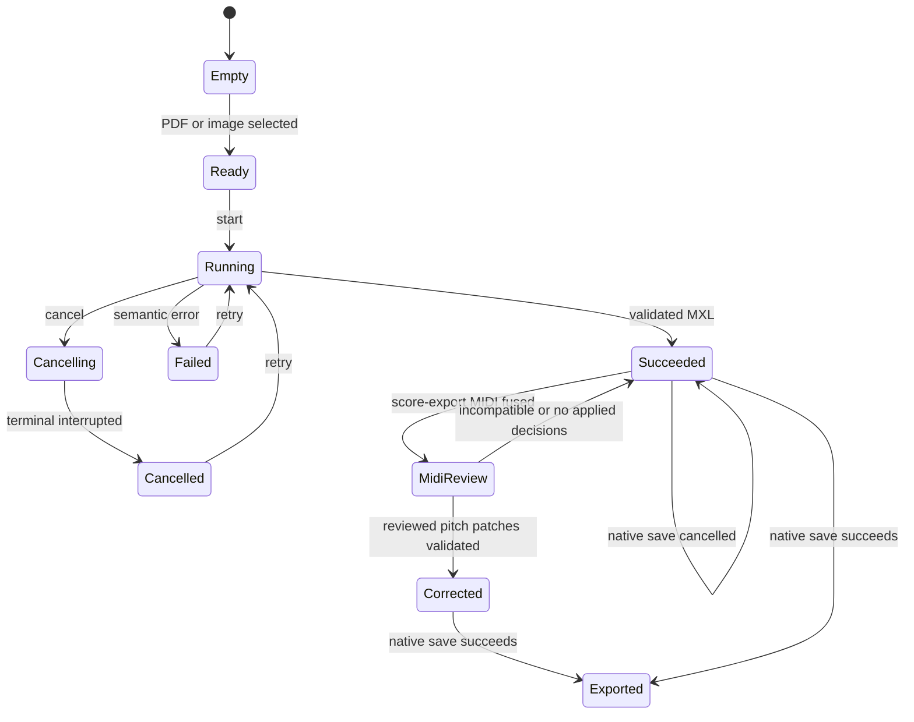

# Desktop PDF 识谱实验工作台 Feature Contract

## 一句话契约

Desktop 提供一个 capability-gated 的本地识谱实验工作台，用于选择 PDF、单页 PNG 或 JPEG，观察 CLI 的离散
处理阶段，并在成功 round-trip 后预览和导出临时 MXL。初步识别后可导入同曲 score-export MIDI，人工审核可安全
回写的音高冲突并生成新的 corrected MXL。它不是 Library 导入，也不代表当前识谱质量已达到普通用户产品门槛。

本文描述当前可观察行为。发生冲突时，运行时代码、Zod schema、数据库约束和可重复测试优先于本文；Current
ADR 与当前架构文档优先于历史规格。“进行中的目标差异”不是已经交付的行为。

## 用户入口

- 只有 Desktop Main handshake 声明 `pdfOmrWorkbench` 时，主导航才显示 `PDF 识谱`，route 为 `#/pdf-omr`。
- Browser、iPad 的 capability 默认不包含该入口，iPad Bridge manifest 也拒绝 PDF OMR 请求和事件。
- 页面要求用户通过 Main 原生 picker 选择一份 `.pdf`、`.png`、`.jpg` 或 `.jpeg`；Renderer 只收到一次性 token、
  文件名、大小和输入类型。
- PNG/JPEG 输入只启用声明 `inputKinds` 包含 `image` 的 Audiveris；其他 engine 在开始任务前禁用。
- Desktop Main 在 handshake 前使用各 engine 的 canonical adapter 做真实预检；页面直接展示已检查的版本或安全的
  配置原因，并在用户开始任务前禁用不可用 engine。
- 用户可从任意 route 的 Header 齿轮进入共享 `#/settings`；Browser 只显示通用语言与主题，Desktop 额外通过
  `recognitionProviderSettings` capability 显示四种本地识谱 provider。
- Desktop 不读取 `PDF_OMR_*` 环境变量。没有手动配置 Audiveris 时，Main 依次检查用户级和系统级 app bundle，
  再回退到 `PATH`；Rokot、LEGATO 与 Transcoda 没有持久化配置时保持未配置。独立 CLI 仍支持环境变量自动化。

## 当前已实现行为

### 成功路径

- Main 消费一次性输入 token，在 session-scoped 临时目录直接调用 programmatic `pdf-omr-cli` pipeline；失败或取消后的
  retry 使用 Main 仍持有的当前 session 输入，不会再次消费已失效的 token。
- Main 启动时并行预检已知 engine，将真实 `available`、`version`、`inputKinds` 或 bounded semantic `reason`
  写入 capability handshake；每次 start/retry 会重新预检最新配置，并为该 job 捕获不可变 registry snapshot。
- Settings 支持 Main 原生文件或目录选择器，也支持在对应字段粘贴绝对路径。用户手输路径只单向送入 Main；Main
  去除首尾空白、拒绝相对路径，并将候选资源转换为 session-scoped opaque token 与 basename 安全标签。整份
  candidate 只有通过 canonical preflight 后才以 mode `0600` 的版本化 provider document 原子替换；失败保留旧配置，
  损坏文件按 provider 隔离。保存时只预检目标 provider；保存或清除返回的单个 provider summary 会立即同步工作台
  engine 状态，不重复预检其他 provider。清除配置不影响 active job，新配置只影响后续任务。
- Main 将 job start、heartbeat、stage、engine progress 和 terminal status 以不含绝对路径或原始 stderr 的安全字段
  输出到 Electron 主进程日志，并追加写入 `desktop.log`。
- pipeline 依次发出 `inspect`、`recognize`、`validate`、`export` stage 事件，并转发 engine 提供的 page/system
  `completed / total` 计数；Renderer 不解析 stdout、stderr 或绝对路径。
- Desktop 页面以宽屏三仓工作区呈现输入/阶段、证据面和结果/诊断；`620–899px` 折叠为纵向工作区，
  `<620px` 使用单一 document scroll，保留文件选择、阶段、证据标签、engine 和主操作。
- pipeline 成功后 Main 只返回受 schema 约束的 MXL bytes、hash、readiness 和 bounded diagnostic summary；
  Renderer 使用现有只读 score runtime 做 transient preview，并通过 Main 原生保存 Dialog 导出。
- 结果不会调用 Library repository、Managed Score Copy、Practice Sidecar、resume 或 Harmony Analysis
  Document。
- 初步识别成功后可通过第二个 Main 原生 picker 选择一份 `.mid` / `.midi`。Main 消费 MIDI token 后复用 CLI
  `fuse`，Renderer 只收到 compatibility、coverage、pitch agreement 和 bounded repair proposals。
- `writeback-ready` pitch proposal 要求用户从与目标 MIDI 音高一致的合法书面拼写中明确选择；UI 不预选
  enharmonic spelling。Main 用 hash-bound decisions 运行 `apply-fusion`，全部校验通过后才把预览与导出切换到新的
  `score-midi-corrected.mxl`。
- incompatible / ambiguous fusion、missing note、extra note、tie 与非零 transposition proposal 只供检查，不能回写；
  初步识别 MXL、MIDI 和原输入始终不覆盖。

### 取消、失败与重试

- 一个 Desktop session 同时最多一个 active job；运行中可取消，Main 终止 runtime 的 abort signal，UI 保留
  已提交阶段并进入 `cancelled`。`running` 与 `cancelling` 期间输入选择保持禁用，避免页面文件与 Main active job
  错位。
- `ENGINE_UNAVAILABLE`、`DRAFT_VALIDATION_FAILED` 等 semantic error code 进入安全失败快照，不把原始 exception、
  stack、stderr 或路径写入 Renderer。
- Runtime 未自行提交 terminal event 时，Main 会补发带 semantic `errorCode` 的 terminal failed event，确保页面从
  running 恢复到可重试状态，并在诊断区展示错误代码和用户可读原因。
- `failed` 或 `cancelled` 可在重新选择兼容 engine 后对当前输入重试；成功结果尚未导出时重新选择输入会先请求确认。
- retry request 在新 job 建立前失败时，页面保留原失败快照、错误原因与 retry 操作，不回退到需要重新消费旧 token
  的 start 状态。
- 原生导出 Dialog 取消不会清空成功结果；成功导出只显示稳定的已导出状态，不显示目标绝对路径。

### 恢复与并发

- route 离开或刷新不会主动取消 Main job；重新进入 route 时通过 `pdfOmr.getSnapshot` 恢复当前 session snapshot，
  成功任务还会通过 `pdfOmr.readResult` 恢复当前 initial/corrected MXL。
- App shutdown 在 lifecycle acknowledgement 前调用 runtime cancel；临时 run directory 不成为 Library 历史。

## 状态与转换

`Succeeded` 与 `Corrected` 都是 transient result，不是 Library Score；只有通过 parse/view/playback/structural
round-trip 的 MXL 才可以进入 preview/export。MIDI corrected result 还必须通过 source/proposal hash、结构差异与
fusion no-regression gates。`blocked` readiness 禁用 preview/export，并保留诊断与证据。

## 平台能力矩阵

| 能力                                  | Browser                 | Desktop                             | iPad                  |
| ------------------------------------- | ----------------------- | ----------------------------------- | --------------------- |
| PDF OMR capability / route            | 不支持，不加载 route UI | 支持，`pdfOmrWorkbench` gating      | 不支持，manifest 拒绝 |
| Application Settings                  | 通用语言与主题          | 通用 + 四种本地识谱 provider        | 通用                  |
| PDF picker / process runtime          | 无                      | Main 原生 picker + programmatic CLI | 无                    |
| PNG/JPEG picker / recognition         | 无                      | 单页图片，Audiveris only            | 无                    |
| score-export MIDI reviewed correction | 无                      | pitch-only，显式书面拼写与校验回写  | 无                    |
| transient MXL preview / native export | 无                      | 支持（session-scoped）              | 无                    |
| Library mutation                      | 不适用                  | 不允许                              | 不适用                |

## 领域不变量

1. Renderer never receives an absolute path; Main revalidates and consumes every one-time file token.
2. PDF/image/MIDI is never registered as a `ScoreFormat` and never enters the Sheet Library import pipeline.
3. Main owns the active process, cancellation and session run directory; Renderer owns only presentation state and a
   narrow `PdfOmrWorkbenchPort`.
4. Structured progress is engine/CLI supplied only; UI MUST NOT infer percentage or ETA from logs.
5. Only a validated, round-trip-passing MXL may be previewed or exported.
6. A transient result MUST NOT create Library, managed bytes, practice, resume or Harmony facts.
7. MIDI correction MUST preserve source bytes, require explicit written pitch, and publish only a newly validated artifact.
8. Recognition configuration paths remain Main-only; Renderer receives only closed provider fields, opaque tokens, safe labels,
   semantic status and bounded reasons.
9. An active job MUST retain its registry snapshot when a provider configuration is saved or cleared.

字段约束见 [`packages/web-core/src/bridge/schemas.ts`](../../../packages/web-core/src/bridge/schemas.ts)，运行时端口
见 [`packages/web-viewer/src/features/pdf-omr/pdf-omr-port.ts`](../../../packages/web-viewer/src/features/pdf-omr/pdf-omr-port.ts)。

## 进行中的目标差异

以下内容不得被 AI 当作已经实现的行为：

- 部分落地：`原 PDF` 证据面当前显示安全的文件摘要，没有在页面中绘制 PDF 原页；中间 evidence 也只显示结构化
  facts，不展开未知二进制 artifact。
- 自动化边界：Desktop E2E 使用临时 fake Audiveris executable 覆盖 stage observation、validated MXL、transient
  preview 和 native export；它不代表真实 external engine 的质量或环境可用性，CI 仍不绑定任何外部 engine。

## 明确非目标

- Browser backend、iPad、云端上传、批量任务、benchmark、任务历史、模型下载或环境编辑 UI。
- 无人审核自动修复、missing-note insertion、note deletion、真人演奏 MIDI、自动加入 Library、修改 Managed Score
  Copy 或注册 PDF/image/MIDI `ScoreFormat`。
- 多页 TIFF、HEIC、多张图片自动合并、云端 alignment 或远程模型处理。
- 分发或授权任何第三方 engine、model、repository、token 或 license。

## 验收契约

- 给定 Desktop handshake 未声明 capability，主导航和 `#/pdf-omr` route 不得加载 PDF OMR UI。
- 给定用户选择 PDF，Renderer payload 不得包含绝对路径，Library facts 不得变化。
- 给定 pipeline progress，页面只能显示离散 stage 和 engine 提供的 monotonic counters，不显示伪造百分比/ETA。
- 给定取消或 semantic failure，页面不得显示 succeeded manifest、preview 或 exportable score。
- 给定 validated MXL，页面允许 transient preview 和 native export；取消保存不得清空结果。
- 给定 PNG/JPEG，页面只允许选择声明 image capability 的 engine，并可完成同一识别 pipeline。
- 给定 Desktop 启动，handshake 必须反映 canonical engine inspection 的真实结果；不可用 engine 在开始/重试前
  禁用，并只显示 bounded、path-free 的配置原因。
- 给定 macOS 标准 Audiveris app bundle 且没有显式 executable 配置，Desktop 必须自动发现并通过预检；Settings
  中已验证并保存的显式配置始终优先，且 Desktop 不读取 `PDF_OMR_*` 环境变量。
- 给定 Browser，Settings 只显示通用设置；给定 Desktop provider capability，Settings 列出 Audiveris、Rokot、LEGATO
  与 Transcoda。Main 返回的 Bridge response 与已保存配置 DOM 不包含绝对路径；用户粘贴的路径只允许作为未保存的
  单向 request 输入，不能由 Main 回显。
- 给定用户在 provider 字段粘贴绝对路径，保存必须复用与原生选择器相同的 token、preflight 与原子持久化流程；给定
  空值或相对路径，已保存配置保持不变。
- 给定 provider candidate preflight 失败，已保存配置与 active job 保持不变；给定保存成功，下一 job 使用新 registry。
- 给定 validated initial MXL 与 compatible score-export MIDI，页面显示 path-free fusion facts；只有显式选择
  `writtenPitch` 的 writeback-ready proposal 可生成 corrected MXL。
- 给定 incompatible/ambiguous MIDI、review-only proposal 或任一 writeback gate 失败，初步识别结果保持不变。

## 证据地图

| 契约                                                | 运行时代码 / Schema                                                                                                                                                                                                                                                                                                                                                                 | 自动化证据                                                                                                        |
| --------------------------------------------------- | ----------------------------------------------------------------------------------------------------------------------------------------------------------------------------------------------------------------------------------------------------------------------------------------------------------------------------------------------------------------------------------- | ----------------------------------------------------------------------------------------------------------------- |
| Programmatic pipeline 与 canonical result           | [`tools/pdf-omr-cli/src/pipeline.ts`](../../../tools/pdf-omr-cli/src/pipeline.ts)                                                                                                                                                                                                                                                                                                   | `tools/pdf-omr-cli/src/__tests__/pipeline.test.ts`                                                                |
| Main runtime、token 与 job lifecycle                | [`apps/desktop-shell/src/main/pdf-omr-controller.ts`](../../../apps/desktop-shell/src/main/pdf-omr-controller.ts)、[`apps/desktop-shell/src/main/files.ts`](../../../apps/desktop-shell/src/main/files.ts)                                                                                                                                                                          | `apps/desktop-shell/src/main/__tests__/pdf-omr-controller.test.ts`、`pdf-files.test.ts`                           |
| Engine discovery、settings 与 job registry snapshot | [`apps/desktop-shell/src/main/pdf-omr-engine-preflight.ts`](../../../apps/desktop-shell/src/main/pdf-omr-engine-preflight.ts)、[`apps/desktop-shell/src/main/recognition-provider-settings.ts`](../../../apps/desktop-shell/src/main/recognition-provider-settings.ts)、[`apps/desktop-shell/src/main/pdf-omr-runtime.ts`](../../../apps/desktop-shell/src/main/pdf-omr-runtime.ts) | `recognition-provider-configuration-store.test.ts`、`pdf-omr-engine-preflight.test.ts`、`pdf-omr-runtime.test.ts` |
| MIDI fusion 与 reviewed writeback                   | [`apps/desktop-shell/src/main/pdf-omr-midi-correction-controller.ts`](../../../apps/desktop-shell/src/main/pdf-omr-midi-correction-controller.ts)、[`tools/pdf-omr-cli/src/midi-correction.ts`](../../../tools/pdf-omr-cli/src/midi-correction.ts)                                                                                                                                  | `pdf-omr-midi-correction-controller.test.ts`、`fuse-command.test.ts`、`apply-fusion-command.test.ts`              |
| Bridge capability、request/response/event isolation | [`packages/web-core/src/bridge/schemas.ts`](../../../packages/web-core/src/bridge/schemas.ts)                                                                                                                                                                                                                                                                                       | `packages/web-core/src/bridge/__tests__/schemas.test.ts`、`contract-manifest.test.ts`                             |
| Capability-gated route and workbench states         | [`packages/web-viewer/src/app/pages/PdfOmrPage.tsx`](../../../packages/web-viewer/src/app/pages/PdfOmrPage.tsx)、[`packages/web-viewer/src/app/router.tsx`](../../../packages/web-viewer/src/app/router.tsx)                                                                                                                                                                        | `PdfOmrPage.test.tsx`、`App.test.tsx`                                                                             |
| Desktop-only E2E and Library isolation              | [`apps/desktop-shell/e2e/desktop.spec.ts`](../../../apps/desktop-shell/e2e/desktop.spec.ts)                                                                                                                                                                                                                                                                                         | `PDF OMR Desktop-only` 与 packaged fake-engine Playwright tests                                                   |

## 相关资料

- 当前架构入口：[`docs/architecture/README.md`](../../architecture/README.md)
- 当前 UI 契约：[`DESIGN.md`](../../../DESIGN.md)
- 图片导入与 MIDI 修正规格：
  [`2026-08-08-desktop-omr-image-midi-correction.md`](../../specs/2026-08-08-desktop-omr-image-midi-correction.md)
- Engine 预检规格：
  [`2026-08-08-desktop-omr-engine-preflight.md`](../../specs/2026-08-08-desktop-omr-engine-preflight.md)
- 进行中的规格：[`docs/specs/2026-08-05-desktop-pdf-omr-workbench.md`](../../specs/2026-08-05-desktop-pdf-omr-workbench.md)
- PDF OMR 冻结评测结论：[`docs/evaluation/pdf-omr.md`](../../evaluation/pdf-omr.md)
- Sheet Library 边界：[`sheet-library.md`](sheet-library.md)

## 维护触发器

- PDF OMR Bridge schema、capability、Main token/process lifecycle 或 transient preview boundary 变化。
- 页面 route、状态、导出/取消语义或 Browser/iPad capability 矩阵变化。
- CLI canonical artifact、semantic error code 或 progress contract 变化。
- PDF OMR 从实验能力变成普通用户产品或开始进入 Library 前，必须重新评审当前 STOP 决策。
