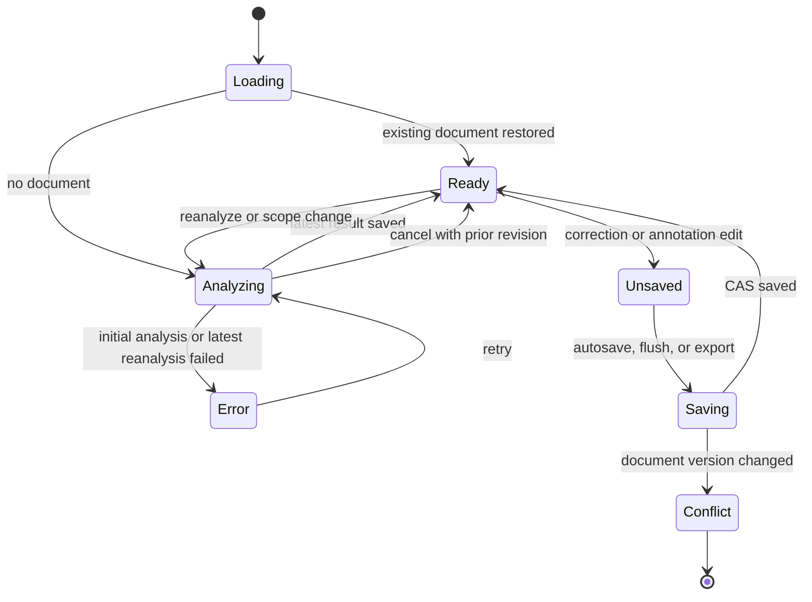

# Harmony Analysis Feature Contract

## 一句话契约

用户可以在独立的 Harmony Studio 中分析 MusicXML/MXL Library Score、修正和弦、预览结果并导出
标注副本。生产分析由随应用发布的 paper-compatible Semi-CRF 决定 primary chord 与 boundary；
独立 adapter 只负责 alternatives 和拒识 confidence，不改写 Semi-CRF 路径。

本文描述当前可观察行为。发生冲突时，运行时代码、Zod schema、数据库约束和可重复测试优先于
本文；当前架构文档优先于一次性计划。“进行中的目标差异”不是已经交付的行为。

## 用户入口

- 用户从 Library 或 Viewer 打开 `#/studio/:libraryScoreId`；路由只包含持久化的 Library Score ID。
- Studio 只支持已导入 Library 的 MusicXML/MXL；MIDI 和临时外部路径不能进入该工作区。
- 首次打开且不存在 Harmony Analysis Document 时自动分析。已有 Document 会直接恢复，不会静默
  重跑算法。
- 默认 scope 包含有音高的非打击乐轨道；用户改变 scope 会发起新的分析。

## 当前已实现行为

### 分析、拒识与有效结果

生产入口从相邻 note onset/offset 建立 paper basic events，在冻结的 62-label inventory 和最长
20 events span 上运行 factorized exact semi-Markov Viterbi。随应用发布的 Mozart train-only 模型
SHA-256 为 `6fb18d1245aea9d89f5568a9b384b405c5326cb37015cc2caa5ade8dad5f7515`，其 hash
进入新 Revision 的 `algorithmVersion`。

Semi-CRF 路径决定 primary chord 与 boundary。Bundled alternatives adapter 仅在这些冻结 range
上生成 Top-8 alternatives，并用独立 confidence 与默认 `decisionThreshold=0.6` 决定
resolved/unresolved；CRF path score 不是 confidence。低于阈值的区间保留为
`low-confidence`，不会伪装成 N.C.。

Studio 显示 Effective Harmony Projection。同一区间遵循：

```text
User Correction > supported source <harmony> > active Analysis Revision
```

Correction 锚定 Score Written Range，不绑定算法 segment ID。Reset 删除 Correction，让下层来源或
分析结果重新显现；N.C. 只能来自明确的来源或 User Correction。

### 编辑、重分析与导出

用户可以替换或重拼和弦、标记 N.C.、分割、合并、移动边界以及 reset，并在当前会话中 undo/redo。
编辑后 500 ms autosave；显式保存、离开和导出会先 `flush()`。

重分析生成新的不可变 active Revision，并把当时最新的 Corrections 与 annotation target 叠加到新
结果；首版不持久化旧 Revision 历史。导出从不可变 Managed Score Copy 与固化的 Effective
Projection 生成新的 MusicXML/XML/MXL 副本，只写已确定结果，不修改或自动重新导入 Library Score。

### 取消、失败与重试

- 首次分析失败时不创建空 Document，并显示稳定的产品错误。
- 已有 Revision 的重分析失败、取消或被更新意图取代时，继续保留旧 Revision 与 Corrections。
- Browser 与 Desktop Renderer 通过相同 module Worker 运行生产分析。取消、替代 job、Session dispose
  或离开 Studio 会终止 Worker，不只是忽略迟到结果；intent check 继续作为提交前的最终防线。
- Worker 消息只包含经过 Zod 校验的投影输入、参数、segments 与稳定错误码；不传 alphaTab runtime、
  DOM、Repository、绝对路径或原始异常。
- 模型 JSON 损坏或不符合 contract 时明确失败，不存在第二套 analyzer fallback。
- 保存冲突保留本地 Document 并暴露 `version-conflict`；不会覆盖外部新版本。
- 预览渲染或音频失败不阻止 Correction 保存与导出；原始异常不直接进入 DOM。

### 恢复与并发

Browser 把 Document 与 Library 保存在同一 IndexedDB；Desktop 由 Main 的 SQLite store 持久化，
Renderer 只通过经过 Zod 校验的 Bridge 访问。刷新或重启后按 `libraryScoreId` 恢复 active Revision
与 Corrections。

Repository 用 `expectedDocumentVersion` 做 CAS，并同时校验 `libraryScoreId` 和
`sourceContentHash`。保存串行化；只有最新 reanalysis intent 的完整成功结果可以提交。删除 Library
Score 会一并删除 Harmony Analysis Document，旧会话不得重建 orphan document。

## 状态与转换



失败、取消或过期的 reanalysis job 不得提交；当已有 Document 时，它们也不得清空当前 Revision。

## 平台能力矩阵

| 能力               | Browser                         | Desktop                           | 当前差异                     |
| ------------------ | ------------------------------- | --------------------------------- | ---------------------------- |
| 生产 Semi-CRF 推理 | 本地 TypeScript module Worker   | Renderer TypeScript module Worker | 协议、模型与算法相同         |
| Document 持久化    | IndexedDB                       | Main SQLite                       | Repository contract 相同     |
| Studio 路由与编辑  | `#/studio/:libraryScoreId`      | `#/studio/:libraryScoreId`        | UI 行为相同                  |
| MusicXML/MXL 导出  | Browser download                | 原生保存 Dialog                   | 都从 Managed Score Copy 导出 |
| 外部文件与绝对路径 | Browser File API 后进入 Library | Main token/Bridge 后进入 Library  | Renderer 均不持有绝对路径    |
| Library 删除联动   | 单 IndexedDB transaction        | SQLite/files reconciliation       | 最终语义相同                 |

## 领域不变量

1. Semi-CRF path 独占生产 primary chord 与 boundary 决策；alternatives 和
   confidence 不得改写它。
2. Production decoder 必须是完整 label inventory 上的 exact semi-Markov Viterbi；不得以 Top-K
   label pruning、beam search 或静默 fallback 改变结果。
3. `algorithmVersion` 必须标识实际使用的 bundled model；模型无效必须明确失败。
4. `AnalysisRevision` 一经创建不可变；重新分析创建新 Revision，同时保留 User Corrections。
5. Effective Projection 的优先级固定为 User Correction、supported source harmony、active Revision。
6. Score Written Range 左闭右开，不绑定 playback occurrence、track runtime object 或 segment ID。
7. Harmony Analysis Document 必须与现存 Library Score ID 和其 source content hash 一致。
8. 导出不修改 Managed Score Copy，不把标注副本自动导回 Library。
9. 删除 Library Score 必须删除 Harmony Analysis Document，旧 session 不得重建孤儿数据。
10. Harmony Studio 不读取或写入 Viewer 练习 sidecar、播放恢复与练习摘要。

字段约束见
[`packages/web-core/src/harmony/schemas.ts`](../../../packages/web-core/src/harmony/schemas.ts)，Repository
端口见
[`packages/web-core/src/harmony/repository.ts`](../../../packages/web-core/src/harmony/repository.ts)；
本文不复制完整 schema。

## 当前性能合同

在 Apple M2 Max、Node `v22.22.1` 上，commit
`ce98a2914e7dfe70d37f51991e28711d6575a32a` 对 K331 做一次 warm-up 后采集五个隔离样本：
`5,054.43 / 4,797.78 / 4,925.84 / 4,913.62 / 4,774.76 ms`。analysis-only median 为
`4,913.62 ms`，最大 RSS 为 `484,098,048 bytes`；五次均输出 121 segments 与 canonical checksum
`9b0d56e25913116c1a44b460432280a681dc6dcfc2ed9812ab3c3178bb927ff0`。

生产 scorer 使用编译后的 numeric weights、range/prefix evidence 和有界 retained-note cache，但仍在
完整 62-label inventory 与最长 20 events span 上执行 exact decoder。Browser 与 Desktop 的真实
K331 E2E 同时约束分析期主线程延迟不超过 50 ms，并验证取消恢复旧 Document。

当前 TypeScript 已满足 5 秒门禁；post-prefix profile 没有占剩余 CPU 40% 以上的单一连续 numeric
kernel，因此没有引入 WASM、Rust runtime 或静默 fallback。

## 进行中的目标差异

以下内容不得被 AI 当作已经实现的行为：

- label coverage 仍有限：paper inventory 不表达大量 inversion、dominant 与 half-diminished gold；
  Mozart train/tune 的无损映射覆盖约 39%。生产采用不等于这些 chord families 已完整支持。
- confidence 尚未按 Semi-CRF 概率校准；当前是冻结 range 上的 alternatives adapter，因此只能解释为产品拒识
  分数。
- BaCh 已完成 fresh fold 1 reproduction，但没有在本次资源预算内 fresh 训练全部 10 folds。

## 明确非目标

- 在线服务、浏览器网络推理、Python/Java/Torch runtime 或运行时训练。
- 用 CRF path score 冒充 confidence。
- 为满足时延预算而引入近似 decoder、label pruning 或 silent fallback。
- 用 final holdout 调参，或把结构 fixture 本身当作 accuracy gold。
- 在本次 analyzer 替换中改变 Document、Revision、Correction、Repository 或导出数据结构。
- 把分析结果直接写回 Managed Score Copy，或把 Harmony Studio 混入 Viewer 练习状态。

## 验收契约

- 给定可分析的 MusicXML/MXL Library Score 且尚无 Document，当首次打开 Studio 时，必须使用 bundled
  Semi-CRF 创建 Revision，且 `algorithmVersion` 包含模型 hash。
- 给定相同输入与模型，当重复分析时，primary chord 与 boundary 必须由 exact decoder 确定且结果
  一致；改变 confidence threshold 不得改变这些 range 或 primary chord。
- 给定候选低于阈值，当生成 Revision 时，该区间必须是 unresolved，而不是自动 N.C. 或规则 chord。
- 给定来源和弦、Revision 与重叠 Correction，当形成有效视图时，必须按 Correction、source、
  Revision 的顺序取值。
- 给定已有 Revision，当重分析失败、取消或被更新意图取代时，旧 Revision 与最新 Corrections 必须
  保留。
- 给定 Browser 或 Desktop 正在分析，当用户取消、替代 job、dispose Session 或离开 Studio 时，
  对应 Worker 必须终止，迟到结果不得保存，Renderer 仍可响应事件和重绘。
- 给定两个 session 基于同一 document version 保存，当后一个遇到 CAS 冲突时，不得覆盖先提交的
  Document。
- 给定用户导出 MusicXML/MXL，当完成导出时，原 Library Score、Managed Score Copy 和容器类型必须
  保持不变。
- 给定 Library Score 被删除，当旧 session 再保存时，Repository 必须拒绝重建 Harmony Analysis
  Document。

## 证据地图

| 契约                                      | 运行时代码 / Schema                                                                                                                                                                                                   | 自动化证据                                                                                                                                                                                                                       |
| ----------------------------------------- | --------------------------------------------------------------------------------------------------------------------------------------------------------------------------------------------------------------------- | -------------------------------------------------------------------------------------------------------------------------------------------------------------------------------------------------------------------------------- |
| bundled Semi-CRF、exact path 与拒识分离   | [`analyzeHarmony.ts`](../../../packages/web-core/src/harmony/analyzeHarmony.ts)、[`analyzePaperSemiCrf.ts`](../../../packages/web-core/src/harmony/analyzePaperSemiCrf.ts)                                            | [`analyzePaperSemiCrf.test.ts`](../../../packages/web-core/src/harmony/__tests__/analyzePaperSemiCrf.test.ts)、[`paper-semi-crf-decode.test.ts`](../../../packages/web-core/src/harmony/__tests__/paper-semi-crf-decode.test.ts) |
| Revision schema、阈值与 written range     | [`schemas.ts`](../../../packages/web-core/src/harmony/schemas.ts)、[`writtenTime.ts`](../../../packages/web-core/src/harmony/writtenTime.ts)                                                                          | [`schemas.test.ts`](../../../packages/web-core/src/harmony/__tests__/schemas.test.ts)、[`writtenTime.test.ts`](../../../packages/web-core/src/harmony/__tests__/writtenTime.test.ts)                                             |
| Effective Projection 与 Corrections       | [`effectiveProjection.ts`](../../../packages/web-core/src/harmony/effectiveProjection.ts)、[`correctionCommands.ts`](../../../packages/web-core/src/harmony/correctionCommands.ts)                                    | [`effectiveProjection.test.ts`](../../../packages/web-core/src/harmony/__tests__/effectiveProjection.test.ts)、[`correctionCommands.test.ts`](../../../packages/web-core/src/harmony/__tests__/correctionCommands.test.ts)       |
| Studio 首次分析、恢复和生产模型版本       | [`ViewerApplication.ts`](../../../packages/web-viewer/src/app/ViewerApplication.ts)                                                                                                                                   | [`ViewerApplication.test.ts`](../../../packages/web-viewer/src/app/__tests__/ViewerApplication.test.ts)                                                                                                                          |
| autosave、CAS、重分析与取消               | [`harmonyStudioSession.ts`](../../../packages/web-viewer/src/harmonyStudioSession.ts)、[`repository.ts`](../../../packages/web-core/src/harmony/repository.ts)                                                        | [`harmonyStudioSession.test.ts`](../../../packages/web-viewer/src/__tests__/harmonyStudioSession.test.ts)、[`repositoryContract.test.ts`](../../../packages/web-core/src/harmony/__tests__/repositoryContract.test.ts)           |
| Worker 协议、真实取消与 Renderer 响应性   | [`harmony-analysis-worker-client.ts`](../../../packages/web-viewer/src/harmony-analysis-worker-client.ts)、[`harmony-analysis-worker.ts`](../../../packages/web-viewer/src/harmony-analysis-worker.ts)                | [`harmony-analysis-worker-client.test.ts`](../../../packages/web-viewer/src/__tests__/harmony-analysis-worker-client.test.ts)、Browser/Desktop K331 E2E                                                                          |
| Browser/Desktop 持久化与删除联动          | [`indexed-db-sheet-library-repository.ts`](../../../packages/web-storage/src/indexed-db-sheet-library-repository.ts)、[`DesktopLibraryStore.ts`](../../../apps/desktop-shell/src/main/library/DesktopLibraryStore.ts) | 双宿主 Repository tests                                                                                                                                                                                                          |
| Effective Projection 的 MusicXML/MXL 导出 | [`exportMusicXmlHarmony.ts`](../../../packages/web-core/src/harmony/exportMusicXmlHarmony.ts)、[`harmonyStudioExport.ts`](../../../packages/web-viewer/src/harmonyStudioExport.ts)                                    | [`exportMusicXmlHarmony.test.ts`](../../../packages/web-core/src/harmony/__tests__/exportMusicXmlHarmony.test.ts)、[`harmonyStudioExport.test.ts`](../../../packages/web-viewer/src/__tests__/harmonyStudioExport.test.ts)       |
| reproduction、current-corpus 与 K331 证据 | [`semi-crf.md`](../../evaluation/semi-crf.md)                                                                                                                                                                         | 模型/records SHA-256 与已记录指标                                                                                                                                                                                                |

## 相关资料

- 产品术语：[`CONTEXT.md`](../../../CONTEXT.md)
- 当前架构入口：[`docs/architecture/README.md`](../../architecture/README.md)
- 当前 UI 契约：[`DESIGN.md`](../../../DESIGN.md)
- 当前架构：
  [`harmony-analysis-system.md`](../../architecture/harmony-analysis-system.md)
- 当前 Semi-CRF 模块：
  [`packages/web-core/docs/harmony.md`](../../../packages/web-core/docs/harmony.md)
- 当前验证证据：
  [`semi-crf.md`](../../evaluation/semi-crf.md)

## 维护触发器

以下变化必须重新核对并更新本文：

- bundled model、label inventory、feature semantics、decoder exactness 或 `algorithmVersion` 变化。
- confidence、decision threshold、alternatives 或 resolved/unresolved 语义变化。
- Revision、Correction、Effective Projection、written range 或来源和弦优先级变化。
- Studio 入口、首次分析、重分析、取消、保存冲突、恢复或 scope 行为变化。
- Browser IndexedDB、Desktop SQLite/Bridge、CAS 或 Library 删除联动变化。
- MusicXML/MXL 导出是否写入、跳过或保留内容的语义变化。
- “进行中的目标差异”落地并获得可重复测试证据。
