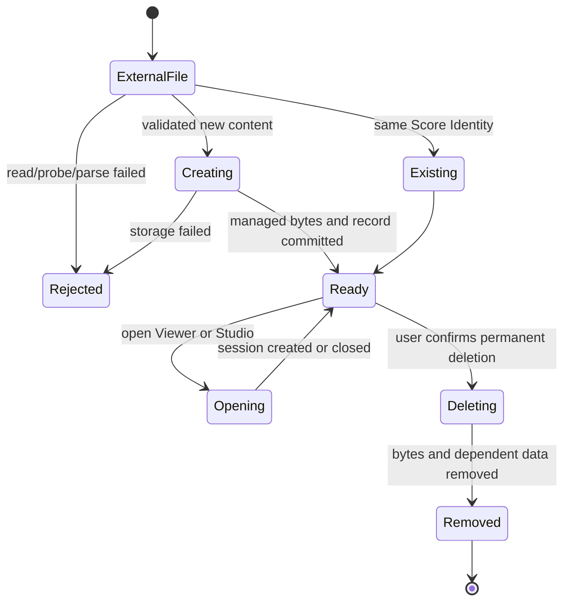

# Sheet Library Feature Contract

## 一句话契约

Sheet Library 是当前设备持久保存和管理已导入曲谱的主页。导入会创建应用托管的本地副本；之后
查看、导出和删除都以 Library Score 为中心，不再依赖用户最初选择的外部文件。

本文描述当前可观察行为。发生冲突时，运行时代码、Zod schema、数据库约束和可重复测试优先于
本文；Current ADR 与当前架构文档优先于历史规格。“已知差距”不是已经交付的行为。

## 用户入口

- Browser Demo 和 Desktop Shell 启动后都以 Sheet Library 为根页面。
- 用户可选择单份或多份 Guitar Pro、MusicXML、MXL 文件导入。
- 单份导入成功或命中重复内容后，应用导航到 `#/viewer/:libraryScoreId`。
- 批量导入完成后留在 Library。
- Library Score 可从 Library 打开 Viewer；MusicXML/MXL Library Score 还可从应用导航进入
  Studio。

Viewer 和 Studio URL 只使用持久的 Library Score ID，不使用外部路径、Score Identity 或临时
Session ID。

## 当前已实现行为

### 初始化与列表

- Repository 必须先完成初始化，应用随后读取 Library Score 摘要列表。
- 初始化或读取失败时，Library 显示可重试的不可用状态，不主动清空已有数据。
- 页面获得窗口焦点时会刷新列表。
- Library 提供标题/艺术家搜索、收藏筛选，以及按最近活动、导入时间、最近练习或标题排序。
- “最近活动”当前按 `lastOpenedAt ?? importedAt` 排序；编辑元数据和切换收藏不会更新它。

### 导入

每份候选文件独立执行以下流程：

1. 读取字节；单文件不得超过 64 MiB。
2. 根据文件名取得格式提示，并以实际字节探测格式。
3. 计算小写 SHA-256 Score Identity。
4. 如果当前 Library 已存在相同 Score Identity，返回已有 Library Score，不重复解析或写入。
5. 使用匹配的格式 adapter 做最小解析；只有可查看且至少包含一个 track 的曲谱才可入库。
6. 生成新的 UUID Library Score ID，并把原始字节作为 Managed Score Copy 写入 Repository。

批量导入通过逐项结果隔离失败：无效或不支持的文件不会阻止其他文件导入。结果类型定义的失败
code 包括 `FILE_TOO_LARGE`、`UNSUPPORTED_FORMAT`、`INVALID_SCORE`、`READ_FAILED`、
`STORAGE_QUOTA_EXCEEDED`、`LIBRARY_UNAVAILABLE` 和 `UNKNOWN`；调用方不得依赖原始异常文本。

### 身份与去重

- Library Score ID 是馆藏生命周期身份，必须是 UUID。
- Score Identity 是小写 64 位十六进制 SHA-256 内容哈希。
- 同一个宿主 Library 中，一个 Score Identity 最多对应一个 Library Score。
- Repository 必须在并发导入时维持该唯一性；调用前的 `findByIdentity()` 只用于快速命中，最终
  一致性由 IndexedDB 唯一索引或 SQLite 唯一约束保证。
- 删除后重新导入完全相同的字节会创建新的 Library Score ID，不恢复旧馆藏生命周期。
- Browser 与 Desktop 的 Library 相互独立；相同文件可在两个宿主中各自拥有一个 Library Score。

### 托管副本与打开

- 导入成功后，读取曲谱只使用 Managed Score Copy。
- 外部原文件被移动、修改或删除，不影响已经成功写入的 Library Score。
- 打开 Viewer 时，应用先按 Library Score ID 读取 Managed Score Copy，再记录 `lastOpenedAt`，
  最后创建临时 Viewer Session。
- 刷新或重新打开 `#/viewer/:libraryScoreId` 时，Session 可由 Repository 中的馆藏事实重建。
- Renderer 和共享 Viewer 不获得 Desktop 绝对路径。

### 元数据、收藏与练习摘要

- 用户可以修改馆藏标题和艺术家；修改只写 Library Metadata，不改写 Managed Score Copy，也不
  改变 Score Identity。
- 标题显示优先级是：`titleOverride`、谱内标题、去扩展名文件名。
- 艺术家显示优先级是：`artistOverride`、谱内艺术家、无值。
- 收藏状态属于 Library Score，可独立切换。
- Browser 当前从 Practice Sidecar 和 Local Playback Resume 汇总 `hasLoop`、
  `lastPracticedAt` 和 `lastPosition`。
- Desktop 当前没有把已保存的 sidecar/resume 汇总进 Library 列表，见“已知差距”。

### 导出

- Library 可以把 Managed Score Copy 交给宿主保存。
- 导出内容是原始托管字节，文件名沿用入库文件名。
- 导出不会写入 Library Metadata、练习数据或 Harmony Analysis Document。
- 用户取消保存时不改变 Library Score。
- Studio 的 Annotated Score Export 是独立 Feature，不属于这里的原始曲谱导出契约。

### 删除

- 删除入口位于 Library，并在执行前显示永久删除确认。
- 删除 Library Score 必须同时删除 Managed Score Copy、Library 记录、Practice Sidecar、
  Local Playback Resume 和 Harmony Analysis Document。
- Browser 在一个 IndexedDB read-write transaction 中删除这些记录。
- Desktop 使用 `deleting` 状态、托管文件删除和 SQLite transaction 协调文件系统与数据库；
  下次初始化会继续 reconciliation。
- 删除后，旧 Studio session 不能重新创建已经失去 Library Score 身份的 Harmony Analysis
  Document。

## 状态与转换

- 只有 `Ready` 的 Desktop 记录出现在正常列表并可读取。
- `pending` 和 `deleting` 是 Desktop 文件系统/SQLite reconciliation 状态，不是用户可管理的
  Library Score 状态。
- 导入取消、导出取消和删除确认取消都不得改变馆藏。
- Repository 不得为已经不存在的 Library Score 新建练习数据或分析数据。

## 平台能力矩阵

| 能力                  | Browser                      | Desktop                                          | 当前差异                            |
| --------------------- | ---------------------------- | ------------------------------------------------ | ----------------------------------- |
| 馆藏索引              | IndexedDB                    | SQLite                                           | Library 相互独立                    |
| Managed Score Copy    | IndexedDB bytes              | 应用数据目录托管文件                             | Renderer 不获得 Desktop 路径        |
| 内容唯一性            | `scoreIdentity` unique index | `score_identity` UNIQUE                          | 语义一致                            |
| 导入文件选择          | Browser File API             | Main 一次性 token + Bridge                       | 共享 Viewer 只见 `ScoreFileGateway` |
| 原始文件导出          | Browser download             | 原生保存 Dialog                                  | 都导出 Managed Score Copy           |
| 删除联动              | 单 IndexedDB transaction     | 文件状态机 + SQLite transaction + reconciliation | 最终语义一致                        |
| Library 练习摘要      | 已汇总 sidecar/resume        | 尚未汇总                                         | Desktop 当前显示“尚未练习”          |
| Harmony Analysis 删除 | 随 Library Score 删除        | 随 Library Score 删除                            | 旧 session 均不得重建孤儿文档       |

## 领域不变量

1. `LibraryScoreId` 是 UUID，并标识一次馆藏生命周期。
2. `ScoreIdentity` 是 Managed Score Copy 内容的小写 SHA-256。
3. 一个宿主 Library 内，一个 Score Identity 最多对应一个 Library Score。
4. 成功导入必须同时形成 Library Score 和 Managed Score Copy；托管字节缺失时不得静默重建、
   删除或重置仍可保留的馆藏事实。
5. `SheetLibraryRepository` 管馆藏事实；`ScoreFileGateway` 只管用户选择外部文件和导出位置。
6. Library Metadata 不改写谱文件，不改变 Score Identity。
7. Viewer/Studio 路由只暴露 Library Score ID。
8. 删除必须清理托管字节、馆藏、练习数据、续播位置和 Harmony Analysis Document。
9. Browser 与 Desktop 不共享或隐式同步馆藏。
10. 持久化或迁移失败不得通过清空 Library 来恢复。

运行时字段约束见
[`packages/web-core/src/library/schemas.ts`](../../../packages/web-core/src/library/schemas.ts)，领域端口见
[`packages/web-core/src/library/ports.ts`](../../../packages/web-core/src/library/ports.ts)；本文不复制
完整 schema。

## 已知差距

以下内容不得被 AI 当作已经实现的行为：

- Desktop Library 列表尚未从已保存的 Practice Sidecar 和 Local Playback Resume 生成
  `hasLoop`、`lastPracticedAt`、`lastPosition`；当前摘要固定为 `hasLoop: false`。
- 批量导入虽逐项返回 created/existing/failed 结果，但 UI 尚未提供规格中完整的成功、失败、重复
  汇总和可展开失败详情。
- `importing` 状态存在于应用 snapshot，但当前 Library 组件只使用通用 `loading` 禁用导入按钮，
  没有完整呈现独立的 importing 状态。
- 搜索或收藏筛选得到零结果时，当前 UI 复用 Library 空状态，没有独立 No-results 状态和清除条件
  操作。
- 当前 Library 行使用带 `role="button"` 的 `<li>` 包裹多个子按钮；尚未达到规格中“行主链接与
  行内操作使用独立语义控件”的完整可访问性契约。
- Managed Score Copy 缺失或损坏时，Repository 会拒绝读取；UI 尚未提供规格设想的专用恢复操作。
- 当前不提供标签、文件夹、歌单、多选、回收站、批量删除或 Library 迁移包。

## 明确非目标

- 云同步、账号和 Browser/Desktop 馆藏合并。
- MIDI 产品导入。
- Browser OPFS 存储。
- 曲谱版本关系、替换曲谱或跨 Library Score 生命周期恢复旧练习数据。
- 通过修改馆藏标题或艺术家改写来源谱文件。
- 把 Studio 导出的标注副本自动覆盖 Managed Score Copy。

## 验收契约

- 给定两次并发导入相同字节，当 Repository 写入时，结果必须恰好包含一个 `created` 和一个
  `existing`，并保留首次创建的托管字节。
- 给定已经成功导入的 Library Score，当外部原文件消失时，仍可从 Managed Score Copy 打开和
  导出。
- 给定用户修改标题、艺术家或收藏，当重新读取 Library Score 时，Library Score ID 和 Score
  Identity 不变。
- 给定一个 Library Score 具有练习数据和 Harmony Analysis Document，当用户确认删除时，所有
  关联事实和托管字节都被删除。
- 给定已删除的 Library Score，当相同内容被重新导入时，新 Library Score ID 与旧 ID 不同。
- 给定某一文件在批量导入中失败，当其他文件有效时，有效文件仍可独立进入 Library。
- 给定 Browser 或 Desktop 重启，当持久化数据完好时，Library Score 仍可列出并打开。
- 给定 Repository 初始化失败，当应用显示错误时，不得自动重建或清空原 Library。

## 证据地图

| 契约                                           | 运行时代码 / Schema                                                                                                                                                          | 自动化证据                                                                                                                                                                                                                                                                                 |
| ---------------------------------------------- | ---------------------------------------------------------------------------------------------------------------------------------------------------------------------------- | ------------------------------------------------------------------------------------------------------------------------------------------------------------------------------------------------------------------------------------------------------------------------------------------ |
| 字段约束与 Repository/Gateway 边界             | [`schemas.ts`](../../../packages/web-core/src/library/schemas.ts)、[`ports.ts`](../../../packages/web-core/src/library/ports.ts)                                             | Bridge schema tests、双宿主 repository contract                                                                                                                                                                                                                                            |
| 逐项导入、格式探测、64 MiB 上限和内容哈希      | [`importLibraryScores.ts`](../../../packages/web-core/src/library/importLibraryScores.ts)                                                                                    | [`importLibraryScores.test.ts`](../../../packages/web-core/src/library/__tests__/importLibraryScores.test.ts)                                                                                                                                                                              |
| 双宿主并发去重、元数据身份稳定、删除后新 ID    | Browser/Desktop Repository                                                                                                                                                   | [`sheetLibraryRepositoryContract.ts`](../../../test-harness/__tests__/sheetLibraryRepositoryContract.ts)                                                                                                                                                                                   |
| Browser 原子存储、练习摘要和删除联动           | [`indexed-db-sheet-library-repository.ts`](../../../packages/web-storage/src/indexed-db-sheet-library-repository.ts)                                                         | [`indexed-db-sheet-library-repository.test.ts`](../../../packages/web-storage/src/__tests__/indexed-db-sheet-library-repository.test.ts)、[`library.spec.ts`](../../../apps/web-demo/e2e/library.spec.ts)                                                                                  |
| Desktop 托管文件、SQLite 状态和 reconciliation | [`DesktopLibraryStore.ts`](../../../apps/desktop-shell/src/main/library/DesktopLibraryStore.ts)、[`reconcile.ts`](../../../apps/desktop-shell/src/main/library/reconcile.ts) | [`DesktopLibraryStore.test.ts`](../../../apps/desktop-shell/src/main/library/__tests__/DesktopLibraryStore.test.ts)、[`reconcile.test.ts`](../../../apps/desktop-shell/src/main/library/__tests__/reconcile.test.ts)、[`desktop.spec.ts`](../../../apps/desktop-shell/e2e/desktop.spec.ts) |
| Library UI、过滤、排序、编辑、导出与删除确认   | [`SheetLibrary.tsx`](../../../packages/web-viewer/src/features/SheetLibrary.tsx)                                                                                             | [`App.test.tsx`](../../../packages/web-viewer/src/app/__tests__/App.test.tsx)、Browser E2E                                                                                                                                                                                                 |
| 单份导入导航、打开与应用状态编排               | [`ViewerApplication.ts`](../../../packages/web-viewer/src/app/ViewerApplication.ts)                                                                                          | [`ViewerApplication.test.ts`](../../../packages/web-viewer/src/app/__tests__/ViewerApplication.test.ts)                                                                                                                                                                                    |
| Desktop Renderer 不获得文件路径                | Bridge schemas、Main handler、Renderer adapter                                                                                                                               | Desktop Bridge tests、Desktop E2E isolation test                                                                                                                                                                                                                                           |

## 相关资料

- 产品术语：[`CONTEXT.md`](../../../CONTEXT.md)
- 当前架构入口：[`docs/architecture/README.md`](../../architecture/README.md)
- 当前 UI 契约：[`DESIGN.md`](../../../DESIGN.md)
- Sheet Library 原始设计规格：
  [`2026-07-12-sheet-library-design.md`](../../superpowers/specs/2026-07-12-sheet-library-design.md)
- Current ADR：0040–0051、0052
- MusicXML 导入：
  [`musicxml-import-design.md`](../../architecture/musicxml-import-design.md)、
  [`musicxml-import-acceptance.md`](../../architecture/musicxml-import-acceptance.md)
- Harmony Analysis 当前实现：
  [`harmony-analysis-system.md`](../../architecture/harmony-analysis-system.md)

## 维护触发器

以下变化必须重新核对并更新本文：

- Library Score、Metadata、Identity、Import Result 或 Repository/Gateway schema 变化。
- 导入格式、文件大小上限、探测/解析门槛或去重语义变化。
- Library 路由、Viewer/Studio 打开流程或 Session 恢复语义变化。
- Browser IndexedDB schema/version、Desktop SQLite migration 或 Managed Score 状态机变化。
- Metadata、收藏、练习摘要、搜索、排序、导出或删除的用户可观察行为变化。
- 删除联动中新增加或移除任何按 Library Score 持久化的数据。
- “已知差距”中的一项落地并获得可重复测试证据。
