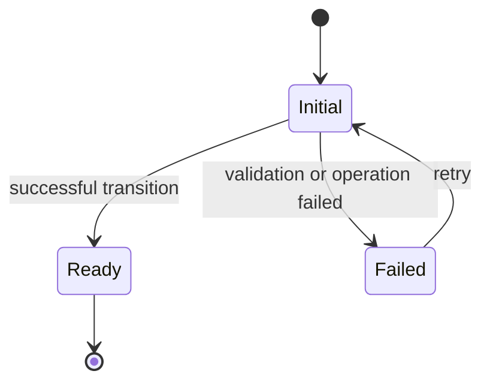

<!--
使用说明：

1. 复制到 docs/features/contracts/<feature-slug>.md 后再填写；不要直接把模板当作 Feature Contract。
2. 删除所有占位说明和不适用的可选章节。
3. 只把代码、schema、数据库约束或可重复测试能够证明的行为写入“当前已实现行为”。
4. 设计目标、进行中变更和已知缺口必须写入“进行中的目标差异”，不得伪装成当前事实。
5. Contract 描述用户与领域行为；实现结构链接到 Architecture，决策理由链接到 ADR，
   单次变更目标链接到 Spec，实施步骤留在 Plan 或 issue。
-->

---

feature: feature-slug
title: Feature Name
status: draft
delivery: planned
last_verified: YYYY-MM-DD
hosts: []
implementation_paths: []
supersedes: []
---

# Feature Name Feature Contract

## 一句话契约

<!--
用一到三句话说明：
- 用户获得什么能力；
- 最重要的领域边界或承诺；
- 该能力不应被误解成什么。
-->

本文描述当前可观察行为。发生冲突时，运行时代码、Zod schema、数据库约束和可重复测试优先于
本文；Current ADR 与当前架构文档优先于历史规格。“进行中的目标差异”不是已经交付的行为。

## 元数据语义

<!-- 本节用于填写时参考，完成 Contract 后通常删除。 -->

`status` 表示本文能否作为事实依据：

- `draft`：仍在形成，不得作为当前事实源。
- `current`：准确描述当前行为，可以作为导航入口。
- `deprecated`：Feature 仍存在，但正在退出；必须说明替代方案。
- `historical`：只用于追溯，不得指导当前实现。

`delivery` 表示 Feature 的交付程度：

- `planned`：尚未形成可用竖切。
- `in_progress`：正在实现，但尚未形成稳定可用能力。
- `partial`：已有稳定可用能力，仍存在明确缺口。
- `available`：当前承诺范围已经交付。
- `retired`：能力已经移除。

常见组合：

- `status: draft` + `delivery: planned`：目标契约草案。
- `status: current` + `delivery: partial`：本文准确，但 Feature 尚未全部交付。
- `status: current` + `delivery: available`：本文准确，当前承诺范围已经交付。
- `status: historical` + `delivery: retired`：仅供追溯的已移除 Feature。

## 用户入口

<!--
- 用户从哪里进入；
- 有什么前置条件；
- 支持哪些宿主、格式或角色；
- 成功后进入哪个产品表面；
- 路由或外部入口使用什么稳定身份。
-->

## 当前已实现行为

<!--
只记录已经落地并可验证的行为。按用户流程或领域阶段拆分三级标题，避免按代码模块罗列。
如果没有已实现行为，应保持 status: draft，并明确说明本节为空。
-->

### 成功路径

<!-- 输入、关键处理、用户可见结果。 -->

### 取消、失败与重试

<!--
- 取消是否改变已有状态；
- 稳定错误 code 与降级行为；
- 哪些失败可重试；
- 原始异常是否允许跨边界或进入 UI。
-->

### 恢复与并发

<!--
- 重启、刷新或重新打开后如何恢复；
- 重复请求、并发写入、旧任务结果如何处理；
- 幂等、去重、CAS 或 generation guard 语义。
-->

## 状态与转换

<!--
仅在状态关系不容易用短段落解释时保留 Mermaid。
节点使用领域状态，避免使用组件内部的临时布尔值。
-->

<!-- 补充禁止转换、原子边界和用户不可见的恢复状态。 -->

## 平台能力矩阵

<!--
跨宿主 Feature 保留本节；单宿主 Feature 可删除。
“不支持”和“尚未实现”必须区分。
-->

| 能力       | Browser              | Desktop              | 当前差异               |
| ---------- | -------------------- | -------------------- | ---------------------- |
| Capability | 支持/不支持/部分支持 | 支持/不支持/部分支持 | 说明差异，不写目标愿景 |

## 领域不变量

<!--
列出任何实现都必须维持的业务规则。优先写身份、所有权、生命周期、去重、删除、安全和一致性边界。
不要复制完整 TypeScript 类型、Zod schema、SQL 表或 Bridge payload；链接到对应事实源。
-->

1. Invariant one.
2. Invariant two.

运行时字段约束见 `path/to/schema`，领域端口见 `path/to/port`；本文不复制完整 schema。

## 进行中的目标差异

<!--
当 delivery 为 planned、in_progress 或 partial 时保留。
每项必须明确属于“尚未落地”或“部分落地”，并尽量链接当前 Spec/issue。
AI 不得从本节推断当前运行时行为。
-->

以下内容不得被 AI 当作已经实现的行为：

- 尚未落地：...
- 部分落地：...
- 已知平台差异：...

## 明确非目标

<!--
记录当前承诺明确排除的能力，防止 AI 擅自扩张范围。
不要把短期未完成项放在这里；短期缺口属于“进行中的目标差异”。
-->

- Non-goal one.
- Non-goal two.

## 验收契约

<!--
使用可观察的 Given/When/Then 语义。避免绑定组件 class、私有方法或数据库实现细节。
每项最好能够映射到一个自动化测试或明确指出尚无证据。
-->

- 给定……，当……时，必须……。
- 给定……，当……失败或取消时，不得……。

## 证据地图

<!--
每项契约至少链接一个运行时/schema 事实源；重要行为应同时链接自动化测试。
没有测试的行为明确写“尚无自动化证据”，不要用设计文档冒充验证。
-->

| 契约     | 运行时代码 / Schema | 自动化证据     |
| -------- | ------------------- | -------------- |
| Behavior | `path/to/runtime`   | `path/to/test` |

## 相关资料

<!-- 只链接当前任务需要继续读取的资料；历史文档必须标出 historical/superseded。 -->

- 产品术语：[`CONTEXT.md`](../../../CONTEXT.md)
- 当前架构入口：[`docs/architecture/README.md`](../../architecture/README.md)
- 当前 UI 契约：[`DESIGN.md`](../../../DESIGN.md)
- Current ADR：...
- 当前架构文档：...
- 进行中的规格：...
- Historical / Superseded 资料：...

## 维护触发器

<!--
列出哪些代码、schema、持久化、路由或用户行为变化必须同步核对本文。
避免写“Feature 变化时更新”这类无法执行的空泛规则。
-->

- 领域 schema、持久化约束或跨进程契约变化。
- 用户入口、成功/失败/取消行为或路由身份变化。
- 平台能力矩阵发生变化。
- “进行中的目标差异”落地并获得可重复测试证据。
- Feature 被废弃、替代或移除。
