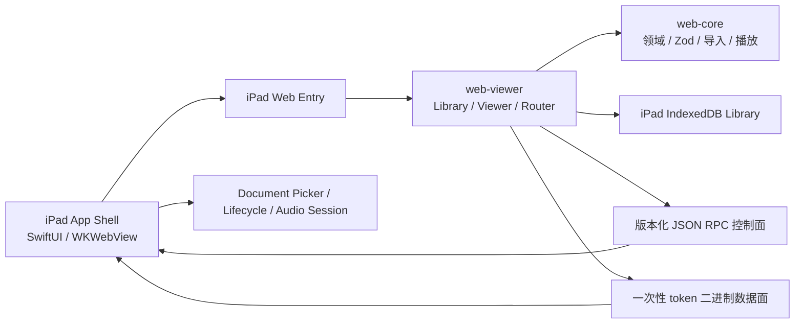

# iPad Practice Player 设计规格

## 目标

Zupulse 新增原生 iPad Practice Player：用户可以从系统文件入口导入 Guitar Pro、MusicXML 与
MXL，在独立本地 Sheet Library 中离线打开 Viewer，并完成读谱、前台播放、变速、点拍定位、
命名 A/B 循环、轨道混音与练习状态恢复。

首个交付面面向项目作者个人使用，同时为未来 App Store 产品保留清晰的原生宿主、Bridge、构建、
网络和持久化替换边界。它不是 Desktop Shell 的全量移植，也不以首版 Studio、后台播放或跨设备
同步为成功条件。

最低部署目标为 iPadOS 17。首台真机验收设备为 11 英寸 iPad Pro M5、iPadOS 26.5.2；当前尚无
Apple Developer Team，工程与 Simulator 验证先行，真机门禁等待 Personal Team 可用后执行。

## 已确认假设

- 发布形态是原生 iPad App，不以 PWA 作为最终产品。
- 使用薄 SwiftUI App Shell 和单个 WKWebView，不引入 Capacitor。
- Library、Viewer、路由、Transport 与练习控制继续复用共享 React 应用。
- 个人原型阶段复用 Browser IndexedDB Repository，不承诺未来改用原生存储时无损迁移已有数据。
- 核心 Library、导入、渲染与练习播放必须离线可用。
- 发布版不加载或执行远程 Web 代码。
- 首版只承诺前台播放，不支持锁屏或后台继续播放。

## 产品范围

### MVP

- 应用内系统文件选择器支持单选与多选导入。
- 支持 Files、AirDrop、邮件等系统“用 Zupulse 打开”入口。
- 外部文件统一进入 Library Import，导入后保存 Managed Score Copy，不持续引用原文件。
- 批量导入逐份原子处理，允许部分成功并显示汇总。
- Library 支持现有搜索、排序、收藏、元数据编辑、导出与彻底删除语义。
- Viewer 支持渲染、前台播放、暂停、停止、seek、速度、命名 A/B 循环、mute/solo 与练习恢复。
- 横屏、竖屏和 Split View 都是正式布局状态；布局按容器宽度而非设备方向切换。
- 谱面支持独立缩放按钮与双指缩放；轻点可识别 beat/note 定位播放位置。
- 冷启动或 WebContent 进程重建后恢复 Library Score、位置与练习设置，但保持暂停。
- 保留 `#/studio/:libraryScoreId` 占位路由，不在 Library 展示入口，也不创建 Studio Session。
- 本地结构化诊断可由用户主动导出，不自动上传。

### 非目标

- Harmony Analysis Studio runtime、编辑器、分析任务或预览播放。
- 云同步、账号、跨设备 Library 或 Browser/Desktop/iPad 馆藏共享。
- IndexedDB 到未来原生 Repository 的无损迁移。
- 后台播放、锁屏播放、Control Center 播放控制或原生音频引擎。
- Apple Pencil 手写批注。
- 多窗口同时打开多份曲谱。
- iPhone、macOS Catalyst 或 visionOS。
- 远程 Web bundle、动态 JavaScript 插件或绕过 App 更新的热更新。
- 原型阶段的完整 VoiceOver、动态文字和无障碍验收；实现仍不得移除语义 HTML、键盘路径、
  状态文本、系统缩放或手势的按钮替代。

## 架构



### 所有权

- `packages/web-core` 继续拥有领域模型、Zod 边界、Library Import、PlaybackController、格式解析与
  alphaTab adapter，不依赖 React、WebKit 或 Swift。
- `packages/web-viewer` 继续拥有共享 React 页面、路由、ViewerApplication、Viewer Session 组合与
  UI。iPad 适配通过显式 host capability、容器布局和平台入口完成，不复制 feature。
- `apps/ipad-shell` 只拥有 SwiftUI 生命周期、WKWebView 配置、资源加载、Bridge transport、系统
  文件交互、音频会话、网络/导航 policy 和本地诊断导出。
- 原型的 Sheet Library 由 iPad WebView 自己的持久 IndexedDB 存储持有；它与 Browser Demo、
  Desktop Shell 相互独立。
- SwiftUI 不实现 Library 列表、Viewer 导航栏、Transport 或练习控制。

### App Shell

- 使用一个持久 WKWebView 承载完整 React 应用。
- 直接使用 WebKit API，不引入 Capacitor。
- SwiftUI 可以拥有 Web 尚未启动时的 loading 与不可恢复启动错误表面，但不能复制业务页面。
- 发布构建锁定顶层应用 origin；普通外链交给 Safari。
- 允许 React 访问构建时配置的 HTTPS allowlist，但网络不能成为打开 Managed Score Copy 的前置条件。

## Bridge 与文件数据

### 控制面

iPad 使用一个白名单化的双向 RPC 通道。请求、响应和事件使用统一 envelope：

```ts
type IpadBridgeEnvelope = {
  bridgeVersion: string;
  correlationId: string;
  type: string;
  payload: unknown;
};
```

- 未知版本、方法、事件、字段或越界 payload 必须拒绝。
- 原生主动事件与 RPC 响应共享版本和 envelope 语义，但类型空间必须可区分。
- app/web build hash 与 Bridge version 在启动 handshake 中双向校验。
- 请求处理覆盖成功、结构化失败、取消、超时、迟到响应和 Shell 销毁。
- Zod schema 是唯一契约事实源；构建生成传输中立 manifest。
- 首版 Swift DTO 与严格校验手写，由同一 valid/invalid JSON fixtures 在 TypeScript 与 Swift 验证。
- 现有 Electron structured clone 中的 `Uint8Array` 不是 iPad JSON contract 的合法传输表达。

### 二进制数据面

Bridge RPC 不传 Base64、JSON 数字数组或其他大二进制编码。系统文件选择流程为：

1. React 请求文件选择或 Shell 接收系统外部打开事件。
2. Shell 校验外部文件的类型、普通文件属性与 64 MiB 上限。
3. Shell 返回文件名、大小和一次性 opaque token，不返回绝对路径或 security-scoped URL。
4. React 通过受限数据通道读取字节并执行共享 Library Import。
5. 成功、取消、过期、App Shell 销毁或使用次数耗尽后 token 失效。

数据通道必须防止 token 枚举、路径注入、重复消费和读取 App Bundle/容器中未授权内容。是否采用
自定义 scheme 由技术探针决定；ADR 0060 只固定控制面与数据面分离的语义。

### 外部打开与冷启动

- Shell 可以在 React/IndexedDB/Router 尚未就绪时接收一个或多个外部文件。
- 待处理导入保留到 handshake 与 Library initialize 完成后，再按收到顺序投递。
- 重复系统事件不得重复创建同一 Library Score；最终由 Score Identity 唯一约束去重。
- 单文件成功或已存在时进入对应 Viewer；批量导入完成后留在 Library 并显示汇总。
- 取消选择不改变当前 route 或 Session。

## Library 与数据生命周期

- iPad Library 继续使用 UUID Library Score ID 和小写 SHA-256 Score Identity。
- 导入成功后 Managed Score Copy 不依赖外部原文件；外部文件被修改、移动或删除不影响馆藏。
- IndexedDB schema 继续显式版本化；普通 App 更新不得因资源路径或 origin 改变而出现空馆藏。
- 原型不承诺未来 IndexedDB 到原生 Repository 的数据迁移，但 Repository interface 不得泄漏
  IndexedDB key、object store 或 WebKit 实现细节。
- 删除继续联动清理 Managed Score Copy、Library Score、Metadata、Practice Sidecar、Local Playback
  Resume、Library Practice Summary 和 Harmony Analysis Document。
- Repository 初始化或迁移失败不得自动清库；个人原型“不承诺跨实现迁移”不等于允许普通升级
  静默丢数据。

## Viewer 交互与布局

### 布局状态

- 横屏宽布局：乐谱是主视觉面，Transport 常驻，次级练习控制按需展开。
- 竖屏：乐谱全宽，Transport 位于底部安全区上方，Tracks/Loop/Session 使用 sheet。
- Split View：按实际容器宽度切换布局；极窄状态仍保留播放、暂停、速度、循环状态与返回 Library。
- 尺寸变化可以触发 alphaTab re-layout，但不得销毁 Viewer Session、回到开头或改变循环/播放事实。
- 每个工作区只有一个主要滚动宿主，避免乐谱与控制面形成嵌套滚动。

### 谱面缩放

- 缩放只影响谱面，不缩放 App Shell、Transport 或导航。
- 按钮与双指手势更新同一个本地 UI preference。
- 双指过程中可以轻量预览，手势结束后才提交 alphaTab re-layout。
- re-layout 后保持当前书面位置在视口附近，并保持播放、循环和 Viewer Session。
- 不禁用 iPadOS 系统级辅助缩放。

### 点击定位与循环

- 完整轻点 beat/note 才 seek；超过移动阈值的单指滚动和双指缩放不得触发 seek。
- 暂停时点击只定位；播放时点击定位后继续播放。
- 首版不在谱面上拖拽创建循环范围。
- A/B 继续取当前播放位置，并沿用 off/beat/measure 吸附与现有 Written Position / Playback
  Occurrence 语义。

## 生命周期与音频

- 使用适合音乐播放的原生 audio session，并允许与其他应用音频混合；不主动 duck 其他应用。
- 首版只在前台播放。进入后台、系统音频中断或耳机断开时立即暂停并 flush 状态。
- 中断结束、回到前台或进程重建后都不得自动播放。
- 恢复 Library Score、Local Playback Resume、Practice Sidecar、主题与必要 UI preference。
- 不恢复 seek 手势、打开的 popover/sheet、文件选择、一次性 token 或其他瞬时 UI。
- 上次 Library Score 不存在、损坏或无法读取时回到 Library，并显示可恢复的就地错误。
- WebContent 进程终止必须进入显式恢复流程，不得留下永久白屏。

## 网络、代码与诊断边界

- 发布版 HTML、React bundle、alphaTab、Worker、AudioWorklet、字体和 SoundFont 随 App Bundle 发布。
- 不远程替换 HTML/JavaScript，不执行远程插件。
- React 只能访问构建时 allowlist 中的 HTTPS 服务；未知 scheme、`file://`、脚本弹窗和非 allowlist
  请求被拒绝。
- 用户明确点击普通 HTTPS 外链时交给 Safari。
- Debug 可以通过显式、不可进入 Archive/Release 的配置连接本地 dev server。
- 首版不上传自定义遥测。诊断只记录稳定 code、版本、耗时、最多 16 字符 hash 前缀、设备/系统
  版本和系统可用的进程终止信息。
- 诊断不得包含曲谱字节、路径、token、文件名、标题、艺术家、完整哈希、Bridge payload 或用户文本。

## 技术栈

- Swift 6.2、SwiftUI、WebKit、AVFAudio。
- iPadOS 17 deployment target；当前开发工具链 Xcode 26.3。
- React、React Router、Zustand、普通 CSS 与现有 semantic tokens。
- TypeScript、Zod 4、IndexedDB 和 alphaTab 1.8.4，版本以 workspace lockfile 为准。
- 不新增 Capacitor、React Native、原生 UI 组件库、远程代码更新框架或原生数据库依赖。

## 项目结构

```text
apps/ipad-shell/
  Zupulse.xcodeproj/              # 提交的 Xcode 工程
  app/                            # SwiftUI 生命周期与组合入口
  bridge/                         # WebKit transport、DTO、严格校验和 fixtures
  webview/                        # WKWebView 配置、资源与导航 policy
  files/                          # Document Picker、外部打开与一次性 token
  audio/                          # Audio session 与中断映射
  diagnostics/                    # 本地最小诊断与主动导出
  tests/                          # Swift 单元/集成测试
  scripts/                        # iPad 构建与 manifest 校验脚本
  web/                            # iPad 专用 Web entry；不保存生成 dist

packages/web-viewer/src/
  app/                            # capability-aware route 组合
  features/                       # 共享 Library/Viewer 与 iPad 响应式状态
  platform/                       # iPad host adapter，不依赖 Swift 实现细节

packages/web-core/src/bridge/
  schemas.ts                      # Bridge Zod 事实源
  generated/                      # 构建生成的 transport-neutral manifest
  __tests__/fixtures/             # 双端 valid/invalid contract fixtures
```

最终目录在实施计划阶段与 Xcode 工具约束一起确认；业务模块仍遵循项目 kebab-case 约定，Xcode 必须
使用的工程文件名属于工具例外。跨 workspace 依赖只通过公开入口。

## 代码风格

TypeScript 继续使用 named export、双引号、严格 Zod 边界和 `exactOptionalPropertyTypes`：

```ts
export function createIpadViewerHost(transport: IpadBridgeTransport): ViewerHost {
  return {
    request: (value) => transport.request(bridgeRequestSchema.parse(value)),
    subscribe: (listener) => transport.subscribe((event) => listener(bridgeEventSchema.parse(event))),
  };
}
```

Swift 类型使用明确的值语义与 exhaustive switch；任何 Bridge 输入先严格验证再路由：

```swift
func handle(_ value: Any) async -> BridgeReply {
    switch BridgeRequest.validate(value) {
    case .success(let request):
        return await router.dispatch(request)
    case .failure(let error):
        return .rejected(error.asBridgeError())
    }
}
```

Swift 不暴露文件路径到 JavaScript，不把 Web 输入直接拼进 URL，也不以 `try?` 静默吞掉 Bridge、
文件或生命周期失败。

## 命令

当前门禁继续有效：

```bash
pnpm verify:fast
pnpm verify
pnpm verify:e2e
```

实施第一竖切时必须新增以下可执行入口，脚本名称是本规格的一部分：

```bash
pnpm ipad:web:dev
pnpm ipad:web:build
pnpm ipad:build
pnpm ipad:test
pnpm ipad:verify
```

- `ipad:web:build` 生成 iPad entry、alphaTab 资源和版本/hash manifest，不写入 Git 跟踪目录。
- `ipad:build` 调用统一 Web 构建后使用 `xcodebuild` 构建通用 iOS Simulator 目标。
- `ipad:test` 运行 TypeScript 最小相关测试与 Swift/Simulator tests。
- `ipad:verify` 依次执行 contract drift、资源 manifest、Release 配置泄漏、Swift tests 与 iPad Web build。
- Xcode Build Phase 和 CI 必须调用与这些命令相同的底层脚本，不维护第二套复制逻辑。

## 测试策略

### TypeScript

- Zod Bridge request/response/event/capability 与 contract manifest 测试。
- iPad ViewerHost transport adapter 的成功、失败、取消、超时、迟到响应和销毁测试。
- capability-aware route 测试，包括 Studio 占位路由。
- 横屏、竖屏、窄 Split View 的组件状态测试。
- 谱面缩放、触控滚动阈值、点拍 seek 与 A/B 控件测试。
- 批量导入部分成功、去重、取消和汇总测试。

### Swift

- valid/invalid fixtures 与 TypeScript 使用同一输入集。
- 严格拒绝未知字段、未知版本、未知方法、越界值和非法 URL。
- token 创建、消费、过期、取消、并发、重复读取和 Shell 销毁测试。
- 导航 allowlist、外链 Safari 委托与 Release dev-server 禁用测试。
- pending external import 在 handshake 前后只投递一次。
- audio interruption、route change、background/foreground 与不自动续播测试。
- WebContent process termination 的恢复协调测试。

### Simulator 与真机

Simulator 验证布局、route、Bridge、文件选择编排和恢复状态，但不能证明 Web Audio、Worker、内存或
真实触控质量。Personal Team 可用后，M5 真机必须验证：

- Web Crypto、Worker、AudioWorklet、IndexedDB origin 和 bundle 资源加载。
- 连续前台播放 20 分钟。
- 横竖屏与 Split View 动态尺寸变化。
- 单指滚动、轻点定位与双指缩放冲突。
- 前后台、音频中断、耳机断开和 WebContent 进程终止。
- 连续打开/关闭 20 份代表性曲谱后内存不呈单调增长。

## 性能与资源门槛

- 文件字节就绪到首屏谱面可见 P95 不超过 3 秒。
- 播放能力总就绪时间不超过 5 秒。
- 播放、暂停、seek 与 A/B 操作的可见反馈不超过 100 ms。
- 容器尺寸变化后 1 秒内恢复稳定布局，且 Session 不重建。
- Local Playback Resume 最多丢失约 5 秒位置，暂停、切后台、换谱和销毁前立即 flush。
- 单文件保持 64 MiB 硬上限；MusicXML/MXL 保持现有解码量与容器预算。
- 首轮探针记录进程与 WebContent 峰值，不在缺少基线时虚构绝对内存上限。

## 第一竖切

第一阶段只交付可演进的风险验证闭环：

1. SwiftUI 启动单个 WKWebView。
2. bundle 资源加载并完成 build hash / Bridge version handshake。
3. Document Picker 选择一份 GP 或 MusicXML。
4. 一次性 token 数据通道读取并导入 IndexedDB。
5. 共享 Viewer 完成渲染和前台播放。
6. 轻点定位、暂停、速度和一个 A/B 循环可用。
7. 横竖屏与 Split View 不重建 Session。
8. 切后台暂停并保存，回前台恢复且保持暂停。
9. WebContent 进程终止后恢复而非白屏。

批量导入、系统外部打开、完整 iPad 视觉适配和 Studio 占位页在竖切通过后进入完整 MVP；竖切架构
不得阻塞这些已确认需求。

## 边界

### 始终执行

- 保持 `web-core` 与 `web-viewer` 的平台边界。
- 所有跨 WebKit 输入使用版本化 schema 与双端校验。
- 外部文件使用一次性 token，JavaScript 永远不获得路径。
- 使用 Managed Score Copy、UUID Library Score ID 和小写 SHA-256 去重。
- 生命周期停止播放时 flush 练习状态，并且绝不自动恢复播放。
- 从最小相关测试开始，再运行与风险相称的项目门禁。

### 实施前需要再次确认

- 采用哪个稳定资源 origin，以及是否需要 loopback server 或新依赖。
- 正式产品化时是否改用原生 Repository、是否承诺数据迁移与备份。
- 后台播放、原生音频、云同步、遥测服务或新 entitlement。
- Studio 在 iPad 的正式产品范围与触控布局。
- 任何远程服务域名、数据类型和隐私策略。

### 禁止

- 在 SwiftUI 复制 Library、Viewer 或 Transport。
- 把绝对路径、security-scoped URL、文件 token 或曲谱字节写入 route、日志或诊断。
- 通过 JSON/Base64 Bridge 发送完整曲谱字节。
- 为了解决构建问题远程加载发布版 JavaScript。
- 在 migration、origin 或 WebContent 错误后自动清空 IndexedDB。
- 把 Simulator 成功报告成真机音频、内存或触控验收通过。

## 技术探针与未决事实

资源 origin 按以下顺序实验，而不是先写死 ADR：

1. 只读自定义 scheme。
2. `loadFileURL` 与最小目录读取权限。
3. App 内 loopback 服务，只在前两者无法满足时考虑。

候选只有同时满足下列条件才能采用：

- secure context 与 Web Crypto 满足 SHA-256。
- alphaTab Worker 与 AudioWorklet 正常启动，不默认降级到主线程或 ScriptProcessor。
- IndexedDB 在重启、bundle 更新与 WebContent 重建后保持稳定 origin。
- 字体、SoundFont、动态 import、CSP 与网络 allowlist 正常。
- token 数据通道不能扩展为任意路径读取。

探针完成后，为选中的资源加载方式新增或接受 ADR；失败候选与可重复证据留在验证记录中。

## 成功标准

- 第一竖切在 Simulator 完成自动化验证，并在 Personal Team 可用后通过指定 M5 真机门禁。
- 同一 React Library 与 Viewer 在 Browser、Desktop 和 iPad entry 下保持领域与路由语义一致。
- iPad App 能在断网状态完成导入已选择文件、打开馆藏、读谱与前台练习。
- 普通升级和 WebContent 重建不会意外显示新的空 Library。
- Bridge 不接受未验证输入，不暴露路径，不通过 JSON 复制大二进制。
- 生命周期、音频中断和恢复都保持“恢复位置但不自动播放”。
- 横屏、竖屏与 Split View 不重建 Viewer Session。
- ADR 0058–0063 已于 2026-07-24 按个人原型范围接受；性能、长稳和完整设备验收仍是正式产品化前的
  必须门禁。

## 相关决策

- ADR 0039：共享 Viewer 使用 React 应用壳。
- ADR 0047：所有外部打开统一进入 Library Import。
- ADR 0048–0051：双宿主 Library、Repository、迁移失败和 Desktop 文件协调边界。
- Accepted ADR 0058：薄 SwiftUI/WKWebView iPad Shell。
- Accepted ADR 0059：单一版本化 iPad RPC 通道。
- Accepted ADR 0060：控制面与二进制数据面分离。
- Accepted ADR 0061：受控网络与固定应用页面/代码边界。
- Accepted ADR 0062：Zod contract 事实源与双端 fixtures。
- Accepted ADR 0063：构建时生成 iPad Web 资产。
