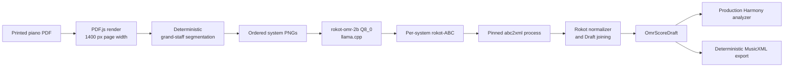

# Rokot PDF OMR Engine 与 Harmony 分析链路设计

## 决策摘要

为 `tools/pdf-omr-cli` 增加本地 `rokot` recognition engine，使印刷体钢琴谱 PDF 可以经过
deterministic system segmentation、逐 system transcription、ABC conversion 和 Draft joining，产出
engine-neutral `OmrScoreDraft`。现有 `pdf-omr analyze` 随后把 Draft 投影到生产 Harmony analyzer。

不在 `@zupulse/harmony-cli` 内实现或注册 OMR engine。当前依赖方向是
`pdf-omr-cli -> harmony-cli -> web-core`；反向依赖会形成 workspace cycle，也会让 Harmony 层承担 PDF、
图像、模型和外部进程职责。



## 默认假设

1. v1 只支持印刷体 piano grand staff；single staff、lead sheet、手写谱、TAB、打击乐与管弦总谱不在范围。
2. v1 使用已验证的 `rokot-omr-2b-Q8_0.gguf` 和 F16 vision projector，不支持 Q4。
3. 模型与 `llama-cli` 预先安装；recognize 不隐式下载约 2.7 GB 权重。
4. inference 完全本地运行，不上传 PDF、crop 或输出。
5. v1 每个 system 启动一次 `llama-cli`，优先实现简单且可取消的确定性链路；resident server 优化另立规格。
6. 该能力只属于隔离 CLI 与 benchmark，不接入 `apps/*`，也不批准模型随产品分发。
7. development corpus 继续使用仓库现有 K331 fixture；该数据只承担受控回归与 pipeline verification。

## Objective

用户可以对一个可读 PDF 执行 Rokot recognition，获得可验证、可追溯的 raw ABC、converted MusicXML
fragments、segmentation metadata 和 `OmrScoreDraft`。当结构足够完整时，同一 Draft 可以进入现有
Harmony analyze 与 MusicXML export；当 segmentation、ABC、measure alignment 或 rhythm 不可靠时，
命令必须稳定失败或产生 blocking diagnostics，不得猜测修复。

## Commands

### 模型准备

```bash
rokot_snapshot=$(HF_XET_HIGH_PERFORMANCE=1 hf download rokotmidi/rokot-omr-2b \
  --revision 7add305aade6fb3a64ad4dde77d410fa68381089 \
  --include 'rokot-omr-2b-Q8_0.gguf' \
  --include 'mmproj-rokot-omr-2b-f16.gguf')
```

模型权重不得提交到 Git。环境只接受显式绝对路径，不依赖当前用户的 HF cache layout：

```bash
export PDF_OMR_ROKOT_LLAMA_CLI=/absolute/path/to/llama-cli
export PDF_OMR_ROKOT_MODEL="$rokot_snapshot/rokot-omr-2b-Q8_0.gguf"
export PDF_OMR_ROKOT_MMPROJ="$rokot_snapshot/mmproj-rokot-omr-2b-f16.gguf"
export PDF_OMR_ROKOT_ABC2XML_PYTHON=/absolute/path/to/python3.11
```

ABC conversion runtime 使用隔离环境，并锁定 `abc-xml-converter==1.0.1`。v1 已批准把它作为 external
process dependency 使用，但不 vendoring converter source；实际分发仍必须保留其 license provenance。

### Recognition 与 Harmony

```bash
pnpm pdf-omr -- recognize input.pdf --engine rokot --output run
pnpm pdf-omr -- validate run/draft.json --output run/validation.json
pnpm pdf-omr -- analyze run/draft.json --output run/harmony.json
pnpm pdf-omr -- export-musicxml run/draft.json --output run/score.mxl
```

Benchmark 只能先进入新的 development protocol；不得读取或覆盖现有 frozen holdout：

```bash
pnpm benchmark:pdf-omr -- \
  --manifest tools/pdf-omr-cli/corpus/evaluation/manifest.json \
  --engine rokot \
  --mode development \
  --output result
```

## Runtime Contract

- Engine ID MUST be `rokot`.
- Input MUST be a readable PDF with at least one page.
- v1 MUST accept only printed piano grand-staff systems.
- Page rendering MUST use repository-owned `pdfjs-dist`, a white background, and a target width of 1400 px.
- Inference MUST use `temperature=0`, `max_new_tokens=1600`, `reasoning=off`, and concurrency `1`.
- Prompt MUST be exactly `Transcribe this staff to rokot-ABC.`.
- The adapter MUST preserve every crop, ABC fragment, converted MusicXML fragment, and segmentation record.
- The adapter MUST NOT invent confidence values because the model does not emit calibrated confidence.
- The adapter MUST NOT silently repair ambiguous pitches, rhythms, voices, measures, repeats, or system order.
- Cancellation MUST terminate the current `llama-cli` process tree and MUST NOT commit a succeeded run.
- Canonical artifacts MUST NOT contain access tokens, absolute input paths, raw exception stacks, or raw stderr.

## Locked Environment

新建 `tools/pdf-omr-cli/engines/rokot-environment.json`，至少锁定：

| Field                     | Value                                                              |
| ------------------------- | ------------------------------------------------------------------ |
| model repository          | `rokotmidi/rokot-omr-2b`                                           |
| model revision            | `7add305aade6fb3a64ad4dde77d410fa68381089`                         |
| text model                | `rokot-omr-2b-Q8_0.gguf`                                           |
| text model SHA-256        | `df53948ada1a4a584b4c7c81cc7e3293d3457f2e5ec9688271693459eb950f25` |
| vision projector          | `mmproj-rokot-omr-2b-f16.gguf`                                     |
| vision projector SHA-256  | `1074d47f6fd864bffa9d8843bbae30e6aa696ad0d55535ebd77053d81c699bd0` |
| llama.cpp benchmark build | `b10200-5f55650a7`                                                 |
| weights license           | `CC-BY-NC-4.0`                                                     |
| ABC converter             | `abc-xml-converter==1.0.1`                                         |

`inspectEnvironment` 必须流式计算两个 GGUF 文件的 SHA-256，不能用 `readFile` 把 2.7 GB 权重整体读入
内存。`OmrEngineEnvironment.modelSha256` 记录 text model hash；vision projector hash、model revision、
llama.cpp build、converter version 和 decoder settings 记录在 `parameters`。

缺少配置、文件不可读、hash 不匹配、llama.cpp build 不匹配或 converter import 失败时，返回
`ENGINE_UNAVAILABLE`，并使用稳定的 `context.reason`：

- `missing-rokot-configuration`
- `model-unreadable`
- `model-hash-mismatch`
- `mmproj-unreadable`
- `mmproj-hash-mismatch`
- `llama-build-mismatch`
- `abc-converter-unavailable`

## PDF Rendering 与 System Segmentation

### 输入归一化

每页按 `targetWidth=1400` 等比渲染到 opaque RGB canvas。Draft 的 `source.bbox` 使用 PDF point 坐标；
`segmentation.json` 同时记录 pixel bbox、PDF point bbox、page render hash 和 crop hash，避免 raster scale
变化破坏 provenance。

### v1 deterministic detector

1. 将 RGB 转成 luminance，使用 Otsu threshold 得到 binary foreground。
2. 对每行计算长水平 run coverage，合并相邻的粗线像素行。
3. 将近似等距的五条线组成 staff group；line spacing 必须落在锁定范围内。
4. 将 x-range 对齐、垂直距离落在锁定倍率内的相邻两个 staff group 配成 grand-staff system。
5. crop 保留整页宽度；上下 padding 由 local staff spacing 计算，必须包含 measure number、ornaments、
   dynamics、lyrics/harmony-like text，但不得与相邻 system 相交。
6. system 顺序固定为 `(pageIndex, topY)`；不得使用 filesystem enumeration order。

所有 threshold 与倍率进入 environment parameters 和 segmentation artifact。任一 staff group 无法唯一
配对、crop 重叠、system 数为 0、页面方向不受支持或检测结果跨两次运行不一致时，在 inference 前返回
`ENGINE_OUTPUT_INVALID`，reason 为 `ambiguous-system-segmentation`。

首个实现不引入 OpenCV 或新的 native image dependency。PDF.js canvas 的 RGBA buffer 足以实现投影与
run-length detector；若真实扫描 corpus 证明不足，再以独立 protocol 评估 deskew、adaptive threshold
或 learned detector。

## Per-system Inference 与 ABC Validation

adapter 通过 `runEngineProcess` 使用 argument array 调用 `llama-cli`，不得拼接 shell command：

```text
llama-cli
  -m <model.gguf>
  -mm <mmproj.gguf>
  --image <system.png>
  -p "Transcribe this staff to rokot-ABC."
  -n 1600
  --temp 0
  --single-turn
  --reasoning off
  --no-display-prompt
  --no-show-timings
  -o <system.abc>
```

`llama-cli` build `b10200-5f55650a7` writes the chat wrapper to `-o` even with `--no-display-prompt`. The adapter
MUST therefore accept only either a response beginning directly with `%%rokot-abc 0.1` or this exact wrapper:

```text
User:
Transcribe this staff to rokot-ABC.

Assistant:
```

It MUST strip that wrapper before preserving the canonical `.abc` artifact. Any other preamble, repeated role,
suffix prose, or additional assistant turn MUST fail rather than be heuristically extracted. The extracted payload
then undergoes UTF-8 and rokot-ABC envelope validation:

- first line MUST be `%%rokot-abc 0.1`;
- headers MUST contain one `X`, `M`, `L`, and `K` in fixed order;
- allowed voices are `1`, `1b`, `2`, and `2b`;
- standard lowercase `w:` lyric continuation lines MAY follow a voice body and MUST be preserved verbatim; the
  v1 Draft does not project lyrics;
- output MUST contain at least one pitched note or rest;
- prose、Markdown fence、duplicate header 或未知 voice MUST fail with `ENGINE_OUTPUT_INVALID`.

失败 reason 使用 `invalid-abc-utf8`、`invalid-rokot-abc-envelope`、`unknown-rokot-voice` 或
`empty-rokot-abc`。原始输出只有在整个 recognition 成功提交时才成为 canonical artifact；失败现场保留在
临时目录，不生成 succeeded run。

## ABC Conversion 与 Normalization Bundle

每段 ABC 由隔离 Python process 调用 pinned `abc-xml-converter`，输出 per-system MusicXML。process
failure、空输出或 XML parse failure 均映射为 `ENGINE_OUTPUT_INVALID`，不得回退到 heuristic ABC parser。

共享 `OmrRawRecognition.normalizationBytes` 不改变类型。Rokot adapter 将它编码成经过 Zod 验证的
`RokotSystemBundle` JSON：

```ts
type RokotSystemBundle = {
  schemaVersion: "1.0.0";
  systems: Array<{
    pageIndex: number;
    systemIndex: number;
    source: {
      pixelBbox: { x: number; y: number; width: number; height: number };
      pdfPointBbox: { x: number; y: number; width: number; height: number };
      cropSha256: string;
    };
    abcUtf8: string;
    musicXmlUtf8: string;
  }>;
};
```

`normalizationBytes` 是 engine-private process boundary，不写入 canonical artifacts；同内容的 ABC、XML、
crop 和 segmentation metadata 分别以可复查文件保存。

## Draft Joining Invariants

`normalizeRokotOutput` 按 system 顺序解析 converted MusicXML，并执行 Rokot-specific voice mapping：

| rokot voice | Draft staff | Draft voice |
| ----------- | ----------: | ----------: |
| `1`         |           0 |           1 |
| `1b`        |           0 |           2 |
| `2`         |           1 |           1 |
| `2b`        |           1 |           2 |

Draft staff indices are zero-based, while Draft voice indices are one-based. This follows the current
`omrScoreDraftSchema`, Audiveris normalizer, validator, and MusicXML exporter contracts; changing those shared
contracts is outside this engine implementation.

空的 secondary voice 可以省略；未知 part/voice 不得猜测映射。每个 system 的两个 staff 必须产生相同
measure count，global measure index 按 system 顺序连续生成。只有完全无 events 的 header-only measure
可以删除，其 attributes 必须显式 carry 到下一 measure。

以下事实必须产生 blocking diagnostic，而不是自动修复：

- `ROKOT_STAFF_MEASURE_COUNT_MISMATCH`
- `ROKOT_MEASURE_DURATION_MISMATCH`
- `ROKOT_UNSUPPORTED_VOICE`
- `ROKOT_UNSUPPORTED_STAFF_TOPOLOGY`
- `ROKOT_SYSTEM_BOUNDARY_AMBIGUOUS`

若 XML 无法解析、voice mapping 不唯一或没有任何 measure，直接返回 `ENGINE_OUTPUT_INVALID`。如果 Draft
可以忠实表达已识别事实但结构不足以 analyze/export，则 recognition 可以成功，但
`validateDraft` 必须把 Harmony/MusicXML readiness 标为 `blocked`。

## Canonical Artifacts

成功 run 至少包含：

```text
run.json
input.json
draft.json
diagnostics.json
engine/environment.json
engine/segmentation.json
engine/systems/page-001-system-001.png
engine/systems/page-001-system-001.abc
engine/systems/page-001-system-001.musicxml
...
```

不额外生成伪装成完整 score 的 `converted.musicxml`。完整 MusicXML 只能由通过 readiness validation 的
Draft 经现有 `export-musicxml` 生成。这样可以避免 per-system XML 拼接失败却被误认为 engine-native
成功输出。

## Project Structure

```text
tools/pdf-omr-cli/
  engines/
    rokot-abc2xml-runner.py
    rokot-environment.json
  src/
    render-pdf-pages.ts
    staff-system-segmentation.ts
    engines/rokot.ts
    normalizers/rokot.ts
    __tests__/
      rokot-adapter.test.ts
      rokot-normalizer.test.ts
      staff-system-segmentation.test.ts
      fixtures/fake-llama-cli.mjs
```

还需最小修改 `engine-registry.ts`、registry/recognize tests、`README.md` 与 evaluation docs。不得修改
`packages/web-core`、`apps/*` 或 `OmrScoreDraft` schema，除非实施中证明现有 contract 无法忠实表达结果并
重新获得批准。

## Code Style

遵循 named exports、Prettier double quotes、`__tests__/*.test.ts`、Zod process boundary 和
`exactOptionalPropertyTypes`。缺失 optional field 时省略，不传 `undefined`。

```ts
export function createRokotAdapter(options: RokotAdapterOptions): OmrEngineAdapter {
  return {
    async inspectEnvironment(signal) {
      return inspectLockedRokotEnvironment(options, signal);
    },
    async recognize(request) {
      return recognizeRokotSystems(options, request);
    },
    normalize(recognition) {
      return normalizeRokotOutput(recognition.normalizationBytes);
    },
  };
}
```

## Testing Strategy

1. Segmentation unit tests generate in-memory binary staff matrices and cover valid grand staff、noise、missing
   line、ambiguous pairing、overlap 与 deterministic ordering；不依赖外部 model。
2. Adapter tests 使用 fake `llama-cli` 和 fake converter process，验证 args、sequential ordering、artifacts、
   cancellation、timeout、output limit 与 stable errors。
3. Environment tests 使用小 fixture bytes 验证 streaming hash、build lock、缺失配置与 hash mismatch。
4. Normalizer tests 覆盖 `1/1b/2/2b` mapping、empty secondary voice、attribute carry、partial measure、
   duration mismatch 和 cross-system measure indexing。
5. Recognize integration test 使用两 system 小 PDF，要求重复运行的 `draft.json`、`segmentation.json`、ABC
   和 XML hashes 一致。
6. Development corpus 固定使用 `test-fixtures/musicxml/K331-3_reviewed.pdf` 与对应 reviewed MusicXML；允许在
   development 阶段用它调试 segmentation、joining 和 deterministic thresholds。
7. K331 是由同一 ground-truth MusicXML 导出的 `derived-controlled` fixture，只能报告 pipeline、回归和
   clean upper-bound evidence；不得进入 holdout，也不得声称 independent-scan 或真实世界泛化准确率。
8. v1 acceptance 不要求新增 independent scan；未来若进入 App discovery，必须建立包含 independent corpus
   的新 protocol，不能复用这组 K331 指标作为产品 gate。

## Boundaries

### Always

- Validate model, projector, llama.cpp build, converter version, and every process output.
- Preserve source anchors and every per-system native artifact.
- Keep inference local and deterministic.
- Use the existing `OmrScoreDraft`, validation, Harmony projection, and export paths.
- Report segmentation, transcription, joining, runtime, and downstream Harmony failures separately.

### Ask first

- Vendor converter source, change the approved converter version, or change its external-process boundary.
- Change `OmrScoreDraft`, CLI error codes, or canonical report schemas.
- Add resident `llama-server`, parallel inference, GPU-specific behavior, or automatic model download.
- Expand beyond printed piano grand staff.
- Integrate with Browser, Desktop, Bridge, Library, or any product UI.

### Never

- Commit or redistribute model weights.
- Treat CC-BY-NC-4.0 weights as approved for commercial product use.
- Upload user scores to a remote inference service.
- Hide invalid measures by padding rests or dropping notes.
- Add a reverse `harmony-cli -> pdf-omr-cli` dependency.
- Read the existing frozen holdout while tuning the Rokot protocol.

## Acceptance Criteria

1. `recognize --engine rokot` MUST accept a configured local Q8_0 runtime and produce deterministic per-system
   artifacts plus a schema-valid `OmrScoreDraft`.
2. Missing or mismatched runtime inputs MUST fail as `ENGINE_UNAVAILABLE` before rendering or inference.
3. Ambiguous segmentation MUST fail before inference with stable, structured context.
4. Invalid ABC or conversion output MUST fail as `ENGINE_OUTPUT_INVALID` and MUST NOT produce a succeeded run.
5. Joining MUST preserve staff, voice, pitch, duration, key, meter, clef, and source anchors without heuristic repair.
6. Structurally incomplete output MUST remain visible through blocking diagnostics and MUST NOT become
   Harmony-ready or MusicXML-ready.
7. A Harmony-ready Rokot Draft MUST run through the current production analyzer without a second analyzer or a
   reverse package dependency.
8. Repeated runs with identical input, model hashes, runtime build, and parameters MUST produce identical Draft,
   segmentation, ABC, and MusicXML fragment hashes; timestamped `run.json` is excluded.
9. The repository K331 fixture MUST complete the development run and preserve its derived-controlled provenance in
   the report.
10. Existing Audiveris, Transcoda, LEGATO, Harmony CLI, and frozen report tests MUST remain green.
11. Target verification MUST pass:

```bash
pnpm --filter @zupulse/pdf-omr-cli test
pnpm --filter @zupulse/pdf-omr-cli typecheck
pnpm --filter @zupulse/harmony-cli test
pnpm format:check
git diff --check
pnpm verify:fast
```

## Resolved Decisions

- Development corpus uses the repository K331 fixture and MUST be labeled `derived-controlled`.
- The K331 fixture is development/regression evidence only and MUST NOT enter holdout.
- v1 acceptance does not require a new independent scan corpus.
- v1 supports printed piano grand staff only.
- v1 launches `llama-cli` once per system; resident-server optimization is deferred.
- `abc-xml-converter==1.0.1` is approved as an isolated external process and MUST NOT be vendored in v1.
- v1 adds only `pdf-omr --engine rokot`; no root-level convenience alias is added.

## Open Questions

None for v1 planning. Any scope expansion requires updating this spec before implementation.

## Evidence

- Exploratory report:
  `tools/pdf-omr-cli/reports/exploratory/k331-rokot-vs-audiveris/README.md`
- Current PDF OMR decision: `docs/evaluation/pdf-omr.md`
- Existing engine architecture: `docs/specs/2026-07-28-pdf-omr-cli-benchmark-spec.md`
- Model card and runtime contract: <https://huggingface.co/rokotmidi/rokot-omr-2b>
