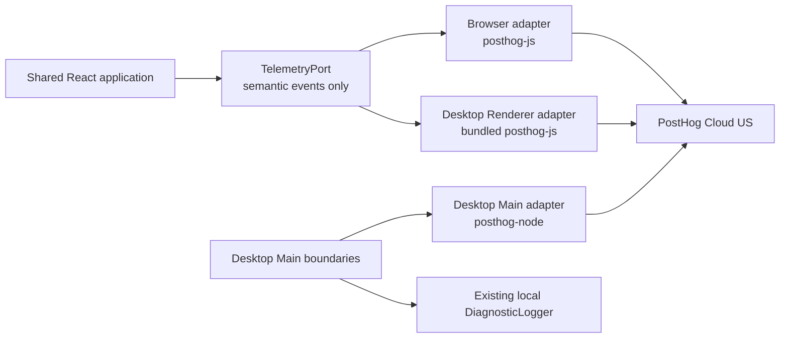

# 匿名产品遥测与错误追踪设计

本文定义 Zupulse Browser 与 Desktop 分发构建准备交付的匿名使用统计和 JavaScript Error Tracking，
不是当前运行时行为或实施进度的事实源。实现完成前，当前 Desktop 诊断行为仍以
[`ADR 0029`](../adr/0029-keep-internal-build-telemetry-free.md)、运行时代码和测试为准。

## 已确认假设

1. 第一阶段覆盖 Browser Demo 与 Electron Desktop，不覆盖 iPad Shell。
2. 使用 PostHog Cloud US 同时承载 Product Analytics 与 Error Tracking，不在第一阶段引入 Sentry。
3. 匿名使用与错误报告使用一个设置，分发构建默认启用并提供明确告知与随时退出；开发、测试、E2E
   与 Internal Acceptance Build 保持禁用。
4. 不启用 DOM autocapture、Session Replay、热图、用户调查、Feature Flags、console capture 或
   performance tracing。
5. Zupulse 当前没有账号身份，因此只能统计 Anonymous Installation，不能把报表描述为真实人数。
6. 需要远程遥测的内部 dogfood 使用独立 `alpha` release channel；Internal Acceptance Build 继续
   使用 No-op client，不改变 `ADR 0029` 的含义。

这些假设是本 Spec 的评审基线。改变供应商、默认启用策略、平台范围或数据分类时，必须先更新本
Spec，再进入实施。

## 背景

Zupulse 当前是本地优先应用，Browser 与 Desktop 分别维护独立的本地 Sheet Library。项目已有：

- 结构化 `ApplicationIssueCode` 与面向用户的本地化错误状态；
- Desktop Main 中经过 Zod 校验、限制大小且仅保存在本机的 `DiagnosticLogger`；
- Renderer 到 Main 的窄 Bridge，以及禁止路径、文件名、曲谱内容进入生产 UI 和诊断日志的约束；
- route-level 可恢复错误页和 Desktop 启动前 fatal error UI；
- app version、Renderer build hash 与 release build pipeline。

项目目前没有远程行为分析、安装身份、全局未捕获异常上报或 source map 发布流程。现有
`ADR 0029` 要求 Internal Acceptance Build 不集成遥测或自动上传诊断，同时明确允许在公开发布前重新
作出带告知与退出机制的决策。本 Spec 只为分发构建增加该能力，不取消本地诊断日志，也不改变内部
验收包的离线属性。

## 目标

- 可靠回答每天、每周和每月有多少 Anonymous Installation 启动并实际使用 Zupulse。
- 区分“打开应用”“成功进入工作区”和“在 Viewer 中首次开始播放”三层使用深度。
- 捕获 Browser、Desktop Renderer 和 Desktop Main 的未预期 JavaScript 异常，并按 release、平台、
  runtime 和稳定问题指纹聚合。
- 测量启动完成率、无错误 Application Session 比例、导入成功率和受错误影响的安装数。
- 保持本地优先信任边界：遥测故障永不阻塞导入、渲染、播放、保存、关闭或离线使用。
- 通过严格 event schema、property allowlist 和发送前清理，证明用户曲谱与本地路径不会离开设备。
- 允许用户在运行时关闭或重新启用遥测，并让关闭操作立即停止发送、清空未发送队列和重置身份。

## 成功口径

第一阶段成功不是“收集尽可能多的数据”，而是能够稳定回答下列问题：

1. `Daily/Weekly/Monthly Active Installations` 分别是多少？
2. 其中多少安装成功进入 Viewer 或 Studio？
3. 其中多少安装在 Viewer Session 中至少开始过一次播放？
4. 每个 release 的 `Application Ready Rate` 和 `Error-free Application Session Rate` 是多少？
5. 当前影响安装数最多的五类异常是什么？它们发生在哪个平台、runtime 和 release？
6. Score Import 的 `created | existing | failed` 分布如何？

所有指标必须使用 Anonymous Installation 或 Application Session 表述，不得在产品、Dashboard 或
发布报告中简写为 `Users`，除非未来已有经过身份系统确认的 User 聚合规则。

## 非目标

- 不建立账号、登录、跨设备身份合并、广告标识或设备指纹。
- 不上传 Library Score ID、Score Identity、文件名、曲名、作者、路径、曲谱字节、sidecar、和声分析
  内容或用户编辑内容。
- 不记录每次点击、滚动、seek、播放 tick、音符、和弦、轨道选择、搜索词或窗口尺寸变化。
- 不启用 Session Replay、DOM autocapture、heatmap、survey、Feature Flag 或 A/B test。
- 不把 PostHog 作为应用日志、审计日志、持久化队列或业务事实源。
- 不移除 Desktop 本地 `DiagnosticLogger`，也不自动上传现有本地日志文件。
- 不捕获或上传 native crash dump；Electron/Chromium native crash、macOS crash report 和 iPad native
  crash 需要单独设计。
- 不保证离线事件最终补传。遥测数据允许丢失，业务数据不允许因遥测失败而受影响。
- 不在本阶段为 iPad WebView 或 Swift Shell 开放 PostHog 网络访问。
- 不在本 Spec 中承诺法律合规结论；公开隐私声明、适用司法辖区与合规审查由发布流程负责。

## 领域语言

### Anonymous Installation

一个宿主本地持久化的匿名统计身份。它由随机 UUID 表示，不来源于硬件、文件、曲谱、账号、网络地址
或操作系统标识。同一自然人在多个宿主上产生多个 Anonymo
Installation；清除存储或关闭后重新启用
遥测也会产生新的 Anonymous Installation。

### Application Session

一次应用运行周期。Browser 从页面 bootstrap 到刷新、关闭或销毁；Desktop 从 Main bootstrap 到应用
退出。Desktop Main 与 Renderer 共享同一个 Application Session ID，不分别计算两个 Session。

### Active Installation

在指定自然时间窗口内至少发送一次 `application_session_started` 的 Anonymous Installation。该指标
衡量可观测到的安装活跃度，不等价于自然人数、设备销量或累计安装量。

### Engaged Installation

在指定时间窗口内至少发送一次 `workspace_session_started` 或 `viewer_playback_started` 的 Active
Installation。报表必须明确使用了哪个 qualifying event。

### Telemetry Preference

宿主本地持久化的匿名使用与错误报告选择。它不属于 Library、Practice Sidecar、Viewer Session、
Studio Session 或同步数据。

### Semantic Usage Event

由产品语义定义、具有稳定名称和精确字段的低频事件。它描述完成的应用行为，不描述 DOM 元素、点击
坐标或展示文案。

### Diagnostic Event

用于理解失败的结构化事件，包括 `application_issue_presented`、经过清理的 exception 和 runtime
failure。它不得成为传输任意日志或应用状态的后门。

## 平台与构建矩阵

| Surface           | Development / Test / E2E | Internal Acceptance    | Alpha / Beta / Production                |
| ----------------- | ------------------------ | ---------------------- | ---------------------------------------- |
| Browser           | No-op client             | No-op client           | PostHog Web adapter                      |
| Desktop Renderer  | No-op client             | No-op client           | bundled PostHog Web adapter              |
| Desktop Main      | No-op client             | local diagnostics only | PostHog Node adapter + local diagnostics |
| iPad Web / Native | No-op                    | No-op                  | Out of scope                             |

构建只有同时满足以下条件时才能启用远程遥测：

```text
releaseChannel in { alpha, beta, production }
AND POSTHOG_PROJECT_TOKEN is present
AND POSTHOG_API_HOST matches the compiled allowlist
```

缺少任一条件时必须组合 `NoopTelemetryPort`。不得使用默认 token、开发者个人 token或运行时从远程配置
下载 token。PostHog project token 可以随客户端分发，但 Personal API Key、source map upload token 和
其他管理凭证只能存在于 CI secret store。

## 产品行为

### 首次告知

首次运行启用遥测的分发构建时，App Shell 必须显示一次非阻塞但清晰可见的匿名数据告知。告知必须：

- 说明收集匿名启动、关键功能使用和崩溃信息；
- 说明不收集曲谱、文件名、路径或用户输入；
- 提供“继续分享”“关闭分享”和“了解详情”操作；
- 说明之后可以在设置中修改；
- 使用 `@zupulse/app-i18n` 的 `zh-CN` 与 `en-US` 文案；
- 不使用 dark pattern，不把关闭操作隐藏在二级确认中。

首次 `application_session_started` 只能在告知已经渲染后发送。告知不是阻塞式 consent dialog；默认
Preference 仍为 enabled。用户在告知中关闭时，当前 Session 后续不得发送任何事件。
`noticeAcknowledged` 只在用户选择继续或关闭后设为 `true`；未操作的告知在下次运行继续显示。

### 设置行为

App Header 的低频设置入口增加“隐私与诊断”区域，提供单一开关：

```text
Share anonymous usage and error reports
```

- 切换必须先持久化到宿主，再同步 Renderer 状态，沿用 locale persistence 的一致性原则。
- 持久化失败时 UI 保留原状态、显示本地化 Application Issue，不假装切换成功。
- 从 enabled 切到 disabled 后立即停止 capture，清空 SDK 未发送队列、清除 SDK persistence、删除
  `installationId` 并释放 client。
- disabled 状态不发送“用户关闭了遥测”事件。
- 从 disabled 切到 enabled 时生成新的 `installationId` 和 `applicationSessionId`，初始化 client，并在
  当前应用仍运行时发送新的 `application_session_started`。
- Preference 改变不重建 Viewer/Studio Session，不中断播放，不改变 URL 或 Library 数据。

### 离线与服务故障

- SDK 初始化、DNS、TLS、timeout、quota、rate limit 或 PostHog outage 必须静默降级。
- capture API 对产品代码表现为 non-throwing；内部 Promise rejection 必须被 adapter 消费。
- 第一阶段不实现磁盘级 durable retry queue；SDK 内存队列可在关闭时 best-effort flush。
- Desktop `prepare-close` 最多等待 300 ms 完成 flush；超时后继续关闭。
- Browser 使用 `sendBeacon` 或 SDK 等价 best-effort 行为，不监听页面卸载来阻止导航。

## 身份与生命周期契约

### Identity ownership

- Browser Host 使用独立、版本化的 local storage record 持有 Preference、notice state 与
  `installationId`。
- Desktop Main 持有 Preference、notice state、`installationId` 和当前 `applicationSessionId`；Renderer
  不自行生成第二份身份。
- Desktop handshake 只向 Renderer 返回遥测启用状态与匿名 UUID，不返回路径、系统账号、机器名或
  network identifier。
- PostHog `distinct_id` 必须等于 `installationId`。不得调用会创建已识别 Person 的 `identify(email)`、
  alias 或 group identity。
- Desktop Main 和 Renderer 使用相同的 `distinct_id` 与 `application_session_id`，并通过 `runtime`
  区分来源。

### Persisted state

持久化状态必须由 Zod 精确校验：

```ts
const telemetryPreferenceStateSchema = z
  .object({
    schemaVersion: z.literal(1),
    enabled: z.boolean(),
    noticeAcknowledged: z.boolean(),
    installationId: z.uuid().optional(),
  })
  .strict();
```

Invariants:

1. Absent persisted state MUST resolve to `{ enabled: true, noticeAcknowledged: false }` without an
   `installationId`.
2. `enabled === false` MUST imply `installationId` is absent.
3. `enabled === true` MAY omit `installationId` only before first client initialization.
4. Invalid persisted state MUST fail closed to telemetry disabled and MUST NOT delete unrelated preferences.
5. `applicationSessionId` MUST NOT be persisted across application runs.
6. Browser storage clearing and Desktop user-data deletion create a new Anonymous Installation.

## 事件契约

所有自定义事件在进入 provider adapter 前必须通过一个 provider-neutral Zod discriminated union。基础
envelope 为：

```ts
const telemetryEnvelopeSchema = z
  .object({
    schemaVersion: z.literal(1),
    eventId: z.uuid(),
    installationId: z.uuid(),
    applicationSessionId: z.uuid(),
    occurredAt: z.iso.datetime(),
    platform: z.enum(["browser", "desktop"]),
    runtime: z.enum(["browser", "renderer", "main"]),
    appVersion: z.string().min(1).max(64),
    buildId: z.string().min(1).max(128),
    releaseChannel: z.enum(["alpha", "beta", "production"]),
    effectiveLocale: z.enum(["zh-CN", "en-US"]),
    event: telemetryEventSchema,
  })
  .strict();
```

Provider adapter 负责把 `installationId` 映射为 PostHog `distinct_id`，把
`applicationSessionId` 映射为 session property，并保留 `eventId` 作为幂等/诊断字段。自定义事件名使用
`snake_case`；字段只允许下表列出的枚举和值，不接受 arbitrary property bag。

### `application_session_started`

发送时机：每个 Application Session 最多一次；重新启用遥测形成新的 Session 时可再次发送。

```ts
{
  name: "application_session_started";
}
```

### `application_ready`

发送时机：App Shell 已挂载、初始 route 已解析且第一次 Library refresh 已成功或进入明确的 degraded
state。启动前 fatal error 不发送 ready。

```ts
{
  name: "application_ready";
  initialSurface: "library" | "viewer" | "studio" | "not-found";
  state: "ready" | "degraded";
}
```

不得发送 raw URL、route params 或 `libraryScoreId`。

### `score_import_completed`

发送时机：一次已选择/已 drop/已选择 sample 的导入尝试进入终态。用户关闭系统选择器且没有选择文件
不属于导入尝试，不发送事件。

```ts
{
  name: "score_import_completed";
  source: "picker" | "drop" | "sample";
  outcome: "created" | "existing" | "failed";
  scoreFormat?: "gp" | "musicxml";
  issueCode?: string;
}
```

`issueCode` 必须来自稳定 code catalog 并满足 `^[a-z][a-z0-9-]{0,63}$`；不能使用原始异常消息。
无法可靠探测格式时省略 `scoreFormat`，不得传 `undefined`。

### `workspace_session_started`

发送时机：Viewer 或 Studio 成功从 Library Score 建立 runtime Session。route 匹配或 loading 开始不算
成功。

```ts
{
  name: "workspace_session_started";
  workspace: "viewer" | "studio";
  scoreFormat: "gp" | "musicxml";
}
```

每个 Viewer Session 或 Studio Session 最多发送一次。不得附加 Library Score、title、artist、duration
或 library size。

### `viewer_playback_started`

发送时机：Viewer Session 首次成功进入实际 playing state。按钮点击、被浏览器音频策略拒绝、loading
或 Studio Preview Transport 不算成功。

```ts
{
  name: "viewer_playback_started";
  scoreFormat: "gp" | "musicxml";
  navigationMode: "continuous-follow" | "page-turn";
}
```

每个 Viewer Session 最多发送一次，避免把暂停/继续和 loop 重播放大为事件量。

### `application_issue_presented`

发送时机：用户可见 UI 实际呈现新的 `ApplicationIssue`。相同 surface、issue code 和 Application
Session 的重复 render 只发送一次。

```ts
{
  name: "application_issue_presented";
  surface: "startup" | "library" | "viewer" | "studio" | "settings";
  issueCode: string;
  recoverable: boolean;
}
```

该事件衡量产品失败结果，不替代 exception。一个已预期的稳定 Application Issue 可以没有 exception；
一个未预期 exception 也可能在 UI recovery 前被捕获。

### `runtime_failure_observed`

发送时机：宿主观察到无法用 JavaScript exception 表达的 runtime failure。

```ts
{
  name: "runtime_failure_observed";
  runtime: "renderer";
  reason: "crashed" | "oom" | "killed" | "integrity-failure" | "unknown";
}
```

第一阶段仅由 Desktop Main 根据受控 Electron lifecycle event 发送；不得附加 Electron 原始 details
object、exit dump 或 command line。

## Error Tracking

### Capture boundaries

Browser 与 Desktop Renderer 捕获：

- global `error` 中未处理的 JavaScript exception；
- global `unhandledrejection`；
- React root / route error boundary 捕获且已被 UI recovery 消费的 exception；
- Desktop Renderer `start().catch(renderStartupError)` 中已被捕获的 startup exception；
- `ViewerHost.reportDiagnostic` 与 Studio diagnostic seam 中无法归类为预期 Application Issue 的
  exception。

Desktop Main 捕获：

- bootstrap 和 lifecycle 顶层 Promise rejection；
- 明确 operation boundary 中的 unexpected exception；
- Electron `render-process-gone` 并投影为 `runtime_failure_observed`；
- process-level uncaught exception / unhandled rejection，仅用于 best-effort capture 和安全退出，不得因为
  安装遥测而继续运行处于未知状态的 Main Process。

### Expected versus unexpected failures

- `ApplicationIssueCode`、Bridge stable error code、import diagnostic code 和已知 persistence warning 优先
  作为结构化 Diagnostic Event。
- 原始 exception 只用于 unexpected failure 或需要 stack 才能定位的内部失败。
- 不得为了提高 Error Tracking 数量，把所有 rejected command、用户取消、文件不支持或可恢复业务状态
  包装为 exception。
- 一个 error boundary 对同一个 exception 只允许一个 owner capture；global handler 与 manual capture
  必须通过 SDK event identity 或本地 `WeakSet` 避免重复。

### Sanitization

发送 exception 前必须：

1. 将任意绝对 POSIX / Windows path 替换为 `<redacted-path>`。
2. 移除 URL query、fragment、hash route params 和自定义 `zupulse://` resource path。
3. 移除 UUID、64-character content hash、file token 和疑似 bearer/API credential。
4. 丢弃 exception custom fields、cause payload、Bridge details、local variables 和 attachments。
5. stack 只保留最多 50 frames；message 最多 512 characters；每个 frame path 最多 256 characters。
6. 仅保留 application frame、package/module name、function、line 和 column；不得发送 source line content。

若 sanitizer 无法证明 payload 安全，必须丢弃该 exception，只允许发送
`application_issue_presented` 或本地诊断 code。

### Rate limiting

- 每个 Application Session 最多发送 20 个 exception events。
- 相同 sanitized fingerprint 在 60 秒内只发送一次。
- 达到预算后仅增加内存计数，不发送 `telemetry_dropped`，避免故障循环产生新事件。
- Semantic Usage Event 不采样；exception 第一阶段不随机采样，只做上述确定性限制。

## 数据最小化契约

### Allowed properties

除事件自身字段外，只允许：

- `schema_version`
- `event_id`
- `distinct_id`（Anonymous Installation UUID）
- `application_session_id`
- `occurred_at`
- `platform`
- `runtime`
- `app_version`
- `build_id`
- `release_channel`
- `effective_locale`
- coarse `os_name`、`os_major` 和 `runtime_version`（仅错误诊断）
- PostHog Error Tracking 要求的、已经过 sanitizer 的 exception fields

### Forbidden data

以下数据在任何事件、exception、breadcrumb、person property、group、attachment 或 source map metadata
中均禁止出现：

- Library Score ID、Score Identity、content hash 或其前缀；
- file token、文件名、目录、绝对路径、bookmark 或 filesystem metadata；
- title、artist、track/staff name、歌词、和弦、音符、MusicXML/GP 字节或用户修正；
- Practice Sidecar、Local Playback Resume、Harmony Analysis Document 或完整 application state；
- raw URL、hash route、referrer、DOM text、CSS selector、input value、search query 或 clipboard；
- email、姓名、账号、IP-derived geolocation、hardware serial、advertising ID 或 fingerprint；
- console logs、network body/header、Bridge request/response、SQLite/IndexedDB payload；
- screenshot、session recording、crash dump 或本地诊断文件。

Provider adapter 必须使用 final `beforeSend`/equivalent allowlist 再校验 provider 自动添加的 properties，
显式移除 `$current_url`、`$pathname`、`$referrer`、DOM/autocapture 和不在列表中的 automatic properties。
事件必须禁用 GeoIP enrichment。网络服务仍会在传输层接触请求 IP，这一点必须在公开隐私声明中如实
披露，不能表述为“服务器完全看不到 IP”。

## 架构



### Provider-neutral port

共享应用只依赖 provider-neutral port：

```ts
export interface TelemetryPort {
  capture(event: TelemetryEvent): void;
  captureException(error: unknown, context: TelemetryExceptionContext): void;
  flush(deadlineMs: number): Promise<void>;
}
```

Invariants:

- `capture` and `captureException` MUST NOT throw.
- Product code MUST NOT import `posthog-js` or `posthog-node` outside host adapters.
- Host adapter MUST enrich and validate the complete envelope.
- `NoopTelemetryPort` MUST be the default when telemetry is unavailable or disabled.
- Telemetry MUST NOT become a capability of `SheetLibraryRepository` or `ScoreFileGateway`.
- `web-core` MUST remain free of Browser, React, Electron and provider dependencies.

Provider-neutral event schemas and types放在 `packages/web-core/src/telemetry/`；React 触发点和设置 UI 放在
`packages/web-viewer`；PostHog adapters 与 identity persistence 属于各宿主。不得创建通用
`utils/analytics.ts` 或让共享 UI 读取 global `window.posthog`。

### Desktop Bridge

Desktop 需要以下版本化 Bridge 能力：

- handshake response 增加 `telemetry` capability 与初始 Preference state；
- request `app.telemetry.setPreference`，由 Main 先持久化，再返回完整 state；
- Renderer 不通过 Bridge 发送每个事件，避免把 Main 变成高频 relay；Renderer 使用 handshake 中的匿名
  context 直接调用受 CSP 限制的 ingestion host；
- Main 与 Renderer 使用相同 identity/session context；
- request、response、capability、dispatcher、preload contract、schema tests 和 E2E 必须一起更新。

Renderer 收到匿名 UUID 不扩大文件系统或 Library 权限。Main 仍须将 Renderer 输入视为不可信；Preference
request 只接受 boolean，不接受 token、host、identity 或 arbitrary config。

### Browser Host

Browser 使用 host adapter：

- Preference 和 identity storage 与 Sheet Library IndexedDB 分离；
- storage 读写失败时 fail closed 为 disabled；
- 不使用 cookie identity，不尝试跨域或跨浏览器合并；
- 清除 site data 后产生新的 Anonymous Installation；
- Browser Demo 的 static host 必须允许 PostHog ingestion，但不允许远程 script execution。

### PostHog configuration

- Renderer 使用能够把 Error Tracking extension 编入本地 bundle 的 no-external import；运行时不得加载
  PostHog CDN JavaScript。
- `autocapture = false`、`capture_pageview = false`、`capture_pageleave = false`、
  `disable_session_recording = true`、person profiles disabled、GeoIP disabled。
- Node adapter 设置 client-like desktop attribution，不启用 server request instrumentation、OpenTelemetry
  tracing 或 Express middleware。
- PostHog host 编译为精确 US ingestion origin；不得接受用户、remote config 或 Bridge 提供的任意 URL。
- Browser 与 Desktop CSP 的 `connect-src` 只增加精确 ingestion origin；`script-src` 保持 `'self'`。
- Source maps 只在 release CI 上传，不随 Browser public assets 或 Desktop package 分发。

## Source map 与 release

- `release` identity 使用 `appVersion + buildId`，Browser 与 Desktop 必须可区分。
- Browser bundle、Desktop Renderer bundle 和 Desktop Main bundle 分别上传 source maps，并设置正确
  runtime/source root。
- CI upload 使用独立 secret；失败必须使 alpha/beta/production release job 失败，避免发布无法定位的
  Error Tracking build。
- 上传成功后从 public/package artifacts 删除 `.map`，同时验证 bundle 中的 release/build identity。
- source map source content 不得包含 secret；构建检查必须继续拒绝把 `.env` 或凭证打入 bundle。
- Development、test、E2E 与 Internal Acceptance 不上传 source maps 到 PostHog。

## Dashboard 与报告口径

第一阶段创建一个 `Zupulse Product Health` dashboard：

| Metric                       | Definition                                                                      |
| ---------------------------- | ------------------------------------------------------------------------------- |
| Daily Active Installations   | unique `distinct_id` with `application_session_started` in calendar day         |
| Weekly Active Installations  | unique `distinct_id` with `application_session_started` in trailing 7 days      |
| Monthly Active Installations | unique `distinct_id` with `application_session_started` in trailing 30 days     |
| Ready Rate                   | sessions with `application_ready` / sessions with `application_session_started` |
| Workspace Engagement         | installations with `workspace_session_started` / Active Installations           |
| Viewer Playback Engagement   | installations with `viewer_playback_started` / Active Installations             |
| Import Success Rate          | `created + existing` / all `score_import_completed`                             |
| Error-free Session Rate      | sessions without exception or `runtime_failure_observed` / started sessions     |
| Affected Installations       | unique `distinct_id` with exception, grouped by issue fingerprint               |

Dashboard 默认按 `release_channel`, `app_version`, `platform`, `runtime` 提供 breakdown。任何图表不得展示或
导出单个 Anonymous Installation 的行为时间线作为日常产品分析工具；需要单事件调试时只在 Error
Tracking issue 中使用最小上下文。

## 项目结构

预期实现边界如下；实施计划可在不改变所有权的前提下调整具体文件名：

```text
packages/web-core/src/telemetry/
  schemas.ts                 provider-neutral strict schemas
  types.ts                   event and port types
  sanitizer.ts               pure path/token/URL redaction
  __tests__/*.test.ts

packages/web-viewer/src/features/telemetry-settings/
  telemetry-settings.tsx     notice and preference UI
  __tests__/*.test.tsx

apps/web-demo/src/telemetry/
  browser-telemetry.ts       identity, preference and PostHog adapter
  __tests__/*.test.ts

apps/desktop-shell/src/telemetry/
  renderer-telemetry.ts      bundled Web SDK adapter
apps/desktop-shell/src/main/telemetry/
  main-telemetry.ts          Node SDK adapter and preference store
  __tests__/*.test.ts
```

如果实际实现只需要较少文件，应保持目录扁平，不为了匹配示意树创建空层级。

## Code style

事件必须通过 named constructor 或 exact object 创建，不接受 arbitrary `Record<string, unknown>`：

```ts
telemetry.capture({
  name: "workspace_session_started",
  workspace: "viewer",
  scoreFormat: score.format,
});
```

禁止：

```ts
telemetry.capture("clicked", {
  url: location.href,
  title: score.title,
  ...applicationState,
});
```

继续使用 named exports、Prettier double quotes、`__tests__/*.test.ts(x)`，并在
`exactOptionalPropertyTypes` 下省略 absent optional fields，不传 `undefined`。

## 测试策略

### Schema and sanitizer unit tests

- 每个 event 的有效 payload 与所有 forbidden extra field；
- UUID、enum、长度、optional omission 和 strict-object 行为；
- POSIX path、Windows path、file URL、hash route、UUID、content hash、token 和 credential redaction；
- sanitizer 无法确认安全时 drop；
- exception frame/message budgets 和 deterministic fingerprint；
- Preference corruption fail closed，不删除其他 local state。

### Port and application tests

- No-op port 从不抛错；
- 每个 Session 的 event cardinality；
- Viewer 只有实际 playing 后才发送 `viewer_playback_started`；
- route params、Library ID、title、artist 和 file name 永不进入 fake telemetry；
- Application Issue 只在真实呈现时发送，并按 code/surface 去重；
- disabled 时所有 capture 都是 no-op，重新启用产生新 installation/session identity；
- SDK rejection、timeout 和 flush timeout 不改变业务 snapshot。

### Desktop tests

- handshake schema、capability、Preference request/response 与不可信输入拒绝；
- Main 先持久化再返回 Renderer；持久化失败不改变 Renderer 状态；
- Main/Renderer context identity 一致，不暴露绝对路径；
- `render-process-gone` 只投影 allowlisted reason；
- packaged HTML 只允许精确 ingestion `connect-src`，不允许 remote script；
- Internal Acceptance Build 中 token 缺失且 SDK 不初始化。

### Browser and E2E

- storage clearing、corrupt state、disable/enable 与新 identity；
- first-run notice、双语、keyboard、focus 和 setting persistence；
- fake ingestion endpoint 验证 payload allowlist，不连接真实 PostHog；
- Browser refresh 新建 Application Session 但保留 enabled Installation；
- Desktop relaunch 同样保留 Installation、重建 Application Session；
- offline 和 ingestion 失败仍可导入、打开和播放。

### Manual release checks

- PostHog US event 能在 macOS packaged Desktop 与实际部署的 Browser origin 到达；
- source maps 能把刻意触发的 sanitized test exception 还原到正确 release source；
- Dashboard 的 Installation/Session 口径与本地受控事件数量一致；
- opt-out 后 PostHog live events 不再收到该安装的新事件。

## Commands

实施时从最小验证逐级运行：

```bash
pnpm vitest run packages/web-core/src/telemetry
pnpm vitest run packages/web-viewer/src/features/telemetry-settings
pnpm vitest run apps/web-demo/src/telemetry
pnpm vitest run apps/desktop-shell/src/main/telemetry apps/desktop-shell/src/telemetry
pnpm check:i18n
pnpm demo:build
pnpm desktop:build
pnpm verify:fast
pnpm demo:test:e2e
pnpm desktop:test:e2e
pnpm format:check
git diff --check
```

命令中的目录可随最终文件布局调整，但最终变更必须至少通过覆盖 Browser 与 Desktop 的 build，以及
fake-ingestion E2E。真实 PostHog ingestion smoke check 只在人工 release check 执行，不进入普通 CI。

## Boundaries

### Always

- Validate every event and persisted preference with Zod before use.
- Keep telemetry non-blocking and fail closed when configuration or persisted state is invalid.
- Preserve local diagnostics and user-visible stable Application Issues.
- Strip forbidden data after SDK automatic enrichment and before network transmission.
- Use fake/no-op adapters in automated tests.
- Update this Spec before adding an event or property.

### Ask first

- Add or change a telemetry/error-tracking provider.
- Enable telemetry on Internal Acceptance or iPad builds.
- Enable Session Replay, autocapture, performance tracing, surveys, Feature Flags or user identification.
- Change default Preference, retention, region, sampling or data residency.
- Add any event/property not listed in this Spec.
- Change CSP, Bridge schema, CI secrets or release behavior beyond the exact implementation described here.

### Never

- Send user content, score/library identity, raw URL/path, credentials or arbitrary application state.
- Treat provider availability as required for application availability.
- Use Personal API Keys in client or packaged artifacts.
- Continue a corrupted Main Process solely to flush telemetry.
- Disable security boundaries, CSP, schema validation or sandboxing to make an SDK work.
- Describe Anonymous Installation metrics as real users.

## 风险与缓解

| 风险                                | 影响                       | 缓解                                                                              |
| ----------------------------------- | -------------------------- | --------------------------------------------------------------------------------- |
| SDK 自动属性泄露 URL/DOM            | 暴露 Library ID 或用户内容 | 禁用 autocapture/pageview；final property allowlist；payload contract tests       |
| exception message 含本地路径/文件名 | 隐私泄露                   | deterministic sanitizer；不安全即 drop；稳定 Application Issue 替代 raw exception |
| Main 与 Renderer 生成不同 identity  | 安装数翻倍、错误无法关联   | Main 单一 ownership；handshake context；contract/E2E 校验                         |
| 默认启用造成信任问题                | 用户反感或发布阻塞         | 首次明确告知、一级关闭入口、公开隐私声明、关闭即删除 identity                     |
| 离线事件丢失                        | 指标低估                   | 报表声明 observed telemetry；不为准确率引入 durable user-data queue               |
| exception storm                     | 费用与噪声                 | 每 Session budget、fingerprint dedupe、provider quota alerts                      |
| source map 泄露或错配               | 源码暴露或错误不可定位     | CI-only upload、artifact removal、release identity test                           |

## 文档与决策生命周期

- 本 Spec 经人工批准后改为 `status: approved`，再创建对应 `tasks/<initiative>/` 实施 bundle。
- 实施前新增一份 accepted ADR，决策主题为“公开分发构建允许可退出匿名遥测，Internal Acceptance Build
  继续零遥测”；它必须链接 `ADR 0029`，不得把旧决策无状态地覆盖。
- 验证完成后新增 Current Feature Contract，记录实际平台矩阵、Preference 行为、event catalog、已知
  gaps 和证据；同时更新相关架构文档与 ADR 状态。
- Spec 只记录批准设计，不记录 checkbox、每日进度、真实 token、Dashboard URL 或临时验证输出。

## 验收标准

1. Development、test、E2E、Internal Acceptance 和 iPad build 均不会初始化远程 SDK或产生真实网络
   遥测。
2. Alpha/Beta/Production Browser 与 Desktop 在配置有效且 Preference enabled 时，能发送本文定义的
   七类 Semantic/Diagnostic Events 和 sanitized exceptions。
3. Dashboard 能用 Anonymous Installation 和 Application Session 正确计算本 Spec 的九项指标，且不
   使用 `Users` 作为业务标签。
4. Browser refresh 与 Desktop relaunch 保留 Installation、重建 Application Session；Desktop Main 与
   Renderer 共享 identity，不造成双计数。
5. 用户首次看到明确双语告知，可在告知或设置中关闭；关闭后停止发送、清空未发送队列、删除本地
   installation identity，并且不影响当前工作区。
6. 所有自定义事件在发送前通过 strict Zod schema；extra fields 被拒绝，不存在 arbitrary property bag。
7. 自动化 payload tests 证明 Library ID、content hash、file token、文件名、title、artist、path、raw URL、
   DOM text 和 application state 不会进入网络 payload。
8. Browser/Renderer 未处理 exception、Promise rejection、route error 与 Desktop startup/Main error 能按
   release/runtime 聚合，并通过 source map 定位到正确 application frame。
9. exception sanitizer 覆盖 POSIX/Windows path、URL、UUID、hash 和 credential；无法保证安全的事件被
   drop，不退回发送原始异常。
10. ingestion 离线、超时、SDK 初始化失败、quota 和 flush timeout 均不改变导入、打开、播放、保存、
    关闭或本地诊断行为。
11. Desktop CSP 只为精确 PostHog US ingestion origin 增加 `connect-src`；运行时代码全部来自本地
    bundle，Electron sandbox、context isolation 和 navigation restriction 保持不变。
12. `pnpm check:i18n`、相关 Vitest、`pnpm demo:build`、`pnpm desktop:build`、fake-ingestion E2E、
    `pnpm format:check` 与 `git diff --check` 在最终变更后通过。

## 待评审问题

1. “了解详情”最终链接到哪个公开隐私声明 URL？没有可发布页面时，alpha/beta 分发不能声称告知流程
   完整。
2. PostHog 项目的事件保留期和成员访问权限由谁负责？实现前必须记录 owner，但不把账号或 URL 写入
   repository。

## 参考资料

- [PostHog JavaScript Web SDK](https://posthog.com/docs/libraries/js)
- [PostHog Node.js SDK](https://posthog.com/docs/libraries/node)
- [PostHog Error Tracking installation](https://posthog.com/docs/error-tracking/installation)
- [PostHog source map upload](https://posthog.com/docs/error-tracking/upload-source-maps)
- [Electron `render-process-gone`](https://www.electronjs.org/docs/latest/api/web-contents#event-render-process-gone)
