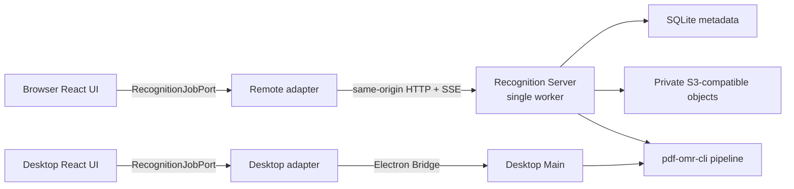

# Web Remote PDF 识谱产品 Spec

## 定位与现状证据

本 Spec 定义一个单租户、自托管的 Remote Recognition Service，使 Browser 页面可以上传 PDF 或单页图片、
排队运行现有 PDF OMR pipeline、恢复历史任务、预览并下载 validated MXL。它描述目标行为，不代表该能力已经
实现，也不改变 PDF/image 不能进入 Sheet Library 的当前边界。当前已验证行为以
[`Browser Remote PDF 识谱`](../features/contracts/remote-pdf-omr-service.md) Feature Contract 为准。

Desktop 行为仍由
[`Desktop PDF 识谱实验工作台`](../features/contracts/desktop-pdf-omr-workbench.md) 约束；运行时代码和两个 Current
Feature Contract 优先于本 Spec。

- **实际体验**：2026-08-16 在 Browser Demo `http://127.0.0.1:5173/#/library` 走查当前产品，使用已有
  IndexedDB 数据（2 份 MusicXML 曲谱）和默认桌面视口。主导航只有“首页 / 曲谱库”，没有 PDF 识谱入口；
  直接访问 `#/pdf-omr` 显示“页面不存在”，且当前 Library 文案仍声明文件本地读取、不上传。
- **仓库事实**：共享 React 已有 capability-gated `PdfOmrPage` 和 `PdfOmrWorkbenchPort`；Desktop Renderer
  通过版本化 Bridge 调用 Main。`web-core` 已验证 snapshot、progress、result 与 semantic error schema，
  `pdf-omr-cli` 已提供 programmatic pipeline、结构化 progress、取消和 canonical MXL result。当前 port 混合了
  核心 job lifecycle、宿主文件选择/保存和 Desktop-only MIDI correction；当前 Main 只保存一个 session-scoped
  active job，不提供队列或历史。
- **证据限制**：Browser journey 不能验证尚不存在的 Server、S3-compatible 实现或真实外部 engine；这些风险
  由 Feasibility Gate 约束。现有 Desktop E2E 仍只是本地 Bridge 行为证据。

## 用户问题与范围

- **目标用户与场景**：获准访问同一个自托管 Zupulse 实例的研究者或开发者，希望从普通 Browser 使用服务端
  已配置的识谱 engine，并在关闭页面或 Server 重启后继续查看任务与结果。
- **目标结果**：用户可以上传一份 PDF、PNG 或 JPEG，看到真实排队与识别状态，取消或重试任务，查看 30 天内
  的共享历史，并预览或下载校验通过的 MXL。
- **Non-goals**：公网多租户 SaaS、Zupulse 账号、用户级历史隔离、横向扩容、多 worker、优先级队列、批量
  上传、Web engine 配置、MIDI correction、任务分享、永久归档、Library 自动导入、移动端和 iPad。
- **Assumptions**：实例由受信任 operator 管理；反向代理负责 TLS 和访问控制；所有获准访问者共享同一历史；
  Server 以单实例运行，并能访问一份 SQLite 文件、一个 private S3-compatible bucket 和已安装的 engine 资源。

## 方案

### 部署与能力发现



- Browser 与 API 必须处于同一 origin。部署层把 `/api/recognition/v1/*` 转发到 Recognition Server；首版不提供
  CORS，也不支持 Browser 配置任意 endpoint。
- Browser 启动时读取 `GET /api/recognition/v1/capabilities`。只有响应通过共享 schema 校验时，才声明
  `pdfOmrWorkbench` 与 `pdfOmrHistory` 并显示“PDF 识谱”入口。普通 Browser Demo 在没有该 API 时保持当前
  行为。
- Server 默认只监听 loopback；operator 显式改变 bind address 才可直接监听网络接口。S3 credentials、engine
  executable/model/repository paths 和原始诊断永不发送到 Browser。
- Server 启动必须验证 SQLite、bucket read/write/delete 和至少一个 engine 的 canonical preflight。SQLite 或
  object storage 不可用时 Server fail fast；单个 engine 不可用只进入 capability summary。

### 用户流程

1. Browser 用户从主导航进入 `#/pdf-omr`，看到按最近活动时间倒序的实例级共享历史，以及唯一主操作“新建识别”。
   列表首次加载 20 项，以 opaque cursor 继续加载；首版不提供搜索、筛选或批量操作。
2. 用户进入 `#/pdf-omr/new`，选择一份 `.pdf`、`.png`、`.jpg` 或 `.jpeg`，再选择当前可用 engine。
   “开始识别”以单个 `multipart/form-data` request 把文件交给 Server；Browser 不直接连接 object storage。
3. Server 在 request boundary 校验媒体类型、magic bytes、文件大小和 engine ID，把输入写入 private bucket，持久化
   Job 与首个 Attempt，最后把 Attempt 原子切换为 `queued`。只有进入 `queued` 后 HTTP request 才算成功。
4. 页面转到 `#/pdf-omr/:jobId`。`queued` 只显示“排队中”，不伪造队列位置或 ETA；全实例唯一 worker 按 Attempt
   创建时间和 ID 的稳定 FIFO 顺序取下一项。
5. worker 把输入下载到 job-scoped 临时目录，重新 preflight engine，捕获不可变 registry snapshot，并运行现有
   `inspect → recognize → validate → export` pipeline。页面只显示 typed stage 和 engine 提供的 page/system counter。
6. Server 先把 validated MXL 和 bounded result manifest 写入 object storage，再在 SQLite transaction 中发布
   `succeeded`。Browser 才能读取结果、使用现有 transient score runtime 预览并下载 MXL。
7. 用户可以取消 `queued` 或 `running` Attempt。取消 queued Attempt 不启动 engine；取消 running Attempt 通过
   `AbortSignal` 终止 runtime，最终状态为 `cancelled`。
8. `failed`、`cancelled` 或 `interrupted` Job 可重试。retry 复用原 input object，在同一 Job 下新增 Attempt；旧
   Attempt 保留为历史证据，最新 Attempt 决定 Job 当前状态。retry 可以重新选择当前可用 engine。
9. 用户可以删除 terminal Job。确认后 Job 进入 `deleting`，详情与下载立即禁用；Server 删除全部 objects 后才删除
   SQLite rows。删除失败由 reconciliation 重试，不能提前显示删除成功。

### 重启、保留与故障恢复

- SQLite 持有 Job、Attempt、当前 snapshot、安全错误摘要、object keys、hash 和时间；bucket 只持有原始输入、
  validated MXL 与 bounded result manifest。不得保存 engine 临时目录、渲染页、stdout/stderr 或模型中间产物。
- Server 启动 transaction 把遗留的 `running` / `cancelling` Attempt 标记为 `interrupted`；已存在的 `queued`
  Attempt 保持 FIFO 顺序并继续运行。首版不从 pipeline 中间 stage 续跑。
- 上传采用 `uploading` internal state：SQLite row 先存在，object put 成功后才能进入 `queued`。异常退出留下的
  `uploading` row 与 object 由 reconciliation 清理。
- pipeline 成功不等于产品成功。MXL 和 manifest 都成功写入 bucket、hash 回读一致且 SQLite publish transaction
  成功后，Attempt 才能进入 `succeeded`；否则进入 `failed`，并返回 `RESULT_PERSIST_FAILED` 或
  `RESULT_INTEGRITY_FAILED`。
- retention 固定为 30 天。到期 Job 使用与手动删除相同的 `deleting` 流程。历史 UI
  显示 `expiresAt`，首版不允许页面延长保留期。
- 本地 attempt temp directory 在 terminal publish 后清理；启动 reconciliation 清理没有 active Attempt 引用的
  过期临时目录和超过 grace period 的无引用 objects。

### UI / UX

- Browser `#/pdf-omr` 是历史列表；`#/pdf-omr/new` 和 `#/pdf-omr/:jobId` 复用现有高密度工作台。Desktop 没有
  `pdfOmrHistory` capability，继续让 `#/pdf-omr` 直接打开当前临时工作台，不增加历史页面。
- 历史行显示文件名、输入类型、最新 Attempt 状态、engine、创建/完成时间和 Attempt 数；不得显示 object key、
  bucket、Server 路径或原始异常。文件名属于用户内容，不翻译。
- 历史空态的唯一主操作是“新建识别”。详情页中 `queued/running` 的主操作是“取消”，terminal failure 的主操作是
  “重试”，`succeeded` 的主操作是“下载 MXL”；删除始终是低频 destructive action。
- `queued`、`interrupted`、`deleting` 必须以文本和结构表达，不仅依赖颜色。SSE 断开时页面显示“正在重新连接”，
  保留最后一份已验证 snapshot，并以 bounded backoff 重连；重连后的第一条消息必须是当前完整 snapshot。
- 刷新 detail route 必须从 Server 恢复 Job 与 Attempts。浏览历史不把 Job 复制进 IndexedDB，不创建 Library
  Score、Managed Score Copy、Practice Sidecar、resume 或 Harmony Analysis Document。
- 结果预览仍是 transient session。下载使用 Browser 原生 download；Server 提供安全 filename 与
  `Content-Disposition: attachment`，不使用 object storage public URL。
- 宽屏、`620–899px` 和 `<620px` 延续当前工作台响应式层级。历史页只有一个 document scroll；详情页只有一个
  evidence/score 主 scroll。键盘、焦点恢复、Light/Dark 和 reduced-motion 遵循当前 Desktop workbench 契约。

### 状态

| State         | Visible behavior                         | Available actions    | Recovery / exit                 |
| ------------- | ---------------------------------------- | -------------------- | ------------------------------- |
| `uploading`   | 本地文件摘要与上传中状态，不进入历史列表 | 取消 Browser request | 失败后仍停留在新建页            |
| `queued`      | 排队中，无位置和 ETA                     | 取消                 | worker 领取或取消               |
| `running`     | typed stage 与可选真实 counter           | 取消、查看已提交事实 | SSE 重连或 terminal             |
| `cancelling`  | 保留 snapshot，防止重复操作              | 无                   | runtime 结束后进入 `cancelled`  |
| `cancelled`   | 保留 Attempt 与输入                      | 重试、删除           | 新 Attempt 或 `deleting`        |
| `failed`      | semantic error 和失败 stage              | 重试、删除           | 新 Attempt 或 `deleting`        |
| `interrupted` | Server 重启中断，不伪装为用户取消        | 重试、删除           | 新 Attempt 或 `deleting`        |
| `succeeded`   | validated MXL 摘要、预览和下载           | 下载、重试、删除     | 保留至到期或 `deleting`         |
| `deleting`    | 内容与下载禁用，删除进行中               | 无                   | reconciliation 完成后从历史移除 |

`Job.status` MUST equal the latest Attempt status, except that Job-level `deleting` overrides every Attempt status.
`ready` remains local pre-submit UI state and MUST NOT be persisted as a Job status.

## 共享 interface 与协议

### Port 边界

现有 `PdfOmrWorkbenchPort` 应收窄为宿主无关的 `RecognitionJobPort`。React 页面只消费该 interface；Desktop
adapter 映射 Electron Bridge，Browser adapter 映射 HTTP/SSE。文件 token 仍是 adapter-scoped opaque reference：
Desktop 指向 Main one-time token，Browser 指向当前页面内存中的 `File`，两者都不得被 Server 当作 object key。

```ts
export interface RecognitionJobPort {
  readonly engines: readonly RecognitionEngineOption[];
  select(): Promise<RecognitionInputSelection>;
  start(inputRef: string, engineId: string): Promise<{ jobId: string; snapshot: RecognitionJobSnapshot }>;
  retry(jobId: string, engineId: string): Promise<{ jobId: string; snapshot: RecognitionJobSnapshot }>;
  cancel(jobId: string): Promise<void>;
  getSnapshot(): Promise<RecognitionJobSnapshot | null>;
  readResult(jobId: string): Promise<RecognitionResult | null>;
  exportResult(jobId: string): Promise<"saved" | "cancelled">;
  subscribe(listener: (snapshot: RecognitionJobSnapshot) => void): () => void;
}

export interface RecognitionHistoryPort {
  list(input: { cursor?: string; limit: number }): Promise<RecognitionJobPage>;
  create(): RecognitionJobPort;
  open(jobId: string): RecognitionJobPort;
  delete(jobId: string): Promise<void>;
}
```

- `RecognitionHistoryPort` 只在 Browser Remote capability 存在时注入；Desktop 暂不实现。
- Desktop-only MIDI correction 从核心 port 移入独立的 optional `PdfOmrMidiCorrectionPort`；本 Spec 不改变其
  当前行为，也不为 Remote adapter 实现占位方法。
- Job/snapshot/progress/result/engine/error Zod schema 从 Bridge envelope 中提取为 `web-core` 的宿主无关
  recognition schema；Electron Bridge 与 HTTP 分别组合自己的 envelope。不得为了 wire-identical 把
  `bridgeVersion` 或 Electron `correlationId` 暴露成 HTTP contract。
- `web-core` 只拥有 DTO、schema 与 semantic codes，不依赖 Node、React、Browser、Electron、SQLite 或 S3。

### HTTP + SSE v1

| Method   | Path                                      | Contract                                       |
| -------- | ----------------------------------------- | ---------------------------------------------- |
| `GET`    | `/api/recognition/v1/capabilities`        | engine summaries and API schema version        |
| `POST`   | `/api/recognition/v1/jobs`                | multipart `input` + `engineId`; create Job     |
| `GET`    | `/api/recognition/v1/jobs`                | cursor-paginated shared history                |
| `GET`    | `/api/recognition/v1/jobs/:jobId`         | Job, Attempts and latest snapshot              |
| `GET`    | `/api/recognition/v1/jobs/:jobId/events`  | SSE; current snapshot first, then live updates |
| `POST`   | `/api/recognition/v1/jobs/:jobId/cancel`  | cancel latest queued/running Attempt           |
| `POST`   | `/api/recognition/v1/jobs/:jobId/retries` | create queued Attempt with `engineId`          |
| `GET`    | `/api/recognition/v1/jobs/:jobId/result`  | validated MXL bytes only                       |
| `DELETE` | `/api/recognition/v1/jobs/:jobId`         | begin terminal Job deletion                    |

- 所有 JSON response 和 SSE data 必须通过共享 Zod schema；未知字段拒绝。API schema version 使用 URL major
  version，payload 继续保留 recognition schema version。
- SSE `id` 使用 Attempt-local monotonic sequence。每次连接先发送完整 `snapshot` event，再发送 live progress；
  v1 不持久化或重放完整 event log，snapshot 是断线恢复事实源。
- list cursor 必须 opaque、稳定且有界；默认 `limit=20`，最大 100。API 不接受排序表达式、任意 object key 或
  Server path。
- mutation request 必须验证 same-origin `Origin`，Server 不返回 CORS headers。POST/DELETE 只接受预期
  `Content-Type`；所有 ID 使用 Server 生成 UUID。
- upload 上限与 Desktop 对齐为 64 MiB。Server 必须在解析 multipart 时实施 byte limit，不能先无限制缓存完整
  body；不得手写 multipart parser。
- result response 必须包含 `Content-Type: application/vnd.recordare.musicxml`、安全的 attachment filename 和以
  `outputSha256` 构造的 ETag。Server 在返回前验证 object length/hash；bucket 永不公开。

统一错误 envelope：

```ts
type RecognitionApiError = {
  error: {
    code:
      | "INVALID_REQUEST"
      | "FILE_TOO_LARGE"
      | "UNSUPPORTED_INPUT"
      | "ENGINE_UNAVAILABLE"
      | "JOB_NOT_FOUND"
      | "JOB_NOT_CANCELLABLE"
      | "JOB_NOT_RETRYABLE"
      | "JOB_DELETING"
      | "STORAGE_UNAVAILABLE"
      | "RESULT_PERSIST_FAILED"
      | "RESULT_INTEGRITY_FAILED";
    recoverable: boolean;
  };
};
```

Pipeline 已有 semantic codes 保持原值；API boundary code 只描述 transport、persistence 与 lifecycle failure。
response 不得包含 raw exception、stack、stderr、credentials、absolute path 或 object key。

## 产品与工程约束

- `apps/recognition-server` owns HTTP/SSE, SQLite Job/Attempt metadata, FIFO scheduling, S3-compatible object
  lifecycle, reconciliation and job-scoped temp directories.
- `tools/pdf-omr-cli` remains the sole owner of inspection, recognition, normalization, validation, canonical
  artifacts and engine execution. Server MUST call its programmatic API and MUST NOT invoke workspace `pnpm`.
- Recognition Server MUST run exactly one worker in v1. Horizontal replicas, distributed locks, Postgres, Redis,
  message brokers and presigned uploads MUST NOT be added.
- SQLite and S3 cannot share a transaction. Upload, result publish and deletion MUST use explicit transitional
  states plus idempotent reconciliation; a partial cross-store operation MUST NOT become visible as complete.
- Job input object MUST be immutable after `queued`. Every retry MUST reuse and revalidate the same input hash.
- Engine configuration is operator-owned Server configuration. Browser MUST NOT read or write executable, model,
  repository, converter or credential settings.
- Recognition result remains transient product output even though Server retains it for history. It MUST NOT
  mutate Library, Managed Score Copy, practice, resume or Harmony Analysis data.
- System copy belongs to `@zupulse/app-i18n`; shared runtime returns semantic codes and safe context only.
- A new dependency is justified only for standards-compliant streaming multipart or S3 protocol support. SQLite
  MUST use the available `node:sqlite` platform API; no ORM or additional queue framework is required.

## Feasibility Gate

### Gate A — S3-compatible persistence and reconciliation

- **Question**: Can one implementation safely publish, hash-verify and delete the required objects across AWS S3,
  MinIO and R2-compatible endpoints without assuming provider-specific ETag semantics?
- **Fixtures / platforms**: one PDF, one PNG, one 64 MiB boundary input, simulated put/get/delete failure and process
  termination between every SQLite/object transition; local MinIO is the automated conformance target.
- **Pass evidence**: no `succeeded` result before verified object publish; startup reconciliation reaches a stable
  state; no referenced object is deleted; stale uploading/deleting records converge without manual repair.
- **Fallback**: if compatible endpoints cannot meet one contract, narrow the documented supported endpoint set.
  Do not add a provider plugin system.

### Gate B — Persistent FIFO worker and engine runtime

- **Question**: Can the existing programmatic pipeline run repeatedly in a long-lived single worker, cancel its
  process tree and release engine resources between Attempts?
- **Fixtures / platforms**: queued fake engines for success, failure, cancellation and slow execution; one configured
  real engine; process restart while queued/running/cancelling.
- **Pass evidence**: strict FIFO start order, at most one active pipeline, queued work survives restart, active work
  becomes `interrupted`, retry reuses the immutable input hash, and no orphan process or temp directory remains.
- **Fallback**: keep the Remote capability disabled for any engine that cannot satisfy isolation and cancellation;
  do not run it concurrently or report synthetic completion.

### Gate C — Browser reconnect and result integrity

- **Question**: Can the Browser adapter preserve the current workbench semantics through HTTP/SSE, refresh and
  transient MXL preview without IndexedDB or Library mutation?
- **Fixtures / platforms**: desktop and `390 × 844` Chromium; queued/running/succeeded/failed/interrupted/deleting;
  forced SSE disconnect; missing and hash-mismatched result object.
- **Pass evidence**: refresh restores the same Job, reconnect begins with a full snapshot, duplicate SSE data is
  harmless, corrupt/missing results never mount or download, and Library facts remain unchanged.
- **Fallback**: retain history and validated download while disabling in-app preview. Do not copy the result into
  Library as a recovery mechanism.

## Acceptance Criteria

- Browser MUST expose `#/pdf-omr` only after a valid Remote capability handshake; Browser without the Service MUST
  preserve the current no-entry and not-found behavior.
- Desktop MUST continue to support its local transient workbench and MUST NOT gain persistent history in this scope.
- Browser and Desktop MUST drive the shared React job experience through `RecognitionJobPort`; Remote history MUST
  use the separate `RecognitionHistoryPort`.
- The HTTP contract and Electron Bridge MUST share strict recognition payload schemas and semantic codes, but MUST
  NOT share transport envelopes.
- Upload MUST accept exactly one PDF, PNG or JPEG up to 64 MiB, validate actual bytes at the Server boundary and
  MUST NOT expose Server paths or object keys.
- A successfully accepted upload MUST create one persistent Job and one `queued` Attempt; the single worker MUST
  execute queued Attempts in stable FIFO order with at most one active pipeline.
- Server restart MUST preserve queued Attempts and MUST mark previously running/cancelling Attempts as
  `interrupted`; it MUST NOT claim mid-stage continuation.
- Retry MUST create a new Attempt under the same Job, retain earlier Attempts and reuse the immutable stored input.
- Progress UI MUST display only persisted snapshot facts and engine-supplied typed counters; it MUST NOT show a
  synthetic queue position, percentage or ETA.
- SSE reconnect MUST begin with a full validated snapshot and MUST tolerate duplicate or skipped live events.
- An Attempt MUST NOT become `succeeded` until validated MXL and manifest are stored, read-back integrity passes and
  the SQLite publish transaction commits.
- Only integrity-verified validated MXL MUST be previewable or downloadable. Result download MUST flow through the
  Server and MUST NOT reveal or redirect to a public bucket URL.
- Manual deletion and 30-day expiry MUST enter `deleting`, remove all referenced objects and metadata, and retry
  partial deletion through reconciliation.
- Browser MUST NOT configure engines, perform MIDI correction, create Library facts or persist recognition history
  in IndexedDB.
- Mutation endpoints MUST enforce same-origin requests; Server responses and logs visible to Browser MUST NOT expose
  credentials, raw exceptions, stderr, absolute paths or object keys.
- History, new-job and detail surfaces MUST remain keyboard-operable and usable in Light, Dark, reduced-motion,
  desktop and 390px-wide layouts without horizontal overflow or duplicate primary scroll hosts.
