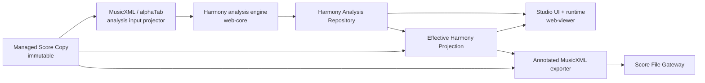

# Harmony Analysis Studio 设计规格

## 状态

- 状态：已完成产品与架构访谈，待人工评审后进入实现。
- 日期：2026-07-15。
- 关联决策：ADR 0035、0037、0043、0046、0049、0052。
- 实现边界：本文件是规格，不授权在评审前修改产品代码。

## 结论与可行性

该功能可行，适合采用“规则候选生成 + 全局序列解码 + 非和弦音修正 + 置信度拒识”的轻量混合架构。它不需要先训练端到端模型，也不需要改变现有 Managed Score Copy 不可变、Viewer 负责查看与练习的边界。

首版最主要的工程风险不是和弦模板本身，而是以下三点：

1. 在多声部、延音、经过音和反复记号存在时建立稳定的书面谱时间坐标。
2. 同时保持高叠扩展与 altered chord 的识别能力和低误报率。
3. 在不经过现有有损业务投影的前提下，把确认结果安全写入 MusicXML/MXL 副本并保留未知元素。

本规格通过独立 Harmony Analysis Document、固定置信度阈值下的 `Unresolved Harmony`、结构化和弦模型和基于原始 XML 的导出器控制这些风险。

## 目标

用户可以从一份 MusicXML Library Score 进入独立 Studio，自动获得整份谱的和弦符号分析，在谱面预览上检查和修正结果，并在确认后导出一份写有 `<harmony>` 的新 MusicXML/MXL 文件。

系统必须：

- 保持来源谱文件和 Managed Score Copy 不变。
- 保存可继续编辑的分析数据，而不是把 XML 当作编辑状态。
- 支持三和弦、七和弦、6、9、11、13，以及 `b9`、`#9`、`#11`、`b13` 等组合 alteration。
- 在证据不足时明确留空，不用错误的确定答案填满谱面。
- 让 Browser 与 Desktop 获得相同领域行为和 Studio UI。
- 与 Viewer 的练习、播放恢复和 sidecar 完全隔离。

## 非目标

首版明确不包含：

- 罗马数字、调内级数、T/S/D 或其他功能和声标注。`key` 只作为内部概率先验。
- Guitar Pro 分析或任意格式转换。Studio 首版只对 `.musicxml`、`.xml` 和 `.mxl` Library Score 开放。
- 音符、节奏、歌词、排版或来源和弦节点的通用制谱编辑。
- 在 Viewer 中消费 Studio 分析结果，或把分析发布成练习资料。
- 云同步、协作编辑、跨设备同步或跨内容版本迁移 Corrections。
- 持久化历史 Revision、版本对比或跨会话 undo/redo。
- 端到端神经网络、在线模型服务或首版机器学习重排序。
- 用户可调的分析阈值、规则权重或“风格”参数面板。

## 术语

以下术语采用 `CONTEXT.md` 与 `docs/architecture/glossary.md` 中的定义：

- **Harmony Analysis Document**：某个 Library Score 当前可编辑的分析数据层。
- **Analysis Revision**：一次完整成功分析的不可变结果及其参数快照。
- **User Correction**：用户按书面谱范围保存的显式覆盖。
- **Effective Harmony Projection**：User Corrections、来源和弦和算法结果按优先级组合出的当前视图，允许包含 unresolved 间隙。
- **Score Written Moment / Range**：不展开反复的书面谱位置与左闭右开范围。
- **Harmony Analysis Scope**：参与分析的谱轨集合。
- **Annotation Target**：新增和弦符号在预览和导出中的目标 track/staff。
- **Preview Transport**：只属于 Studio 当前会话的临时播放状态。
- **No Chord**：来源或用户明确声明的 N.C.。
- **Unresolved Harmony**：系统证据不足或来源冲突，尚不能确认和弦。

“和弦分析”在本规格中表示 chord-symbol inference，不表示 functional harmony analysis。

## 产品流程

### 进入 Studio

1. 用户从 Library 或 Viewer 导航到 `#/studio/:libraryScoreId`。
2. 应用读取 Library Score 和不可变 Managed Score Copy。
3. 非 MusicXML 格式显示明确的不支持状态，不创建空分析文档。
4. 如 Harmony Analysis Document 已存在且来源内容哈希匹配，直接加载，不静默重新分析。
5. 如文档不存在，按默认 Scope 自动启动可取消的 Harmony Analysis Job。
6. 分析成功后立即保存新的 Document；失败或取消不产生半成品 Revision。
7. 如已保存文档的算法版本落后，只提示“可重新分析”，不自动替换结果。

### 检查与编辑

用户可以：

- 在谱面或和弦时间带选择一个范围。
- 从 Top-K 候选中选择结果。
- 通过结构化字段编辑 root、kind、extension、degrees 和 bass。
- 把范围标记为 N.C.。
- 在合法候选位置拆分、合并或移动边界。
- 对某个范围执行 Reset，删除 User Correction 并重新显示下层来源/算法结果。
- 在当前 Studio 会话内 undo/redo 编辑命令。
- 选择 Analysis Scope 和 Annotation Target。
- 使用 Preview Transport 播放、暂停、定位、临时变速或循环所选和弦范围。

用户不能输入任意和弦字符串。显示文本始终从结构化数据生成。

### 重新分析

1. 用户改变 Scope 或主动执行“重新分析”。
2. 系统以当前参数快照启动后台 candidate Job，同时继续显示和编辑旧 active Revision。
3. 新的分析意图使旧 Job 取消或失效。
4. 只有最新 Job 的完整成功结果可以原子替换 active Revision。
5. 替换时重新叠加提交瞬间最新的 Corrections；Corrections 不绑定旧 segment ID。
6. 失败或取消继续保留旧 active Revision 和当前 Corrections。

### 保存与离开

- 初次分析成功立即保存。
- Corrections 和 Annotation Target 在 500 ms 无新编辑后自动保存。
- UI 明确显示 `未保存`、`保存中`、`已保存`、`保存失败` 或 `版本冲突`。
- `保存` 和 `Cmd/Ctrl+S` 立即 flush。
- 离开 Studio 前 flush；若失败，阻止无提示离开并允许重试或放弃本次未保存更改。
- undo/redo 只存在于当前会话，保存不会创建持久化历史版本。

### 导出

1. 用户选择“导出带和弦的副本”。
2. Studio 固化当前 Effective Harmony Projection 快照。
3. 未保存更改必须先保存成功；版本冲突必须先解决。
4. 导出器从原始 Managed Score Copy 生成新字节，不从渲染模型反向序列化。
5. Score File Gateway 请求保存位置。
6. 默认文件名为原名加 `-chords`，扩展名和容器保持不变。
7. 导出不会替换、重新导入或修改当前 Library Score。

## 系统边界



所有音乐领域模型、Zod schema、分析、组合和导出规划位于 `packages/web-core`。`packages/web-viewer` 只编排端口、管理 Studio 会话和渲染 UI。Browser 通过 IndexedDB 实现 Repository，Desktop Renderer 通过严格 Bridge 调用 Main 中的 SQLite 实现。

不得把可变 alphaTab 对象、DOM 节点、绝对路径或一次性文件 token 保存到分析文档或通过 UI 状态传播。

## 领域模型

以下 TypeScript 只表达规范形状；实现必须以 Zod schema 为跨进程与持久化事实源，并从 schema 推导类型。

```ts
type SpelledPitch = {
  step: "A" | "B" | "C" | "D" | "E" | "F" | "G";
  alter: -2 | -1 | 0 | 1 | 2;
};

type ChordKind =
  | "major"
  | "minor"
  | "dominant"
  | "diminished"
  | "half-diminished"
  | "augmented"
  | "suspended-second"
  | "suspended-fourth"
  | "power";

type ChordExtension = 6 | 7 | 9 | 11 | 13;

type ChordDegree = {
  operation: "add" | "alter" | "subtract";
  value: 2 | 3 | 4 | 5 | 6 | 7 | 9 | 11 | 13;
  alter: -2 | -1 | 0 | 1 | 2;
};

type ChordSymbol = {
  root: SpelledPitch;
  kind: ChordKind;
  extension?: ChordExtension;
  degrees: ChordDegree[];
  bass?: SpelledPitch;
};

type ScoreWrittenMoment = {
  measureIndex: number;
  offsetTicks: number;
};

type ScoreWrittenRange = {
  start: ScoreWrittenMoment;
  end: ScoreWrittenMoment;
};

type HarmonyCandidate = {
  chord: ChordSymbol;
  localScore: number;
  sequenceScore: number;
  confidence: number;
};

type HarmonySegment =
  | {
      status: "resolved";
      range: ScoreWrittenRange;
      chord: ChordSymbol;
      confidence: number;
      alternatives: HarmonyCandidate[];
    }
  | {
      status: "unresolved";
      range: ScoreWrittenRange;
      reason: "low-confidence" | "microtonal" | "unsupported-time";
      alternatives: HarmonyCandidate[];
    };

type HarmonyAnalysisScope = {
  includedTrackIds: string[];
};

type HarmonyAnalysisParameters = {
  scope: HarmonyAnalysisScope;
  topK: number;
  decisionThreshold: number;
};

type AnalysisRevision = {
  id: string;
  algorithmVersion: string;
  createdAt: string;
  parameters: HarmonyAnalysisParameters;
  segments: HarmonySegment[];
};

type HarmonyCorrection = {
  id: string;
  range: ScoreWrittenRange;
  value: { type: "chord"; chord: ChordSymbol } | { type: "no-chord" };
  updatedAt: string;
};

type AnnotationTarget = {
  trackId: string;
  staffIndex: number;
};

type EffectiveHarmonyEntry =
  | {
      type: "chord";
      range: ScoreWrittenRange;
      chord: ChordSymbol;
      origin: "correction" | "source" | "analysis";
    }
  | {
      type: "no-chord";
      range: ScoreWrittenRange;
      origin: "correction" | "source";
    }
  | {
      type: "unresolved";
      range: ScoreWrittenRange;
      reason: "low-confidence" | "source-conflict" | "unsupported-source-harmony" | "microtonal" | "unsupported-time";
      alternatives: HarmonyCandidate[];
    };

type HarmonyAnalysisDocument = {
  schemaVersion: "1.0.0";
  libraryScoreId: string;
  sourceContentHash: string;
  documentVersion: number;
  activeRevision: AnalysisRevision;
  corrections: HarmonyCorrection[];
  annotationTarget: AnnotationTarget;
  updatedAt: string;
};
```

在 `exactOptionalPropertyTypes` 下，可选属性缺失时必须省略，禁止写成 `undefined`。

### 模型约束

- `ScoreWrittenRange` 左闭右开，`start < end`，同一 Document 中统一按书面谱顺序比较。
- `offsetTicks` 使用 `web-core` 定义的 canonical written-time tick；只能取输入投影产生的 legal moment，不能由 UI 任意构造。
- legal moment 必须能够无歧义映射回来源 MusicXML 的精确 measure offset。不能精确 round-trip 的位置不得成为编辑或导出边界。
- `extension=9/11/13` 表示完整高叠扩展语义，不等同于 `add9/add11/add13`。未出现的内部音可在模板评分中作为可省略音处理，结构语义不降级。
- alteration 用 `ChordDegree` 表示，例如 `C7(b9,#11,b13)` 是 dominant + 7 + 三个 `alter` degree，不创建组合字符串枚举。
- slash bass 只有在 bass 与 root 不同且有足够证据时生成；同音 bass 省略。
- `No Chord` 不属于 `ChordSymbol`，避免 N.C. 与 unresolved 混淆。
- `AnalysisRevision` 完成后不可变。重新分析创建新对象并替换 active Revision。
- Corrections 持久化为已规范化、不重叠的范围。后写入的编辑先切分已有 correction，再替换目标范围。
- `documentVersion` 用于 Repository compare-and-swap，避免 Browser 多标签页或 Desktop 多窗口静默覆盖。
- Scope 至少包含一条存在于来源中的有音高非打击乐 track；Annotation Target 必须指向来源中存在且可承载 harmony 的 track/staff，但不要求属于当前 Scope。
- Moment、Range、Scope 和 Annotation Target 在读入、保存与导出前都相对当前来源投影做引用完整性校验。

### 和弦结构合法性

Zod refinement 至少约束：

- `dominant` 必须带 7、9、11 或 13 extension。
- `half-diminished` 首版只允许 7 extension。
- `power` 不带 6/7/9/11/13 extension。
- 同一 degree 不允许重复或互相矛盾的 operation。
- degree 按 `value`、`operation`、`alter` 规范排序，以获得稳定序列化和等值比较。
- `alter` 的 `value` 必须属于当前基础和弦或扩展栈；额外色彩音使用 `add`。

## 来源和弦与 Effective Harmony Projection

来源 `<harmony>` 直接从不可变原始 XML 提取，不复制成可编辑的持久化事实。每次打开 Studio 和导出时都以来源字节重新得到 `Source Harmony Event`，并校验其内容哈希与 Document 一致。

组合优先级固定为：

```text
User Correction > Source Harmony > Analysis Revision
```

具体规则：

1. User Correction 覆盖相交范围内的来源与算法结果。
2. 来源和弦默认是权威锚点，算法只填补来源没有定义的范围。
3. 来源和弦是 point event；投影范围延续到下一来源事件、显式 N.C. 或谱尾，并受同位置事件约束。
4. 同一时刻完全等价的多个来源符号去重，但保留所有原始地址供导出。
5. 同一范围存在不可等价的来源符号时生成 `source-conflict` unresolved；算法不得自行覆盖，用户可以用 Correction 解决。
6. 无法映射到首版 ChordSymbol 结构的来源 `<harmony>` 生成 `unsupported-source-harmony`；它仍是来源拥有的范围，原节点在导出中保持不变，算法不得填补，用户可以用 Correction 覆盖。
7. Revision 低于固定阈值的 segment 保持 unresolved。
8. Effective Projection 可以含 unresolved 间隙，因此不得再称为 Resolved Projection。
9. 导出只写 resolved chord、来源/用户 N.C. 和已有来源 harmony；未被用户确认的算法 unresolved 不写入。

选择 unresolved 的某个候选会创建 User Correction；它不是“修改算法置信度”。

## 分析输入

现有 `ScoreDocument` 投影不足以支持分析，因为它没有保留完整 staff/measure/note 时间信息。实现应新增一个窄的 `HarmonyAnalysisInput` projector，而不是扩张 UI 使用的 ScoreDocument。

输入至少包含：

- 稳定的 track/staff/voice 身份与名称。
- measure 顺序、拍号、调号和 canonical written-time 映射。
- note-on、note-off、sounding pitch class、written spelling、velocity/重音近似、tie、grace 与 ornament 标记。
- 每个 legal moment 对来源 MusicXML measure/divisions 的精确映射。
- 每个 track 是否有音高、是否 percussion。
- 来源 harmony event 与原始 part/staff 地址。

默认 Scope 包含所有有音高且非 percussion 的 tracks。用户的选择保存在 Revision 参数中；修改 Scope 触发新 Revision。输出仍是 score-global harmony，不为每条 track 分别生成结果。

### 规范化

- 合并 tie chain 的持续权重，避免每个连音重复触发边界。
- grace note 默认只提供装饰证据，不独立创建边界。
- percussion 不参与 pitch-class 聚合。
- written spelling 与 sounding pitch class 分开保存；移调乐器按 sounding pitch 分析，按当前谱调号和来源 spelling 选择显示拼写。
- 12-TET 是首版硬边界。包含微分音的局部范围标记 `microtonal` unresolved，不把音高四舍五入到半音。
- 反复、D.S./D.C. 和跳房子不展开；分析、修正和导出都按 written score 执行。

## 分析算法

### 总体流水线

```text
MusicXML / alphaTab projection
  -> note normalization
  -> legal boundary lattice
  -> cached weighted pitch-class features
  -> evidence-driven chord candidates
  -> segmental Viterbi / beam decode
  -> non-chord-tone correction
  -> merge and confidence calibration
  -> resolved / unresolved revision
```

分析引擎是 `web-core` 中的纯 TypeScript 函数。UI 和持久化不参与评分。输入投影完成后，计算部分在 module Worker 中执行，以保持 Studio 可交互；Worker 只接收可序列化 plain data。

### 1. 边界格

边界候选来自：

- 小节起止和谱尾。
- 拍与较强拍位置。
- note onset/off。
- bass 变化。
- 来源 harmony、调号和拍号变化。

来源 harmony、调号/拍号变化和谱尾是强制边界；其他位置按节拍强度、持续时间和事件密度剪枝。用户边界编辑也只能选择这套 legal moments。

来源 harmony 覆盖的范围作为固定 chord/N.C. state 参与前后 Transition，但不生成会被来源层遮蔽的算法 segment。分析引擎只为来源空白范围提出结果；来源冲突由 Effective Projection 标记，不写进 Analysis Revision。

首版不穷举任意 `(start,end)`。每个起点只考虑到后续有限个边界、一个合理最大持续范围内的 segment，并通过最短和弦持续时值先验抑制抖动。

### 2. 加权 pitch-class 特征

为每个边界前缀缓存特征，使任意候选区间可以通过前缀差得到：

- pitch-class overlap duration。
- onset count 与 onset strength。
- metric weight。
- bass duration 与区间起点 bass。
- voice/track coverage。
- sustained-from-previous 与 resolving-to-next 标记。

同音八度和多声部 doubling 需要封顶，避免编制大小直接支配评分。根音、三音、七音、最高扩展音和 bass 的权重分别建模。

### 3. 候选生成

候选库必须覆盖：

- major、minor、diminished、half-diminished、augmented、sus2、sus4、power。
- 6、7、9、11、13。
- add2/add4/add6/add9/add11/add13。
- inversion/slash bass。
- `b5/#5`、`b9/#9`、`#11`、`b13` 以及有证据的组合，例如 `C13(b9,#11)`。

不得对所有 root × kind × extension × alteration 做笛卡尔积枚举。流程为：

1. 从显著 pitch classes 和 bass 提出少量 root。
2. 为每个 root 生成与三度/七度证据相容的基础 kind。
3. 只有区间内存在相应 pitch-class、持续/重音证据时才附加 9/11/13 或 alteration。
4. 对复杂度增加先验惩罚；复杂候选必须显著优于简单解释。
5. 每个区间保留默认 Top-8；`topK` 固定在 Revision 参数中，不由用户调整。

模板区分“必需”“重要”“可省略”和“冲突”音。例如 C13 的 root、third、seventh、thirteenth 是强证据，fifth 与内部扩展可以在真实配器中省略；但仅有 C–E–Bb 不足以提出 C13。

### 4. Local Score

Local Score 至少组合：

- required/important chord-tone coverage。
- non-chord tone duration 与强拍惩罚。
- root 与 bass 支持。
- onset、metric 和 sustained-note 上下文。
- spelling/key prior。
- chord complexity prior。
- segment duration/boundary prior。

权重是带版本的算法常量，不进入 UI。调号只影响拼写和小幅先验，不能禁止离调和弦。

### 5. 全局解码

使用 segmental Viterbi；当单个位置的候选组合过大时对前态做固定宽度 beam 剪枝：

```text
V[j, c] = max over i,c' (
  V[i, c']
  + LocalScore(i, j, c)
  + Transition(c', c, keyContext)
  + BoundaryPrior(i, j)
)
```

Transition 首版使用可测试的人工规则：

- 同和弦延续奖励。
- 五度根音运动奖励。
- 常见 ii -> V、V -> I 声部/根音趋势奖励。
- 共同音和近距离 bass 运动小幅奖励。
- 无证据的色彩复杂度跃迁惩罚。

这些规则只能帮助消歧，不能输出 Roman numeral 或覆盖强烈局部证据。

### 6. 非和弦音修正

首轮路径产生上下文后，对以下音型降低冲突惩罚并重算受影响窗口：

- 弱拍经过音与邻音。
- 短倚音。
- 挂留与延迟解决。
- anticipation。
- 短时 pedal tone。

只进行一次局部二次解码，避免迭代到不可预测。典型 `C | Cadd9 | C` 中短弱拍 D 应合并为持续 C；强拍且持续的 D 仍可支持 add9/9 候选。

### 7. 合并与置信度

- 相邻结构化和弦完全相同则合并。
- 若中间短 segment 只由已识别的非和弦音造成，合并到两侧共同和弦。
- 不跨来源 harmony、Correction、强制 meter/key boundary 合并。
- 置信度综合最终路径与次优路径 margin、局部候选 margin 和边界稳定性，经离线标注语料校准到 `[0,1]`。
- Revision 中保存算法版本对应的固定 `decisionThreshold`。低于阈值输出 unresolved，而不是自动 N.C.。

### 后续机器学习边界

未来可以用轻量 ranking model 重排规则候选，但不得改变领域契约。模型输入可以是当前候选、局部音符特征、前后候选、key、beat 和 bass，输出附加 candidate score。只有规则基线在固定语料上稳定、且有足够授权标注数据后才进入该阶段。

## 拼写与显示

- root 和 bass 以 `SpelledPitch` 保存，不只保存 pitch class。
- 算法同时计算 sound score 与 notation score；前者决定和声匹配，后者根据调号、来源拼写和邻近和弦选择 `C#`/`Db` 等表示。
- 用户可以在结构化编辑器中 respell 等音根音或 bass；该操作创建 Correction，不改变 sounding chord。
- 显示格式由一个共享 formatter 生成，候选列表、谱面叠加和导出测试使用同一结构数据，不以 formatter 文本作为身份。

## Studio UI

### 路由与会话

```text
/#/viewer/:libraryScoreId    Viewer：查看与练习
/#/studio/:libraryScoreId    Studio：分析、修正、预览与导出
```

Viewer 与 Studio 可以读取同一 Managed Score Copy，但各自拥有独立、可销毁的 alphaTab/runtime session。任何时刻应用只保留当前 route 所需的重型 runtime；切换工作区先 flush 并销毁旧 runtime，再创建新 runtime。

现有 `ViewerApplication` 在实现时演进为能够表达 workspace kind 的应用服务；snapshot 至少以 `{ kind: "viewer" | "studio", libraryScoreId }` 区分当前工作区，禁止继续用单个 `hasSession` 隐含两类 session。

### 页面结构

Studio 采用三块紧凑工作区：

1. 顶部工具带：返回、分析状态、Scope、重新分析/取消、undo/redo、保存状态、导出。
2. 中央谱面：alphaTab 预览、当前位置、结构化和弦叠加和 unresolved 标记。
3. 侧栏/底部检查器：范围、候选、置信度、root/kind/extension/degrees/bass、N.C.、Reset、边界操作。

桌面宽屏使用谱面 + 检查器双栏；窄屏检查器落到谱面下方，不引入嵌套 modal 编辑器。所有选择、菜单、字段和状态满足现有键盘与可访问性约束；不能只用颜色表达 confidence 或 unresolved。

### 谱面叠加

- Studio 从 Effective Harmony Projection 构造纯展示 overlay，不修改 Managed Score Copy 或共享 ScoreDocument。
- 默认 Annotation Target 是第一条有音高、非 percussion track 的上方 staff。
- 用户可选择其他 track/staff；该设置不触发重新分析。
- 来源 harmony 保持原 part/staff 地址；新增算法/Correction harmony 使用 Annotation Target。
- 预览与导出使用同一 projection 和 target 选择。
- 如果 alphaTab 不能在某个 legal moment 原生表现 chord symbol，UI 使用独立的绝对定位 overlay/和弦时间带；不得为了渲染方便静默移动边界。

### Preview Transport

Preview Transport 支持 play/pause/seek、临时 speed 和循环所选 range。它完全是 Studio 会话状态：

- 不读取或写入 Practice Sidecar。
- 不读取或写入 Local Playback Resume。
- 不更新 last practiced、练习摘要或 Viewer loop。
- 离开 Studio 即丢弃。

### 页面状态

必须显式覆盖：

- 首次自动分析、取消、失败和重试。
- 后台重新分析但旧结果仍可编辑。
- 无 active Revision 的空状态。
- 当前结果、算法升级提示和 Scope 摘要。
- 未保存、保存中、已保存、保存失败和 CAS 冲突。
- 来源 harmony conflict。
- microtonal/unsupported-time 范围。
- Managed Score Copy 缺失、损坏或内容哈希不匹配。
- 导出中、导出取消和导出失败。

## Harmony Analysis Job 与并发

Job 是临时运行时对象，不持久化。它包含 monotonically increasing intent id、取消信号、输入哈希、参数快照和进度。规则为：

- 同一 Studio 会话只有最新 intent 有提交资格。
- 新 Scope、重新分析或关闭 Studio 都取消旧 Job；无法物理中止时也必须使其结果失效。
- Job 不直接写 Repository。应用服务先验证 intent、来源哈希和当前文档版本，再构造候选 Document。
- active Revision 的替换与 Document 保存是一个原子写入。
- Job 完成时读取最新 Corrections，而不是启动时副本。
- 用户在分析期间的 correction 保存与 Job 提交经过同一串行写队列，避免进程内丢失更新。

Browser 多标签页和 Desktop 多窗口使用 `documentVersion` compare-and-swap。冲突时停止自动覆盖、保留本地草稿并提示重新加载；首版不自动合并两份并发 correction 集合。

## 持久化契约

### 领域端口

`web-core` 新增独立端口，不把分析方法塞入 `SheetLibraryRepository`：

```ts
interface HarmonyAnalysisRepository {
  read(libraryScoreId: string): Promise<HarmonyAnalysisDocument | null>;
  save(input: {
    document: HarmonyAnalysisDocument;
    expectedDocumentVersion: number | null;
  }): Promise<
    | { status: "saved"; document: HarmonyAnalysisDocument }
    | { status: "conflict"; current: HarmonyAnalysisDocument | null }
  >;
}
```

`save` 必须验证 Library Score 存在且 `sourceContentHash` 等于 Score Identity。Library Score 删除由宿主在同一删除事务/恢复协议中清理分析文档，禁止删除后通过 autosave 重建孤儿数据。

### Browser

IndexedDB database 从 version 1 升级到 version 2，新增：

```text
harmony_analyses    key: libraryScoreId
```

- 保存 payload 前后都经共享 Zod schema 校验。
- `documentVersion` 在同一 readwrite transaction 内比较并递增。
- 删除 Library Score 的现有事务加入 `harmony_analyses`。
- 升级是 additive migration；失败不得删除或重建旧 database。
- 不新增 OPFS、BroadcastChannel 或额外状态库。

### Desktop

SQLite `library_schema` 从 version 1 顺序迁移到 version 2，新增概念表：

```sql
CREATE TABLE library_harmony_analyses (
  library_score_id TEXT PRIMARY KEY,
  document_version INTEGER NOT NULL,
  payload_json TEXT NOT NULL,
  updated_at TEXT NOT NULL,
  FOREIGN KEY (library_score_id) REFERENCES library_scores(id)
);
```

- Main 在事务中验证 score 存在、内容哈希和 expected version。
- 删除 Library Score 的事务显式删除该行；不得只依赖未启用或行为不一致的 SQLite cascade。
- migration failure 沿用现有阻塞且不重建策略。
- Renderer 不获得 SQLite、托管文件路径或绝对路径。

### Desktop Bridge

Bridge 增加严格、exact 的 request/response：

- `harmonyAnalysis.read`
- `harmonyAnalysis.save`
- 对应 `storage.harmonyAnalysis` capability

请求、响应、capability、Main handler、Preload API、Renderer adapter、mock 和测试必须同时增加。本变更把当前 `BRIDGE_SCHEMA_VERSION` 从 `2.0.0` 提升到 `3.0.0`；旧 Renderer/Main 组合在 handshake 失败后显示明确升级错误，不做宽松字段忽略。

## MusicXML/MXL 导出

### 总则

- `.musicxml` 导出 `.musicxml`，`.xml` 导出 `.xml`，`.mxl` 导出 `.mxl`。
- 保持来源 MusicXML version、`score-partwise`/`score-timewise` 根结构和 namespace。
- 未知元素、属性、注释和非根 MXL entries 需语义保留；不承诺字节、缩进或属性顺序完全相同。
- 实现不得从 alphaTab 或 `ScoreDocument` 重新生成整份 MusicXML。
- 为跨 Browser/Desktop 获得一致行为，XML DOM 与 ZIP 必须使用公开、直接声明的依赖；不得依赖 alphaTab 私有 ZIP API。建议最小选择是直接声明 `@xmldom/xmldom` 与 `fflate`，不引入通用制谱库。

### XML 处理

导出器接收原始字节、来源格式、Effective Projection 快照和 Annotation Target：

1. 在与导入一致的字节、节点、嵌套与解压上限内解析 XML/MXL。
2. 禁止外部实体、网络资源和任意文件访问。
3. 建立 part/staff、measure、voice cursor 与 legal moment 的可逆索引。
4. 保留没有被 Correction 覆盖的来源 `<harmony>` 节点。
5. 对被 Correction 覆盖的来源节点，在导出副本中删除/切分冲突语义并写入 correction 结果。
6. 对算法填补范围在 segment 起点写入新 `<harmony>`。
7. unresolved 不写节点；显式 N.C. 写成合法的 `kind=none` 并保留 `N.C.` 显示文本。
8. 序列化后重新解析并执行语义 round-trip 校验，再交给 Gateway。

每个新节点按 MusicXML 顺序生成 root、kind、bass 和 degree。9/11/13 优先使用对应标准 kind；alteration/add/subtract 使用一个或多个 `<degree>`，不能压缩成只有人能读的 `text`。`text` 可以作为显示兼容信息，但结构节点是事实。

对 target staff 的插入必须计算准确的 measure cursor 和 `<offset>` divisions。若一个 legal moment 不能精确表示，导出失败并指向范围，不能取整、吸附到邻近 note 或生成节奏漂移。

### MXL

- 读取 `META-INF/container.xml` 确认 rootfile，不假设固定文件名。
- 只替换 root MusicXML entry，保留 mimetype、container 和其他 entry 字节及路径。
- 拒绝 path traversal、重复冲突 entry、加密 entry、超限压缩比或超限解压总量。
- 输出新 archive 后重新打开 container/rootfile 并做 MusicXML 语义校验。

### 文件名

```text
my-score.musicxml -> my-score-chords.musicxml
my-score.xml      -> my-score-chords.xml
my-score.mxl      -> my-score-chords.mxl
```

若用户在系统保存面板改名，Gateway 采用用户选择。导出取消不改变 Document 保存状态。

## 诊断、安全与数据完整性

结构化错误至少包含：

- `unsupported-score-format`
- `source-hash-mismatch`
- `analysis-cancelled`
- `analysis-failed`
- `analysis-document-invalid`
- `analysis-save-conflict`
- `analysis-storage-unavailable`
- `microtonal-region`
- `source-harmony-conflict`
- `unsupported-source-harmony`
- `export-unrepresentable-position`
- `export-invalid-musicxml`
- `export-invalid-mxl`

错误必须携带可安全展示的 score/range 上下文，不包含绝对路径或 XML 全文。解析器、Worker 和导出器沿用导入的资源预算，并对候选数量、边界数量和 DP beam 设置硬上限，防止恶意或异常谱面造成内存/CPU 放大。

Harmony Analysis Document 是本机数据，不上传、不遥测具体音符或和弦内容。

## 性能预算

用于首版验收的“常规大谱”上限为：来源文件不超过现有 64 MiB 安全上限，最多 20 条有音高 tracks、50,000 个 note events、5,000 个 legal boundaries。超过分析预算不影响导入和 Viewer，Studio 显示明确限制。

在项目 CI 基准机器或记录型号的基准 Mac 上：

- 典型 5,000-note 乐谱首轮分析 P95 不超过 5 秒。
- cancel、新编辑、播放按钮等 UI 反馈不超过 100 ms。
- projection 变更到和弦 overlay 可见不超过 100 ms。
- Worker 进度至多每 100 ms 推送一次，避免 React 更新风暴。
- Top-K、segment 长度和 beam width 都有固定上限；不得因谱长形成无界候选矩阵。

性能门槛应通过固定 fixture benchmark 记录，不用开发者主观等待判断。

## 项目结构

遵循现有 workspace 边界，建议最小新增结构：

```text
packages/web-core/src/harmony/
  schemas.ts                 领域与持久化 Zod schema
  model.ts                   比较、排序与 formatter
  analysisInput.ts           alphaTab/MusicXML 窄投影
  sourceHarmony.ts           来源 <harmony> 解析
  analyzeHarmony.ts          流水线入口
  boundaries.ts              legal boundary lattice
  features.ts                加权 pitch-class 特征
  candidates.ts              结构化候选
  decode.ts                  segmental Viterbi / beam
  corrections.ts             range 规范化与编辑命令
  effectiveProjection.ts     三层组合
  exportMusicXmlHarmony.ts   XML/MXL 导出
  ports.ts                   HarmonyAnalysisRepository
  __tests__/

packages/web-viewer/src/features/harmony-studio/
  HarmonyStudio.tsx
  HarmonyInspector.tsx
  HarmonyOverlay.tsx
  harmonyStudioSession.ts
  harmonyAnalysis.worker.ts
  __tests__/

apps/web-demo/src/library/
  BrowserHarmonyAnalysisRepository.ts

apps/desktop-shell/src/main/library/
  DesktopHarmonyAnalysisStore.ts
```

文件可在实现中按测试驱动再拆分；不得预先创建空接口、factory、service 层或“未来模型”目录。共享公开入口从 workspace package index 导出，禁止 `@zupulse/*/src/...` 深导入。

## 代码风格与实现约束

- TypeScript strict 和 `exactOptionalPropertyTypes`。
- named exports、Prettier 双引号。
- 测试只位于 `__tests__` 或 `e2e`。
- `web-core` 不依赖 React、Browser 或 Electron。
- 所有持久化和 Bridge 输入使用 Zod `.strict()`/exact schema。
- 算法常量集中在带 `algorithmVersion` 的只读参数中；不引入运行时配置平台。
- 优先复用当前 alphaTab score runtime、Score File Gateway、Library 删除流程和错误分类。
- 不新增客户端状态库。React 局部状态与应用 service snapshot 足够承载首版。
- 不为一个实现创建抽象 factory；Repository 端口是 Browser/Desktop 两宿主差异所必需的例外。

## 测试策略

### 领域与 schema

- SpelledPitch、ChordSymbol、9/11/13 和多 alteration 的合法/非法组合。
- 稳定 formatter、规范排序和结构等值。
- ScoreWrittenRange 比较、切分、合并和半开区间边界。
- Correction 重叠替换、Reset、跨新 Revision 保留。
- User > source > revision 组合，包括来源冲突、N.C. 和 unresolved。
- Document round-trip、旧/损坏 schema 拒绝和 CAS version。

### 算法单测

使用小型合成片段分别证明：

- 三和弦、inversion、七和弦、6。
- 9、11、13 与 add9/add11/add13 的区分。
- `b9/#9/#11/b13` 单项和组合候选。
- 弱拍经过音、邻音、挂留和 anticipation 不制造短伪和弦。
- 强拍/长持续 tension 仍支持 extension 或 alteration。
- 五度进行、同和弦延续和离调跳转的 transition 行为。
- 低置信度产生 unresolved，算法从不自动产生 N.C.。
- 微分音范围不被取整。
- tie、多声部 doubling、移调乐器和书面反复。
- 取消与候选/beam 硬上限。

### 标注语料评估

建立有许可、可提交或可重复取得的分层 corpus，覆盖古典四部和声、流行键盘/吉他、爵士扩展和弦、多声部 MusicXML、含来源 harmony 与无来源 harmony。训练、调参和最终评估集合严格分开。

首版发布门槛：

- Top-8 candidate oracle recall >= 95%。
- 对系统选择为 resolved 的时长，结构化和弦 sound-label precision >= 95%。
- resolved duration coverage >= 70%；不能靠全部 unresolved 达到 precision。
- boundary F1 >= 85%，容差为一个八分音符或相邻 legal moment 中较小者。
- confidence expected calibration error <= 0.10。
- 另行报告 root、bass、kind、extension、alteration 和 enharmonic spelling 的分项准确率。

门槛不足时优先提高拒识或修正规则，不降低结构标签要求来伪造覆盖率。

### MusicXML/MXL round-trip

fixtures 至少覆盖：

- MusicXML 3.1/4.0、partwise/timewise、namespace/no namespace。
- 多 part/staff/voice、backup/forward、变化 divisions、tuplets。
- 已有 harmony、同位置重复、来源冲突和来源 N.C.。
- 来源 `kind=other` 或首版不能结构化的 degree 组合，确认保持原节点且不被算法覆盖。
- major/minor/dominant 9/11/13 与多个 `<degree>` alteration。
- comments、unknown elements/attributes、lyrics、directions、layout。
- MXL 非默认 rootfile、附加资源、压缩炸弹与 path traversal 拒绝。

验证导出后：

- 可被本项目 MusicXML adapter 重新打开。
- 音符、节奏、part/staff、歌词和反复语义与来源相同。
- 写入 harmony 与 Effective Projection 的 resolved 内容等价。
- unresolved 未写入。
- 原始 Managed Score Copy 的哈希完全不变。

### Repository contract

Browser 与 Desktop 运行同一组 HarmonyAnalysisRepository contract tests：

- absent/read/save/update。
- expected version 成功和冲突。
- 来源 hash 不匹配拒绝。
- Library Score 不存在时拒绝写入。
- 删除 Library Score 同时删除分析文档。
- 删除后 autosave 不能重建孤儿文档。
- migration failure 保留旧数据并阻止写入。

### UI 与 E2E

- 首次进入自动分析；取消不生成半成品。
- 已存在 Document 时直接加载且不静默重跑。
- 重新分析期间旧结果可见可编辑，latest-intent-wins。
- 候选选择、结构化编辑、N.C.、split/merge/move/reset、undo/redo。
- autosave 状态、Cmd/Ctrl+S、失败离开保护和 CAS 冲突。
- Annotation Target 改变预览和导出但不重新分析。
- Preview Transport 不改变 Viewer sidecar/resume/practice summary。
- Studio 刷新后从 Library Score 和 Document 重建。
- MusicXML/MXL 导出保持扩展名且不改变 Library Score。
- GP Library Score 显示不支持，不创建分析记录。
- 删除 score 后已打开 Studio 的后续保存失败且不重建数据。

## 实施与验证计划

为避免本规格同时承担领域事实与执行清单，阶段、依赖图、验证矩阵和退出门槛已拆到：

- [`tasks/plan.md`](../../../tasks/plan.md)：七阶段实施计划与验证计划。
- [`tasks/todo.md`](../../../tasks/todo.md)：25 个单会话任务、逐项验收、命令和预计修改范围。

实现必须从 Phase 0 的书面时间可逆性和 XML/MXL 增量回写关口开始；当前 phase 未通过时不得进入依赖阶段。量化产品验收仍以本规格下节为准。

## 验收标准

1. MusicXML Library Score 可通过 `#/studio/:libraryScoreId` 打开，Viewer 行为不变。
2. 首次分析自动运行且可取消；已有结果和算法升级都不会触发静默重跑。
3. 分析覆盖完整 9/11/13 以及 `b9/#9/#11/b13` 的结构化单项与组合表示。
4. 低于阈值、微分音和来源冲突显示 unresolved，不伪装成 N.C. 或确定和弦。
5. 用户可完成候选选择、结构编辑、N.C.、边界编辑和 Reset，并可靠 autosave。
6. Corrections 按 Score Written Range 在重新分析和 Scope 变化后继续叠加。
7. 来源 harmony 默认优先，用户可显式覆盖；算法只填空白。
8. Browser/Desktop 使用同一领域 schema 和 Repository contract，删除 score 会联动删除 Document。
9. Studio Preview Transport 不读写任何练习或播放恢复数据。
10. 导出保持来源扩展名、容器与 MusicXML 根结构，原始 Managed Score Copy 哈希不变。
11. 导出只包含来源、Correction 和达到阈值的 resolved harmony；unresolved 不写回。
12. 导出文件可被本项目重新导入，除 harmony 外的音乐语义保持不变。
13. latest-intent-wins、CAS 和离开 flush 防止后台分析或并发窗口静默丢失用户修正。
14. 固定语料的准确率、覆盖率、校准和性能达到本规格门槛。
15. `pnpm verify` 与 Browser/Desktop 相关 E2E 通过。

## 已定假设与非阻塞实现选择

- 首版 Studio 只对 MusicXML/MXL 开放；未来 GP 支持需要新的来源写回规格。
- canonical tick 的具体常量复用 alphaTab 当前书面时间语义，但由 `web-core` 命名导出并通过 tuplets/divisions fixture 证明可逆；若 fixture 证明固定 tick 不足，保持 `ScoreWrittenMoment` 外形不变，在 AnalysisInput 内增加来源 rational mapping，而不让 UI 接触 MusicXML divisions。
- 首版多窗口冲突只检测并阻止覆盖，不自动合并。
- XML/ZIP 建议使用两个窄直接依赖；实现前按仓库规则确认许可、bundle 大小和公开 API。
- 精度门槛是首个发布 gate；实际 corpus 名单和权重需在实现阶段随授权 fixture 一并提交，但不得用私有、不可重复数据作为唯一证据。

当前没有阻塞规格评审的开放产品问题。

## 相关文档

- `CONTEXT.md`
- `docs/architecture/glossary.md`
- `docs/architecture/musicxml-import-design.md`
- `docs/adr/0035-model-midi-as-immutable-source-and-derived-analysis.md`
- `docs/adr/0037-use-alphatab-score-as-musicxml-runtime-model.md`
- `docs/adr/0046-route-viewer-by-library-score.md`
- `docs/adr/0052-separate-studio-harmony-analysis-from-viewer-practice.md`
- `docs/superpowers/specs/2026-07-12-sheet-library-design.md`
