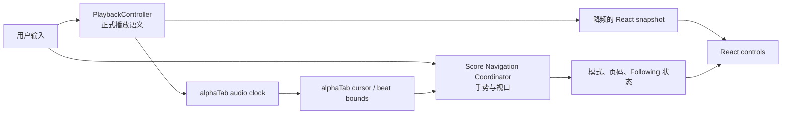
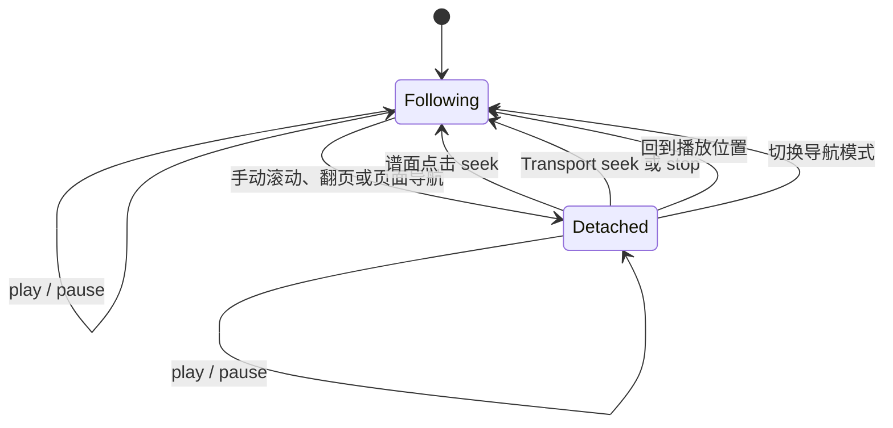

# Viewer 谱面导航与播放同步初步 Spec

- 状态：Draft；尚未实施。
- 当前行为：
  [`Viewer Playback Navigation Feature Contract`](../../features/contracts/viewer-playback-navigation.md)。
- Proposed 决策：ADR 0064。
- 事实边界：本 Spec 描述本次变更意图，不是当前运行时或实施进度的事实源。

## 目标

Viewer 在同一份 alphaTab 乐谱与播放器运行时上提供：

- 播放时按谱表行跟随的 Continuous Follow Mode；
- 适合稳定练习的 Page Turn Mode；
- 谱面点击到正式播放位置的单一 seek 路径；
- 拖动 Transport 时实时但低开销的 alphaTab 游标与视口预览。

本设计不实现打印分页、alphaTab Horizontal 单行长卷、自研谱表虚拟化或 iOS 验收。首轮只在
Web Browser Demo 验证。

## 当前实现与缺口

当前 `createViewerAlphaTabSettings` 已把 `ScoreViewer` 的主滚动容器传给 alphaTab，且未覆盖
默认 `ScrollMode.Continuous`。因此 alphaTab 会在播放跨越谱表行时尝试滚动，但应用没有显式的
导航模式、Following / Detached 状态或可测试的滚动策略。

当前同时启用 alphaTab `enableUserInteraction`，并监听 `beatMouseDown` 向
`PlaybackController` dispatch seek。alphaTab 的内建交互也会修改播放位置或选择播放区间，形成
双重手势解释路径。现有 Written Position 映射还用书面总时长近似当前 occurrence，不能完整表达
repeat、D.S.、D.C. 与 Coda 的展开路径。

Transport 已用 animation frame 合并 Scrub Preview，并在松手时只提交一次正式 seek。它可以
继续作为预览协议基础，但缺少独立的谱面导航协调器和翻页投影。

## 所有权

- alphaTab 音频时钟是实际播放时间的事实源，并继续拥有播放游标、beat 命中和完整谱面坐标系。
- `PlaybackController` 拥有 transport、Playback Occurrence、Loop、正式 seek 和持久化。
- `ScoreNavigationCoordinator` 位于 `web-viewer` 的 alphaTab/DOM 生命周期边界，拥有视口导航、
  Screen Score Page 投影和 Score Follow State。
- React 只展示导航模式、页码、回到播放位置入口和降频后的 transport snapshot。
- 逐帧游标几何、scrollTop 和 Scrub Preview 不进入 React、Zustand 或持久化。

正式用户定位必须经过 `PlaybackController`。Scrub Preview 是唯一可绕过正式 state/persistence
更新的临时端口，松手时仍由 Controller 提交最终 seek。

## 导航状态机

新 Viewer Session 总是从 `Following` 开始。播放和暂停不改变 Follow State。程序化滚动产生的
DOM `scroll` 事件不得进入 `Detached`；协调器应从 wheel、pointer、touch 和 PageUp/PageDown
等用户输入意图识别手动导航，而不是从 scroll 结果反推意图。

## Continuous Follow Mode

当前谱表行保持稳定。播放头进入新的谱表行时，协调器把该行放到视口上方约 25% 的位置，并尽量
留下下一行作为预读内容：

- 默认使用 160–220ms 的可取消短动画；
- 新目标到达时取消旧动画，禁止排队；
- `prefers-reduced-motion` 下直接定位；
- `Detached` 时不自动移动；
- Scrub Preview 期间直接定位，不运行动画。

实现使用 alphaTab 公开的 `customScrollHandler` 和 beat bounds，不从高频 position snapshot 计算
DOM 几何。

## Page Turn Mode

### 页面投影

alphaTab 始终保留一个纵向 Page layout 和一个播放器 runtime。`postRenderFinished` 后，协调器从
公开的 `boundsLookup.staffSystems` 读取谱表行边界，并按当前可视高度顺序装入 Screen Score Page：

1. 页面只包含连续且完整的谱表行，并计入行间实际间距。
2. 一页尽量容纳最多完整行，不为了凑页缩放谱面。
3. 单条谱表行高于可视区域时形成超高页，仅该页允许有限纵向滚动。
4. 页身份使用首条谱表行对应的书面锚点，不持久化页码。
5. 启用 Loop 且相关完整谱表行可以放入一屏时，临时围绕 Loop 重组页面；放不下时维持普通分页。

缩放、容器 resize、显示轨道变化或 alphaTab 重新布局后重新生成 page table。Following 时保持播放
头所在行可见；Detached 时保持用户原先看到的第一条谱表行可见。重分页不改变 position、transport、
Loop、tempo 或 zoom。

### 翻页行为

- Following 时，播放头进入下一页第一个 occurrence 后立即切页。
- Detached 时自动翻页暂停，页面保留用户浏览位置。
- 左滑、PageDown、滚轮向下和“下一页”前进；反向输入后退。
- 乐谱阅读方向不随 UI locale 反转。
- 一次滚轮或触控板惯性手势最多翻一页；协调器按 gesture session 去重，而不是固定吞掉后续输入。
- 不使用谱面左右边缘隐形热区；左右方向键留给未来音乐位置导航。
- 普通自动翻页不播放堆叠动画，减少动态效果时保持相同的直接切换。

## 导航模式偏好

Score Navigation Mode 是设备级 Viewer 偏好，不进入 Practice Sidecar，也不跨设备同步：

- iPad 宿主首次默认 Page Turn；
- Desktop 与 Browser 首次默认 Continuous Follow；
- 用户选择后不因 resize 或旋转自动换模式；
- 播放中切换模式不暂停、不 seek、不重建 alphaTab；
- 切换取消当前导航动画，以播放头重建投影并进入 Following。

模式入口属于低频 Viewer 设置，放入紧凑的 ContextPopup。Page Turn Mode 才显示小型上一页、
下一页与 `n / m` 输出；页码不使用高频 `aria-live`。Detached 时显示明确、紧凑的“回到播放位置”
入口，不用介绍文案或长期状态栏占据谱面空间。

## Score Pointing Seek

应用关闭 alphaTab 内建 seek 和拖动区间副作用，但继续消费其公开 beat 命中事件：

- 单击或轻触 beat 产生 Written Position；
- 拖动用于滚动或翻页，并进入 Detached；
- 捏合只缩放；
- 超过移动阈值的手势在结束时不得误发 seek；
- AB Loop 只通过明确的练习控制修改。

Written Position 遵循 ADR 0038 的双位置模型，并按 Proposed ADR 0064 解析为唯一
Playback Occurrence：

1. 优先选择与当前播放头相同的 repeat/jump 展开路径；
2. 当前路径不存在时选择播放头之后最近的 occurrence；
3. 后面也不存在时回退到首次 occurrence。

定位保持当前 transport：播放中继续播放，暂停时继续暂停。成功定位后恢复 Following。

## Scrub Preview

拖动 Transport 时使用 latest-only 协议：

1. Slider 立即显示本地乐观位置。
2. 每个 animation frame 最多把一个最新 tick 写入 alphaTab 预览端口。
3. alphaTab 内部更新游标；协调器只在目标谱表行或目标页变化时移动视口。
4. 预览期间取消滚动和翻页动画，跳过过时的中间页。
5. 预览回调不发布正式 Controller state、不标记 resume dirty、不写持久化。
6. 松手取消未执行预览，并向 Controller 提交一次正式 seek。

新的播放、停止、正式 seek 或 Session destroy 必须取消尚未执行的预览，避免旧 animation frame
覆盖新意图。

## 事件矩阵

| 输入或事件            | PlaybackController          | alphaTab                 | Navigation Coordinator    | React / persistence              |
| --------------------- | --------------------------- | ------------------------ | ------------------------- | -------------------------------- |
| 正常播放 position     | 更新语义位置并降频发布      | 驱动音频与内部游标       | 仅跨行或跨页时跟随        | 常规位置最多约 10Hz；resume 防抖 |
| 播放、暂停、停止      | 立即提交                    | 执行 transport           | stop 恢复 Following       | 立即发布；按既有规则持久化       |
| 谱面单击              | 解析 occurrence 并正式 seek | 响应 Controller seek     | 恢复 Following            | 立即发布；不改变 transport       |
| Transport 拖动        | 预览阶段不修改正式 state    | 每帧最多一次 latest seek | 目标行或页变化时直接定位  | Slider 本地预览；不持久化        |
| Transport 松手        | 一次正式 seek               | 定位最终游标             | 恢复 Following            | 立即发布并恢复正常 resume 语义   |
| 手动滚动或翻页        | 不变                        | 不变                     | 进入 Detached             | 只更新低频导航 UI                |
| 回到播放位置          | 不 seek                     | 保持当前 position        | 定位游标并恢复 Following  | 更新导航 UI                      |
| 切换导航模式          | transport 与 position 不变  | 不重建                   | 重投影并恢复 Following    | 持久化设备偏好                   |
| alphaTab 重新布局完成 | 不变                        | 发布新 bounds            | 保留锚点并重建 page table | 必要时更新页码                   |

## 故障与降级

- alphaTab 尚未完成布局时保留上一份有效导航投影，不用半成品 bounds 计算页面。
- Page Turn 在一次完整 render 后仍拿不到有效 staff-system bounds 时，不阻断谱面或播放；本次渲染
  降级为 Continuous Follow，保留用户 Page Turn 偏好，并在下一次 `postRenderFinished` 重试。
- 降级使用本地化、非阻塞状态反馈，不把 alphaTab 原始异常放入 DOM。
- render、resize 或模式切换期间只允许一个有效 generation；旧 generation 的异步回调必须失效。
- Session destroy 取消 animation frame、导航动画、ResizeObserver 和 alphaTab 事件订阅。

## Web 验收

首轮只验证 Chromium Browser Demo，不运行 iOS、Xcode 或实体 iPad 测试。覆盖 1440×900、
768×1024 和 1024×768 视口。

### 自动化

- 纯函数测试分页分组、超高页、Loop 临时重组和锚点恢复。
- 状态机测试 Following / Detached 的全部转换及程序化滚动不误触发 Detached。
- 使用真实 repeat/jump timeline fixture 测试 Written Position 到 Playback Occurrence 的三层回退。
- 测试 alphaTab 内建用户交互关闭后单击只产生一次正式 seek，拖动和捏合不 seek。
- 测试 Scrub latest-only、每帧至多一次预览、commit 一次正式 seek、取消过时 preview。
- 组件测试模式设置、页码、PageUp/PageDown、返回播放位置、焦点和 accessible name。

### 浏览器流程

- 播放跨行时逐行跟随，手动浏览后保持 Detached，返回后恢复 Following。
- Page Turn 自动与手动翻页、滚轮惯性去重、横竖视口重分页和减少动态效果。
- 点击普通段落与第二次反复段落时定位正确且不改变 transport。
- 快速拖动 10% 到 80% 时游标和最终页同步，中间页面不排队。
- 短 Loop 跨普通页边界时重组为稳定页面；超长 Loop 维持正常翻页。
- 切换模式、缩放和显示轨道时音频不中断、控制台无错误。

### 性能预算

- Scrub 输入到游标反馈目标低于 50ms。
- alphaTab 游标不经过 React，并保持浏览器可观察的流畅动画。
- Controller 常规 position snapshot 最多约 10Hz；transport、seek、换页和 Loop 边界立即发布。
- 连续模式换行动画 160–220ms 且不排队；翻页只呈现最新目标。
- 代表性长谱连续播放 30 分钟，无持续掉帧、内存单调增长或导航导致的音频中断。
