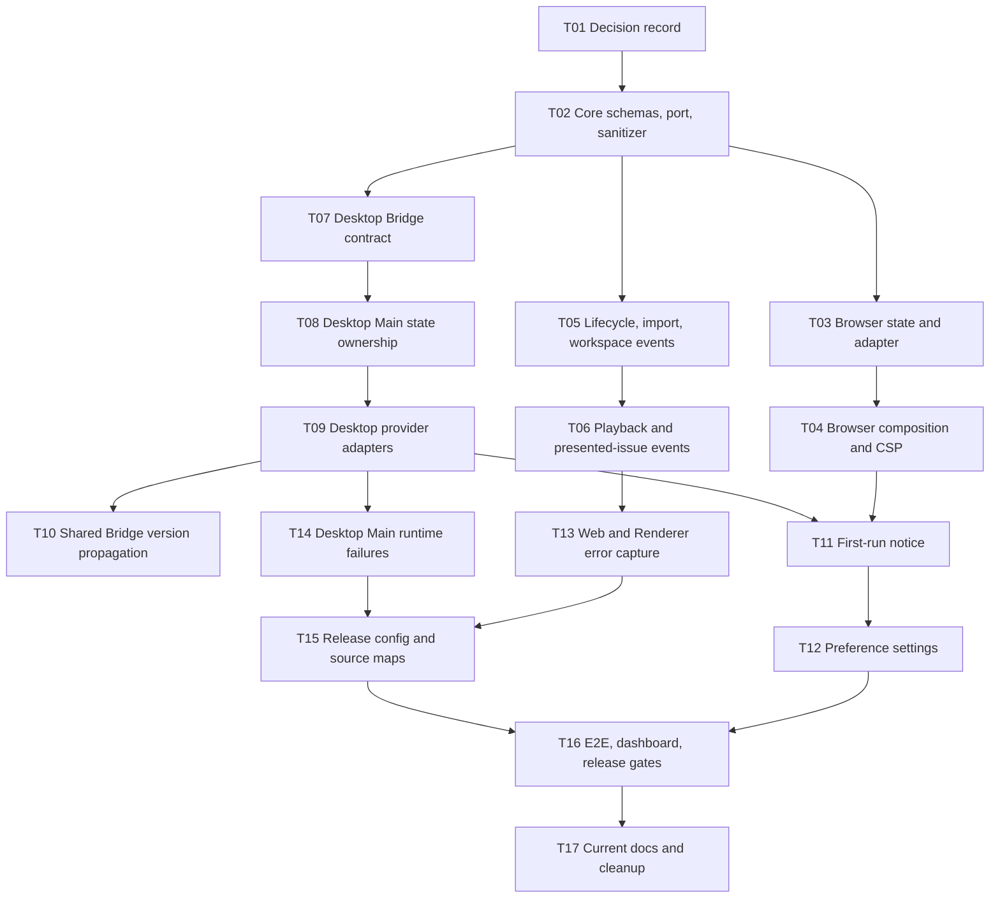

# Implementation Plan: Anonymous Product Telemetry and Error Tracking

## Status

- Status: in_progress
- Approved Spec: `docs/specs/2026-08-08-anonymous-product-telemetry-and-error-tracking.md`
- Target surfaces: Browser and Electron Desktop
- Provider: PostHog Cloud US
- Release channels: `alpha | beta | production`; Internal Acceptance and iPad remain No-op
- Release gates still requiring ownership: PostHog retention/access owner and production dashboard access review

## Goal

在不上传用户曲谱、文件身份、路径或任意应用状态的前提下，为 Browser 与 Desktop 分发构建交付可退出的
匿名使用统计和 JavaScript Error Tracking，并能可靠计算 Active Installation、Application Session、
engagement 与 error-free rate。

## Non-goals

- 不实现账号身份、跨设备合并、广告标识、设备指纹或真实人数统计。
- 不启用 autocapture、Session Replay、performance tracing、survey 或 Feature Flag。
- 不捕获 native crash dump，不为 iPad 启用遥测。
- 不实现 durable offline telemetry queue，不让遥测影响应用可用性。
- 不保留旧 Bridge schema compatibility window；同一构建内所有消费者同步升级。

## Canonical context

- Approved Spec: `docs/specs/2026-08-08-anonymous-product-telemetry-and-error-tracking.md`
- Existing no-telemetry decision: `docs/adr/0029-keep-internal-build-telemetry-free.md`
- Bridge contracts: `packages/web-core/src/bridge/schemas.ts`
- Shared application composition: `packages/web-viewer/src/mountViewerApp.tsx`
- Application lifecycle: `packages/web-viewer/src/app/ViewerApplication.ts`
- Browser composition: `apps/web-demo/src/main.ts`, `apps/web-demo/src/browserHost.ts`
- Desktop composition: `apps/desktop-shell/src/main/main.ts`, `apps/desktop-shell/src/renderer.ts`
- Desktop local diagnostics: `apps/desktop-shell/src/main/diagnostics.ts`
- Current architecture: `docs/architecture/README.md`, `docs/architecture/react-application-system.md`

## First-principles constraints

1. 先证明 payload 安全，再连接真实 provider；SDK 不能成为事件契约事实源。
2. Desktop Main owns telemetry identity and preference；Renderer 只消费经过 Bridge 校验的匿名 context。
3. Shared React code emits semantic events through `TelemetryPort`；host adapters own PostHog。
4. `NoopTelemetryPort` 是缺配置、禁用、无效持久化和非分发构建的默认结果。
5. 一个 Application Session 只有一个 `installationId` 和 `applicationSessionId`，Desktop Main/Renderer
   不分别计数。
6. 每个 task 先写或更新 focused test；checkpoint 后再扩大验证范围。

## Dependency graph

Browser adapter work (`T03–T04`) and Desktop Bridge work (`T07–T10`) may proceed independently after `T02`.
Shared semantic event work (`T05–T06`) may also proceed against a fake port. Integration tasks must wait for their
declared dependencies.

## Phase 0: Freeze the decision

### T01: Record the distribution telemetry decision

**Description:** 新建 accepted ADR，明确分发构建允许可退出匿名遥测，Internal Acceptance 与 iPad 继续
No-op，并与 ADR 0029 双向建立 replacement/scope relationship。

**Acceptance criteria:**

- [x] The ADR states the release-channel boundary, opt-out behavior, provider-neutral application boundary, and local-diagnostics coexistence.
- [x] ADR 0029 remains authoritative for Internal Acceptance builds and links to the new decision for distributed builds.
- [x] `docs/adr/README.md` classifies both decisions without contradictory current guidance.

**Verification:** `pnpm check:arch`; `pnpm check:docs`; `git diff --check`.

**Dependencies:** None

**Files likely touched:** new ADR, `docs/adr/0029-keep-internal-build-telemetry-free.md`, `docs/adr/README.md`.

**Estimated scope:** S

## Phase 1: Safe contract and Browser vertical slice

### T02: Implement provider-neutral telemetry contracts

**Description:** 在 `web-core` 增加 strict event/envelope schemas、`TelemetryPort`、No-op implementation、
exception sanitizer 和 deterministic rate-limit/fingerprint primitives，不引入 PostHog dependency。

**Acceptance criteria:**

- [x] All seven custom events and persisted preference state are strict Zod schemas with inferred TypeScript types.
- [x] The sanitizer removes or drops every forbidden path, URL, UUID, hash, token, credential, custom field, and oversized exception payload defined by the Spec.
- [x] `capture` and `captureException` cannot throw through the No-op or guarded port boundary.

**Verification:** `pnpm vitest run packages/web-core/src/telemetry`; `pnpm typecheck`.

**Dependencies:** T01

**Files likely touched:** `packages/web-core/src/telemetry/{schemas,types,sanitizer}.ts`, one adjacent test file,
`packages/web-core/src/index.ts`.

**Estimated scope:** M, 5 files

### T03: Build the Browser identity, preference, and PostHog adapter

**Description:** 以注入 config 的方式实现 Browser local state 和 PostHog adapter；先通过 fake transport
验证 identity lifecycle、property allowlist、disable/reset 和 failure isolation。

**Acceptance criteria:**

- [x] Missing state defaults to enabled/unacknowledged, corrupt state fails closed, and disabling deletes the installation identity.
- [x] Re-enabling creates a new installation/application-session identity and never uses cookies, identify, alias, or person profiles.
- [x] The adapter emits only schema-approved properties and remains non-throwing under SDK failure.

**Verification:** `pnpm vitest run apps/web-demo/src/telemetry`.

**Dependencies:** T02

**Files likely touched:** `apps/web-demo/package.json`, `apps/web-demo/src/telemetry/browser-telemetry.ts`, adjacent test.

**Estimated scope:** M, 3 files

### T04: Deliver the Browser launch vertical slice

**Description:** 在 Browser build composition 中注入 release config，启用精确 US ingestion
`connect-src`，并在告知可见后发送一次 `application_session_started`；开发/E2E 仍组合 No-op。

**Acceptance criteria:**

- [x] Distribution builds with valid config emit one launch event; development, test, E2E, missing-token, and invalid-host builds initialize no remote SDK.
- [x] `script-src` remains local-only and `connect-src` allows only the compiled PostHog US ingestion origin.
- [x] A fake-ingestion test proves that raw URL, route params, DOM text, library data, and automatic properties are absent.

**Verification:** `pnpm vitest run apps/web-demo/src`; `pnpm demo:build`.

**Dependencies:** T03

**Files likely touched:** `apps/web-demo/rspack.config.mjs`, `apps/web-demo/index.html`,
`apps/web-demo/src/main.ts`, `apps/web-demo/src/global.d.ts`, one entry/config test.

**Estimated scope:** M, 5 files

### Checkpoint A: Browser safety and viability

- [x] `pnpm vitest run packages/web-core/src/telemetry apps/web-demo/src`
- [x] `pnpm demo:build`
- [x] Captured payload matches the strict allowlist.
- [x] Invalid/absent configuration produces no network initialization.
- [x] Review SDK bundle size and confirm no remote-code extension loading.

## Phase 2: Shared semantic usage events

### T05: Emit lifecycle, import, and workspace events

**Description:** 将 `TelemetryPort` 注入 shared application composition，并从业务完成点发送
`application_ready`、`score_import_completed` 和 `workspace_session_started`，不从 DOM click 推断。

**Acceptance criteria:**

- [x] Ready is emitted only after the first library refresh settles and contains no raw route or score identifier.
- [x] Import events map terminal results to the exact source/outcome/format/code contract and ignore an empty picker cancellation.
- [x] Workspace events emit once only after a Viewer or Studio runtime is ready.

**Verification:** `pnpm vitest run packages/web-viewer/src/app/__tests__/ViewerApplication.test.ts`.

**Dependencies:** T02

**Files likely touched:** `packages/web-viewer/src/mountViewerApp.tsx`,
`packages/web-viewer/src/app/ViewerApplication.ts`, `packages/web-viewer/src/app/__tests__/ViewerApplication.test.ts`,
`packages/web-viewer/src/host.ts` if the port is exported there.

**Estimated scope:** M, 3–4 files

### T06: Emit first-playback and presented-issue events

**Description:** 订阅 Viewer Session 的真实 playback state，只在首次进入 `playing` 时发送
`viewer_playback_started`；从实际呈现 Application Issue 的 React boundary 发送去重后的
`application_issue_presented`。

**Acceptance criteria:**

- [x] Playback emits once per Viewer Session after actual `playing`, never on click, blocked audio, pause/resume repetition, or Studio preview.
- [x] Presented issues emit once per application-session/surface/code only when the user-visible state is rendered.
- [x] Neither event contains Library Score ID, title, artist, duration, raw route, or source content.

**Verification:** focused Viewer Session/Application/Page tests under `packages/web-viewer/src`.

**Dependencies:** T05

**Files likely touched:** one telemetry presentation adapter/hook, `ViewerApplication.ts` or `ViewerPage.tsx`,
relevant Viewer Session/Page tests; split by playback and issue surface if the final file set exceeds 5.

**Estimated scope:** M, maximum 5 files per sub-slice

### Checkpoint B: Semantic event correctness

- [x] All seven custom event schemas have at least one real producer or an explicitly deferred Desktop-only producer.
- [x] Event cardinality tests pass under React StrictMode setup/cleanup/setup.
- [x] `pnpm vitest run packages/web-viewer/src/app packages/web-viewer/src/viewer-session`
- [x] `pnpm typecheck`

## Phase 3: Desktop identity and Bridge

### T07: Add the Desktop telemetry Bridge contract

**Description:** 增加 optional handshake telemetry context、telemetry capability 和
`app.telemetry.setPreference` request/response；保持 iPad allowlist 不包含该 request。

**Acceptance criteria:**

- [x] Request, response, capability, inferred types, mock behavior, and invalid-input tests are updated together.
- [x] The preference request accepts only the strict boolean preference input and never accepts identity, token, host, or arbitrary config.
- [x] iPad request/event allowlists remain unchanged and reject the Desktop-only method.

**Verification:** `pnpm vitest run packages/web-core/src/bridge apps/desktop-shell/src/main/__tests__/bridge.test.ts`.

**Dependencies:** T02

**Files likely touched:** `packages/web-core/src/bridge/schemas.ts`, mock and two adjacent tests,
`apps/desktop-shell/src/main/bridge.ts` or its test.

**Estimated scope:** M, maximum 5 files

### T08: Make Desktop Main own telemetry state

**Description:** 复用 atomic preference-store pattern，在 Main bootstrap 读取/校验 state、创建唯一
Application Session ID，并实现“先持久化再返回”的 Preference handler 与 handshake context。

**Acceptance criteria:**

- [x] Missing state defaults correctly, corrupt state fails closed and is quarantined, and file permissions remain private.
- [x] Main owns installation/application-session identity and Renderer cannot provide or overwrite either identifier.
- [x] Persistence failure returns a stable recoverable Bridge error and leaves the previous state unchanged.

**Verification:** focused telemetry-store and Desktop bridge dispatcher tests.

**Dependencies:** T07

**Files likely touched:** new Main telemetry state store and test, `apps/desktop-shell/src/main/main.ts`,
`apps/desktop-shell/src/main/bridge.ts` or its test.

**Estimated scope:** M, 4–5 files

### T09: Compose Desktop Renderer and Main provider adapters

**Description:** Renderer 使用 bundled no-external Web SDK，Main 使用 Node SDK；两者共享 Main 提供的
identity/session context，分发 config 无效或 Preference disabled 时组合 No-op。

**Acceptance criteria:**

- [x] Renderer and Main use the same distinct/session identifiers and different allowlisted runtime values.
- [x] The packaged Renderer loads no remote JavaScript and both adapters remain non-blocking under SDK failure.
- [x] Internal Acceptance, development, test, E2E, and iPad builds initialize no PostHog client.

**Verification:** focused adapter tests; `pnpm desktop:build`; package source inspection.

**Dependencies:** T08

**Files likely touched:** `apps/desktop-shell/package.json`, one Renderer adapter, one Main adapter,
`apps/desktop-shell/src/renderer.ts`, `apps/desktop-shell/src/main/main.ts`; tests may require splitting composition
from adapter implementation.

**Estimated scope:** M, maximum 5 files per sub-slice

### T10: Propagate the finalized shared Bridge version

**Description:** API 稳定后一次性提升 `BRIDGE_SCHEMA_VERSION`，重新生成 iPad manifest，并同步 Swift/Web
runtime 和 fixtures；iPad 继续省略 telemetry capability 且拒绝 Desktop-only request。

**Subtasks:**

- **T10a:** Update Zod version, generated manifest, JSON fixtures, and TypeScript contract tests.
- **T10b:** Update iPad Swift runtime version owners and their focused router/validator/lifecycle tests.
- **T10c:** Update remaining iPad Web/Swift fixture literals and run full bridge/release verification.

**Acceptance criteria:**

- [x] Main, Preload, Renderer, iPad Web, Swift runtime, manifest, fixtures, and tests agree on one exact version.
- [x] The generated iPad contract contains no telemetry request and the Swift router rejects it as unknown.
- [x] No compatibility shim or multi-version branch remains.

**Verification:** bridge manifest drift test; `pnpm ipad:test`; `pnpm ipad:verify`; `pnpm desktop:build`.

**Dependencies:** T09

**Files likely touched:** split into three groups of at most 5 production/test files; generated manifest is updated
only through `scripts/generate-bridge-contract.mjs`.

**Estimated scope:** three S/M mechanical subtasks

### Checkpoint C: Desktop and shared Bridge

- [x] Browser and Desktop emit the same envelope semantics.
- [x] Desktop Main/Renderer count as one Installation and one Application Session.
- [x] `pnpm vitest run packages/web-core/src/bridge apps/desktop-shell/src`
- [x] `pnpm desktop:build`
- [x] `pnpm ipad:verify`
- [x] Packaged Renderer CSP and local-only code-loading inspection pass.

## Phase 4: User control and error capture

### T11: Deliver the first-run telemetry notice

**Description:** 在共享 App Shell 中显示一次可访问、双语、非阻塞告知，并按已批准语义处理继续分享、
关闭分享和了解详情；未确认时下次继续显示。

**Acceptance criteria:**

- [x] The notice renders before the first launch event, supports keyboard/focus, and uses only `@zupulse/app-i18n` copy.
- [x] Continue and disable persist before updating UI; failed persistence keeps the notice and presents a stable localized issue.
- [x] The notice does not cover or rebuild the active Viewer/Studio session.

**Verification:** focused React tests; Light/Dark and narrow/desktop visual inspection; `pnpm check:i18n`.

**Dependencies:** T04, T09

**Files likely touched:** one telemetry notice component and test, App/router integration, `zh-CN.ts`, `en-US.ts`.

**Estimated scope:** M, 5 files

### T12: Deliver the privacy and diagnostics setting

**Description:** 在现有低频 App Header settings pattern 中增加单一开关，复用 host persistence contract，
并验证 disable/reset/re-enable identity lifecycle。

**Acceptance criteria:**

- [x] The setting is available from every route, reports saving/error states, and persists before Renderer state changes.
- [x] Disable immediately stops capture, clears pending/provider persistence, deletes identity, and emits no opt-out event.
- [x] Re-enable creates a new identity/session without rebuilding workspaces or interrupting playback.

**Verification:** focused AppHeader/App tests; Browser persistence test; Desktop Bridge preference test;
`pnpm check:i18n`.

**Dependencies:** T11

**Files likely touched:** one settings component/test, AppHeader integration/styles, and existing telemetry host interface;
split i18n additions into T11 if needed.

**Estimated scope:** M, maximum 5 files

### T13: Capture Browser and Renderer JavaScript errors

**Description:** 在 Web adapters 安装 global error/unhandled-rejection capture，增加 root/route boundary manual
capture，并通过 single-owner dedupe、session budget 和 sanitizer 发送 PostHog exception。

**Acceptance criteria:**

- [x] Unhandled exceptions, unhandled rejections, handled route errors, and Desktop startup errors reach one owner exactly once.
- [x] The 20-per-session budget and 60-second fingerprint dedupe are deterministic and cannot recurse.
- [x] Unsafe exceptions are dropped; console, breadcrumbs, DOM, network payloads, attachments, and local variables remain disabled.

**Verification:** focused adapter/router/startup tests using fake transport and synthetic sensitive errors.

**Dependencies:** T06, T04, T09

**Files likely touched:** shared error boundary/adapter and test, Browser entry integration, Desktop Renderer entry integration;
split Browser and Renderer if more than 5 files.

**Estimated scope:** two S/M vertical slices

### T14: Capture Desktop Main errors and Renderer runtime failures

**Description:** 在 Main operation boundaries 捕获 unexpected error，观察 `render-process-gone` 并投影
allowlisted `runtime_failure_observed`；process-level fatal handler 只 best-effort flush 后安全退出。

**Acceptance criteria:**

- [x] Main exceptions are sanitized and associated with the shared installation/session identity.
- [x] `render-process-gone` maps only to the approved reason enum and never forwards Electron details or dump paths.
- [x] Fatal process state never continues solely to flush telemetry, and close-time flush is bounded to 300 ms.

**Verification:** focused Main adapter/lifecycle tests; Desktop E2E renderer-failure fixture if deterministic.

**Dependencies:** T09

**Files likely touched:** Main telemetry adapter/test, `main.ts`, lifecycle or diagnostics integration/test.

**Estimated scope:** M, maximum 5 files

### Checkpoint D: User control and diagnostics

- [x] First-run and settings journeys pass in `zh-CN` and `en-US`.
- [x] Opt-out proves zero subsequent fake-ingestion requests.
- [x] Synthetic sensitive exceptions are sanitized or dropped in Browser, Renderer, and Main.
- [x] `pnpm check:i18n`
- [x] `pnpm verify:fast`

## Phase 5: Release pipeline, E2E, and durable truth

### T15: Add release configuration, source maps, and package guards

**Description:** 为 Browser、Desktop Renderer 和 Desktop Main 生成 release/build identity，只在
alpha/beta/production CI 上传 source maps，上传后确保 `.map` 不进入 public/package artifacts。

**Acceptance criteria:**

- [x] Release jobs fail when required source-map upload fails, while normal verify/internal package jobs require no telemetry secrets.
- [x] Public and packaged artifacts contain no source maps, management credentials, remote scripts, or invalid telemetry host.
- [x] Source maps resolve a synthetic release exception to the correct Browser/Renderer/Main source and build identity.

**Verification:** Rspack config tests/builds; package verification script; CI dry-run/config inspection; manual PostHog
release smoke.

**Dependencies:** T13, T14

**Files likely touched:** shared/both Rspack configs, Desktop package verifier, release workflow, global build definitions;
split Browser and Desktop release work if more than 5 files.

**Estimated scope:** two M vertical slices

### T16: Prove end-to-end payload, metrics, and release gates

**Description:** 以本地 fake ingestion server 验证 Browser/Desktop launch、events、exceptions、opt-out、
offline 和 relaunch identity；在 PostHog 建立 Product Health dashboard 并完成两项治理 gate。

**Acceptance criteria:**

- [x] Browser refresh and Desktop relaunch preserve installation identity and create new application-session identity.
- [x] Offline/provider failure leaves import, Viewer open, playback, save, close, and local diagnostics unchanged.
- [ ] The nine dashboard metrics use Installation/Session terminology; privacy URL, retention, access owner, and production access review are recorded before release.

**Verification:** `pnpm demo:test:e2e`; `pnpm desktop:test:e2e`; manual PostHog US smoke and dashboard review.

**Dependencies:** T12, T15

**Files likely touched:** Browser E2E, Desktop E2E, small fake-ingestion fixture/helper, release documentation; keep
external dashboard configuration out of repository secrets.

**Estimated scope:** two M E2E slices plus manual gate

### T17: Promote verified behavior and remove task state

**Description:** 验证全部可观察行为后新增 Current Feature Contract，更新 architecture/ADR/Spec status；
最后删除本 initiative task bundle，不把执行 checkbox 留作当前事实。

**Acceptance criteria:**

- [x] The Current Feature Contract records actual platform behavior, event catalog, preference semantics, known gaps, and reproducible evidence.
- [ ] Architecture and ADR status describe the implemented trust boundary; the Spec is `implemented` only after final verification.
- [ ] `tasks/anonymous-telemetry/` is deleted only after durable outcomes are promoted.

**Verification:** `pnpm docs:impact`; `pnpm check:context`; `pnpm check:arch`; `pnpm check:docs`.

**Dependencies:** T16

**Files likely touched:** new Feature Contract, feature index, relevant architecture/ADR/Spec files; task bundle removed
last.

**Estimated scope:** M

### Checkpoint E: Definition of Done

- [x] `pnpm verify:fast`
- [x] `pnpm verify`
- [x] `pnpm verify:e2e`
- [x] `pnpm ipad:verify`
- [x] `pnpm format:check`
- [x] `git diff --check`
- [x] `git status --short` confirms only intended files.
- [x] Manual packaged Desktop and deployed Browser PostHog US smoke pass.
- [x] Public privacy URL is live and recorded.
- [ ] PostHog retention/access owner and production dashboard access review are recorded.
- [x] Current Feature Contract and architecture documents match verified runtime behavior; external PostHog governance and deployed URL remain explicit gaps.

## Risks and mitigations

| Risk                                          | Impact   | Mitigation                                                                                 |
| --------------------------------------------- | -------- | ------------------------------------------------------------------------------------------ |
| SDK automatic enrichment leaks forbidden data | Critical | T02 sanitizer + adapter final allowlist + fake-ingestion contract tests before real config |
| Desktop Main/Renderer double-count identity   | High     | Main ownership, handshake context, relaunch E2E, dashboard cardinality check               |
| Shared Bridge change breaks iPad              | High     | T10 isolated version-propagation checkpoint and full `ipad:verify`                         |
| StrictMode duplicates events/subscriptions    | High     | Per-session idempotence and setup/cleanup/setup tests in T05–T06                           |
| Remote extension loading weakens Electron CSP | High     | Bundled no-external SDK, exact `connect-src`, package source inspection                    |
| Error storm creates cost/noise                | Medium   | Deterministic fingerprint dedupe and per-session budget before provider adapter            |
| Source map mismatch makes errors unusable     | High     | Release/build identity and synthetic mapped exception as a release gate                    |
| Default-on notice harms trust                 | High     | Visible first-run notice, first-level disable, no opt-out event, identity deletion         |
| Provider outage affects product behavior      | Critical | No-op/fail-silent port, bounded flush, offline E2E for core journeys                       |

## Open release gates

- Public privacy notice URL for “Learn more”.
- PostHog event retention policy and named access owner.

These gates do not block T01–T15 implementation, but T16 and any alpha/beta/production release cannot complete
without them.
