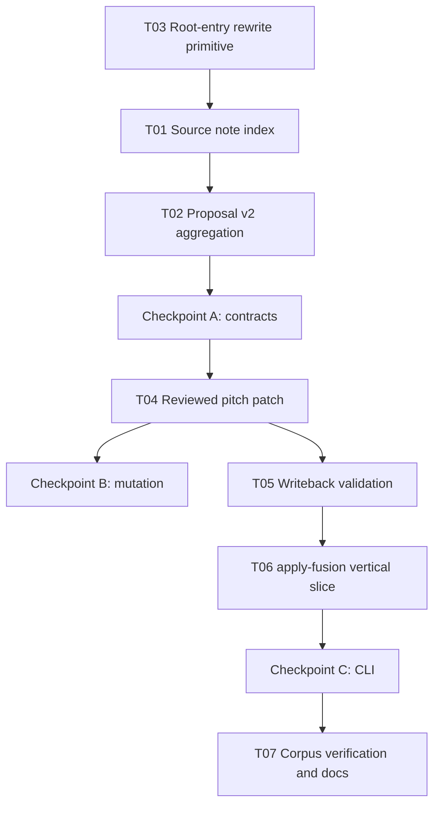

# Implementation Plan: MIDI Fusion 人工审核回写

## 状态

- Status: approved_in_progress
- Date: 2026-08-01
- Approved spec: `docs/specs/2026-08-01-midi-score-reviewed-writeback-design.md`
- Execution checklist: `tasks/midi-score-writeback/todo.md`

## Overview

在保持 `fuse` report-only 行为和输入 artifact 不可变的前提下，增加 `apply-fusion` 命令。实现先建立
原始 MusicXML note locator 和 writeback-ready proposal，再交付 byte-preserving pitch patch、回写后验证、
CLI artifact contract，最后使用 K331 development corpus 与 Flower Day compatible run 验证。

## Architecture Decisions

- `fuse` 与 mutation 分离；`apply-fusion` 只消费 hash 固定的 fusion run 和 reviewer decisions。
- v1 只支持 reviewed pitch correction；missing/extra proposal 不能 apply。
- 修改原 XML/MXL root entry，不从 `OmrScoreDraft` 重建整谱。
- locator 使用 `partId + measureIndex + noteIndex + preconditionSha256`；repeat evidence 聚合到 source note。
- corrected score 必须通过结构、runtime capability 和 before/after fusion 三重无回归门禁。
- 推荐从 `web-core` 现有 MusicXML round-trip 模块提取窄 `rewriteMusicXmlRoot` API；此公共接口变更必须在
  Checkpoint A 获得人工批准后才能实施。

## Dependency Graph

## Phase 1: Provenance and proposal contracts

### Task 01: 建立 source note index

**Progress:** Completed on 2026-08-01. Audiveris normalizer 在同一次 traversal 返回 Draft 与 source-note
sidecar；locator 覆盖 raw note ordinal、MXL root path 和 canonical writable-facts hash，既有 Draft 输出不变。

**Description:** 在 Audiveris MusicXML 单次 traversal 中同时产生 `OmrScoreDraft` 和 source-note sidecar，
让逻辑 event ID 可稳定定位 plain XML/MXL 中的原始 note；现有 normalizer 输出保持兼容。

**Acceptance criteria:**

- [ ] locator 包含 root entry、part、measure/note ordinal 和 writable-facts precondition hash。
- [ ] chord、多个 voice/staff、前序 note 缺失 timing、plain XML 与 MXL 均有测试。
- [ ] `normalizeAudiverisMusicXml(bytes)` 的既有 Draft fixtures 不变化。

**Verification:**

- [ ] `pnpm vitest run --root . tools/pdf-omr-cli/src/__tests__/source-note-index.test.ts`
- [ ] `pnpm vitest run --root . tools/pdf-omr-cli/src/__tests__/audiveris-normalizer.test.ts`
- [ ] `pnpm --filter @zupulse/pdf-omr-cli typecheck`

**Dependencies:** Task 03

**Files likely touched:**

- `tools/pdf-omr-cli/src/normalizers/audiveris.ts`
- `tools/pdf-omr-cli/src/normalizers/musicxml-source.ts`
- `tools/pdf-omr-cli/src/__tests__/source-note-index.test.ts`
- `tools/pdf-omr-cli/src/__tests__/audiveris-normalizer.test.ts`

**Estimated scope:** M

### Task 02: 生成 writeback-ready proposal v2

**Progress:** Completed on 2026-08-01. Alignment 保留 playback-level v1 evidence；fuse artifact 升级为
source-level proposal schema v2，一致 repeat suggestions 合并，冲突/缺失 evidence、missing/extra 和非零
detected transposition 均 fail closed 为 review-only。

**Description:** 将 playback-level alignment proposals 按 `sourceNoteId` 聚合，加入 locator、before facts 与
reviewability reasons；冲突 repeat evidence、missing/extra 和不完整 transpose facts 保持 review-only。

**Acceptance criteria:**

- [ ] schema v2 严格验证 locator、reviewability、source IDs 和 `autoApplicable: false`。
- [ ] 同一 source note 的一致 repeat suggestions 合并，冲突 suggestions 不可回写。
- [ ] 当前 `fuse` 仍为 report-only，但输出足以被后续 `apply-fusion` 消费。

**Verification:**

- [ ] `pnpm vitest run --root . tools/pdf-omr-cli/src/__tests__/writeback-proposals.test.ts`
- [ ] `pnpm vitest run --root . tools/pdf-omr-cli/src/__tests__/fuse-command.test.ts`
- [ ] `pnpm --filter @zupulse/pdf-omr-cli typecheck`

**Dependencies:** Task 01

**Files likely touched:**

- `tools/pdf-omr-cli/src/fusion/schemas.ts`
- `tools/pdf-omr-cli/src/fusion/build-writeback-proposals.ts`
- `tools/pdf-omr-cli/src/commands/fuse.ts`
- `tools/pdf-omr-cli/src/__tests__/writeback-proposals.test.ts`
- `tools/pdf-omr-cli/src/__tests__/fuse-command.test.ts`

**Estimated scope:** M

### Checkpoint A: Contracts

- [x] source locator 对 XML/MXL 和 repeat 稳定。
- [x] report-only fusion tests 与 typecheck 通过。
- [x] 人工已批准新增窄 `web-core` root-entry rewrite API。

## Phase 2: Byte-preserving mutation

### Task 03: 提取 MusicXML root-entry rewrite primitive

**Progress:** Completed on 2026-08-01. 新增 `readMusicXmlRootSource` 与 `rewriteMusicXmlRoot`；plain XML/MXL
均执行 preflight，MXL 仅替换 root entry，非 root 解压 bytes 保持不变，输出 deterministic。

**Description:** 从 `web-core` 现有 MXL preflight/unzip/zip 路径提取窄接口，使 caller 只替换 root XML bytes；
plain XML 原样走 transform，MXL 的其他解压 entry bytes 保持不变，并继续执行资源限制与 container 校验。

**Acceptance criteria:**

- [ ] API 对 plain XML/MXL 返回 transform 后 bytes，空 transform 不改变语义。
- [ ] 非 root entries 的解压 bytes 保持一致，zip 输出 deterministic。
- [ ] malformed/container traversal/resource-limit inputs 稳定失败。

**Verification:**

- [ ] `pnpm vitest run --root . packages/web-core/src/harmony/__tests__/musicXmlRoundTrip.test.ts`
- [ ] `pnpm --filter @zupulse/web-core typecheck`

**Dependencies:** None; approved by human on 2026-08-01

**Files likely touched:**

- `packages/web-core/src/harmony/musicXmlRoundTrip.ts`
- `packages/web-core/src/harmony/__tests__/musicXmlRoundTrip.test.ts`
- `packages/web-core/src/index.ts`

**Estimated scope:** M

### Task 04: 应用 reviewed pitch patch

**Progress:** Completed on 2026-08-01. Decision/patch-plan 使用 strict schemas；reviewed written pitch 必须匹配
suggested MIDI，source locator 与 note-facts hash 在 mutation 前复核。plain XML/MXL 仅替换目标 pitch children；
missing/extra、tie chain、stale precondition 与 duplicate target 全部 fail closed。

**Description:** 定义 decision/patch-plan schemas，校验 run/proposal/precondition，并仅替换目标 note 的
`step/alter/octave`。对 tie chain 形成原子 patch group；任何不支持或冲突操作在写出 corrected score 前失败。

**Acceptance criteria:**

- [ ] reviewer pitch 必须投影为 proposal suggested sounding MIDI，enharmonic 由 reviewer 明确给出。
- [ ] 只改变批准 pitch；未知 XML 和 source bytes 保持不变。
- [ ] duplicate target、source drift、missing/extra apply 与 tie conflict 稳定失败。

**Verification:**

- [ ] `pnpm vitest run --root . tools/pdf-omr-cli/src/__tests__/apply-reviewed-patches.test.ts`
- [ ] `pnpm --filter @zupulse/pdf-omr-cli typecheck`

**Dependencies:** Tasks 02, 03

**Files likely touched:**

- `tools/pdf-omr-cli/src/fusion/writeback-schemas.ts`
- `tools/pdf-omr-cli/src/fusion/apply-reviewed-patches.ts`
- `tools/pdf-omr-cli/src/fusion/musicxml-pitch-patcher.ts`
- `tools/pdf-omr-cli/src/__tests__/apply-reviewed-patches.test.ts`

**Estimated scope:** M

### Checkpoint B: Mutation safety

- [x] plain XML 与 MXL mutation tests 通过。
- [x] source、non-root entries 和未批准 XML facts 不变。
- [x] precondition/decision/proposal drift 全部 fail closed。

## Phase 3: Validation and CLI vertical slice

### Task 05: 建立 writeback no-regression validator

**Progress:** Completed on 2026-08-01. Validator 构造只包含 approved pitch 的 expected Draft，拒绝其他结构或
blocking diagnostic 增量，并对 source/corrected 重新 fusion。实现同时修复 MusicXML alphaTab projection 未读取
`masterBar.calculateDuration()` 导致 accepted fixtures 被误判为 view-only 的根因。

**Description:** 比较 source/corrected normalization、adapter capability 和重新 fusion metrics，仅允许 patch plan
声明的 pitch differences；已有 blocking diagnostics 可保留但不得新增。

**Acceptance criteria:**

- [ ] structural diff 拒绝 pitch 以外的 part/staff/measure/voice/event/timing/tie/tuplet 变化。
- [ ] corrected score 必须 `view: true`、`playback: true` 且不新增 blocking diagnostics。
- [ ] compatibility/coverage/pitch agreement 不回退，applied disagreement 消失。

**Verification:**

- [ ] `pnpm vitest run --root . tools/pdf-omr-cli/src/__tests__/validate-writeback.test.ts`
- [ ] `pnpm --filter @zupulse/pdf-omr-cli typecheck`

**Dependencies:** Task 04

**Files likely touched:**

- `tools/pdf-omr-cli/src/fusion/validate-writeback.ts`
- `tools/pdf-omr-cli/src/musicxml-structural-compare.ts`
- `tools/pdf-omr-cli/src/fusion/writeback-schemas.ts`
- `tools/pdf-omr-cli/src/__tests__/validate-writeback.test.ts`

**Estimated scope:** M

### Task 06: 交付 `apply-fusion` vertical slice

**Progress:** Completed on 2026-08-01. CLI 验证 source run 全部 artifact hashes 以及 decisions 绑定的 run/proposal
hashes；patch 与 no-regression gates 全部通过后，临时 run 才原子发布到 `--output`。成功 artifacts 包含 corrected
score、patch plan、拆分 validation reports、diagnostics 和 manifest。

**Description:** 接入 CLI flags、run integrity verification、reviewed patch、validation 与原子 output directory；
成功 run 写入 corrected score、patch plan、before/after validation、diagnostics 和 manifest hashes。

**Acceptance criteria:**

- [ ] 命令严格接受 `--run --decisions --output`，未知/重复 flags 与已有 output 稳定失败。
- [ ] source run 的所有 artifact hashes、decision run/proposal hashes 在 mutation 前验证。
- [ ] validation 全部成功后才原子发布完整 output，失败时不存在伪成功 corrected score。

**Verification:**

- [ ] `pnpm vitest run --root . tools/pdf-omr-cli/src/__tests__/apply-fusion-command.test.ts`
- [ ] `pnpm vitest run --root . tools/pdf-omr-cli/src/__tests__/command.test.ts`
- [ ] `pnpm --filter @zupulse/pdf-omr-cli test`
- [ ] `pnpm --filter @zupulse/pdf-omr-cli typecheck`

**Dependencies:** Task 05

**Files likely touched:**

- `tools/pdf-omr-cli/src/commands/apply-fusion.ts`
- `tools/pdf-omr-cli/src/command.ts`
- `tools/pdf-omr-cli/src/artifact-writer.ts`
- `tools/pdf-omr-cli/src/__tests__/apply-fusion-command.test.ts`
- `tools/pdf-omr-cli/src/__tests__/command.test.ts`

**Estimated scope:** M

### Checkpoint C: CLI end-to-end

- [x] synthetic fixture 完成 fuse → decisions → apply-fusion → re-fuse。
- [x] corrected score 可 view/playback，目标 disagreement 消失。
- [x] package tests、typecheck、format 和 `git diff --check` 通过。

## Phase 4: Corpus verification and durable documentation

### Task 07: 验证 K331 与 Flower Day 并更新 evaluation

**Description:** 使用仓库 K331 texture development corpus 验证成功/拒绝案例；对 Flower Day Audiveris
compatible run 只验证结构安全与 fusion consistency。将可持续结论写入 `docs/evaluation/pdf-omr.md`，运行目录
保持本地或临时，不提交模型与大 artifacts。

**Acceptance criteria:**

- [ ] K331 记录 applied/rejected counts、precondition failures 和 before/after fusion metrics。
- [ ] Flower Day 不宣称 ground-truth accuracy，只记录结构和 consistency gates。
- [ ] 文档明确 reviewed writeback 的支持边界、CLI 示例和剩余 gap。

**Verification:**

- [ ] 实际运行 K331 fuse/apply/re-fuse 命令并保存聚合证据。
- [ ] 实际运行 Flower Day Audiveris compatible sample 或记录不可运行的具体环境原因。
- [ ] `pnpm verify:fast`
- [ ] `pnpm format:check`
- [ ] `git diff --check`

**Dependencies:** Checkpoint C

**Files likely touched:**

- `docs/evaluation/pdf-omr.md`
- `tools/pdf-omr-cli/README.md`
- `tools/pdf-omr-cli/reports/development/` 下的小型聚合 JSON/README（如需要）

**Estimated scope:** M

### Checkpoint D: Complete

- [ ] spec acceptance criteria 全部验证。
- [ ] `pnpm verify:fast`、`pnpm format:check`、`git diff --check` 通过。
- [ ] durable outcomes 已更新到 evaluation/README；完成后删除本 task bundle。
- [ ] ready for human review。

## Risks and Mitigations

| Risk                                   | Impact | Mitigation                                                 |
| -------------------------------------- | ------ | ---------------------------------------------------------- |
| 逻辑 event ID 与原 XML note 错位       | High   | 单次 traversal sidecar + writable facts hash，拒绝近似反推 |
| repeat occurrence 给同一 note 不同建议 | High   | source-level aggregation，冲突 proposal 永远 review-only   |
| DOM serialization 改写未知 XML         | High   | byte-preserving text patch，只替换三个 pitch children      |
| transpose/enharmonic 处理错误          | High   | reviewer 提供 written pitch，并验证 sounding projection    |
| corrected score 看似可解析但结构漂移   | High   | structural allowlist + adapter + re-fusion 三重 gate       |
| 既有 source diagnostics 阻断可用样本   | Medium | 使用 no-new-blocking 规则，不要求基线零诊断                |
| public API 过宽                        | Medium | 仅提取 root bytes transform，Checkpoint A 人工批准         |

## Open Questions

- None. The narrow `@zupulse/web-core` root-entry rewrite API was approved on 2026-08-01.
