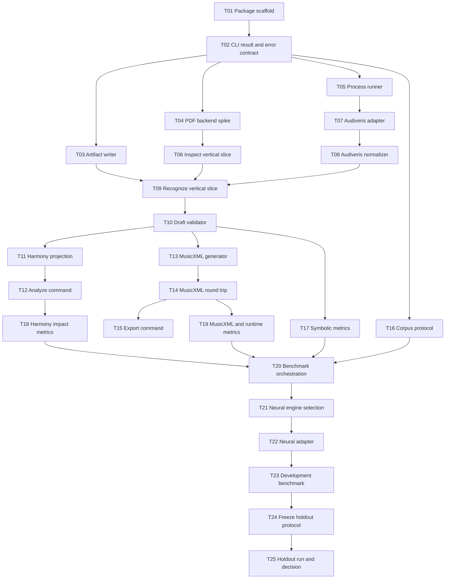

# Implementation Plan: PDF OMR CLI 与 Benchmark

## 状态

- Status: draft
- Date: 2026-07-28
- Approved scope:
  `docs/superpowers/specs/2026-07-28-pdf-omr-cli-benchmark-spec.md`
- Roadmap:
  `docs/superpowers/plans/2026-07-28-pdf-omr-cli-benchmark.md`
- Execution checklist: `tasks/pdf-omr-cli/todo.md`

本计划只拆分 CLI、engine adapter、统一 Draft、MusicXML/和声投影与 benchmark。不得修改
`apps/*`、`packages/web-viewer`、Bridge、Repository、Library 或 UI。

## 实现约定

- 新工具位于 `tools/pdf-omr-cli`，参考 `tools/harmony-cli` 的 package、CLI、Zod 和 Vitest 模式。
- OMR 实验 schema 暂留在工具目录，不从 `@zupulse/web-core` 导出。
- CLI 复用 `@zupulse/web-core` 当前 `HarmonyAnalysisInput`、生产 analyzer 与 MusicXML adapter。
- 所有外部 process 由一个 cancellable runner 管理；adapter 不自行实现第二套 process lifecycle。
- 测试先于行为实现；每个任务完成后运行本任务最小验证。
- 新依赖进入 `package.json` 前必须完成 Task 04 的 backend/licence spike。
- 外部模型、语料、运行结果和大文件默认不提交；仓库只保存 manifest、hash、少量许可明确 fixtures
  和聚合报告。
- 每个任务目标不超过 5 个文件；发现超出时先更新本计划并继续拆分。

## 目标命令

```bash
pnpm pdf-omr -- --help
pnpm pdf-omr -- inspect <input.pdf> --output <run-dir>
pnpm pdf-omr -- recognize <input.pdf> --engine <engine-id> --output <run-dir>
pnpm pdf-omr -- validate <draft.json> --output <diagnostics.json>
pnpm pdf-omr -- analyze <draft.json> --output <harmony.json>
pnpm pdf-omr -- export-musicxml <draft.json> --output <score.mxl>
pnpm benchmark:pdf-omr -- --manifest <manifest.json> --engine <engine-id> --output <result-dir>
```

## 依赖图



## Phase 0：CLI foundation

### Task 01：建立 `pdf-omr-cli` workspace package

**Goal:** 建立可以 typecheck、test 和显示 help 的最小工具包，不加载 PDF 或模型。

**Acceptance criteria:**

- [ ] package 名为 `@zupulse/pdf-omr-cli`，包含 `cli`、`test`、`typecheck` scripts。
- [ ] `pnpm pdf-omr -- --help` 返回 exit code 0，stdout/stderr 不加载 engine。
- [ ] 根 package 只增加 `pdf-omr` 与 `benchmark:pdf-omr` 入口，不改变现有命令。

**Verification:**

```bash
pnpm --filter @zupulse/pdf-omr-cli typecheck
pnpm --filter @zupulse/pdf-omr-cli test
pnpm pdf-omr -- --help
```

**Dependencies:** None

**Files:**

- `tools/pdf-omr-cli/package.json`
- `tools/pdf-omr-cli/tsconfig.json`
- `tools/pdf-omr-cli/tsconfig.test.json`
- `tools/pdf-omr-cli/src/cli.ts`
- `package.json`

**Scope:** M

### Task 02：冻结 CLI result、error 与 artifact schemas

**Goal:** 用 strict Zod schema 定义 command envelope、exit code、run manifest、engine environment、
artifact hashes 与 `OmrScoreDraft v1`。

**Acceptance criteria:**

- [ ] invalid hash、unknown field、invalid rational、invalid status 和越界 confidence 被拒绝。
- [ ] optional fields 缺失时省略，不传 `undefined`。
- [ ] `INVALID_CLI_ARGUMENT` 到 `INTERRUPTED` 的 exit-code mapping 有单元测试。

**Verification:**

```bash
pnpm vitest run --root . tools/pdf-omr-cli/src/__tests__/schemas.test.ts
pnpm --filter @zupulse/pdf-omr-cli typecheck
```

**Dependencies:** Task 01

**Files:**

- `tools/pdf-omr-cli/src/schemas.ts`
- `tools/pdf-omr-cli/src/errors.ts`
- `tools/pdf-omr-cli/src/__tests__/schemas.test.ts`
- `tools/pdf-omr-cli/src/__tests__/errors.test.ts`

**Scope:** M

### Task 03：实现 canonical artifact writer

**Goal:** 原子创建 run directory、写 canonical JSON、计算 SHA-256，并区分 partial 与 completed run。

**Acceptance criteria:**

- [ ] 已存在输出目录默认拒绝，任何文件不被覆盖。
- [ ] complete run 的 artifact hash 可从磁盘重新验证。
- [ ] failure/cancel 不生成伪造的 complete metrics 或 `completedAt`。

**Verification:**

```bash
pnpm vitest run --root . tools/pdf-omr-cli/src/__tests__/artifact-writer.test.ts
```

**Dependencies:** Task 02

**Files:**

- `tools/pdf-omr-cli/src/canonical-json.ts`
- `tools/pdf-omr-cli/src/artifact-writer.ts`
- `tools/pdf-omr-cli/src/__tests__/canonical-json.test.ts`
- `tools/pdf-omr-cli/src/__tests__/artifact-writer.test.ts`

**Scope:** M

### Checkpoint A：Foundation

```bash
pnpm --filter @zupulse/pdf-omr-cli typecheck
pnpm --filter @zupulse/pdf-omr-cli test
pnpm pdf-omr -- --help
pnpm format:check
git diff --check
```

通过条件：

- [ ] CLI package、schemas 和 artifact writer 均可独立运行。
- [ ] 没有新增 PDF/OMR runtime dependency。
- [ ] 人工批准进入 PDF 与 engine spike。

## Phase 1：PDF inspect 与第一条 engine vertical slice

### Task 04：选择 PDF inspect/render backend

**Goal:** 用一次性 spike 比较 Node PDF backend 与外部 process 方案，记录功能、许可证、安装体积、
vector metadata、raster render 和 cancellation 结果。

**Acceptance criteria:**

- [ ] 至少比较 PDF.js 路线与一个可行替代方案。
- [ ] 使用 vector、raster、mixed、encrypted、malformed 五类 smoke inputs。
- [ ] 在 `tools/pdf-omr-cli/docs/pdf-backend-decision.md` 给出唯一选择和未选理由。

**Verification:**

```bash
pnpm exec prettier --check tools/pdf-omr-cli/docs/pdf-backend-decision.md
git diff --check
```

**Dependencies:** Task 02

**Files:**

- `tools/pdf-omr-cli/spikes/pdf-backend.mts`
- `tools/pdf-omr-cli/docs/pdf-backend-decision.md`
- `tools/pdf-omr-cli/spikes/fixtures/manifest.json`

**Scope:** M

### Task 05：实现 cancellable external process runner

**Goal:** 提供所有 OMR adapter 共用的 spawn、timeout、bounded capture、AbortSignal 和 process-tree
termination。

**Acceptance criteria:**

- [ ] success、missing executable、non-zero exit、timeout、overflow 和 cancel 可区分。
- [ ] AbortSignal 实际终止 owned process tree，P95 cancel latency 可测量。
- [ ] canonical result 不包含本机绝对路径或 raw stderr。

**Verification:**

```bash
pnpm vitest run --root . tools/pdf-omr-cli/src/__tests__/engine-runner.test.ts
```

**Dependencies:** Task 02

**Files:**

- `tools/pdf-omr-cli/src/engine-runner.ts`
- `tools/pdf-omr-cli/src/resource-metrics.ts`
- `tools/pdf-omr-cli/src/__tests__/engine-runner.test.ts`
- `tools/pdf-omr-cli/src/__tests__/fixtures/fake-engine.mjs`

**Scope:** M

### Task 06：交付 `inspect` vertical slice

**Goal:** 让 CLI 对单个 PDF 输出 hash、page count、encryption、renderability 与 page-level
vector/raster signals。

**Acceptance criteria:**

- [ ] 五类 smoke inputs 返回稳定 result 或稳定 error code。
- [ ] 相同 PDF 重复 inspect 产生相同 canonical payload。
- [ ] report 只记录逻辑文件名和 content hash，不记录绝对路径。

**Verification:**

```bash
pnpm vitest run --root . tools/pdf-omr-cli/src/__tests__/inspect-pdf.test.ts
pnpm pdf-omr -- inspect <smoke.pdf> --output <temp-dir>
```

**Dependencies:** Tasks 03, 04

**Files:**

- `tools/pdf-omr-cli/src/inspect-pdf.ts`
- `tools/pdf-omr-cli/src/commands/inspect.ts`
- `tools/pdf-omr-cli/src/command.ts`
- `tools/pdf-omr-cli/src/__tests__/inspect-pdf.test.ts`

**Scope:** M

### Task 07：实现 Audiveris process adapter

**Goal:** 完成 environment inspection 与 Audiveris batch invocation，保存原始 MXL/OMR artifact 和
可复现参数，不做 Draft normalization。

**Acceptance criteria:**

- [ ] `inspectEnvironment()` 记录 executable version、command template 与许可证 metadata。
- [ ] recognize 通过共用 runner 处理 timeout/cancel/crash。
- [ ] 缺失 Audiveris 时返回 `ENGINE_UNAVAILABLE`，测试不要求开发机安装。

**Verification:**

```bash
pnpm vitest run --root . tools/pdf-omr-cli/src/__tests__/audiveris-adapter.test.ts
```

**Dependencies:** Tasks 05, 06

**Files:**

- `tools/pdf-omr-cli/src/engines/types.ts`
- `tools/pdf-omr-cli/src/engines/audiveris.ts`
- `tools/pdf-omr-cli/src/__tests__/audiveris-adapter.test.ts`
- `tools/pdf-omr-cli/src/__tests__/fixtures/fake-audiveris.mjs`

**Scope:** M

### Task 08：实现 Audiveris MusicXML normalizer

**Goal:** 把 Audiveris 生成的 MusicXML/MXL 转成 `OmrScoreDraft`，不把 parser 默认值冒充识别事实。

**Acceptance criteria:**

- [ ] part/staff/measure/voice/note/rest/tie/tuplet/repeat 的支持范围有 fixture。
- [ ] missing/ambiguous facts 生成 diagnostic，不静默填充。
- [ ] 每个 normalized note 至少可追溯到 measure/staff/voice；无 geometry 时省略 `SourceAnchor`。

**Verification:**

```bash
pnpm vitest run --root . tools/pdf-omr-cli/src/__tests__/audiveris-normalizer.test.ts
```

**Dependencies:** Tasks 02, 07

**Files:**

- `tools/pdf-omr-cli/src/normalizers/audiveris.ts`
- `tools/pdf-omr-cli/src/normalizers/musicxml-source.ts`
- `tools/pdf-omr-cli/src/__tests__/audiveris-normalizer.test.ts`
- `tools/pdf-omr-cli/src/__tests__/fixtures/audiveris-output.mxl`

**Scope:** M

### Task 09：交付 `recognize --engine audiveris`

**Goal:** 串联 inspect、artifact writer、Audiveris adapter 和 normalizer，形成第一条 PDF → Draft
端到端命令。

**Acceptance criteria:**

- [ ] success run 包含 manifest、raw artifact、draft 和 diagnostics hashes。
- [ ] cancel/crash/malformed output 不提交 succeeded run。
- [ ] 同一 smoke PDF 重复运行产生相同 Draft hash。

**Verification:**

```bash
pnpm vitest run --root . tools/pdf-omr-cli/src/__tests__/recognize-command.test.ts
pnpm pdf-omr -- recognize <smoke.pdf> --engine audiveris --output <temp-dir>
```

**Dependencies:** Tasks 03, 06, 08

**Files:**

- `tools/pdf-omr-cli/src/commands/recognize.ts`
- `tools/pdf-omr-cli/src/engine-registry.ts`
- `tools/pdf-omr-cli/src/command.ts`
- `tools/pdf-omr-cli/src/__tests__/recognize-command.test.ts`
- `tools/pdf-omr-cli/README.md`

**Scope:** M

### Checkpoint B：First engine

```bash
pnpm --filter @zupulse/pdf-omr-cli test
pnpm --filter @zupulse/pdf-omr-cli typecheck
pnpm pdf-omr -- recognize <smoke.pdf> --engine audiveris --output <temp-dir>
pnpm format:check
git diff --check
```

通过条件：

- [ ] PDF → Draft 单命令可运行。
- [ ] cancel/crash/invalid output 经过测试。
- [ ] 三份 smoke Draft 经人工抽查。
- [ ] 未开始 App、Repository 或共享产品 API 工作。

## Phase 2：Validation、Harmony 与 MusicXML

### Task 10：实现 exact rational time 与 Draft validator

**Goal:** 校验 measure duration、voice overlap、rests、ties、staff alignment 和 source bounds，并独立
计算 Harmony/MusicXML readiness。

**Acceptance criteria:**

- [ ] rational normalization、comparison、addition 与 safe LCM 有边界测试。
- [ ] Harmony-ready 不自动等于 MusicXML-ready。
- [ ] 不可精确转换的位置返回 blocking diagnostic，不做浮点近似。

**Verification:**

```bash
pnpm vitest run --root . tools/pdf-omr-cli/src/__tests__/rational.test.ts
pnpm vitest run --root . tools/pdf-omr-cli/src/__tests__/validate-draft.test.ts
```

**Dependencies:** Task 09

**Files:**

- `tools/pdf-omr-cli/src/rational.ts`
- `tools/pdf-omr-cli/src/validate-draft.ts`
- `tools/pdf-omr-cli/src/__tests__/rational.test.ts`
- `tools/pdf-omr-cli/src/__tests__/validate-draft.test.ts`

**Scope:** M

### Task 11：实现 Draft → `HarmonyAnalysisInput`

**Goal:** 精确投影 measures、tracks、staves、voice、spelling、sounding pitch、tie 和 written time。

**Acceptance criteria:**

- [ ] ground-truth MusicXML 经当前 projection 与 Draft projection 得到相同核心 input。
- [ ] OMR diagnostics 不写入 Harmony confidence 或 segment status。
- [ ] unsafe ticks projection 明确失败。

**Verification:**

```bash
pnpm vitest run --root . tools/pdf-omr-cli/src/__tests__/project-harmony.test.ts
```

**Dependencies:** Task 10

**Files:**

- `tools/pdf-omr-cli/src/project-harmony.ts`
- `tools/pdf-omr-cli/src/__tests__/project-harmony.test.ts`
- `tools/pdf-omr-cli/src/__tests__/fixtures/harmony-draft.json`

**Scope:** M

### Task 12：交付 `analyze` command

**Goal:** 使用当前生产 `analyzeHarmony` 输出 versioned harmony artifact，同时保留 OMR readiness 和
diagnostics。

**Acceptance criteria:**

- [ ] 只接受 Harmony-ready Draft。
- [ ] OMR engine/model 与 Harmony algorithm version 独立记录。
- [ ] analyzer failure、Draft blocked 和 invalid threshold 使用不同 error code/context。

**Verification:**

```bash
pnpm vitest run --root . tools/pdf-omr-cli/src/__tests__/analyze-command.test.ts
pnpm --filter @zupulse/harmony-cli test
pnpm pdf-omr -- analyze <draft.json> --output <harmony.json>
```

**Dependencies:** Task 11

**Files:**

- `tools/pdf-omr-cli/src/commands/analyze.ts`
- `tools/pdf-omr-cli/src/harmony-artifact.ts`
- `tools/pdf-omr-cli/src/command.ts`
- `tools/pdf-omr-cli/src/__tests__/analyze-command.test.ts`

**Scope:** M

### Task 13：实现首轮 MusicXML generator

**Goal:** 从 MusicXML-ready Draft 生成 deterministic MusicXML，支持规格确定的最小 notation subset。

**Acceptance criteria:**

- [ ] part/staff/measure/voice/note/rest/tie/tuplet/repeat 有 positive fixtures。
- [ ] unresolved required facts 阻止生成，不写猜测默认值。
- [ ] 相同 Draft 生成相同 canonical bytes。

**Verification:**

```bash
pnpm vitest run --root . tools/pdf-omr-cli/src/__tests__/generate-musicxml.test.ts
```

**Dependencies:** Task 10

**Files:**

- `tools/pdf-omr-cli/src/generate-musicxml.ts`
- `tools/pdf-omr-cli/src/musicxml-subset.ts`
- `tools/pdf-omr-cli/src/__tests__/generate-musicxml.test.ts`
- `tools/pdf-omr-cli/src/__tests__/fixtures/musicxml-ready-draft.json`

**Scope:** M

### Task 14：实现 Draft/MusicXML structural comparator

**Goal:** 用当前 `createMusicXmlAdapter` 回读生成 bytes，并分别判断 parse、view、playback 和 structural
agreement。

**Acceptance criteria:**

- [ ] pitch、onset、duration、voice、staff、tie drift 可定位。
- [ ] parse success 不会自动记为 structural success。
- [ ] comparison 对输入顺序不敏感，但不隐藏语义差异。

**Verification:**

```bash
pnpm vitest run --root . tools/pdf-omr-cli/src/__tests__/compare-drafts.test.ts
pnpm vitest run --root . tools/pdf-omr-cli/src/__tests__/round-trip-musicxml.test.ts
```

**Dependencies:** Task 13

**Files:**

- `tools/pdf-omr-cli/src/compare-drafts.ts`
- `tools/pdf-omr-cli/src/round-trip-musicxml.ts`
- `tools/pdf-omr-cli/src/__tests__/compare-drafts.test.ts`
- `tools/pdf-omr-cli/src/__tests__/round-trip-musicxml.test.ts`

**Scope:** M

### Task 15：交付 `validate` 与 `export-musicxml`

**Goal:** 暴露稳定 CLI commands，写 diagnostics、MXL 和 round-trip report。

**Acceptance criteria:**

- [ ] blocked Draft 的 validate 命令保存 diagnostics 并返回 exit code 7。
- [ ] structural mismatch 保存 round-trip report 并返回 exit code 8。
- [ ] success export 产生 MXL hash 和 current-adapter capability results。

**Verification:**

```bash
pnpm vitest run --root . tools/pdf-omr-cli/src/__tests__/validate-command.test.ts
pnpm vitest run --root . tools/pdf-omr-cli/src/__tests__/export-musicxml-command.test.ts
pnpm pdf-omr -- export-musicxml <draft.json> --output <score.mxl>
```

**Dependencies:** Tasks 10, 14

**Files:**

- `tools/pdf-omr-cli/src/commands/validate.ts`
- `tools/pdf-omr-cli/src/commands/export-musicxml.ts`
- `tools/pdf-omr-cli/src/command.ts`
- `tools/pdf-omr-cli/src/__tests__/validate-command.test.ts`
- `tools/pdf-omr-cli/src/__tests__/export-musicxml-command.test.ts`

**Scope:** M

### Checkpoint C：Useful CLI

```bash
pnpm --filter @zupulse/pdf-omr-cli test
pnpm --filter @zupulse/pdf-omr-cli typecheck
pnpm --filter @zupulse/harmony-cli test
pnpm format:check
git diff --check
pnpm verify:fast
```

通过条件：

- [ ] PDF → Draft → Harmony 可运行。
- [ ] Draft → MXL → current adapter round-trip 可运行。
- [ ] 两种 readiness 与两种 confidence 没有混用。
- [ ] 人工批准进入 corpus/benchmark 建设。

## Phase 3：Corpus 与 metrics

### Task 16：定义 corpus protocol 与 manifest verifier

**Goal:** 定义 item、work ID、development/holdout、category、ground truth、hash 和 license schema，
机械阻止 work-level leakage。

**Acceptance criteria:**

- [ ] 同一 work 的 render/crop/scan 变体不能跨 split。
- [ ] missing hash、ground truth 或 license metadata 使验证失败。
- [ ] holdout item-level results 默认不可由 development command 输出。

**Verification:**

```bash
pnpm vitest run --root . tools/pdf-omr-cli/src/__tests__/corpus.test.ts
```

**Dependencies:** Task 02

**Files:**

- `tools/pdf-omr-cli/src/benchmark/corpus.ts`
- `tools/pdf-omr-cli/src/benchmark/protocol.ts`
- `tools/pdf-omr-cli/src/__tests__/corpus.test.ts`
- `tools/pdf-omr-cli/corpus/manifest.example.json`

**Scope:** M

### Task 17：实现 symbolic alignment 与 metrics

**Goal:** 在 measure-local exact rational timeline 上匹配 notes，计算 pitch/onset/duration/joint F1、
valid measure 与 voice/staff/tie/tuplet/repeat 指标。

**Acceptance criteria:**

- [ ] matching policy 对 chord notes、rests、ties 和 duplicate candidates 有明确测试。
- [ ] metrics 在空集合、部分匹配和完全匹配下定义明确。
- [ ] item metrics 可无损聚合为 corpus/category metrics。

**Verification:**

```bash
pnpm vitest run --root . tools/pdf-omr-cli/src/__tests__/symbolic-alignment.test.ts
pnpm vitest run --root . tools/pdf-omr-cli/src/__tests__/symbolic-metrics.test.ts
```

**Dependencies:** Tasks 10, 16

**Files:**

- `tools/pdf-omr-cli/src/benchmark/symbolic-alignment.ts`
- `tools/pdf-omr-cli/src/benchmark/symbolic-metrics.ts`
- `tools/pdf-omr-cli/src/__tests__/symbolic-alignment.test.ts`
- `tools/pdf-omr-cli/src/__tests__/symbolic-metrics.test.ts`

**Scope:** M

### Task 18：实现 Harmony impact metrics

**Goal:** 比较 OMR Draft 与 ground-truth MusicXML 进入同一生产 analyzer 后的 resolved precision、
coverage、boundary F1 与 false confident chord rate。

**Acceptance criteria:**

- [ ] OMR error + high-confidence resolved chord 被计入 false confident。
- [ ] OMR blocked、Harmony unresolved 和 unsupported gold 分开统计。
- [ ] metrics 复用现有 interval/boundary semantics，不能创造第二套含义。

**Verification:**

```bash
pnpm vitest run --root . tools/pdf-omr-cli/src/__tests__/harmony-impact-metrics.test.ts
pnpm --filter @zupulse/harmony-cli test
```

**Dependencies:** Tasks 12, 16

**Files:**

- `tools/pdf-omr-cli/src/benchmark/harmony-impact-metrics.ts`
- `tools/pdf-omr-cli/src/benchmark/harmony-ground-truth.ts`
- `tools/pdf-omr-cli/src/__tests__/harmony-impact-metrics.test.ts`
- `tools/pdf-omr-cli/src/__tests__/fixtures/harmony-impact-cases.json`

**Scope:** M

### Task 19：实现 MusicXML、runtime 与 reproducibility metrics

**Goal:** 计算 generation/parse/view/playback/structural rates、wall time、RSS、GPU memory when available、
cancel latency 和 repeated Draft hash agreement。

**Acceptance criteria:**

- [ ] capability rates 与 structural agreement 分开。
- [ ] unavailable GPU metric 省略，不写 `0`。
- [ ] repeated-run mismatch 保留两个 run IDs 和 hashes。

**Verification:**

```bash
pnpm vitest run --root . tools/pdf-omr-cli/src/__tests__/runtime-metrics.test.ts
pnpm vitest run --root . tools/pdf-omr-cli/src/__tests__/reproducibility-metrics.test.ts
```

**Dependencies:** Tasks 14, 16

**Files:**

- `tools/pdf-omr-cli/src/benchmark/runtime-metrics.ts`
- `tools/pdf-omr-cli/src/benchmark/reproducibility-metrics.ts`
- `tools/pdf-omr-cli/src/__tests__/runtime-metrics.test.ts`
- `tools/pdf-omr-cli/src/__tests__/reproducibility-metrics.test.ts`

**Scope:** M

### Task 20：交付 benchmark orchestrator 与 report

**Goal:** 对 manifest × engine × preprocess 运行 item jobs，保存 item artifacts，生成 overall/category
aggregates 并评估 gate。

**Acceptance criteria:**

- [ ] 单项 crash 不丢失其他 item 结果。
- [ ] gate failure 仍保存完整 report，并返回 exit code 9。
- [ ] aggregate 可从 item artifacts 重算得到相同 hash。

**Verification:**

```bash
pnpm vitest run --root . tools/pdf-omr-cli/src/__tests__/benchmark-command.test.ts
pnpm benchmark:pdf-omr -- --manifest <smoke-manifest> --engine audiveris --output <temp-dir>
```

**Dependencies:** Tasks 16, 17, 18, 19

**Files:** 若超过 5 个文件，拆为 runner 与 report 两个任务。

- `tools/pdf-omr-cli/src/benchmark/run-benchmark.ts`
- `tools/pdf-omr-cli/src/benchmark/report.ts`
- `tools/pdf-omr-cli/src/commands/benchmark.ts`
- `tools/pdf-omr-cli/src/__tests__/benchmark-command.test.ts`
- `tools/pdf-omr-cli/README.md`

**Scope:** 2 × M after split

### Checkpoint D：Benchmark framework

```bash
pnpm --filter @zupulse/pdf-omr-cli test
pnpm --filter @zupulse/pdf-omr-cli typecheck
pnpm benchmark:pdf-omr -- --manifest <smoke-manifest> --engine audiveris --output <temp-dir>
pnpm format:check
git diff --check
```

通过条件：

- [ ] smoke corpus 可以产生 item、category 和 overall metrics。
- [ ] 结果可从 artifacts 重算。
- [ ] development/holdout policy 自动执行。

## Phase 4：第二引擎与冻结评测

### Task 21：选择 neural engine 和锁定环境

**Goal:** 依据可运行性、权重、许可证、输出能力和 smoke quality，从 LEGATO 1、LEGATO 2、Transcoda
中选择一个首轮 neural candidate。

**Acceptance criteria:**

- [ ] 三个候选都记录 code/weights/license/runtime availability。
- [ ] 被选候选可在评测机处理至少一份 smoke PDF。
- [ ] decision doc 给出唯一选择、model hash 和 environment bootstrap。

**Verification:**

```bash
pnpm exec prettier --check tools/pdf-omr-cli/docs/neural-engine-decision.md
git diff --check
```

**Dependencies:** Checkpoint D

**Files:**

- `tools/pdf-omr-cli/spikes/neural-engines.mts`
- `tools/pdf-omr-cli/docs/neural-engine-decision.md`
- `tools/pdf-omr-cli/engines/<engine>-environment.json`

**Scope:** M

### Task 22：实现 neural adapter 与 normalizer

**Goal:** 让所选 engine 通过共用 runner 输出相同 `OmrScoreDraft`，使用同一 validator 和 metrics。

**Acceptance criteria:**

- [ ] environment、model hash、decoder parameters 进入 run manifest。
- [ ] engine-native syntax 和 repair diagnostics 只存在于 adapter/normalizer。
- [ ] 三份 smoke PDF 可以生成 schema-valid Draft 或稳定失败。

**Verification:**

```bash
pnpm vitest run --root . tools/pdf-omr-cli/src/__tests__/<engine>-adapter.test.ts
pnpm vitest run --root . tools/pdf-omr-cli/src/__tests__/<engine>-normalizer.test.ts
```

**Dependencies:** Tasks 05, 10, 21

**Files:** 必须拆为 adapter 与 normalizer 两个 M tasks，各自不超过 5 个文件。

**Scope:** 2 × M

### Task 23：运行 development benchmark

**Goal:** 在 development split 比较 Audiveris、neural engine 与 preprocessing variants，定位主要失败
类别，但不读取 holdout item details。

**Acceptance criteria:**

- [ ] 所有组合使用同一 manifest、metrics 和 report schema。
- [ ] 每个主要 error category 有数量、比例和代表 artifact。
- [ ] 只允许预先声明的参数调整，所有调整进入 protocol history。

**Verification:**

```bash
pnpm benchmark:pdf-omr -- --manifest <manifest> --engine audiveris --output <dev-audiveris>
pnpm benchmark:pdf-omr -- --manifest <manifest> --engine <neural> --output <dev-neural>
```

**Dependencies:** Tasks 20, 22

**Files:**

- `tools/pdf-omr-cli/corpus/protocol.json`
- `tools/pdf-omr-cli/docs/evaluation.md`
- development aggregate reports；原始大 artifacts 不提交

**Scope:** S，运行时间另计。

### Task 24：冻结 holdout protocol

**Goal:** 固定 corpus hashes、engine versions、model hashes、preprocess variants、parameters、gate 和
benchmark commit，不再按 holdout 结果调参。

**Acceptance criteria:**

- [ ] protocol manifest 对所有可变输入做 hash。
- [ ] holdout runner 拒绝未列入 protocol 的参数。
- [ ] development decisions 和 rejected variants 有记录。

**Verification:**

```bash
pnpm vitest run --root . tools/pdf-omr-cli/src/__tests__/benchmark-protocol.test.ts
pnpm exec prettier --check tools/pdf-omr-cli/docs/evaluation.md
```

**Dependencies:** Task 23

**Files:**

- `tools/pdf-omr-cli/corpus/protocol.json`
- `tools/pdf-omr-cli/src/benchmark/verify-protocol.ts`
- `tools/pdf-omr-cli/src/__tests__/benchmark-protocol.test.ts`
- `tools/pdf-omr-cli/docs/evaluation.md`

**Scope:** M

### Task 25：运行 holdout 并形成唯一决策

**Goal:** 运行冻结组合，生成可复现报告，并严格输出 `CONTINUE_TO_APP_DISCOVERY`、`INVESTIGATE` 或
`STOP`。

**Acceptance criteria:**

- [ ] canonical metrics 可以从记录的 item artifacts 重算。
- [ ] overall 与 category metrics、失败类别、资源和许可证状态完整。
- [ ] 报告不设计 App；若继续，只允许启动新的 App discovery/spec。

**Verification:**

```bash
pnpm benchmark:pdf-omr -- --manifest <manifest> --engine audiveris --output <holdout-audiveris>
pnpm benchmark:pdf-omr -- --manifest <manifest> --engine <neural> --output <holdout-neural>
pnpm --filter @zupulse/pdf-omr-cli test
pnpm --filter @zupulse/pdf-omr-cli typecheck
pnpm format:check
git diff --check
pnpm verify:fast
```

**Dependencies:** Task 24

**Files:**

- `docs/evaluation/pdf-omr.md`
- `tools/pdf-omr-cli/docs/evaluation.md`
- frozen aggregate reports；原始大 artifacts 不提交

**Scope:** M，运行与人工审阅时间另计。

### Checkpoint E：CLI phase complete

- [ ] 两个 engine 在冻结 holdout 上完成评测。
- [ ] 所有结果可追溯到 input、environment、model、parameters 和 artifacts。
- [ ] 唯一决策经过人工评审。
- [ ] 没有修改 `apps/*`。
- [ ] 将耐久约束移入 CLI README/evaluation 后，删除本任务目录和完成的一次性 roadmap。

## 推荐阶段性提交

1. Tasks 01–03: `test: define pdf omr cli contracts`
2. Tasks 04–06: `feat: inspect pdf inputs for omr`
3. Tasks 07–09: `feat: add audiveris pdf omr slice`
4. Tasks 10–12: `feat: validate omr drafts and analyze harmony`
5. Tasks 13–15: `feat: export and round-trip omr musicxml`
6. Tasks 16–20: `feat: add reproducible pdf omr benchmark`
7. Tasks 21–22: `feat: compare a neural pdf omr engine`
8. Tasks 23–25: `docs: record pdf omr benchmark decision`

每个提交只包含对应任务与必要文档。提交前确认：

```bash
git status --short
pnpm format:check
git diff --check
```

## 计划验证

开始实现前检查：

- [x] 每个任务有验收条件。
- [x] 每个任务有验证命令。
- [x] 依赖顺序已明确。
- [x] 大任务已标记必须拆分。
- [x] 每 2–5 个任务有 checkpoint。
- [ ] 人工审阅并批准本实施计划。
