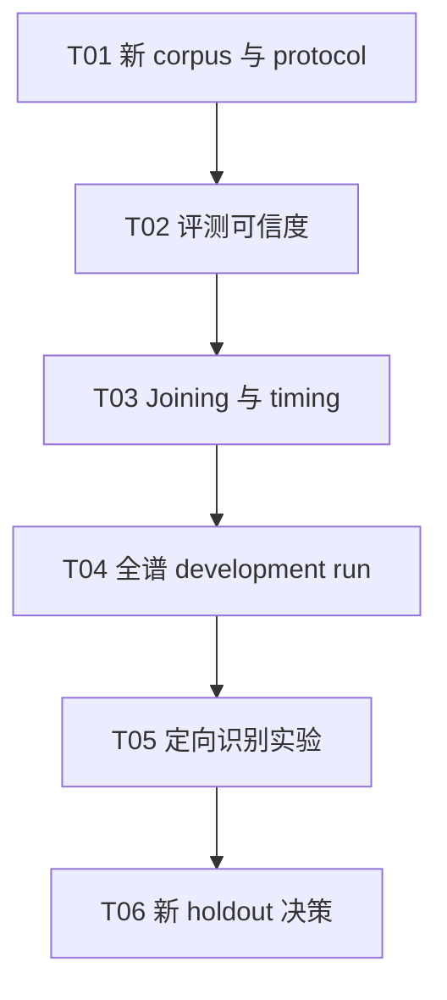

# Implementation Plan: PDF OMR 识别能力优化

## 状态

- Status: handoff_pending_approval
- Previous initiative: `tasks/pdf-omr-cli/`，已完成并由本 handoff 取代
- Current decision: `STOP`
- Durable evidence: `docs/evaluation/pdf-omr.md`

## Goal

在不接入 App、不修改既有 frozen report 的前提下，用新的 corpus 和 protocol 提升并重新评估 PDF
乐谱识别质量；只有新的 holdout gate 通过后，才讨论 App discovery。

## Non-goals

- 不修改 `apps/*`、Library、Bridge、Repository、managed files 或产品导入格式。
- 不覆盖或重新解释 Audiveris/Transcoda 的 frozen `STOP`。
- 不通过放宽 Draft validator、伪造 timing 或自动应用 fusion proposals 来提高指标。
- 不分发许可证不允许商业使用的模型，也不把受控 K331 结果解释为真实世界质量。

## Canonical context

- 当前结论与重启条件：`docs/evaluation/pdf-omr.md`
- CLI 命令与 artifact contract：`tools/pdf-omr-cli/README.md`
- Benchmark protocol：`tools/pdf-omr-cli/docs/evaluation.md`
- Rokot 设计：`docs/specs/2026-07-31-rokot-pdf-omr-engine-design.md`
- 产品边界：`docs/architecture/README.md`

## Dependency graph

## Phase 1：重新建立可信评测基线

### T01：定义真实 corpus 与新版 protocol

**Description:** 引入许可明确的真实印刷/扫描钢琴谱，按 work 隔离 development 与 holdout，并为新一轮
实验分配新的 protocol/version；保持现有 frozen artifacts 不变。

**Acceptance criteria:**

- [ ] corpus 不再只由 synthetic 或 derived-controlled 输入构成，并记录来源、许可和 SHA-256。
- [ ] 同源 variant 不跨 split；holdout 在 development 决策完成前不可读取。
- [ ] 新 protocol 锁定 render、segmentation、model revision、decoder、metrics 和 gate。

**Verification:** manifest/protocol schema tests；canonical hash 重算；人工许可证审阅。

**Dependencies:** None

**Estimated scope:** M；若 corpus 获取本身超过一轮工作，拆成独立任务。

### T02：修复评测可信度缺口

**Description:** 在优化 engine 前，解决 engine-neutral part identity、ground-truth readiness 和资源指标
缺失，避免把评测器缺陷误判为识别质量。

**Acceptance criteria:**

- [ ] part identity 不依赖 engine-specific `partId`，且对映射冲突 fail closed。
- [ ] ground truth 自身 readiness 失败时明确报告 evaluation limitation，不生成伪指标。
- [ ] item metrics 包含 cancel latency、峰值 RSS/GPU 和逐阶段 wall time，缺失时 gate 稳定失败。

**Verification:** focused benchmark tests；同一 artifacts 重算得到相同 report hash。

**Dependencies:** T01

**Estimated scope:** 拆为 2–3 个 S/M tasks，每个不超过 5 个文件。

### Checkpoint A

- [ ] 新 protocol 已冻结 development 输入与指标实现。
- [ ] 旧 frozen reports 的 bytes/hash 未改变。
- [ ] 人工批准开始识别实现优化。

## Phase 2：先解决结构，再优化模型

### T03：修复 Rokot joining 与 timing readiness

**Description:** 从现有 K331 的 blocking diagnostics 出发，分别处理 system/measure identity、跨 system
joining 和 timing reconstruction；每类修复保持单独测试和诊断码。

**Acceptance criteria:**

- [ ] 不放宽 validator，不吞掉非 grace-note blocking diagnostics。
- [ ] system joining 的 identity、顺序和 measure 边界可从 artifacts 复查。
- [ ] development Draft 的 readiness 改善可归因于具体诊断类别。

**Verification:** normalizer/joining focused tests；K331 仅作 controlled regression，不作质量 gate。

**Dependencies:** T02

**Estimated scope:** 拆为多个 S/M vertical slices。

### T04：运行确定性的全谱 development benchmark

**Description:** 使用新版 protocol 对完整 work 运行两次以上，验证 segmentation、inference、joining、
normalization 与 Draft hash 的端到端可复现性。

**Acceptance criteria:**

- [ ] 完整 work 无手工 crop 或运行中人工修补。
- [ ] 重复 run 的输入、system artifacts、Draft 和 report hashes 可追溯。
- [ ] 失败仍生成完整 canonical report，不伪造 Harmony/MusicXML readiness。

**Verification:** development benchmark command；artifact hash verification；package tests/typecheck。

**Dependencies:** T03

**Estimated scope:** S，运行时间另计。

### Checkpoint B

- [ ] Joining/timing 不再是主要阻断项，或形成可复现的停止证据。
- [ ] 决定是否值得进入模型/decoder 优化。

## Phase 3：定向识别实验与新决策

### T05：按错误类别运行单变量实验

**Description:** 只针对 development report 中占比最高的音高、时值、倚音/装饰音或 staff assignment
错误做单变量实验；每次实验记录被拒绝 variant。

**Acceptance criteria:**

- [ ] 每个实验只改变一个预先声明的变量。
- [ ] 同时报告 quality、reproducibility、latency 和 memory trade-off。
- [ ] 不把 MIDI fusion 或人工 writeback 结果计入原始 OMR accuracy。

**Verification:** development report comparison；protocol history；focused regression tests。

**Dependencies:** T04

**Estimated scope:** 每个实验 S，逐项批准。

### T06：冻结并运行新 holdout

**Description:** 完成 development 决策后冻结新版 protocol，一次性运行未读取的 holdout，并输出唯一
`CONTINUE_TO_APP_DISCOVERY`、`INVESTIGATE` 或 `STOP`。

**Acceptance criteria:**

- [ ] holdout 参数、模型、metrics 和 gate 与 frozen protocol 完全一致。
- [ ] aggregate 可从 item artifacts 重算为相同 hash。
- [ ] App、许可证和模型分发不因技术 gate 通过而自动获批。

**Verification:** holdout benchmark；report verifier；`pnpm verify:fast`；`git diff --check`。

**Dependencies:** T05

**Estimated scope:** M，运行与人工评审时间另计。

## Risks and mitigations

| Risk                                   | Impact | Mitigation                                        |
| -------------------------------------- | ------ | ------------------------------------------------- |
| corpus 继续偏向 synthetic              | High   | 先建立真实、许可明确、按 work 隔离的 corpus       |
| 评测器 identity/readiness 缺陷污染结果 | High   | T02 先于任何 engine 优化                          |
| Rokot 权重为 CC-BY-NC-4.0              | High   | 仅研究评测；产品化前更换模型或取得授权            |
| 通过放宽 validator 获得表面提升        | High   | 保持 blocking diagnostics 与 fail-closed contract |
| 大模型成本无法进入产品                 | Medium | 将 latency、RSS/GPU 纳入 item gate 和取舍报告     |

## Open decisions

- 新 corpus 的许可来源、真实扫描占比与目标钢琴谱型。
- Rokot 仅作为研究 baseline，还是在新 protocol 中同时加入许可可商用的候选 engine。
- 新 holdout 的最低 work 数量和资源 gate；必须在读取 holdout 前批准。
