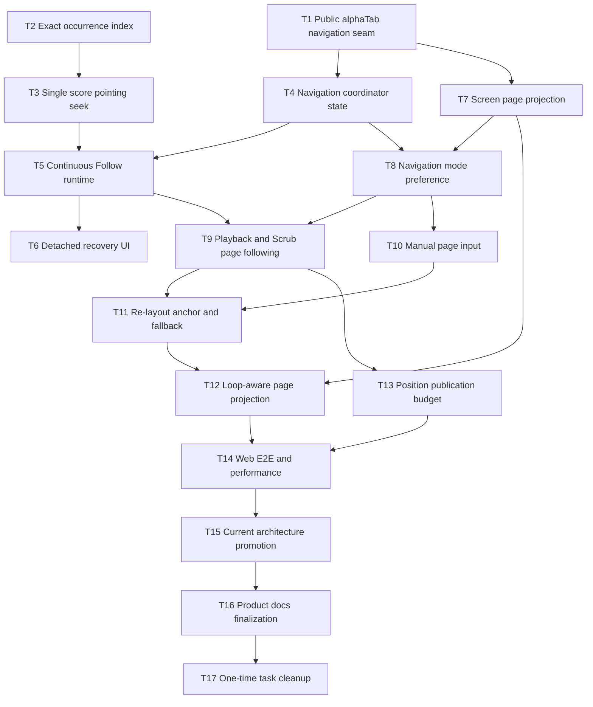

# Implementation Plan: Viewer Playback Navigation Sync

## Overview

在一个稳定的 alphaTab runtime 和纵向 Page layout 上交付精确谱面点击定位、Continuous Follow、
Page Turn、Following / Detached、Scrub 视口同步和 Web 性能验收。当前 Feature Contract 继续作为
已实现行为事实源；初步 Spec 描述目标，Proposed ADR 0064 记录难以逆转的所有权与布局取舍。

本计划不实施 iOS、Xcode 或实体 iPad 验收，不引入 alphaTab 私有 API、Horizontal 长卷、打印分页、
自研谱表虚拟化或新的状态库。

## Planning Baseline

- Current behavior:
  `docs/features/contracts/viewer-playback-navigation.md`
- Target Spec:
  `docs/superpowers/specs/2026-07-25-viewer-score-navigation-playback-sync-design.md`
- Proposed decision:
  `docs/adr/0064-coordinate-score-navigation-with-playback.md`
- Current playback model:
  `packages/web-core/src/playback`
- alphaTab / Viewer DOM boundary:
  `packages/web-core/src/gp/alphaTabBrowser.ts`,
  `packages/web-viewer/src/viewerApp.tsx`
- UI contract:
  `DESIGN.md`

开始 Task 1 前，应先单独落地当前工作区中的 Contract / Spec 文档拆分，并由维护者批准本计划。每个
Task 在 focused tests 通过后形成独立 commit；不得把多个 checkpoint 合并成一次大提交。

## Architecture Decisions

- alphaTab owns the audio clock, animated cursor, beat hit testing, and rendered score coordinates.
- `PlaybackController` owns transport, formal seek, `PlaybackOccurrence`, Loop, and persistence semantics.
- `ScoreNavigationCoordinator` lives at the `web-viewer` alphaTab/DOM boundary and owns viewport navigation,
  Screen Score Page projection, and `Following | Detached`.
- React receives low-frequency navigation/view state only. Cursor geometry, `scrollTop`, and per-frame Scrub
  Preview stay outside React state.
- A formal user seek always passes through `PlaybackController`. Scrub Preview is the only temporary engine-only
  path and commits once on release.
- Page Turn reuses one complete vertical alphaTab layout. It never reloads the score per page.
- Current Browser and Desktop default to Continuous Follow. iPad defaults remain a future host concern and are not
  part of this Web-only delivery.

## Dependency Graph

## Task List

### Phase 1: Risk-first foundations

- [ ] Task 1: Establish the public alphaTab navigation seam.
- [ ] Task 2: Build an exact playback occurrence index.

### Checkpoint A: Public capability gate

- [ ] Locked alphaTab 1.8.4 public APIs provide stable staff-system bounds and cursor callbacks.
- [ ] A repeat fixture produces multiple distinguishable playback occurrences.
- [ ] No private alphaTab field or fork is required.
- [ ] Focused tests and `pnpm typecheck` pass.
- [ ] Human review confirms ADR 0064 remains implementable.

### Phase 2: Authoritative seek and Continuous Follow

- [ ] Task 3: Make score pointing seek single-authority.
- [ ] Task 4: Implement the navigation coordinator state model.
- [ ] Task 5: Deliver Continuous Follow in the Viewer runtime.

### Checkpoint B: Continuous flow

- [ ] Score click selects the intended occurrence without changing transport.
- [ ] Playback follows complete score systems inside the score container.
- [ ] Manual navigation detaches follow without programmatic scroll false positives.
- [ ] `pnpm verify:fast` passes.
- [ ] Browser fixture smoke check has no console errors.

### Phase 3: Recovery UI and Page Turn foundation

- [ ] Task 6: Add Detached recovery UI and localized navigation copy.
- [ ] Task 7: Implement pure Screen Score Page projection.
- [ ] Task 8: Add device-local navigation mode preference and controls.

### Checkpoint C: Manual page mode

- [ ] Users can switch modes without pausing or seeking.
- [ ] Page Turn shows stable complete-system pages and `n / m`.
- [ ] Return-to-playback restores Following.
- [ ] Focused UI tests, `pnpm check:i18n`, and `pnpm demo:build` pass.

### Phase 4: Playback-aware Page Turn

- [ ] Task 9: Follow playback and Scrub across pages.
- [ ] Task 10: Add manual page navigation inputs.
- [ ] Task 11: Preserve anchors across alphaTab re-layout.
- [ ] Task 12: Repack short cross-page Loops.

### Checkpoint D: Page Turn behavior

- [ ] Auto page turn, manual page navigation, resize, zoom, and Scrub use one current generation.
- [ ] Stale animations and render callbacks cannot override the latest intent.
- [ ] Short cross-page Loops remain on one page when their systems fit.
- [ ] `pnpm verify:fast` and the focused Browser E2E scenario pass.

### Phase 5: Performance and acceptance

- [ ] Task 13: Enforce the position publication budget.
- [ ] Task 14: Complete Web E2E and performance evidence.
- [ ] Task 15: Promote verified behavior into Current architecture and ADRs.
- [ ] Task 16: Finalize product language, UI contract, and Spec history.
- [ ] Task 17: Remove completed one-time task records.

### Checkpoint Complete

- [ ] `pnpm verify:fast` passes.
- [ ] `pnpm demo:build` passes.
- [ ] `pnpm demo:test:e2e` passes.
- [ ] Chromium checks pass at 1440×900, 768×1024, and 1024×768.
- [ ] A representative long score plays for 30 minutes without sustained jank, monotonic memory growth, or audio
      interruption caused by navigation.
- [ ] `pnpm check:docs`, `pnpm format:check`, and `git diff --check` pass.
- [ ] Feature Contract current behavior and `last_verified` match reproducible evidence.

## Detailed Tasks

## Task 1: Establish the public alphaTab navigation seam

**Description:** Prove the highest-risk integration assumption before building UI. Extend the existing typed
alphaTab facade only with public 1.8.4 APIs needed for `postRenderFinished`, `boundsLookup.staffSystems`, and
`customScrollHandler`, then normalize those values behind a small `web-viewer` navigation adapter.

**Acceptance criteria:**

- [ ] A completed render produces ordered, finite staff-system bounds with stable written anchors.
- [ ] Cursor callbacks expose the current system without leaking alphaTab classes into React state.
- [ ] Missing or malformed bounds return an unavailable result; implementation uses no private alphaTab field.

**Verification:**

- [ ] Tests pass:
      `pnpm vitest run packages/web-core/src/gp/__tests__/alphaTabBrowser.test.ts packages/web-viewer/src/score-navigation/__tests__/alpha-tab-navigation.test.ts`
- [ ] Typecheck passes: `pnpm typecheck`
- [ ] Manual source check confirms every consumed member exists in the locked alphaTab 1.8.4 public declaration.

**Dependencies:** None.

**Files likely touched:**

- `packages/web-core/src/gp/alphaTabBrowser.ts`
- `packages/web-core/src/gp/__tests__/alphaTabBrowser.test.ts`
- `packages/web-viewer/src/score-navigation/alpha-tab-navigation.ts`
- `packages/web-viewer/src/score-navigation/__tests__/alpha-tab-navigation.test.ts`

**Estimated scope:** Medium, 4 files.

## Task 2: Build an exact playback occurrence index

**Description:** Replace the written-duration heuristic with an occurrence index derived from alphaTab's expanded
playback timeline. Reuse the existing `PlaybackOccurrence` / `PositionMap` domain language and preserve
repeat/jump path identity.

**Acceptance criteria:**

- [ ] A repeated Written Position maps to distinct ordered occurrences with stable path identity.
- [ ] Resolution can select the current path, the next occurrence, or the first fallback without guessing from
      total written duration.
- [ ] A real repeat-ending fixture covers at least first-pass and second-pass lookup.

**Verification:**

- [ ] Tests pass:
      `pnpm vitest run packages/web-core/src/score/__tests__/positions.test.ts packages/web-core/src/playback/__tests__/alphaTabPlaybackAdapter.test.ts`
- [ ] Typecheck passes: `pnpm typecheck`

**Dependencies:** None; coordinate any `AlphaTabApiLike` edits with Task 1.

**Files likely touched:**

- `packages/web-core/src/score/positions.ts`
- `packages/web-core/src/score/__tests__/positions.test.ts`
- `packages/web-core/src/playback/alphaTabPlaybackAdapter.ts`
- `packages/web-core/src/playback/__tests__/alphaTabPlaybackAdapter.test.ts`

**Estimated scope:** Medium, 4 files.

## Task 3: Make score pointing seek single-authority

**Description:** Wire exact occurrence resolution into Viewer score clicks and disable alphaTab's built-in
seek/range side effects while retaining public beat/note hit events. A click or tap must submit one formal
`PlaybackController` seek.

**Acceptance criteria:**

- [ ] A valid score click dispatches exactly one seek and preserves playing/paused transport.
- [ ] Repeat clicks follow the current-path → next → first fallback rule.
- [ ] Drag and pinch suppression remains intact and cannot commit a seek on gesture end.

**Verification:**

- [ ] Tests pass:
      `pnpm vitest run packages/web-core/src/gp/__tests__/alphaTabBrowser.test.ts packages/web-core/src/playback/__tests__/writtenSelection.test.ts packages/web-viewer/src/__tests__/viewerApp.test.ts`
- [ ] Manual Browser check uses `test-fixtures/musicxml/generated/repeat-ending.musicxml`.

**Dependencies:** Task 2.

**Files likely touched:**

- `packages/web-core/src/playback/writtenSelection.ts`
- `packages/web-core/src/playback/__tests__/writtenSelection.test.ts`
- `packages/web-viewer/src/viewerApp.tsx`
- `packages/web-viewer/src/__tests__/viewerApp.test.ts`

**Estimated scope:** Medium, 4 files.

## Task 4: Implement the navigation coordinator state model

**Description:** Introduce a framework-independent `ScoreNavigationCoordinator` with explicit mode, generation,
anchor, and `Following | Detached` transitions. DOM movement is expressed through an injected viewport port so
state tests do not require alphaTab or React.

**Acceptance criteria:**

- [ ] Manual wheel/pointer/touch/page intent enters Detached; programmatic scroll results do not.
- [ ] Formal seek, stop, mode change, and return-to-playback enter Following; play/pause preserve state.
- [ ] A newer generation invalidates stale render and animation callbacks.

**Verification:**

- [ ] Tests pass:
      `pnpm vitest run packages/web-viewer/src/score-navigation/__tests__/score-navigation-coordinator.test.ts`
- [ ] Typecheck passes: `pnpm typecheck`

**Dependencies:** Task 1.

**Files likely touched:**

- `packages/web-viewer/src/score-navigation/score-navigation-coordinator.ts`
- `packages/web-viewer/src/score-navigation/__tests__/score-navigation-coordinator.test.ts`

**Estimated scope:** Small, 2 files.

## Task 5: Deliver Continuous Follow in the Viewer runtime

**Description:** Attach the coordinator to the live alphaTab session and score scroll container. On system changes,
Following positions the system near the upper quarter with a cancellable 160–220ms transition; Scrub and reduced
motion use direct positioning.

**Acceptance criteria:**

- [ ] Playback crosses systems by moving only the score container and never the document root.
- [ ] New system targets cancel older animation; Detached suppresses automatic movement.
- [ ] Session destroy detaches alphaTab events, input listeners, frames, and animation handles.

**Verification:**

- [ ] Tests pass:
      `pnpm vitest run packages/web-viewer/src/score-navigation/__tests__/score-navigation-coordinator.test.ts packages/web-viewer/src/__tests__/viewerApp.test.ts`
- [ ] Browser smoke check loads `test-fixtures/musicxml/K331-3_reviewed.mxl` and verifies cross-system follow.

**Dependencies:** Tasks 3 and 4.

**Files likely touched:**

- `packages/web-viewer/src/score-navigation/score-navigation-coordinator.ts`
- `packages/web-viewer/src/score-navigation/__tests__/score-navigation-coordinator.test.ts`
- `packages/web-viewer/src/host.ts`
- `packages/web-viewer/src/viewerApp.tsx`
- `packages/web-viewer/src/__tests__/viewerApp.test.ts`

**Estimated scope:** Medium, 5 files.

## Task 6: Add Detached recovery UI

**Description:** Expose low-frequency navigation state to the Viewer controls and add a compact localized
return-to-playback action visible only while Detached. Add all mode/page copy now so later tasks do not ship
hard-coded strings.

**Acceptance criteria:**

- [ ] Detached displays one accessible return action; Following removes it without persistent explanatory copy.
- [ ] Activating the action repositions to the current cursor without seeking or changing transport.
- [ ] Chinese and English catalogs contain the complete navigation control vocabulary.

**Verification:**

- [ ] Tests pass:
      `pnpm vitest run packages/app-i18n/src/__tests__/catalog.test.ts packages/web-viewer/src/features/__tests__/PlaybackWorkspace.test.tsx`
- [ ] i18n gate passes: `pnpm check:i18n`

**Dependencies:** Task 5.

**Files likely touched:**

- `packages/app-i18n/src/locales/zh-CN.ts`
- `packages/app-i18n/src/locales/en-US.ts`
- `packages/web-viewer/src/features/PlaybackWorkspace.tsx`
- `packages/web-viewer/src/features/PlaybackWorkspace.module.css`
- `packages/web-viewer/src/features/__tests__/PlaybackWorkspace.test.tsx`

**Estimated scope:** Medium, 5 files.

## Task 7: Implement Screen Score Page projection

**Description:** Add a pure greedy projection from ordered staff-system bounds and viewport height to complete
Screen Score Pages. The function owns no DOM and can be tested exhaustively before Page Turn UI exists.

**Acceptance criteria:**

- [ ] Pages contain consecutive complete systems and account for real inter-system gaps.
- [ ] A system taller than the viewport becomes one explicit oversized page.
- [ ] Projection returns stable first-system anchors and deterministic system-to-page lookup.

**Verification:**

- [ ] Tests pass:
      `pnpm vitest run packages/web-viewer/src/score-navigation/__tests__/screen-score-pages.test.ts`

**Dependencies:** Task 1.

**Files likely touched:**

- `packages/web-viewer/src/score-navigation/screen-score-pages.ts`
- `packages/web-viewer/src/score-navigation/__tests__/screen-score-pages.test.ts`

**Estimated scope:** Small, 2 files.

## Task 8: Add navigation mode preference

**Description:** Persist `continuous | page-turn` as a device-local Viewer preference and add a compact ContextPopup
mode control. Switching while playing preserves transport/position, cancels old navigation, rebuilds the current
projection, and returns to Following.

**Acceptance criteria:**

- [ ] Browser and Desktop default to Continuous; a user selection survives a new application instance.
- [ ] Switching modes does not pause, seek, change Loop, or recreate alphaTab.
- [ ] Page Turn exposes localized previous/next controls and `n / m`; Continuous hides page-only UI.

**Verification:**

- [ ] Tests pass:
      `pnpm vitest run packages/web-viewer/src/app/__tests__/appStore.test.ts packages/web-viewer/src/features/__tests__/PlaybackWorkspace.test.tsx`
- [ ] i18n gate passes: `pnpm check:i18n`
- [ ] Web build passes: `pnpm demo:build`

**Dependencies:** Tasks 4, 6, and 7.

**Files likely touched:**

- `packages/web-viewer/src/app/appStore.tsx`
- `packages/web-viewer/src/app/__tests__/appStore.test.ts`
- `packages/web-viewer/src/features/PlaybackWorkspace.tsx`
- `packages/web-viewer/src/features/PlaybackWorkspace.module.css`
- `packages/web-viewer/src/features/__tests__/PlaybackWorkspace.test.tsx`

**Estimated scope:** Medium, 5 files.

## Task 9: Follow playback across pages

**Description:** Connect current cursor systems and existing Scrub Preview to page lookup. Normal playback switches
only when the target page changes; Scrub skips obsolete pages and directly presents the latest target.

**Acceptance criteria:**

- [ ] Following switches once when playback enters a new page and does not animate intermediate pages.
- [ ] Scrub updates only the latest target page per frame and formal commit restores normal behavior.
- [ ] Detached suppresses playback and Scrub viewport following until a formal positioning intent restores it.

**Verification:**

- [ ] Tests pass:
      `pnpm vitest run packages/web-viewer/src/score-navigation/__tests__/score-navigation-coordinator.test.ts packages/web-viewer/src/features/__tests__/PlaybackWorkspace.test.tsx packages/web-viewer/src/__tests__/viewerApp.test.ts`

**Dependencies:** Tasks 5 and 8.

**Files likely touched:**

- `packages/web-viewer/src/score-navigation/score-navigation-coordinator.ts`
- `packages/web-viewer/src/score-navigation/__tests__/score-navigation-coordinator.test.ts`
- `packages/web-viewer/src/viewerApp.tsx`
- `packages/web-viewer/src/__tests__/viewerApp.test.ts`

**Estimated scope:** Medium, 4 files.

## Task 10: Add manual page navigation input

**Description:** Implement previous/next buttons, PageUp/PageDown, one-page-per-wheel-gesture behavior, and horizontal
swipe. Do not add hidden score-edge targets or consume left/right arrows.

**Acceptance criteria:**

- [ ] All supported inputs move exactly one page per discrete gesture and enter Detached.
- [ ] Wheel/trackpad inertia cannot cascade through multiple pages.
- [ ] Score tap seek and pinch zoom remain distinguishable from swipe navigation.

**Verification:**

- [ ] Tests pass:
      `pnpm vitest run packages/web-viewer/src/features/__tests__/PlaybackWorkspace.test.tsx packages/web-viewer/src/components/__tests__/ScoreViewer.test.tsx packages/web-viewer/src/score-navigation/__tests__/score-navigation-coordinator.test.ts`
- [ ] Manual check covers mouse wheel, trackpad-equivalent wheel events, touch swipe, and keyboard focus exclusions.

**Dependencies:** Task 8.

**Files likely touched:**

- `packages/web-viewer/src/features/PlaybackWorkspace.tsx`
- `packages/web-viewer/src/features/PlaybackWorkspace.module.css`
- `packages/web-viewer/src/features/__tests__/PlaybackWorkspace.test.tsx`
- `packages/web-viewer/src/components/ScoreViewer.tsx`
- `packages/web-viewer/src/components/__tests__/ScoreViewer.test.tsx`

**Estimated scope:** Medium, 5 files.

## Task 11: Preserve anchors across re-layout

**Description:** Rebuild the page table after `postRenderFinished`, resize, zoom, or visible-track changes using a
generation guard. Following anchors the cursor system; Detached anchors the first browsed system. Invalid bounds
temporarily degrade to Continuous without changing the saved preference.

**Acceptance criteria:**

- [ ] Re-layout preserves the correct written system anchor for Following and Detached.
- [ ] Old generations cannot overwrite a later resize, zoom, mode, or score-open result.
- [ ] Invalid page bounds keep playback usable, retain the selected preference, and retry after the next complete
      render.

**Verification:**

- [ ] Tests pass:
      `pnpm vitest run packages/web-viewer/src/score-navigation/__tests__/score-navigation-coordinator.test.ts packages/web-viewer/src/__tests__/viewerApp.test.ts packages/web-viewer/src/components/__tests__/ScoreViewer.test.tsx`

**Dependencies:** Tasks 9 and 10.

**Files likely touched:**

- `packages/web-viewer/src/score-navigation/score-navigation-coordinator.ts`
- `packages/web-viewer/src/score-navigation/__tests__/score-navigation-coordinator.test.ts`
- `packages/web-viewer/src/viewerApp.tsx`
- `packages/web-viewer/src/__tests__/viewerApp.test.ts`

**Estimated scope:** Medium, 4 files.

## Task 12: Repack short cross-page Loops

**Description:** Add a loop-aware projection layer. If all complete systems touched by the active Loop fit in the
viewport, create one temporary stable page; otherwise retain normal pages without shrinking or splitting systems.

**Acceptance criteria:**

- [ ] A short Loop crossing a normal boundary produces one stable temporary page.
- [ ] A Loop larger than the viewport keeps normal page transitions.
- [ ] Disable, selection change, resize, or Loop edit removes stale temporary projections.

**Verification:**

- [ ] Tests pass:
      `pnpm vitest run packages/web-viewer/src/score-navigation/__tests__/screen-score-pages.test.ts packages/web-viewer/src/score-navigation/__tests__/score-navigation-coordinator.test.ts packages/web-viewer/src/__tests__/viewerApp.test.ts`

**Dependencies:** Tasks 7 and 11.

**Files likely touched:**

- `packages/web-viewer/src/score-navigation/screen-score-pages.ts`
- `packages/web-viewer/src/score-navigation/__tests__/screen-score-pages.test.ts`
- `packages/web-viewer/src/score-navigation/score-navigation-coordinator.ts`
- `packages/web-viewer/src/score-navigation/__tests__/score-navigation-coordinator.test.ts`
- `packages/web-viewer/src/viewerApp.tsx`

**Estimated scope:** Medium, 5 files.

## Task 13: Enforce the position publication budget

**Description:** Coalesce ordinary playing position notifications to at most about 10Hz while preserving immediate
transport, formal seek, stop, Loop-boundary, pause, flush, and final-position semantics. alphaTab cursor animation
must remain independent.

**Acceptance criteria:**

- [ ] Continuous engine position events notify React no more than the configured budget.
- [ ] Semantic boundaries publish immediately and the latest position is flushed before pause/destroy persistence.
- [ ] Scrub Preview remains notification-free and engine cursor updates are not throttled.

**Verification:**

- [ ] Tests pass:
      `pnpm vitest run packages/web-core/src/playback/__tests__/playbackController.test.ts packages/web-viewer/src/features/__tests__/PlaybackWorkspace.test.tsx`
- [ ] Typecheck passes: `pnpm typecheck`

**Dependencies:** Task 9.

**Files likely touched:**

- `packages/web-core/src/playback/playbackController.ts`
- `packages/web-core/src/playback/__tests__/playbackController.test.ts`
- `packages/web-viewer/src/features/PlaybackWorkspace.tsx`
- `packages/web-viewer/src/features/__tests__/PlaybackWorkspace.test.tsx`

**Estimated scope:** Medium, 4 files.

## Task 14: Complete Web acceptance evidence

**Description:** Add one Browser E2E scenario using representative long and repeated scores, then collect the
specified viewport and 30-minute performance evidence. This task fixes only defects required by the Spec; it does
not expand product scope.

**Acceptance criteria:**

- [ ] Chromium covers click occurrence, Continuous Follow, detach/return, mode switch, manual/auto page turn,
      Scrub, resize/zoom, and Loop-aware pages.
- [ ] The scenario runs at 1440×900, 768×1024, and 1024×768 with no console errors.
- [ ] Scrub feedback is below 50ms in measurement and 30-minute playback shows no sustained jank, monotonic memory
      growth, or navigation-caused audio interruption.

**Verification:**

- [ ] Focused E2E passes:
      `pnpm demo:test:e2e -- e2e/viewer-navigation.spec.ts`
- [ ] Web build passes: `pnpm demo:build`
- [ ] Final Web gate passes: `pnpm verify:fast && pnpm demo:test:e2e`

**Dependencies:** Tasks 12 and 13.

**Files likely touched:**

- `apps/web-demo/e2e/viewer-navigation.spec.ts`
- Existing runtime/test file for any defect proven by E2E; keep each corrective commit separately scoped.

**Estimated scope:** Small for the acceptance harness; defect fixes are separate follow-up commits.

## Task 15: Promote verified behavior into Current architecture

**Description:** After Web evidence passes, move delivered gaps into current Feature behavior, accept ADR 0064, and
record the actual implemented ownership/lifecycle in Current architecture. Do not copy the whole Spec.

**Acceptance criteria:**

- [ ] Feature Contract current behavior, platform matrix, evidence map, gaps, and `last_verified` match code/tests.
- [ ] ADR 0064 is accepted only with an explicit Web acceptance scope and ADR index update.
- [ ] Current architecture describes the actual coordinator/runtime boundaries and links the Contract.

**Verification:**

- [ ] Docs gate passes: `pnpm check:docs && pnpm check:arch`
- [ ] Format and diff checks pass: `pnpm format:check && git diff --check`

**Dependencies:** Task 14.

**Files likely touched:**

- `docs/features/contracts/viewer-playback-navigation.md`
- `docs/adr/0064-coordinate-score-navigation-with-playback.md`
- `docs/adr/README.md`
- `docs/architecture/react-application-system.md`
- `docs/architecture/README.md`

**Estimated scope:** Medium, 5 files.

## Task 16: Finalize product design records

**Description:** Promote only verified interaction rules into product language and `DESIGN.md`, mark the initial
Spec as Historical with replacement links, and remove Proposed terminology markers that are no longer true.

**Acceptance criteria:**

- [ ] `CONTEXT.md`, glossary, and `DESIGN.md` distinguish current delivered behavior from remaining non-goals.
- [ ] The initial Spec is Historical and points to the Current Contract, accepted ADR, and architecture.
- [ ] No target-only statement remains in a Current document without runtime/test evidence.

**Verification:**

- [ ] Checks pass:
      `pnpm check:context && pnpm check:design && pnpm check:docs`
- [ ] Format and diff checks pass: `pnpm format:check && git diff --check`

**Dependencies:** Task 15.

**Files likely touched:**

- `CONTEXT.md`
- `DESIGN.md`
- `docs/architecture/glossary.md`
- `docs/superpowers/specs/2026-07-25-viewer-score-navigation-playback-sync-design.md`

**Estimated scope:** Medium, 4 files.

## Task 17: Remove completed one-time task records

**Description:** After the human accepts the delivered Feature and all previous task commits, remove this plan and
todo file as required by repository policy. Durable behavior must already exist in the Contract, architecture,
accepted ADR, product context, and UI contract.

**Acceptance criteria:**

- [ ] No unresolved checklist item or open implementation decision remains in either task file.
- [ ] Deleting task records loses no durable constraint or acceptance evidence.

**Verification:**

- [ ] Final gates pass:
      `pnpm verify:fast && pnpm demo:build && pnpm demo:test:e2e`
- [ ] Repository checks pass: `pnpm check:docs && pnpm format:check && git diff --check`

**Dependencies:** Task 16 and explicit human acceptance.

**Files likely touched:**

- `tasks/plan.md`
- `tasks/todo.md`

**Estimated scope:** Small, 2 files.

## Parallelization Opportunities

- Tasks 1 and 2 can run in parallel only after agreeing who owns edits to `AlphaTabApiLike`; otherwise run
  sequentially to avoid a shared-file conflict.
- Task 6 catalog/UI work and Task 7 pure page projection are safe to parallelize after Task 5 establishes the
  navigation session surface.
- Browser E2E scaffolding for Task 14 can begin after Task 8 stabilizes accessible control names, but assertions
  for Tasks 9–13 must remain pending until those behaviors exist.
- Tasks 15–17 are sequential because they change lifecycle status and current sources of truth.

## Risks and Mitigations

| Risk                                                              | Impact | Mitigation                                                                                                                     |
| ----------------------------------------------------------------- | ------ | ------------------------------------------------------------------------------------------------------------------------------ |
| Public alphaTab bounds or cursor callbacks are insufficient       | High   | Task 1 is a stop/go gate. Use only documented public API; revise Spec/ADR before considering a patch or fork.                  |
| alphaTab expanded timeline cannot expose stable repeat/jump paths | High   | Reuse `PositionMap`; prove a real repeat fixture in Task 2 before removing the heuristic.                                      |
| Lazy rendering shows a blank target page                          | High   | Measure in Task 14; prewarm only through public render-result APIs if needed, otherwise reconsider lazy loading for Page Turn. |
| Programmatic scroll is mistaken for user navigation               | Medium | State transitions consume input intent, never infer Detached from a bare `scroll` event.                                       |
| Wheel inertia skips pages                                         | Medium | Group wheel events into a gesture session and accept at most one page action per session.                                      |
| Resize/zoom callbacks overwrite newer state                       | High   | Carry generation IDs through render, projection, animation, and observer callbacks.                                            |
| Position throttling loses the final resume point                  | High   | Flush the latest position at semantic boundaries and test pause/destroy persistence explicitly.                                |
| Page Turn expands React high-frequency state                      | Medium | Keep cursor geometry and scroll in the coordinator; React receives only mode/page/follow state.                                |
| Documentation is promoted before implementation                   | High   | Tasks 15–16 depend on Web acceptance and update the Current Contract only from reproducible evidence.                          |

## Open Questions

None. Product decisions are fixed by the initial Spec and ADR 0064. If Task 1 or Task 2 disproves a foundational
assumption, stop at Checkpoint A and revise the Proposed documents rather than silently selecting a private API or
heuristic fallback.

## Definition of Done

The skill's referenced `references/definition-of-done.md` is not present in the installed skill. This plan uses
the repository `AGENTS.md` rules instead:

- run focused tests first;
- run `pnpm verify:fast`;
- run `pnpm demo:build` and Browser E2E for this Web-only scope;
- run `pnpm check:i18n` for user-visible copy;
- update the Current Feature Contract only after verified behavior changes;
- before each commit run `pnpm format:check` and `git diff --check`;
- delete completed one-time plan/task records after durable documentation is current.
