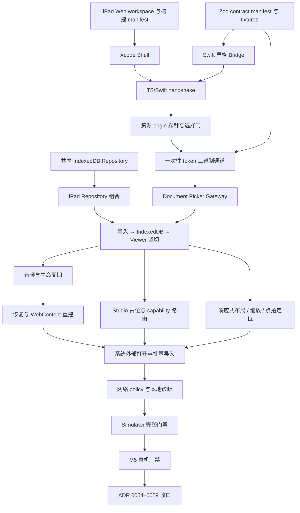

# Implementation Plan: iPad Practice Player

## Overview

实现一个以 Viewer 练习为核心的原生 iPad 交付面：薄 SwiftUI/WKWebView Shell 承载共享 React
Library 与 Viewer，个人原型阶段复用 IndexedDB，通过版本化 JSON RPC Bridge 与一次性 token 数据
通道接入系统文件、生命周期和音频能力。实施顺序先验证最危险的 WebKit 资源 origin、Worker、
AudioWorklet、Web Crypto 与 IndexedDB 边界，再完成导入到 Viewer 的首条竖切，最后扩展恢复、
触控布局和完整 MVP。

Canonical spec：
`docs/superpowers/specs/2026-07-22-ipad-practice-player-design.md`。

## Definition of Done

技能引用的 `references/definition-of-done.md` 在本机安装中缺失，因此本计划采用项目自身门禁：

- 每项任务先写或更新最小相关测试，再实现行为。
- 每项任务执行任务中列出的最小验证命令。
- 每个 Checkpoint 执行 `pnpm verify:fast`；涉及 Web 产物时再执行 `pnpm ipad:web:build`，涉及
  Xcode 时执行 `pnpm ipad:test` 或 `pnpm ipad:verify`。
- 不把 Simulator 结果报告为真机音频、内存或触控验收。
- 不修改或清理当前工作树中与 iPad 任务无关的用户文件。

## Architecture Decisions

- 新增 `apps/ipad-shell`；SwiftUI 只拥有 WKWebView、Bridge、文件、生命周期、音频、导航 policy
  与诊断，不复制业务 UI。
- 新建共享 IndexedDB Repository package，供 Browser Demo 与 iPad Web entry 通过公开入口复用；
  `web-viewer` 不直接依赖 IndexedDB。
- Zod 继续作为 Bridge 契约事实源；iPad 控制面只使用小型 JSON，二进制通过一次性 token 数据
  通道读取。
- 资源 origin 不是预设答案。先探测自定义 scheme；若失败，再探测 `loadFileURL`；两者都失败
  才评估 loopback server 和新依赖。
- Web 资产构建时生成且不提交；Release 只执行 App Bundle 内代码。
- proposed ADR 0054–0059 只有在对应探针和集成证据成立后才转为 accepted/Current。

## Dependency Graph

## Task List

### Phase 1: Build, Bridge and Resource-Origin Foundation

- [x] Task 1: 建立 iPad Web workspace
- [x] Task 2: 生成并验证 iPad Web 资源 manifest
- [x] Task 3: 建立最小 SwiftUI/Xcode App Shell
- [x] Task 4: 从 Zod 生成 transport-neutral Bridge contract
- [x] Task 5: 建立 Swift 严格 Bridge 解码与双端 fixtures
- [x] Task 6: 打通 Web/Swift handshake 与启动错误
- [x] Task 7: 探测只读自定义 scheme 资源 origin
- [x] Task 8: 条件探测 `loadFileURL` 资源 origin（Task 7 通过，条件未触发）

### Checkpoint A: Shell Foundation

- [x] `pnpm verify:fast` 通过。
- [x] `pnpm ipad:web:build` 产生完整且通过 hash 校验的资源目录。
- [x] `pnpm ipad:test` 在 Simulator 完成 App 启动、handshake 成功与不兼容失败测试。
- [x] 记录当前 provisional resource origin 与未能在 Simulator 证明的真机能力。
- [x] 未选择或引入 loopback server 依赖；若前两种候选都失败，回到人类评审。

### Phase 2: First Import-to-Viewer Vertical Slice

- [x] Task 9: 提取共享 IndexedDB Library Repository package
- [x] Task 10: 让 Browser Demo 消费共享 IndexedDB Repository
- [x] Task 11: 实现 Swift 一次性文件 token 与二进制 scheme
- [x] Task 12: 打通 Document Picker 与 iPad ScoreFileGateway
- [x] Task 13: 组合 iPad IndexedDB Library、Gateway 与 Viewer session
- [x] Task 14: 建立 Simulator 单文件导入到 Viewer 的 smoke test

### Checkpoint B: Core Vertical Slice

- [x] GP 与 MusicXML 各至少一份 fixture 能从系统选择语义进入 IndexedDB 并打开共享 Viewer。
- [x] JavaScript、route、日志和诊断均看不到绝对路径或 security-scoped URL。
- [x] token 成功、取消、过期、重复消费与 Shell 销毁行为都有自动化证据。
- [x] `pnpm verify:fast && pnpm ipad:verify` 通过。

### Phase 3: Playback Lifecycle and Recovery

- [x] Task 15: 配置前台可混音的 Audio Session
- [x] Task 16: 将 iPad 生命周期映射为 pause-and-flush
- [x] Task 17: 恢复上次 Viewer 并处理 WebContent 进程终止

### Checkpoint C: Lifecycle

- [x] 后台、音频中断和耳机断开都暂停并 flush，返回前台绝不自动播放。
- [x] 冷启动与 WebContent 重建恢复同一 Library Score 和位置，损坏/删除时回到 Library。
- [x] 生命周期重复事件、迟到 ack 和超时不创建第二个 Viewer Session。
- [x] `pnpm verify:fast && pnpm ipad:verify` 通过。

### Phase 4: iPad Viewer Interaction

- [x] Task 18: 添加 iPad capability 路由与 Studio 占位页
- [x] Task 19: 实现横屏、竖屏和 Split View 布局
- [x] Task 20: 实现谱面专属缩放
- [ ] Task 21: 实现点拍定位与触控手势仲裁

### Checkpoint D: Viewer Interaction

- [ ] 三档容器宽度下主要 Transport、循环状态和返回 Library 路径始终可用。
- [ ] resize、缩放和点拍定位不重建 Session、不跳回开头、不破坏播放/循环状态。
- [ ] Studio URL 显示占位状态且不创建 Studio runtime；Library 不展示 Studio 入口。
- [ ] `pnpm verify:fast && pnpm ipad:verify` 通过。

### Phase 5: Complete MVP Host Surfaces

- [ ] Task 22: 接入系统“用 Zupulse 打开”待处理队列
- [ ] Task 23: 完成多选与部分成功导入汇总
- [ ] Task 24: 落实网络 allowlist、顶层导航与 Release 代码边界
- [ ] Task 25: 实现本地最小诊断与主动导出

### Checkpoint E: Complete Simulator MVP

- [ ] 应用内选择、系统外部打开、单文件自动进 Viewer 与批量留在 Library 语义一致。
- [ ] 非 allowlist 请求、未知 scheme、远程顶层导航和 Release dev-server 配置被拒绝。
- [ ] 诊断包不包含路径、token、曲谱字节、文件名、元数据、完整哈希或 Bridge payload。
- [ ] `pnpm verify && pnpm ipad:verify` 通过；现有 Browser 与 Desktop 构建无回归。

### Phase 6: Verification and Decision Closure

- [ ] Task 26: 完成统一 iPad 验证命令与 Simulator 验收记录
- [ ] Task 27: 在 M5 真机完成风险门禁
- [ ] Task 28: 接受 Shell、Bridge 与数据面 ADR
- [ ] Task 29: 接受网络、契约与构建 ADR

### Checkpoint F: Complete

- [ ] 首屏 P95 ≤ 3 秒、播放就绪 ≤ 5 秒、核心交互反馈 ≤ 100 ms。
- [ ] 真机连续播放 20 分钟，并完成旋转、Split View、触控、音频中断和 WebContent 重建。
- [ ] 连续打开/关闭 20 份代表性曲谱后内存不呈单调增长。
- [ ] 选定资源 origin 的可重复证据已归档；失败候选没有被静默忽略。
- [ ] ADR 0054–0059 与实际实现一致并完成状态更新。
- [ ] `pnpm verify && pnpm verify:e2e && pnpm ipad:verify` 通过。

## Parallelization Opportunities

- Task 3 与 Task 4 可在 Task 1 后并行：一个只触及 Xcode Shell，一个只触及 Zod contract。
- Task 9 与 Task 11 可在 Checkpoint A 后并行：共享 IndexedDB Repository 与 Swift token store 没有共同
  文件；必须在 Task 12/13 前合流。
- Task 15 与 Task 18 可在 Checkpoint B 后并行：Audio Session 与 React route capability 相互独立。
- Task 19–21 共享 Viewer/ScoreViewer/CSS 边界，应顺序执行，避免同时改写同一交互面。
- Task 24 与 Task 25 的 Swift policy/diagnostics 可以并行，但最终都必须经过 Task 26 的 Release
  泄漏检查。

## Risks and Mitigations

| Risk                                              | Impact | Mitigation                                                                     |
| ------------------------------------------------- | ------ | ------------------------------------------------------------------------------ |
| 自定义 scheme 不是满足 alphaTab 的 secure context | 高     | Task 7 先测 Web Crypto、Worker、AudioWorklet 与 IndexedDB；失败立即进入 Task 8 |
| `loadFileURL` origin 在更新后漂移                 | 高     | 使用稳定性 fixture 和重启/替换资源测试；不满足则停止并评审 loopback 方案       |
| WKWebView JSON 消息复制大文件                     | 高     | Bridge 只传 metadata/token，Task 11 建立受限二进制通道                         |
| Browser Repository 无公共复用边界                 | 中     | Task 9 提取独立 package，禁止从 app 深导入或把 IndexedDB 放进 web-viewer       |
| Swift 与 Zod contract 漂移                        | 高     | manifest + 双端 valid/invalid fixtures + exhaustive method coverage            |
| M5 掩盖性能问题                                   | 中     | 保留现有 3s/5s 门槛；正式产品化前追加较旧真机基线                              |
| 当前没有签名 Team                                 | 中     | Simulator 工作不阻塞；Task 27 明确等待 Personal Team，不能提前宣称完成         |
| iPad 响应式改动破坏 Desktop/Browser               | 高     | 以容器状态和现有 tokens 实现，Checkpoint D/E 执行共享测试和现有构建            |
| WebContent 进程回收导致白屏或自动播放             | 高     | Task 17 使用显式恢复协调器，恢复 route/位置但始终 paused                       |
| 允许联网扩大 Bridge 页面攻击面                    | 高     | 顶层 origin 锁定、HTTPS allowlist、CSP、Safari 外链和 Release 配置测试         |

## Open Questions / Decision Gates

- Resource origin 只能由 Task 7/8 与 Task 27 的证据决定；在此之前 ADR 不得标为 accepted。
- 如果自定义 scheme 与 `loadFileURL` 都失败，是否引入 loopback server/依赖必须重新取得用户确认。
- Personal Team 可用日期未知；Task 27 在此前保持明确 pending，而不是 blocked 或 waived。
- 正式产品化时的原生 Repository、无损迁移、远程域名、后台播放、Studio 和完整无障碍仍不在本计划。
