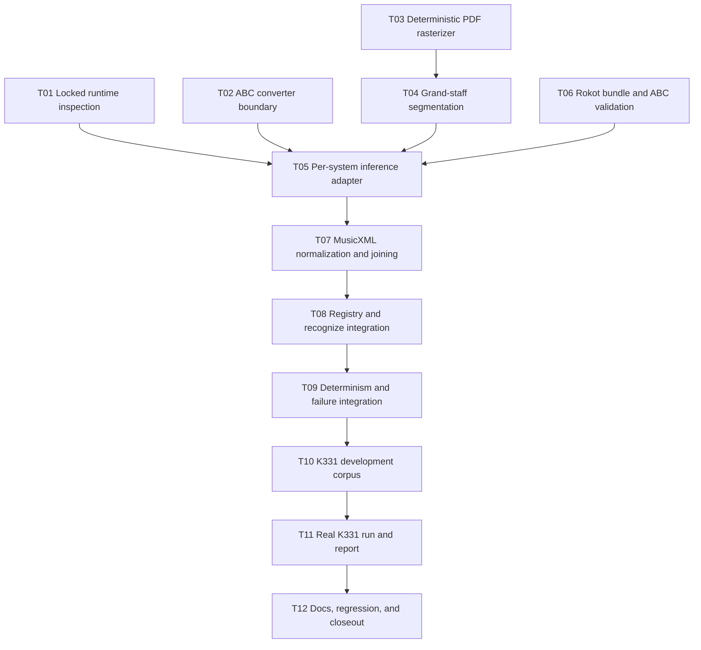

# Implementation Plan: Rokot PDF OMR Engine

## 状态

- Status: in_progress
- Date: 2026-07-31
- Approved spec: `docs/specs/2026-07-31-rokot-pdf-omr-engine-design.md`
- Execution checklist: `tasks/rokot-pdf-omr-engine/todo.md`

本计划只为 `tools/pdf-omr-cli` 增加本地 `rokot` engine，并用仓库现有 K331 fixture 做
`derived-controlled` development verification。不得修改 `apps/*`、`packages/web-core`、
`packages/web-viewer`、Bridge、Library 或产品 UI，也不得读取现有 frozen holdout 来调参。

## Goal

用户配置锁定的 Rokot Q8_0、F16 projector、`llama-cli` 与隔离 ABC converter 后，可以执行：

```bash
pnpm pdf-omr -- recognize input.pdf --engine rokot --output run
pnpm pdf-omr -- validate run/draft.json --output run/validation.json
pnpm pdf-omr -- analyze run/draft.json --output run/harmony.json
pnpm pdf-omr -- export-musicxml run/draft.json --output run/score.mxl
```

recognize 必须保存逐 system crop、ABC、MusicXML fragment、segmentation metadata 和 engine-neutral
`OmrScoreDraft`；任何环境、segmentation、ABC、conversion 或 joining 歧义必须稳定失败或产生 blocking
diagnostic，不得猜测修复。

## Non-goals

- 不实现自动模型下载、resident `llama-server`、并行 inference 或 GPU 专用调度。
- 不支持手写谱、single staff、lead sheet、TAB、打击乐或管弦总谱。
- 不把 OMR engine 放入 `harmony-cli`，也不建立反向 workspace dependency。
- 不修改 `OmrScoreDraft`、CLI error codes 或 canonical report schemas；若现有 contract 不够，先停下更新 spec。
- 不把 K331 当 independent scan、holdout 或产品准确率 gate。
- 不提交模型权重、Python environment、运行 cache 或完整 development run 目录。

## Canonical context

- Approved contract: `docs/specs/2026-07-31-rokot-pdf-omr-engine-design.md`
- Current engine boundary: `tools/pdf-omr-cli/src/engines/types.ts`
- Process lifecycle: `tools/pdf-omr-cli/src/engine-runner.ts`
- Registry: `tools/pdf-omr-cli/src/engine-registry.ts`
- Recognition transaction: `tools/pdf-omr-cli/src/commands/recognize.ts`
- Draft schema: `tools/pdf-omr-cli/src/schemas.ts`
- Existing MusicXML normalization: `tools/pdf-omr-cli/src/normalizers/musicxml-source.ts`
- Development fixture provenance: `test-fixtures/musicxml/K331-3_reviewed.provenance.json`
- Exploratory evidence: `tools/pdf-omr-cli/reports/exploratory/k331-rokot-vs-audiveris/README.md`

## Implementation rules

- 每个任务先写失败测试，再做最小实现；单任务目标不超过 5 个文件。
- 复用 PDF.js、`runEngineProcess`、canonical artifact writer、Zod 与现有 MusicXML parser。
- 不增加 OpenCV、native image dependency 或第二套 process runner。
- 所有 process 使用 argument array；禁止 shell command 拼接。
- 模型与 projector 使用 streaming SHA-256；禁止把 GGUF 整体读入内存。
- `normalizationBytes` 只传递 Zod-validated `RokotSystemBundle`，不作为 canonical artifact 写盘。
- 缺失 optional fields 时省略，不传 `undefined`；保持 `exactOptionalPropertyTypes`。
- 每个阶段结束后形成独立 checkpoint；checkpoint 失败时不进入下一阶段。

## Target structure

```text
tools/pdf-omr-cli/
  engines/
    rokot-abc2xml-runner.py
    rokot-environment.json
  src/
    render-pdf-pages.ts
    staff-system-segmentation.ts
    engines/rokot.ts
    normalizers/rokot.ts
    __tests__/
      fixtures/fake-llama-cli.mjs
      fixtures/fake-rokot-abc2xml.py
      rokot-adapter.test.ts
      rokot-normalizer.test.ts
      staff-system-segmentation.test.ts
      render-pdf-pages.test.ts
test-fixtures/musicxml/
  K331-3_rokot-development-manifest.json
```

若实现证明 fake converter 可以直接由同一测试文件生成临时脚本，则不新增
`fake-rokot-abc2xml.py`，以减少 fixture 数量。

## Dependency graph



T01、T02、T03、T06 在依赖上可独立推进，但仍按小步提交，避免把 runtime、图像和 parser 风险混在
同一个 diff。T11 是唯一需要真实模型的 gate；此前所有任务必须能用 synthetic data 和 fake process 在
CI 中运行。

## Phase 0: High-risk boundaries

### T01: 锁定 runtime environment 与 streaming provenance

**Goal:** 在任何渲染或 inference 前验证配置、模型/projector hash、`llama.cpp` build 和 converter import。

**Files (3):**

- `tools/pdf-omr-cli/engines/rokot-environment.json`
- `tools/pdf-omr-cli/src/engines/rokot.ts`
- `tools/pdf-omr-cli/src/__tests__/rokot-adapter.test.ts`

**Acceptance:**

- [ ] 缺少任一显式路径返回 `ENGINE_UNAVAILABLE/missing-rokot-configuration`。
- [ ] text model 与 projector 使用 stream 计算并验证锁定 SHA-256。
- [ ] build/version mismatch 与 converter unavailable 使用 spec 中稳定 reason。
- [ ] environment artifact 不含绝对路径、token、stderr 或 stack。
- [ ] 两个 GGUF hash、model revision、build、converter version 和 decoder settings 均可追溯。

**Verification:**

```bash
pnpm vitest run --root . tools/pdf-omr-cli/src/__tests__/rokot-adapter.test.ts
pnpm --filter @zupulse/pdf-omr-cli typecheck
```

**Dependencies:** None. **Scope:** M.

### T02: 固定 ABC converter external-process contract

**Goal:** 用隔离 Python 入口调用 `abc-xml-converter==1.0.1`，并把所有 failure 映射为稳定错误。

**Files (4):**

- `tools/pdf-omr-cli/engines/rokot-abc2xml-runner.py`
- `tools/pdf-omr-cli/src/engines/rokot.ts`
- `tools/pdf-omr-cli/src/__tests__/rokot-adapter.test.ts`
- `tools/pdf-omr-cli/src/__tests__/fixtures/fake-rokot-abc2xml.py`（仅需要时）

**Acceptance:**

- [ ] runner 接受 input/output path，不写 stdout payload，不使用 shell。
- [ ] import/version、non-zero exit、empty output 与 invalid XML 都可区分并稳定映射。
- [ ] converter source 不 vendoring；环境 provenance 记录 package/version/license。
- [ ] adapter cancellation 复用 `runEngineProcess` 并终止 process tree。

**Verification:** 同 T01 targeted test；另运行 Python runner smoke test（仅锁定环境可用时）。

**Dependencies:** None. **Scope:** S.

### T03: 抽取 deterministic PDF rasterizer

**Goal:** 复用 `pdfjs-dist` 把页面渲染为 target width 1400 的 opaque RGBA/RGB buffer，并保留坐标映射。

**Files (2):**

- `tools/pdf-omr-cli/src/render-pdf-pages.ts`
- `tools/pdf-omr-cli/src/__tests__/render-pdf-pages.test.ts`

**Acceptance:**

- [ ] 输出包含 page index、pixel/PDF dimensions、scale、pixel bytes 与 render SHA-256。
- [ ] white background、page ordering 与同输入 hash deterministic。
- [ ] unreadable、zero-page、unsupported orientation 使用稳定 structured error。
- [ ] 不新增 native image dependency。

**Verification:** targeted Vitest + package typecheck.

**Dependencies:** None. **Scope:** M.

### T04: 实现 deterministic piano grand-staff segmentation

**Goal:** 从 raster buffer 检测并按 `(pageIndex, topY)` 排序完整 grand-staff systems。

**Files (2):**

- `tools/pdf-omr-cli/src/staff-system-segmentation.ts`
- `tools/pdf-omr-cli/src/__tests__/staff-system-segmentation.test.ts`

**Acceptance:**

- [ ] synthetic tests 覆盖 valid、noise、missing line、ambiguous pairing、overlap、zero system 与 ordering。
- [ ] thresholds 全部是显式 versioned constants，并进入 segmentation metadata。
- [ ] crop padding 基于 local staff spacing，且不得与相邻 system 相交。
- [ ] pixel bbox 可确定性映射回 PDF point bbox。
- [ ] 歧义在 inference 前返回 `ENGINE_OUTPUT_INVALID/ambiguous-system-segmentation`。

**Verification:** targeted Vitest twice，比较相同 fixture 的 metadata/crop hashes；package typecheck.

**Dependencies:** T03. **Scope:** M.

### Checkpoint A: Boundaries proven without model

- [ ] runtime mismatch 在 render 前失败。
- [ ] converter boundary 有 fake-process coverage。
- [ ] raster 与 segmentation 重复运行 hash 一致。
- [ ] 没有新增 native dependency 或 schema change。
- [ ] T01-T04 最小测试与 typecheck 通过。

## Phase 1: Engine core

### T05: 定义 Rokot bundle 与严格 ABC envelope validation

**Goal:** 建立 engine-private、Zod-validated normalization boundary，并在 conversion 前拒绝非 Rokot 输出。

**Files (2):**

- `tools/pdf-omr-cli/src/normalizers/rokot.ts`
- `tools/pdf-omr-cli/src/__tests__/rokot-normalizer.test.ts`

**Acceptance:**

- [ ] `RokotSystemBundle` strict schema 覆盖 system order、bbox、crop hash、ABC 与 XML。
- [ ] 固定 header order、voice allowlist、至少一个 note/rest，并拒绝 prose/Markdown/duplicate header。
- [ ] UTF-8、envelope、unknown voice 与 empty output 使用 spec 中稳定 reason。
- [ ] 不生成模型未提供的 confidence。

**Verification:** targeted normalizer Vitest + package typecheck.

**Dependencies:** None. **Scope:** M.

### T06: 实现逐 system Rokot inference adapter

**Goal:** 串联 render、segmentation、逐 crop `llama-cli` 与 converter，保留所有 native artifacts。

**Files (4):**

- `tools/pdf-omr-cli/src/engines/rokot.ts`
- `tools/pdf-omr-cli/src/__tests__/rokot-adapter.test.ts`
- `tools/pdf-omr-cli/src/__tests__/fixtures/fake-llama-cli.mjs`
- `tools/pdf-omr-cli/src/normalizers/rokot.ts`

**Acceptance:**

- [ ] args 精确包含锁定 prompt/decoder options，且每 system 启动一次、concurrency 为 1。
- [ ] system 顺序不依赖 filesystem enumeration。
- [ ] artifacts 至少包含 `segmentation.json` 与逐 system PNG/ABC/MusicXML。
- [ ] timeout、output limit、non-zero exit 与 cancellation 有测试；取消不提交 succeeded run。
- [ ] `normalizationBytes` 是 validated bundle，且 adapter duration 汇总所有 process。

**Verification:** targeted adapter + normalizer tests，package typecheck.

**Dependencies:** T01-T05. **Scope:** L，超过 5 files 时必须再拆分。

### T07: 实现 MusicXML normalization 与跨 system Draft joining

**Goal:** 把逐 system XML 忠实映射为连续的双 staff Draft，不做 heuristic repair。

**Files (3):**

- `tools/pdf-omr-cli/src/normalizers/rokot.ts`
- `tools/pdf-omr-cli/src/__tests__/rokot-normalizer.test.ts`
- `tools/pdf-omr-cli/src/normalizers/musicxml-source.ts`（仅当可复用 helper 需要导出时）

**Acceptance:**

- [ ] `1/1b/2/2b` 映射、empty secondary voice、attribute carry 与 global measure index 正确。
- [ ] pitch、duration、meter、key、clef、tie、tuplet 与 source anchors 不丢失。
- [ ] measure count/duration、voice、topology、boundary 问题产生指定 blocking diagnostics。
- [ ] invalid XML、mapping ambiguity 或 zero measure 直接返回 `ENGINE_OUTPUT_INVALID`。
- [ ] schema-valid 但结构不足的 Draft 可 recognize 成功，并被现有 validator 标记 blocked。

**Verification:** targeted normalizer/validator tests + package typecheck.

**Dependencies:** T05-T06. **Scope:** L，先按 voice mapping、再按 joining 两个 TDD commit 推进。

### Checkpoint B: Fake end-to-end engine

- [ ] synthetic two-system PDF 经 fake runtime 产生 schema-valid Draft 和完整 artifacts。
- [ ] `validate` 能区分 ready 与 blocking output。
- [ ] identical input 运行两次，除 timestamped `run.json` 外 hashes 相同。
- [ ] 所有失败路径均无伪 succeeded run。

## Phase 2: CLI integration and regression

### T08: 注册 `rokot` engine 并更新用户入口

**Goal:** 只通过现有 `recognize --engine rokot` 暴露能力，不新增 root alias。

**Files (5):**

- `tools/pdf-omr-cli/src/engine-registry.ts`
- `tools/pdf-omr-cli/src/__tests__/engine-registry.test.ts`
- `tools/pdf-omr-cli/src/__tests__/recognize-command.test.ts`
- `tools/pdf-omr-cli/src/command.ts`
- `tools/pdf-omr-cli/README.md`

**Acceptance:**

- [ ] 四个 Rokot env vars 缺失时 registry 返回稳定 unavailable reason。
- [ ] help/README 列出 `rokot` 和显式本地配置；不声称产品支持或自动下载。
- [ ] Audiveris、Transcoda 与 LEGATO registry behavior 不变。
- [ ] recognize transaction 保存 environment、segmentation、systems、Draft 与 diagnostics hashes。

**Verification:** registry/command/recognize tests + package test/typecheck.

**Dependencies:** T07. **Scope:** M.

### T09: 固定 recognize determinism 与 failure transaction

**Goal:** 用小型双 system PDF 做完整 adapter/command integration，覆盖成功、失败和取消事务边界。

**Files (3):**

- `tools/pdf-omr-cli/src/__tests__/recognize-command.test.ts`
- `tools/pdf-omr-cli/src/__tests__/rokot-adapter.test.ts`
- `tools/pdf-omr-cli/src/__tests__/fixtures/rokot-two-system.pdf`（仅无法复用现有 fixture 时新增）

**Acceptance:**

- [ ] 两次 run 的 Draft、segmentation、ABC、XML、crop hash 相同。
- [ ] invalid segmentation/ABC/XML 与 cancellation 不创建 complete manifest。
- [ ] canonical artifacts 不含绝对路径、stderr、token 或 exception stack。
- [ ] downstream `validate`、`analyze`、`export-musicxml` 对 ready Draft 可运行。

**Verification:** targeted tests twice；full package test/typecheck.

**Dependencies:** T08. **Scope:** M.

### Checkpoint C: CLI regression gate

```bash
pnpm --filter @zupulse/pdf-omr-cli test
pnpm --filter @zupulse/pdf-omr-cli typecheck
pnpm --filter @zupulse/harmony-cli test
```

- [ ] Rokot fake end-to-end green。
- [ ] 现有三种 OMR engine tests green。
- [ ] Harmony analyzer/export path 未分叉。

## Phase 3: K331 development verification

### T10: 建立 K331-only development manifest

**Goal:** 复用现有 K331 PDF/MXL bytes，作为 `derived-controlled` development corpus，不复制文件。

**Files (2):**

- `test-fixtures/musicxml/K331-3_rokot-development-manifest.json`
- `tools/pdf-omr-cli/src/__tests__/corpus.test.ts`

**Design note:** manifest 放在 fixture 同目录，因为 corpus path contract 禁止 `..`；这使 input 与 truth
仍使用安全相对路径，同时避免复制 6 页 PDF 和 MXL。manifest 只含 `split: development`，category 为
`derived-controlled-grand-staff`，不得包含 holdout item。

**Acceptance:**

- [ ] input/truth hashes 与 provenance 文件一致。
- [ ] corpus verifier 接受 manifest，development view 恰有一个 K331 item。
- [ ] holdout view 为空，且 report provenance 明确 derived-controlled 限制。

**Verification:** corpus/benchmark protocol tests + JSON formatting check.

**Dependencies:** T09. **Scope:** S.

### T11: 运行真实 K331 development benchmark

**Goal:** 用已保留的本地 Q8_0 模型和锁定 runtime 完成 K331 run，记录实际质量、runtime 与 diagnostics。

**Files (最多 4):**

- `docs/evaluation/pdf-omr.md`
- `tools/pdf-omr-cli/docs/evaluation.md`
- `tools/pdf-omr-cli/reports/development/k331-rokot/README.md`
- `tools/pdf-omr-cli/reports/development/k331-rokot/summary.json`

**Acceptance:**

- [ ] environment/model/projector/converter hashes 均匹配 locked contract。
- [ ] benchmark 使用 K331 development manifest，不读取 frozen holdout。
- [ ] 报告分别列出 segmentation、transcription、joining、runtime、symbolic 与 Harmony readiness。
- [ ] 报告明确这是 controlled regression evidence，不声称 independent-scan 泛化。
- [ ] 只提交小型聚合结果与说明，不提交模型、cache 或完整 run 大文件。

**Verification:** benchmark command exit 0；从 canonical artifacts 重算 summary；targeted report schema/tests.

**Dependencies:** T10. **Scope:** M；此任务需要本地真实 runtime。

### T12: 文档、全量回归与 durable closeout

**Goal:** 让运行说明、Current evaluation 结论、测试与任务状态一致，并完成项目门禁。

**Files (最多 5):**

- `tools/pdf-omr-cli/README.md`
- `docs/evaluation/pdf-omr.md`
- `tools/pdf-omr-cli/docs/evaluation.md`
- `tasks/rokot-pdf-omr-engine/plan.md`
- `tasks/rokot-pdf-omr-engine/todo.md`

**Acceptance:**

- [ ] 安装、env vars、Q8_0、license、命令、artifacts、limits 和 failure semantics 可操作。
- [ ] observable behavior 与 current evaluation docs 一致。
- [ ] 没有修改 App/Bridge/Library 或 frozen holdout。
- [ ] durable outcome 已进入 current docs；完成后按 lifecycle 删除 task bundle，而不是归档成事实源。

**Verification:** 见 Final gate。

**Dependencies:** T11. **Scope:** M.

## Final gate

按风险从小到大执行，任何后续编辑都会使相关检查过期：

```bash
pnpm vitest run --root . tools/pdf-omr-cli/src/__tests__/rokot-adapter.test.ts
pnpm vitest run --root . tools/pdf-omr-cli/src/__tests__/rokot-normalizer.test.ts
pnpm vitest run --root . tools/pdf-omr-cli/src/__tests__/staff-system-segmentation.test.ts
pnpm --filter @zupulse/pdf-omr-cli test
pnpm --filter @zupulse/pdf-omr-cli typecheck
pnpm --filter @zupulse/harmony-cli test
pnpm verify:fast
pnpm format:check
git diff --check
```

真实 runtime smoke：

```bash
pnpm pdf-omr -- recognize test-fixtures/musicxml/K331-3_reviewed.pdf --engine rokot --output <fresh-run-dir>
pnpm benchmark:pdf-omr -- --manifest test-fixtures/musicxml/K331-3_rokot-development-manifest.json --engine rokot --mode development --output <fresh-result-dir>
```

通过条件：

- [ ] Acceptance Criteria 1-11 全部有可复现证据。
- [ ] Audiveris、Transcoda、LEGATO 与 Harmony tests 无回退。
- [ ] K331 的 role 在 manifest、run/report 和 docs 中均为 `derived-controlled`。
- [ ] `git status --short` 只含本任务预期文件。

## Risks and stop conditions

| Risk                                   | Mitigation                                     | Stop condition                               |
| -------------------------------------- | ---------------------------------------------- | -------------------------------------------- |
| PDF.js Node canvas 无法输出稳定 pixels | 先完成 T03 spike，不耦合 model                 | 需要 native dependency 或平台分叉时更新 spec |
| Projection detector 对 K331 不稳       | synthetic invariants + K331 development tuning | 需要 learned/deskew detector 时另立 protocol |
| Converter API 与锁定 package 不一致    | T02 先冻结 runner contract                     | 需要换版本或 vendoring 时 Ask first          |
| `OmrScoreDraft` 无法忠实表达 joining   | blocking diagnostics 优先                      | 需要 schema/error-code 变更时停下重新批准    |
| Q8 inference 太慢                      | 串行且可取消，记录 per-system runtime          | resident server/parallelism 不在本 spec      |
| 权重条款阻止分发                       | CLI-only、local preinstall、license provenance | 不进入 App/product packaging                 |

当前仓库基线注意：`pnpm format:check` 会被 `tmp/dive-in-d-audiveris/engine/environment.json` 与
`tmp/flower-day-audiveris-scaled/engine/environment.json` 两份既有临时文件阻断。实施中不得为了本任务改写
这些无关文件；每个任务先保证 changed-file Prettier check 与 `git diff --check` 通过，并在最终门禁前
单独确认或清理该仓库基线问题。

## Open decisions

None. 任何会改变 approved spec 的选择都必须停下并请求批准。
