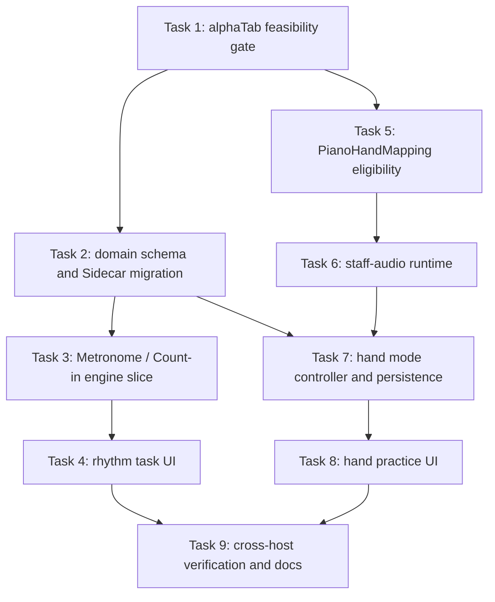

# Implementation Plan: Viewer 基础练习能力

## Overview

实现 Metronome、one-bar Count-in 和钢琴分手练习。工作先验证 alphaTab 1.8.4 的 Count-in 生命周期及
staff 级音频隔离，再沿 `PlaybackEngine → PlaybackController → Practice Sidecar → React task UI`
完成两个垂直切片。任何无法证明不会修改来源谱或污染 Track Mixer 的 staff-audio 方案都不得进入
实现。

规格：
[`docs/superpowers/specs/2026-07-29-viewer-foundational-practice-tools-product-spec.md`](../../docs/superpowers/specs/2026-07-29-viewer-foundational-practice-tools-product-spec.md)。

## Dependency Graph

## Architecture Decisions

1. `PlaybackController` remains the only formal command and persisted-state owner.
2. `PlaybackEngine` receives explicit Metronome, Count-in and staff-audio operations; React never writes alphaTab.
3. Metronome and Count-in use alphaTab native volume properties when the feasibility gate confirms target
   semantics.
4. Piano hand mapping is explicit and structure-based. Pitch-range heuristics are prohibited.
5. Hand practice is a playback projection. It does not change source Track visibility or persisted Track mix.
6. Practice settings use an explicit Sidecar schema migration; no silent strict-schema expansion.
7. User-visible codes and context originate in `web-core`; all copy stays in `@zupulse/app-i18n`.

## Task Breakdown

### Task 1: Prove alphaTab Count-in and staff-audio feasibility

**Description:** Build a focused runtime/test spike against alphaTab 1.8.4. Record Count-in lifecycle events,
pause/resume behavior, Loop interaction and whether a single staff can be silenced without source mutation or
player rebuild.

**Acceptance criteria:**

- [ ] Count-in start/end and pause/resume behavior are reproducible with an automated or deterministic harness.
- [ ] Staff-audio options are classified as supported, unsupported or requiring an approved fallback.
- [ ] The Spec Open Questions 1–3 are resolved or the plan stops before production implementation.

**Verification:**

- [ ] `pnpm vitest run packages/web-core/src/playback`
- [ ] Manual Browser run with `test-fixtures/musicxml/generated/piano-multistaff.musicxml`.
- [ ] No production contract is changed before the gate decision.

**Dependencies:** None

**Files likely touched:**

- `packages/web-core/src/playback/__tests__/alphaTabPlaybackAdapter.test.ts`
- optional disposable spike under an existing ignored artifact directory
- `docs/superpowers/specs/2026-07-29-viewer-foundational-practice-tools-product-spec.md`

**Estimated scope:** S

### Task 2: Add domain settings and Sidecar migration

**Description:** Define `RhythmPracticeSettings`, `PianoHandMode`, commands, state and strict persisted schemas.
Introduce the approved Sidecar migration with defaults that preserve all existing playback settings.

**Acceptance criteria:**

- [ ] Old Sidecars decode with Metronome off, Count-in off and both-hands mode.
- [ ] Invalid volume and hand-mode values are rejected by Zod.
- [ ] Merge semantics compare independent `updatedAt` values without overwriting newer existing settings.

**Verification:**

- [ ] `pnpm vitest run packages/web-core/src/storage`
- [ ] `pnpm vitest run packages/web-core/src/playback/__tests__/playbackSidecar.test.ts`
- [ ] `pnpm typecheck`

**Dependencies:** Task 1

**Files likely touched:**

- `packages/web-core/src/playback/types.ts`
- `packages/web-core/src/playback/schemas.ts`
- `packages/web-core/src/playback/playbackSidecar.ts`
- `packages/web-core/src/storage/sidecar.ts`
- adjacent `__tests__`

**Estimated scope:** M

### Task 3: Deliver Metronome and Count-in through Engine and Controller

**Description:** Extend the alphaTab public boundary and `PlaybackEngine`, then implement Controller commands,
`counting-in` state, restoration and safe audio-error behavior.

**Acceptance criteria:**

- [ ] Metronome and Count-in are independently controllable and restored during initialize.
- [ ] A new start executes one-bar Count-in; resume from pause does not.
- [ ] Tempo, Loop and position facts remain unchanged by rhythm-setting commands.

**Verification:**

- [ ] `pnpm vitest run packages/web-core/src/playback/__tests__/alphaTabPlaybackAdapter.test.ts`
- [ ] `pnpm vitest run packages/web-core/src/playback/__tests__/playbackController.test.ts`
- [ ] `pnpm vitest run packages/web-core/src/playback/__tests__/playbackPersistence.test.ts`

**Dependencies:** Task 2

**Files likely touched:**

- `packages/web-core/src/gp/alphaTabBrowser.ts`
- `packages/web-core/src/playback/types.ts`
- `packages/web-core/src/playback/alphaTabPlaybackAdapter.ts`
- `packages/web-core/src/playback/playbackController.ts`
- adjacent `__tests__`

**Estimated scope:** M

### Task 4: Deliver the rhythm practice task UI

**Description:** Add “节拍与预备拍” to the existing practice-task hierarchy, including independent switches,
volume controls, Count-in status, disabled reasons, narrow layout and localized copy.

**Acceptance criteria:**

- [ ] The task is discoverable from practice overview without adding a permanent Transport text control.
- [ ] All controls have accessible names, focus behavior and localized disabled/error states.
- [ ] Component tests cover independent settings and `counting-in` presentation.

**Verification:**

- [ ] `pnpm vitest run packages/web-viewer/src/features/__tests__/PlaybackWorkspace.test.tsx`
- [ ] `pnpm check:i18n`
- [ ] Manual Light/Dark check at desktop and 390px width.

**Dependencies:** Task 3

**Files likely touched:**

- `packages/web-viewer/src/features/PlaybackWorkspace.tsx`
- `packages/web-viewer/src/features/PlaybackWorkspace.module.css`
- `packages/web-viewer/src/playbackPresenter.ts`
- `packages/app-i18n/src/locales/zh-CN.ts`
- `packages/app-i18n/src/locales/en-US.ts`

**Estimated scope:** M

## Checkpoint A: Rhythm Practice

- [ ] Metronome and Count-in acceptance criteria pass.
- [ ] Browser and Desktop can load the migrated Sidecar.
- [ ] Existing Loop, tempo, Track Mixer and navigation tests remain green.
- [ ] Human review confirms the Count-in scope before hand-practice implementation continues.

### Task 5: Add explicit PianoHandMapping eligibility

**Description:** Extend the playback projection with stable staff metadata and a pure eligibility resolver. Only an
unambiguous two-staff non-percussion piano structure produces `PianoHandMapping`.

**Acceptance criteria:**

- [ ] Eligible fixtures map upper staff to right and lower staff to left with stable IDs.
- [ ] Two independent Tracks, percussion and ambiguous structures return semantic unavailable reasons.
- [ ] No pitch-range, channel or note-density heuristic exists.

**Verification:**

- [ ] `pnpm vitest run packages/web-core/src/musicxml`
- [ ] `pnpm vitest run packages/web-core/src/playback`
- [ ] Fixture coverage includes GP and MusicXML where structurally available.

**Dependencies:** Task 1

**Files likely touched:**

- `packages/web-core/src/playback/types.ts`
- `packages/web-core/src/playback/alphaTabPlaybackAdapter.ts`
- `packages/web-core/src/musicxml/alphaTabProjection.ts`
- adjacent `__tests__`

**Estimated scope:** M

### Task 6: Implement the approved staff-audio runtime

**Description:** Implement the feasibility-gate decision behind an explicit `PlaybackEngine` capability. Keep
rendered Track facts and source score bytes unchanged, and make mode changes safe during playback.

**Acceptance criteria:**

- [ ] Each hand can be independently audible on the piano fixture.
- [ ] Switching modes does not rewrite Track mute, solo, volume or visibility.
- [ ] Unsupported runtimes return a semantic capability result instead of partial audio behavior.

**Verification:**

- [ ] Adapter unit tests cover both hands, restoration and failure.
- [ ] Manual Browser playback verifies no stuck notes or duplicate playback.
- [ ] `pnpm vitest run packages/web-core/src/playback`

**Dependencies:** Task 5

**Files likely touched:**

- `packages/web-core/src/gp/alphaTabBrowser.ts`
- `packages/web-core/src/playback/types.ts`
- `packages/web-core/src/playback/alphaTabPlaybackAdapter.ts`
- `packages/web-core/src/playback/__tests__/alphaTabPlaybackAdapter.test.ts`

**Estimated scope:** M

### Task 7: Add hand mode to PlaybackController and persistence

**Description:** Implement hand-mode commands, availability, initialization, temporary target-hand preview and
safe fallback when a persisted score is no longer eligible.

**Acceptance criteria:**

- [ ] both/right/left modes produce the required engine projection.
- [ ] Temporary preview restores the selected mode and is never persisted.
- [ ] Sidecar failures preserve active session behavior and expose unsaved state.

**Verification:**

- [ ] `pnpm vitest run packages/web-core/src/playback/__tests__/playbackController.test.ts`
- [ ] `pnpm vitest run packages/web-core/src/playback/__tests__/playbackSidecar.test.ts`
- [ ] Existing Track Mixer Controller tests pass unchanged.

**Dependencies:** Tasks 2 and 6

**Files likely touched:**

- `packages/web-core/src/playback/types.ts`
- `packages/web-core/src/playback/playbackController.ts`
- `packages/web-core/src/playback/playbackSidecar.ts`
- adjacent `__tests__`

**Estimated scope:** M

### Task 8: Deliver the piano hand practice UI

**Description:** Add “练习手” to the practice-task hierarchy with both/right/left modes, temporary target-hand
preview, staff emphasis and explicit unavailable reasons. Preserve the advanced Track Mixer as a separate task.

**Acceptance criteria:**

- [ ] Eligible piano scores expose all three modes in teacher-friendly language.
- [ ] Non-eligible scores explain why the task is unavailable without disabling normal playback.
- [ ] Staff emphasis, keyboard operation, focus restoration and narrow layout pass component tests.

**Verification:**

- [ ] `pnpm vitest run packages/web-viewer/src/features/__tests__/PlaybackWorkspace.test.tsx`
- [ ] `pnpm check:i18n`
- [ ] Manual Light/Dark check at desktop and 390px width.

**Dependencies:** Task 7

**Files likely touched:**

- `packages/web-viewer/src/features/PlaybackWorkspace.tsx`
- `packages/web-viewer/src/features/PlaybackWorkspace.module.css`
- `packages/web-viewer/src/playbackPresenter.ts`
- `packages/app-i18n/src/locales/zh-CN.ts`
- `packages/app-i18n/src/locales/en-US.ts`

**Estimated scope:** M

## Checkpoint B: Piano Hand Practice

- [ ] All eligible, ambiguous and unsupported mappings behave as specified.
- [ ] Track Mixer state is unchanged after every hand-mode and preview transition.
- [ ] Loop + tempo + Count-in + hand mode work in combination.
- [ ] Human review confirms the task language and staff emphasis.

### Task 9: Add cross-host journeys and update current contracts

**Description:** Add Browser E2E coverage, run shared Desktop verification, then update the Current Feature Contract
and architecture docs to reflect only verified behavior.

**Acceptance criteria:**

- [ ] Browser E2E covers persistence, Count-in, Metronome, all hand modes and degradation.
- [ ] Desktop shared-domain tests confirm the same persisted contract.
- [ ] Feature Contract distinguishes delivered behavior from remaining gaps and uses current evidence paths.

**Verification:**

- [ ] `pnpm check:i18n`
- [ ] `pnpm check:docs`
- [ ] `pnpm verify:fast`
- [ ] `pnpm verify`
- [ ] `pnpm verify:e2e`
- [ ] `pnpm format:check`
- [ ] `git diff --check`

**Dependencies:** Tasks 4 and 8

**Files likely touched:**

- `apps/web-demo/e2e/library.spec.ts`
- `docs/features/contracts/viewer-playback-navigation.md`
- `docs/architecture/viewer-keyboard-and-transport-controls.md`
- focused Desktop/shared integration tests

**Estimated scope:** M

## Checkpoint C: Complete

- [ ] Every Spec acceptance criterion has reproducible evidence.
- [ ] Browser and Desktop behavior is aligned.
- [ ] No dependency, Bridge expansion or Managed Score mutation was introduced without approval.
- [ ] Completed one-time plan and todo are deleted after durable constraints move into Current docs.

## Risks and Mitigations

| Risk                                                 | Impact | Mitigation                                                                   |
| ---------------------------------------------------- | ------ | ---------------------------------------------------------------------------- |
| alphaTab Count-in lifecycle is not observable enough | High   | Task 1 gate; display only reliable state, never fake beat progress           |
| alphaTab cannot mute one staff                       | High   | Stop at Task 1; require explicit approved runtime projection or reduce scope |
| Staff mapping is ambiguous across formats            | High   | Structure-only eligibility and semantic unavailable reasons                  |
| Sidecar strict schema drifts                         | High   | Explicit version migration and Browser/Desktop contract tests                |
| Hand mode leaks into Track Mixer                     | High   | Separate engine projection and regression tests for all Track facts          |
| Switching modes causes stuck notes                   | High   | Safe-boundary adapter tests and explicit pause fallback requiring review     |
| Practice panel becomes too dense                     | Medium | Keep task hierarchy; validate desktop/narrow and preserve score context      |

## Open Questions

- Task 1 must select the exact staff-audio implementation or stop the plan.
- Confirm the preferred Sidecar version bump before Task 2 implementation.
- Confirm whether target-hand preview should be press-and-hold or a temporary Toggle before Task 8.
